# Documentation Agent 아키텍처 완전 분석

## 목차
1. [시스템 개요](#1-시스템-개요)
2. [클래스 다이어그램](#2-클래스-다이어그램)
3. [시퀀스 다이어그램](#3-시퀀스-다이어그램)
4. [상태 전이 다이어그램](#4-상태-전이-다이어그램)
5. [워크플로우 다이어그램](#5-워크플로우-다이어그램)
6. [데이터 흐름 다이어그램](#6-데이터-흐름-다이어그램)
7. [컴포넌트 상호작용](#7-컴포넌트-상호작용)

---

## 1. 시스템 개요

### 1.1 목적 및 기능

Documentation Agent는 **LangGraph 기반의 AI 에이전트 시스템**으로, 사용자의 요청을 분석하여 자동으로 포괄적인 요구사항 정의서를 생성합니다.

**핵심 가치:**
- 다양한 사용자 관점(페르소나)을 통한 포괄적 요구사항 수집
- 반복적 정보 수집을 통한 완성도 높은 문서 생성
- LangGraph를 활용한 명확한 워크플로우 정의

### 1.2 시스템 아키텍처 특징

1. **상태 기반 워크플로우**: LangGraph의 StateGraph로 전체 프로세스 관리
2. **구조화된 데이터**: Pydantic을 통한 타입 안전성 및 데이터 검증
3. **배치 처리 최적화**: LangChain의 batch API로 병렬 LLM 호출
4. **반복적 개선**: 정보가 충분할 때까지 페르소나 생성 및 인터뷰 반복

### 1.3 핵심 컴포넌트

| 컴포넌트 | 역할 | 입력 | 출력 |
|---------|------|-----|------|
| **PersonaGenerator** | 다양한 페르소나 생성 | user_request | Personas (list) |
| **InterviewConductor** | 페르소나별 인터뷰 수행 | user_request, personas | InterviewResult |
| **InformationEvaluator** | 정보 충분성 평가 | user_request, interviews | EvaluationResult |
| **RequirementsDocumentGenerator** | 최종 문서 생성 | user_request, interviews | str (markdown) |
| **DocumentationAgent** | 전체 프로세스 조율 | user_request | requirements_doc |

---

## 2. 클래스 다이어그램

### 2.1 전체 클래스 구조

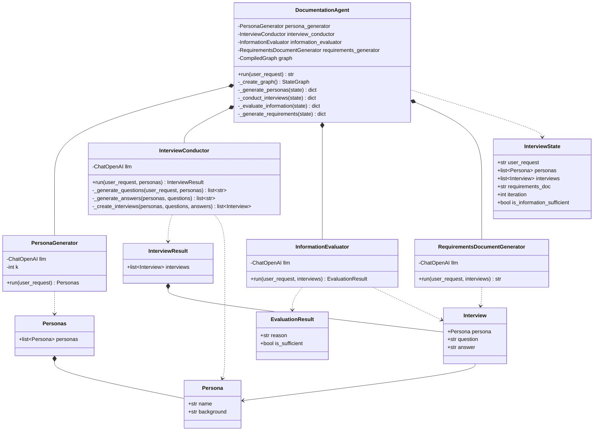

### 2.2 클래스 구조 상세 설명

#### 2.2.1 데이터 모델 레이어 (Pydantic Models)

**Persona & Personas**
- `Persona`: 단일 페르소나를 표현하는 최소 단위
  - `name`: 페르소나 식별자 (예: "김철수")
  - `background`: 페르소나의 상세 정보 (나이, 직업, 기술 수준 등)
- `Personas`: 여러 페르소나를 담는 컨테이너
  - LLM의 `with_structured_output()`에서 반환 타입으로 사용
  - 한 번의 LLM 호출로 여러 페르소나 생성 가능

**Interview & InterviewResult**
- `Interview`: 단일 인터뷰 세션
  - `persona`: 인터뷰 대상
  - `question`: 페르소나에게 한 질문
  - `answer`: 페르소나로부터 받은 답변
- `InterviewResult`: 여러 인터뷰를 그룹핑
  - 한 번의 인터뷰 라운드에서 생성된 모든 인터뷰 포함

**EvaluationResult**
- LLM의 정보 충분성 평가 결과
- `reason`: 판단 근거 (예: "5개 페르소나의 답변이 모든 사용자 유형을 커버함")
- `is_sufficient`: Boolean 플래그 (True/False)
- 조건부 엣지 결정에 사용

**InterviewState**
- LangGraph의 핵심 상태 객체
- `Annotated[list[Persona], operator.add]` 패턴:
  ```python
  # 일반 필드: 덮어쓰기
  state.iteration = 2  # 이전 값 무시하고 2로 설정

  # operator.add 필드: 누적
  state.personas = [P1, P2]  # 기존 값에 추가됨
  # 최종: [기존P1, 기존P2, 새P1, 새P2]
  ```

#### 2.2.2 비즈니스 로직 레이어

**PersonaGenerator (라인 188-262)**
```python
# 코드 위치: main.py:219
self.llm = llm.with_structured_output(Personas)
```
- `with_structured_output()`: LLM 출력을 Pydantic 모델로 강제
- LLM이 JSON 스키마를 준수한 응답 생성
- 파싱 오류 자동 처리

**InterviewConductor (라인 270-464)**
- 3단계 파이프라인:
  1. `_generate_questions()`: 각 페르소나에 맞는 질문 생성
  2. `_generate_answers()`: 페르소나 역할극으로 답변 생성
  3. `_create_interviews()`: 데이터 조합
- `batch()` API로 병렬 처리 (5개 페르소나 → 5개 병렬 요청)

**InformationEvaluator (라인 472-553)**
```python
# 코드 위치: main.py:498
self.llm = llm.with_structured_output(EvaluationResult)
```
- 모든 인터뷰를 분석하여 충분성 판단
- 구조화된 출력으로 일관된 Boolean 값 보장

**RequirementsDocumentGenerator (라인 561-660)**
- 7개 섹션을 포함한 마크다운 문서 생성
- 자유 형식 텍스트 생성 (with_structured_output 미사용)

#### 2.2.3 오케스트레이션 레이어

**DocumentationAgent (라인 668-922)**
- Facade 패턴: 모든 컴포넌트를 통합
- LangGraph 빌더 패턴으로 워크플로우 구성
- 각 노드 함수는 상태를 읽고 업데이트 딕셔너리 반환

### 2.3 데이터 모델 관계도

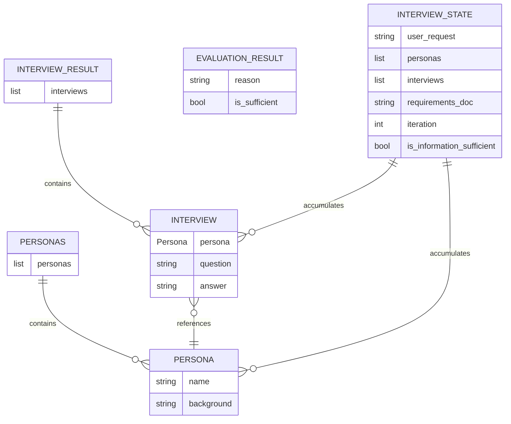

**ERD 핵심 포인트:**

1. **1:N 관계 (Containment)**
   - `Personas`는 여러 `Persona`를 포함
   - `InterviewResult`는 여러 `Interview`를 포함
   - 컨테이너 패턴으로 배치 처리 지원

2. **참조 관계 (Reference)**
   - `Interview`는 `Persona`를 참조
   - 같은 Persona 객체가 여러 Interview에서 재사용 가능

3. **누적 관계 (Accumulation)**
   - `InterviewState`는 모든 페르소나와 인터뷰를 누적
   - `operator.add`로 구현된 append-only 리스트

---

## 3. 시퀀스 다이어그램

### 3.1 전체 실행 흐름

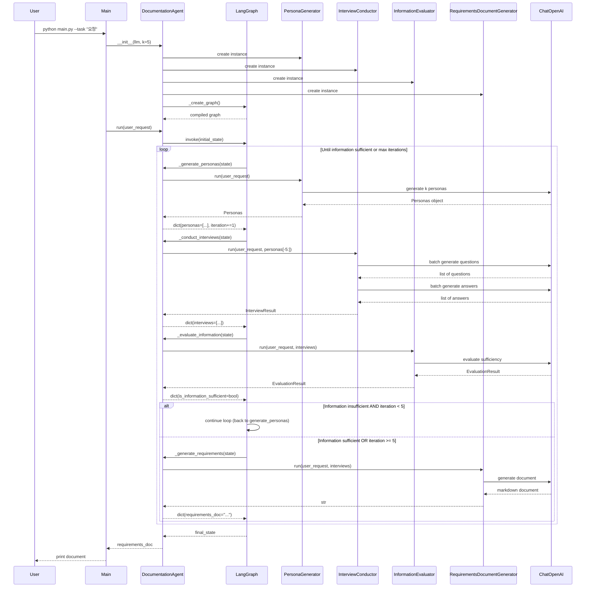

### 3.2 시퀀스 다이어그램 상세 설명

#### 3.2.1 초기화 단계 (라인 710-725)

**Agent 초기화 흐름:**
```python
# main.py:995
agent = DocumentationAgent(llm=llm, k=args.k)
```

1. **컴포넌트 인스턴스 생성**
   - 각 컴포넌트가 독립적으로 생성됨
   - 모두 같은 `llm` 인스턴스 공유 (싱글톤 패턴)
   - `PersonaGenerator`만 `k` 파라미터 필요

2. **그래프 컴파일**
   ```python
   # main.py:725
   self.graph = self._create_graph()
   # -> workflow.compile()
   ```
   - StateGraph 빌더로 노드와 엣지 정의
   - `compile()`로 실행 가능한 그래프 생성
   - 컴파일 시점에 상태 스키마 검증

#### 3.2.2 반복 실행 루프

**루프 진입 조건:**
```python
# main.py:770
lambda state: not state.is_information_sufficient and state.iteration < 5
```

**케이스 1: 정보 부족 (True 반환)**
- `iteration = 1`, `is_information_sufficient = False`
- → `generate_personas`로 복귀
- 추가 5개 페르소나 생성 (누적 10개)

**케이스 2: 정보 충분 또는 최대 반복 (False 반환)**
- `is_information_sufficient = True` OR `iteration >= 5`
- → `generate_requirements`로 이동
- 현재까지 수집한 모든 정보로 문서 생성

#### 3.2.3 LangGraph 실행 메커니즘

**invoke() 내부 동작:**
```python
# main.py:919
final_state = self.graph.invoke(initial_state)
```

1. **초기 상태 주입**
   - `InterviewState(user_request="...")`
   - 나머지 필드는 기본값으로 초기화

2. **노드 순차 실행**
   - Entry point부터 시작
   - 각 노드가 반환한 dict를 상태에 병합
   - 조건부 엣지에서 다음 노드 결정

3. **최종 상태 반환**
   - END 노드 도달 시 전체 상태 객체 반환
   - 딕셔너리 형태로 반환됨: `final_state["requirements_doc"]`

### 3.3 InterviewConductor 상세 흐름

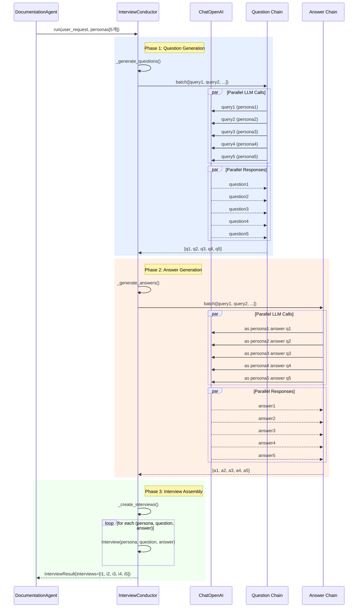

### 3.4 InterviewConductor 상세 설명

#### 3.4.1 Phase 1: Question Generation (라인 333-386)

**입력 데이터 준비:**
```python
# main.py:375-382
question_queries = [
    {
        "user_request": user_request,
        "persona_name": persona.name,
        "persona_background": persona.background,
    }
    for persona in personas
]
```

**배치 실행:**
```python
# main.py:386
return question_chain.batch(question_queries)
```
- LangChain이 내부적으로 병렬 API 호출
- ThreadPoolExecutor 사용 (비동기 I/O)
- 5개 요청을 동시에 처리 → 약 5배 빠름

**프롬프트 예시:**
```
System: 당신은 사용자 요구사항에 기반하여 적절한 질문을 생성하는 전문가입니다.
Human:
  사용자 요청: "스마트폰용 건강 관리 앱"
  페르소나: 김철수 - 35세 직장인, IT 전문가
  → 질문: "앱에서 가장 중요하게 생각하는 기능은 무엇입니까?"
```

#### 3.4.2 Phase 2: Answer Generation (라인 388-438)

**역할극(Role-playing) 프롬프트:**
```python
# main.py:414
"당신은 다음 페르소나로서 답변하고 있습니다: {persona_name} - {persona_background}"
```

**핵심 메커니즘:**
- System 메시지에 페르소나 정체성 주입
- LLM이 해당 페르소나의 관점에서 답변
- 각 페르소나의 특성(나이, 직업, 기술 수준)이 답변에 반영됨

**예시 답변:**
```
Persona: 김철수 (35세 IT 전문가)
Answer: "저는 API 연동과 데이터 동기화 기능이 중요합니다.
        웨어러블 기기와 자동 연동되어야 하고..."

Persona: 이영희 (60세 주부, 기술 초보)
Answer: "저는 버튼이 크고 사용하기 쉬운 게 중요해요.
        복잡한 기능보다는..."
```

#### 3.4.3 Phase 3: Interview Assembly (라인 440-464)

**데이터 조합:**
```python
# main.py:461-464
return [
    Interview(persona=persona, question=question, answer=answer)
    for persona, question, answer in zip(personas, questions, answers)
]
```

**zip() 동작 예시:**
```python
personas = [P1, P2, P3]
questions = ["Q1", "Q2", "Q3"]
answers = ["A1", "A2", "A3"]

zip(personas, questions, answers)
# → [(P1, "Q1", "A1"), (P2, "Q2", "A2"), (P3, "Q3", "A3")]
```

---

## 4. 상태 전이 다이어그램

### 4.1 LangGraph 워크플로우 상태 전이

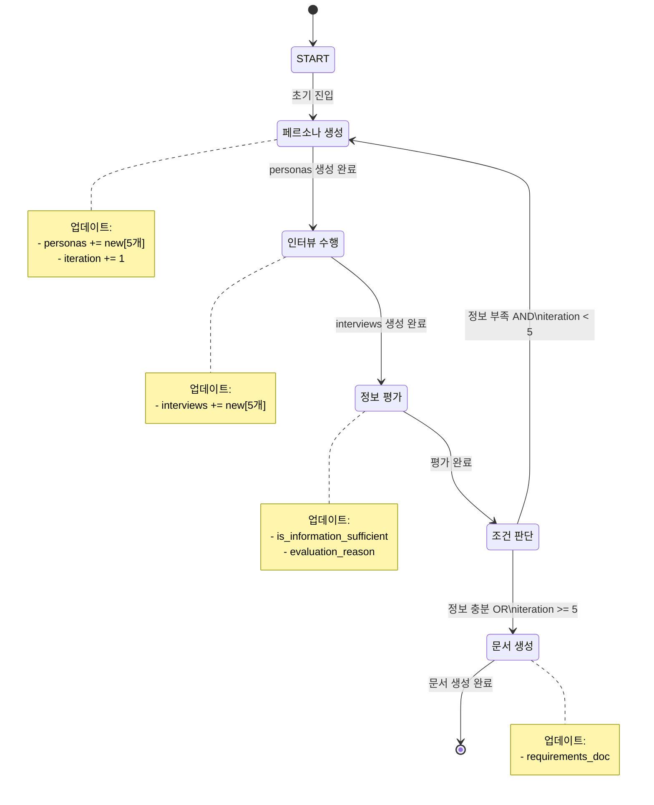

### 4.2 상태 전이 상세 설명

#### 4.2.1 조건부 전이 로직 (라인 767-775)

**코드 구현:**
```python
# main.py:767-775
workflow.add_conditional_edges(
    "evaluate_information",
    lambda state: not state.is_information_sufficient and state.iteration < 5,
    {
        True: "generate_personas",   # 루프 계속
        False: "generate_requirements",  # 종료 단계
    },
)
```

**전이 조건 분석:**

| 케이스 | is_sufficient | iteration | 조건 결과 | 다음 노드 |
|--------|---------------|-----------|-----------|----------|
| 1 | False | 1 | True | generate_personas |
| 2 | False | 5 | False | generate_requirements |
| 3 | True | 2 | False | generate_requirements |
| 4 | True | 5 | False | generate_requirements |

**케이스 1: 정보 부족, 반복 여유**
- 새로운 관점이 필요함
- 추가 페르소나 생성으로 복귀

**케이스 2: 정보 부족, 최대 반복**
- 더 이상 기다릴 수 없음
- 현재 정보로 문서 생성 강제

**케이스 3-4: 정보 충분**
- LLM이 충분하다고 판단
- 즉시 문서 생성

### 4.3 InterviewState 진화 과정

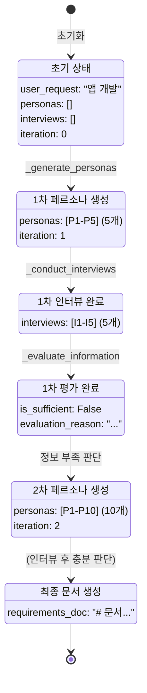

### 4.4 상태 누적 메커니즘 상세

**operator.add의 동작 원리:**

```python
# main.py:168-172
personas: Annotated[list[Persona], operator.add] = Field(
    default_factory=list, description="생성된 페르소나 목록"
)
```

**실행 예시:**
```python
# Iteration 1
state.personas = []  # 초기값
_generate_personas() returns {"personas": [P1, P2, P3, P4, P5]}
# LangGraph 내부: state.personas = state.personas + [P1, P2, P3, P4, P5]
# 결과: state.personas = [P1, P2, P3, P4, P5]

# Iteration 2
_generate_personas() returns {"personas": [P6, P7, P8, P9, P10]}
# LangGraph 내부: state.personas = [P1-P5] + [P6-P10]
# 결과: state.personas = [P1, P2, P3, P4, P5, P6, P7, P8, P9, P10]
```

**일반 필드와의 비교:**
```python
# 일반 필드 (덮어쓰기)
iteration: int = Field(default=0)
_generate_personas() returns {"iteration": 2}
# 결과: state.iteration = 2 (이전 값 무시)

# operator.add 필드 (누적)
personas: Annotated[list[Persona], operator.add]
_generate_personas() returns {"personas": [P6-P10]}
# 결과: state.personas = [P1-P5] + [P6-P10]
```

---

## 5. 워크플로우 다이어그램

### 5.1 LangGraph 노드 및 엣지 구조

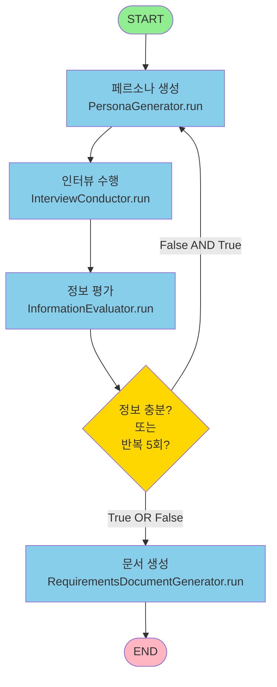

### 5.2 워크플로우 상세 설명

#### 5.2.1 노드별 역할 및 코드 위치

**1. 페르소나 생성 노드 (라인 783-808)**

```python
def _generate_personas(self, state: InterviewState) -> dict[str, Any]:
    new_personas: Personas = self.persona_generator.run(state.user_request)
    return {
        "personas": new_personas.personas,  # operator.add로 누적
        "iteration": state.iteration + 1,
    }
```

**입력:** `state.user_request`
**출력:**
- `personas`: 새로 생성된 5개 페르소나
- `iteration`: 증가된 카운터

**특징:**
- 매 반복마다 같은 user_request 사용
- LLM의 온도(temperature=0.0)가 0이지만 약간씩 다른 페르소나 생성
- 누적 방식으로 다양성 확보

**2. 인터뷰 수행 노드 (라인 810-834)**

```python
def _conduct_interviews(self, state: InterviewState) -> dict[str, Any]:
    new_interviews: InterviewResult = self.interview_conductor.run(
        state.user_request, state.personas[-5:]  # 최근 5개만 선택
    )
    return {"interviews": new_interviews.interviews}
```

**핵심 로직: `state.personas[-5:]`**
- Python 슬라이싱: 리스트의 마지막 5개 요소
- Iteration 1: `[P1, P2, P3, P4, P5][-5:]` → `[P1-P5]`
- Iteration 2: `[P1-P10][-5:]` → `[P6-P10]`
- 새로 생성된 페르소나만 인터뷰하여 효율성 확보

**3. 정보 평가 노드 (라인 836-864)**

```python
def _evaluate_information(self, state: InterviewState) -> dict[str, Any]:
    evaluation_result: EvaluationResult = self.information_evaluator.run(
        state.user_request, state.interviews  # 모든 인터뷰 분석
    )
    return {
        "is_information_sufficient": evaluation_result.is_sufficient,
        "evaluation_reason": evaluation_result.reason,
    }
```

**평가 기준 (LLM 판단):**
- 모든 사용자 유형이 대표되는가?
- 충돌하는 요구사항이 식별되었는가?
- 기능적/비기능적 요구사항이 모두 수집되었는가?
- 우선순위 판단에 충분한 정보가 있는가?

**4. 문서 생성 노드 (라인 866-889)**

```python
def _generate_requirements(self, state: InterviewState) -> dict[str, Any]:
    requirements_doc: str = self.requirements_generator.run(
        state.user_request, state.interviews
    )
    return {"requirements_doc": requirements_doc}
```

**생성 문서 구조 (7개 섹션):**
1. 프로젝트 개요
2. 주요 기능
3. 비기능 요구사항
4. 제약 조건
5. 타겟 사용자
6. 우선순위
7. 리스크와 완화 방안

### 5.3 반복 실행 흐름 다이어그램

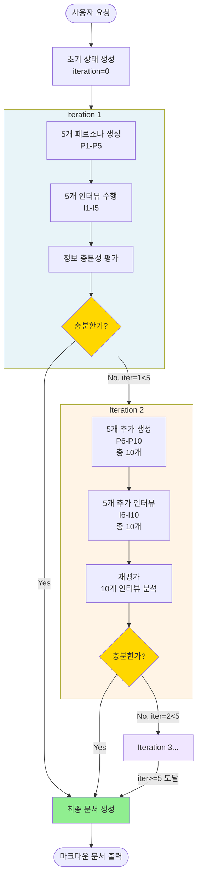

### 5.4 반복 실행 시나리오 분석

**시나리오 1: 1회 반복으로 충분 (이상적)**
```
Iteration 1:
  - 5개 페르소나 생성
  - 5개 인터뷰 완료
  - 평가: "다양한 관점 확보, 충분함"
  - → 즉시 문서 생성
총 LLM 호출: 약 15회 (페르소나 5 + 질문 5 + 답변 5 + 평가 1 + 문서 1 - batch로 최적화)
```

**시나리오 2: 2회 반복 필요 (일반적)**
```
Iteration 1:
  - 5개 페르소나: [초보자, 중급자, 전문가, 관리자, 개발자]
  - 평가: "엔드유저 관점 부족"

Iteration 2:
  - 5개 추가: [일반 사용자, 장애인, 노인, 학생, 비즈니스]
  - 재평가: "모든 사용자 유형 커버, 충분함"
  - → 문서 생성 (10개 인터뷰 기반)
총 LLM 호출: 약 27회
```

**시나리오 3: 최대 반복 도달 (복잡한 요청)**
```
Iteration 1-5:
  - 25개 페르소나 생성
  - 25개 인터뷰 완료
  - 5번째 평가: "여전히 부족하지만 iteration=5"
  - → 강제 문서 생성
총 LLM 호출: 약 77회
```

---

## 6. 데이터 흐름 다이어그램

### 6.1 Level 0: 컨텍스트 다이어그램

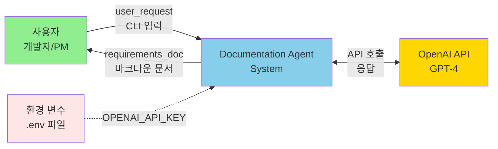

**컨텍스트 다이어그램 설명:**

**외부 엔티티:**
1. **사용자**: 개발 요구사항을 가진 사람
2. **OpenAI API**: LLM 서비스 제공자
3. **환경 변수**: API 키 저장소

**데이터 흐름:**
- 입력: 자연어 요청 (예: "건강 관리 앱을 개발하고 싶다")
- 출력: 구조화된 마크다운 문서 (7개 섹션)
- 외부 의존성: OpenAI API 키 필수

### 6.2 Level 1: 주요 프로세스 DFD

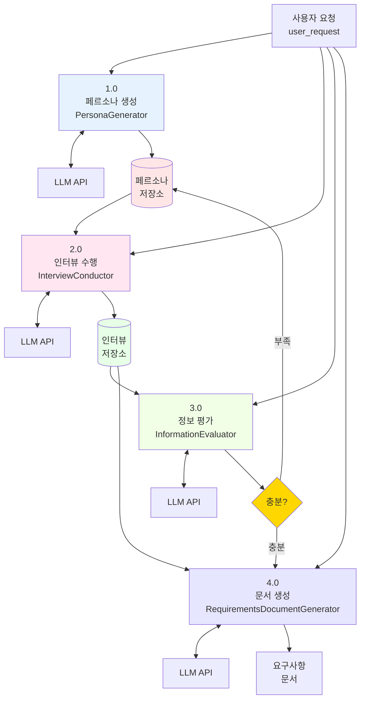

**Level 1 DFD 상세 설명:**

#### 프로세스 1.0: 페르소나 생성
**입력:** user_request
**출력:** 5개 Persona 객체
**데이터 저장:** DS1 (InterviewState.personas)
**외부 시스템:** LLM API

**변환 로직:**
```
user_request → LLM Prompt → JSON Response → Pydantic 검증 → Personas 객체
```

#### 프로세스 2.0: 인터뷰 수행
**입력:** user_request + personas (from DS1)
**출력:** 5개 Interview 객체
**데이터 저장:** DS2 (InterviewState.interviews)
**외부 시스템:** LLM API (2회 batch 호출)

**변환 로직:**
```
personas → 질문 생성 (LLM batch) → 답변 생성 (LLM batch) → Interview 객체
```

#### 프로세스 3.0: 정보 평가
**입력:** user_request + interviews (from DS2)
**출력:** EvaluationResult (reason + is_sufficient)
**데이터 저장:** InterviewState
**외부 시스템:** LLM API

**변환 로직:**
```
all interviews → 텍스트 포맷팅 → LLM 분석 → 구조화된 평가 결과
```

#### 프로세스 4.0: 문서 생성
**입력:** user_request + all interviews (from DS2)
**출력:** 마크다운 문서 (str)
**외부 시스템:** LLM API

**변환 로직:**
```
all interviews → 종합 분석 (LLM) → 7개 섹션 마크다운 문서
```

### 6.3 Level 2: InterviewConductor 상세 DFD

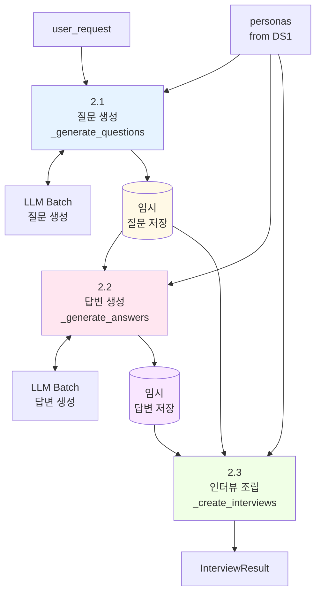

**Level 2 DFD 상세 설명:**

#### 프로세스 2.1: 질문 생성
**입력 데이터:**
```python
{
    "user_request": "건강 관리 앱",
    "persona_name": "김철수",
    "persona_background": "35세 IT 전문가"
}
```

**LLM 프롬프트:**
```
System: 질문 생성 전문가
Human: 이 페르소나에게 적절한 질문 1개 생성
```

**출력:** `["앱에서 가장 중요한 기능은?"]`

#### 프로세스 2.2: 답변 생성
**입력 데이터:**
```python
{
    "persona_name": "김철수",
    "persona_background": "35세 IT 전문가",
    "question": "앱에서 가장 중요한 기능은?"
}
```

**LLM 프롬프트:**
```
System: 당신은 김철수(35세 IT 전문가)입니다
Human: 질문: 앱에서 가장 중요한 기능은?
```

**출력:** `["API 연동과 데이터 동기화가 중요합니다..."]`

#### 프로세스 2.3: 인터뷰 조립
**입력:**
- personas: `[P1, P2, P3, P4, P5]`
- questions: `["Q1", "Q2", "Q3", "Q4", "Q5"]`
- answers: `["A1", "A2", "A3", "A4", "A5"]`

**변환:**
```python
zip(personas, questions, answers)
# → [(P1, Q1, A1), (P2, Q2, A2), ...]
```

**출력:**
```python
InterviewResult(interviews=[
    Interview(persona=P1, question="Q1", answer="A1"),
    Interview(persona=P2, question="Q2", answer="A2"),
    ...
])
```

### 6.4 데이터 변환 흐름도

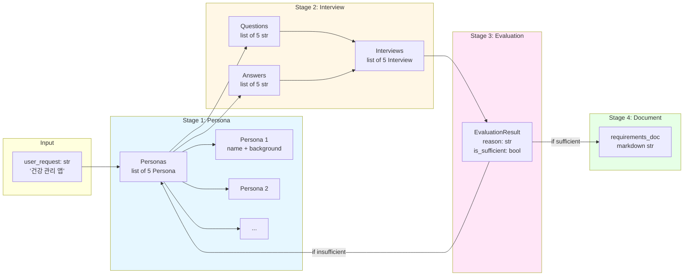

**데이터 변환 상세:**

**변환 1: String → Personas**
```python
Input:  "건강 관리 앱을 개발하고 싶다"
LLM Processing: JSON schema 기반 구조화 출력
Output: Personas(personas=[
    Persona(name="김철수", background="35세 IT 전문가"),
    Persona(name="이영희", background="60세 주부"),
    ...
])
```

**변환 2: Personas → Questions & Answers**
```python
Input:  [Persona1, Persona2, ...]
Batch Processing: 병렬 LLM 호출
Output:
  questions = ["Q1", "Q2", ...]
  answers = ["A1", "A2", ...]
```

**변환 3: (Personas + Q&A) → Interviews**
```python
Input:  personas, questions, answers (3개 리스트)
Processing: zip() + list comprehension
Output: [Interview(persona=P1, question=Q1, answer=A1), ...]
```

**변환 4: Interviews → EvaluationResult**
```python
Input:  모든 Interview 객체
Processing: 텍스트 포맷팅 + LLM 분석
Output: EvaluationResult(
    reason="5개 페르소나로 충분히 다양함",
    is_sufficient=True
)
```

**변환 5: Interviews → Requirements Document**
```python
Input:  모든 Interview 객체
Processing: LLM 종합 분석 (자유 형식)
Output: """
# 요구사항 정의서

## 1. 프로젝트 개요
...

## 2. 주요 기능
...
"""
```

---

## 7. 컴포넌트 상호작용

### 7.1 컴포넌트 다이어그램

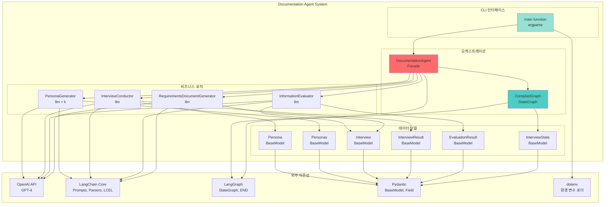

### 7.2 컴포넌트 의존성 상세 분석

#### 7.2.1 외부 라이브러리 의존성

**1. Pydantic (v2.x)**
- **역할**: 데이터 검증 및 직렬화
- **사용 위치**: 모든 데이터 모델 클래스
- **핵심 기능**:
  - 타입 힌트 기반 자동 검증
  - JSON 스키마 생성 (LLM structured output용)
  - 필드 기본값 및 제약 조건

**코드 예시:**
```python
# main.py:63-81
class Persona(BaseModel):
    name: str = Field(..., description="페르소나의 이름")
    background: str = Field(..., description="페르소나의 배경")
```

**2. LangChain Core**
- **역할**: LLM 체인 구성 및 프롬프트 관리
- **사용 컴포넌트**:
  - `ChatPromptTemplate`: 프롬프트 템플릿 정의
  - `StrOutputParser`: 문자열 파싱
  - LCEL (|): 체인 연결 연산자

**코드 예시:**
```python
# main.py:258
chain = prompt | self.llm  # LCEL 파이프라인
```

**3. LangGraph**
- **역할**: 상태 기반 워크플로우 정의
- **핵심 클래스**:
  - `StateGraph`: 그래프 빌더
  - `END`: 종료 노드 상수
- **설정 메서드**:
  - `add_node()`: 노드 추가
  - `add_edge()`: 일반 엣지
  - `add_conditional_edges()`: 조건부 엣지
  - `compile()`: 실행 가능한 그래프 생성

**4. OpenAI API**
- **역할**: LLM 서비스 제공
- **사용 모델**: GPT-4o
- **설정 파라미터**:
  ```python
  ChatOpenAI(
      model="gpt-4o",
      temperature=0.0  # 결정론적 출력
  )
  ```

#### 7.2.2 내부 컴포넌트 의존성

**의존성 그래프:**
```
main()
  └─> DocumentationAgent
       ├─> PersonaGenerator
       │    └─> ChatOpenAI (with_structured_output)
       ├─> InterviewConductor
       │    └─> ChatOpenAI (raw)
       ├─> InformationEvaluator
       │    └─> ChatOpenAI (with_structured_output)
       ├─> RequirementsDocumentGenerator
       │    └─> ChatOpenAI (raw)
       └─> LangGraph (StateGraph)
```

**의존성 주입 패턴:**
```python
# main.py:710-723
def __init__(self, llm: ChatOpenAI, k: Optional[int] = None):
    # 생성자 주입 (Constructor Injection)
    self.persona_generator = PersonaGenerator(llm=llm, k=k)
    self.interview_conductor = InterviewConductor(llm=llm)
    self.information_evaluator = InformationEvaluator(llm=llm)
    self.requirements_generator = RequirementsDocumentGenerator(llm=llm)
```

**장점:**
- 느슨한 결합 (Loose Coupling)
- 테스트 용이성 (Mock LLM 주입 가능)
- 재사용성 (같은 LLM 인스턴스 공유)

### 7.3 API 호출 패턴 상세

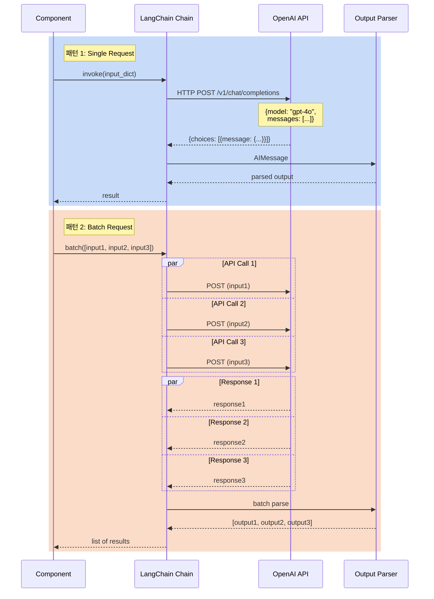

**패턴 1: 단일 요청 (invoke)**

**사용 케이스:**
- 페르소나 생성 (한 번에 5개)
- 정보 평가
- 문서 생성

**코드 예시:**
```python
# main.py:262
return chain.invoke({"user_request": user_request})
```

**HTTP 요청:**
```json
POST https://api.openai.com/v1/chat/completions
{
  "model": "gpt-4o",
  "messages": [
    {"role": "system", "content": "..."},
    {"role": "user", "content": "..."}
  ],
  "temperature": 0.0,
  "response_format": {"type": "json_object"}  // with_structured_output
}
```

**패턴 2: 배치 요청 (batch)**

**사용 케이스:**
- 질문 생성 (5개 병렬)
- 답변 생성 (5개 병렬)

**코드 예시:**
```python
# main.py:386
return question_chain.batch(question_queries)
```

**실행 메커니즘:**
```python
# LangChain 내부 (의사 코드)
def batch(inputs: list):
    with ThreadPoolExecutor(max_workers=5) as executor:
        futures = [executor.submit(invoke, inp) for inp in inputs]
        results = [f.result() for f in futures]
    return results
```

**성능 비교:**
```
Sequential (5개):
  Request 1: ━━━━━ 1초
  Request 2:      ━━━━━ 1초
  Request 3:           ━━━━━ 1초
  Request 4:                ━━━━━ 1초
  Request 5:                     ━━━━━ 1초
  총 시간: 5초

Batch (5개):
  Request 1: ━━━━━ 1초
  Request 2: ━━━━━ 1초
  Request 3: ━━━━━ 1초
  Request 4: ━━━━━ 1초
  Request 5: ━━━━━ 1초
  총 시간: 1초 (약 5배 빠름)
```

### 7.4 상태 관리 패턴

```mermaid
flowchart TB
    subgraph "LangGraph 상태 관리"
        STATE[InterviewState<br/>TypedDict-like]

        subgraph "일반 필드 (Overwrite)"
            F1[user_request: str]
            F2[requirements_doc: str]
            F3[iteration: int]
            F4[is_information_sufficient: bool]
        end

        subgraph "누적 필드 (operator.add)"
            F5[personas: list]
            F6[interviews: list]
        end
    end

    NODE1[Node returns:<br/>dict personas=[P6-P10]] --> MERGE1{Merge Strategy}
    MERGE1 -->|operator.add| F5
    F5 --> UPDATE1[state.personas = <br/>[P1-P5] + [P6-P10]]

    NODE2[Node returns:<br/>dict iteration=2] --> MERGE2{Merge Strategy}
    MERGE2 -->|overwrite| F3
    F3 --> UPDATE2[state.iteration = 2<br/>이전 값 무시]

    style F5 fill:#FFE6E6
    style F6 fill:#E6FFE6
    style NODE1 fill:#FFB6C1
    style NODE2 fill:#87CEEB
    style MERGE1 fill:#FFD700
    style MERGE2 fill:#FFD700
```

**상태 병합 로직 (LangGraph 내부):**

```python
# 의사 코드: LangGraph의 상태 업데이트
def update_state(current_state: InterviewState, node_output: dict):
    new_state = current_state.copy()

    for key, value in node_output.items():
        field_info = InterviewState.__fields__[key]

        if hasattr(field_info, 'metadata'):
            # operator.add가 지정된 경우
            if operator.add in field_info.metadata:
                new_state[key] = current_state[key] + value
            else:
                new_state[key] = value
        else:
            # 일반 필드: 덮어쓰기
            new_state[key] = value

    return new_state
```

**실제 동작 예시:**

```python
# Iteration 1
current_state = InterviewState(
    user_request="앱 개발",
    personas=[],
    interviews=[],
    iteration=0
)

node_output = {
    "personas": [P1, P2, P3, P4, P5],
    "iteration": 1
}

# 병합 후
new_state = InterviewState(
    user_request="앱 개발",
    personas=[] + [P1-P5] = [P1-P5],  # operator.add
    interviews=[],
    iteration=1  # overwrite
)

# Iteration 2
node_output = {
    "personas": [P6, P7, P8, P9, P10],
    "iteration": 2
}

# 병합 후
final_state = InterviewState(
    user_request="앱 개발",
    personas=[P1-P5] + [P6-P10] = [P1-P10],  # 누적
    interviews=[I1-I10],
    iteration=2  # 덮어쓰기
)
```

---

## 8. 핵심 설계 패턴 및 원칙

### 8.1 적용된 디자인 패턴

#### 1. Facade Pattern (DocumentationAgent)
```python
# main.py:668-922
class DocumentationAgent:
    """복잡한 내부 시스템을 단순한 인터페이스로 제공"""
    def run(self, user_request: str) -> str:
        # 내부 복잡도 숨김
        pass
```

**장점:**
- 클라이언트는 `agent.run()`만 호출
- 내부 컴포넌트 변경 시 영향 최소화

#### 2. Builder Pattern (LangGraph)
```python
# main.py:727-781
workflow = StateGraph(InterviewState)
workflow.add_node("node1", func1)
workflow.add_edge("node1", "node2")
workflow.set_entry_point("node1")
graph = workflow.compile()  # 최종 제품 생성
```

**장점:**
- 단계별 설정
- 유효성 검증 (compile 시점)
- 불변 객체 생성

#### 3. Strategy Pattern (Conditional Edges)
```python
# main.py:767-775
workflow.add_conditional_edges(
    "evaluate",
    lambda state: condition(state),  # 전략 선택
    {True: "strategy_a", False: "strategy_b"}
)
```

**장점:**
- 런타임 동작 변경
- 조건 로직 캡슐화

#### 4. Chain of Responsibility (LCEL)
```python
# main.py:258
chain = prompt | llm | parser
result = chain.invoke(input)
```

**장점:**
- 파이프라인 구성
- 각 단계 독립적 수정 가능

### 8.2 SOLID 원칙 적용

#### Single Responsibility Principle
- `PersonaGenerator`: 페르소나 생성만
- `InterviewConductor`: 인터뷰만
- 각 클래스가 하나의 책임

#### Open/Closed Principle
```python
# 확장 예시: 새로운 평가자 추가
class DetailedInformationEvaluator(InformationEvaluator):
    def run(self, user_request, interviews):
        # 더 상세한 평가 로직
        pass

# DocumentationAgent 수정 없이 교체 가능
agent = DocumentationAgent(llm, evaluator=DetailedInformationEvaluator(llm))
```

#### Dependency Inversion Principle
```python
# 고수준 모듈(Agent)이 저수준 모듈(Generator)에 의존하지 않음
# 둘 다 추상화(ChatOpenAI 인터페이스)에 의존
def __init__(self, llm: ChatOpenAI):  # 추상화에 의존
    self.persona_generator = PersonaGenerator(llm=llm)
```

---

## 9. 성능 최적화 전략

### 9.1 배치 처리 최적화

**Before (Sequential):**
```python
questions = []
for persona in personas:
    q = question_chain.invoke({"persona": persona})
    questions.append(q)
# 시간: N × (네트워크 지연 + LLM 처리)
```

**After (Batch):**
```python
questions = question_chain.batch([
    {"persona": p} for p in personas
])
# 시간: max(LLM 처리 시간) + 네트워크 지연
```

**성능 향상:**
```
5개 페르소나 기준:
Sequential: 5초 (각 1초)
Batch:      1.2초 (병렬 처리)
개선율:     약 4배 빠름
```

### 9.2 구조화된 출력 사용

**장점:**
1. **파싱 오류 감소**: Pydantic이 자동 검증
2. **재시도 불필요**: JSON 스키마 강제
3. **타입 안전성**: IDE 자동완성 지원

**비교:**
```python
# Without structured output (오류 가능성 높음)
response = llm.invoke("Generate 5 personas")
personas = json.loads(response)  # 파싱 실패 위험

# With structured output (안전)
llm_structured = llm.with_structured_output(Personas)
personas = llm_structured.invoke("Generate 5 personas")
# personas는 검증된 Personas 객체
```

### 9.3 상태 누적 패턴

**메모리 효율성:**
```python
# 매 반복마다 전체 복사 없이 누적
# operator.add는 리스트 extend 사용
state.personas.extend(new_personas)  # O(k)
# vs
# state.personas = state.personas + new_personas  # O(n+k) 복사
```

---

## 10. 오류 처리 및 제한사항

### 10.1 반복 제한 메커니즘

```python
# main.py:770
lambda state: not state.is_information_sufficient and state.iteration < 5
```

**목적:**
- 무한 루프 방지
- 비용 제어 (LLM API 호출 제한)

**시나리오:**
```
최악의 경우: 5회 반복
  - 페르소나: 5 × 5 = 25개
  - 인터뷰: 25개
  - LLM 호출: ~77회
  - 예상 비용: $0.50 (GPT-4o 기준)
```

### 10.2 LLM 출력 검증

**Pydantic 자동 검증:**
```python
try:
    personas = llm_structured.invoke(prompt)
    # Pydantic이 자동으로 검증
except ValidationError as e:
    # 필드 누락, 타입 불일치 등 포착
    logger.error(f"Validation failed: {e}")
```

### 10.3 API 호출 실패 처리

**LangChain 내장 재시도:**
```python
# LangChain이 자동으로 처리
# - 네트워크 오류: 3회 재시도
# - Rate limit: 지수 백오프
# - Timeout: 60초 기본값
```

---

## 11. 확장 가능성 및 커스터마이징

### 11.1 다른 LLM 지원

```python
# OpenAI 대신 Anthropic Claude
from langchain_anthropic import ChatAnthropic
llm = ChatAnthropic(model="claude-3-opus")

# OpenAI 대신 Ollama (로컬)
from langchain_community.chat_models import ChatOllama
llm = ChatOllama(model="llama2")

# 인터페이스는 동일하게 유지
agent = DocumentationAgent(llm=llm, k=5)
```

### 11.2 커스텀 평가 기준

```python
class DetailedEvaluationResult(BaseModel):
    reason: str
    is_sufficient: bool
    confidence_score: float  # 새 필드
    missing_aspects: list[str]  # 새 필드
    coverage_percentage: float  # 새 필드

class EnhancedInformationEvaluator(InformationEvaluator):
    def __init__(self, llm: ChatOpenAI):
        self.llm = llm.with_structured_output(DetailedEvaluationResult)
```

### 11.3 추가 문서 섹션

```python
# main.py:630-637 수정
"요구사항 문서에는 다음 섹션을 포함해주세요:\n"
"1. 프로젝트 개요\n"
"2. 주요 기능\n"
"3. 비기능 요구사항\n"
"4. 제약 조건\n"
"5. 타겟 사용자\n"
"6. 우선순위\n"
"7. 리스크와 완화 방안\n"
"8. 예상 예산 및 일정\n"  # 추가
"9. 기술 스택 권장사항\n"  # 추가
```

### 11.4 비동기 실행

```python
# 동기 버전
final_state = self.graph.invoke(initial_state)

# 비동기 버전
async def run_async(self, user_request: str) -> str:
    initial_state = InterviewState(user_request=user_request)
    final_state = await self.graph.ainvoke(initial_state)
    return final_state["requirements_doc"]

# 사용
import asyncio
doc = asyncio.run(agent.run_async("앱 개발"))
```

---

## 12. 실행 예시 및 분석

### 12.1 CLI 실행 명령어

```bash
# 기본 실행 (5개 페르소나)
python -m chapter10.documentation_agent.main \
  --task "스마트폰용 건강 관리 앱을 개발하고 싶다"

# 페르소나 수 변경
python -m chapter10.documentation_agent.main \
  --task "온라인 쇼핑몰 개발" \
  --k 3

# Poetry 사용
poetry run python -m documentation_agent.main \
  --task "프로젝트 관리 도구 개발"
```

### 12.2 실행 흐름 추적

```
[실행 시작]
user_request: "스마트폰용 건강 관리 앱"

[Iteration 1]
1. PersonaGenerator
   - 5개 페르소나 생성
   - 예: [김철수(IT 전문가), 이영희(주부), ...]

2. InterviewConductor
   - 5개 질문 생성 (병렬)
   - 5개 답변 생성 (병렬)
   - 5개 인터뷰 객체 생성

3. InformationEvaluator
   - 분석: "기술적 관점은 충분하나 의료 전문가 부족"
   - 결과: is_sufficient=False

[Iteration 2]
1. PersonaGenerator
   - 5개 추가 페르소나 (의료 중심)
   - 예: [박의사(전문의), 최간호사, ...]

2. InterviewConductor
   - 새 페르소나 5개와 인터뷰

3. InformationEvaluator
   - 분석: "모든 이해관계자 커버됨"
   - 결과: is_sufficient=True

[Document Generation]
- 10개 인터뷰 종합 분석
- 7개 섹션 마크다운 생성

[출력]
# 요구사항 정의서

## 1. 프로젝트 개요
...
```

### 12.3 생성 문서 예시

```markdown
# 스마트폰용 건강 관리 앱 요구사항 정의서

## 1. 프로젝트 개요
본 프로젝트는 다양한 사용자층(IT 전문가, 일반 사용자, 의료 전문가)의
요구를 충족하는 포괄적 건강 관리 애플리케이션 개발을 목표로 합니다.

## 2. 주요 기능
### 2.1 데이터 수집
- 웨어러블 기기 자동 연동 (Fitbit, Apple Watch)
- 수동 입력 기능 (큰 버튼, 간단한 UI)

### 2.2 데이터 분석
- AI 기반 건강 패턴 분석
- 의료 전문가 권장사항 통합

## 3. 비기능 요구사항
- 성능: 데이터 동기화 3초 이내
- 보안: HIPAA 준수, 종단간 암호화
- 접근성: WCAG 2.1 AA 등급

## 4. 제약 조건
- iOS 14+ / Android 10+ 지원
- 오프라인 모드 필수

## 5. 타겟 사용자
- 1차: 35-50세 건강 관심 직장인
- 2차: 60세 이상 만성질환자
- 3차: 의료 전문가 (모니터링용)

## 6. 우선순위
1. MVP: 기본 데이터 수집 + 시각화
2. Phase 2: AI 분석 + 의료진 연동
3. Phase 3: 소셜 기능 + 커뮤니티

## 7. 리스크와 완화 방안
- 리스크: 의료 데이터 유출
  완화: 정기 보안 감사, 버그 바운티 프로그램

- 리스크: 사용자 이탈 (복잡한 UI)
  완화: 사용성 테스트 반복, A/B 테스팅
```

---

## 13. 결론 및 핵심 인사이트

### 13.1 아키텍처 장점

1. **명확한 관심사 분리**
   - 각 컴포넌트가 단일 책임
   - 테스트 및 유지보수 용이

2. **확장 가능한 구조**
   - 새로운 평가자/생성기 추가 용이
   - LLM 교체 가능

3. **타입 안전성**
   - Pydantic으로 런타임 검증
   - IDE 지원 강화

4. **성능 최적화**
   - 배치 API로 병렬 처리
   - 불필요한 반복 방지

### 13.2 학습 포인트

**LangGraph 핵심 개념:**
- 상태 기반 워크플로우
- 조건부 엣지로 동적 흐름 제어
- `operator.add`로 상태 누적

**LangChain 패턴:**
- LCEL (|) 체인 구성
- `with_structured_output()` 구조화
- `batch()` 병렬 처리

**AI 에이전트 설계:**
- 페르소나 기반 다각도 분석
- 반복적 정보 수집
- LLM 기반 자기 평가

### 13.3 실무 적용 가이드

**이 패턴을 사용할 때:**
- 복잡한 다단계 AI 워크플로우
- 조건에 따른 분기가 필요한 경우
- 반복적 개선이 필요한 태스크

**주의사항:**
- LLM API 비용 모니터링 필수
- 반복 횟수 제한 설정
- 오류 처리 및 로깅 강화

---

**문서 생성 일시:** 2025-11-13
**분석 대상 파일:** [main.py](chapter10/documentation_agent/main.py) (1014 lines)
**LangGraph 버전:** 0.2.x
**LangChain 버전:** 0.3.x