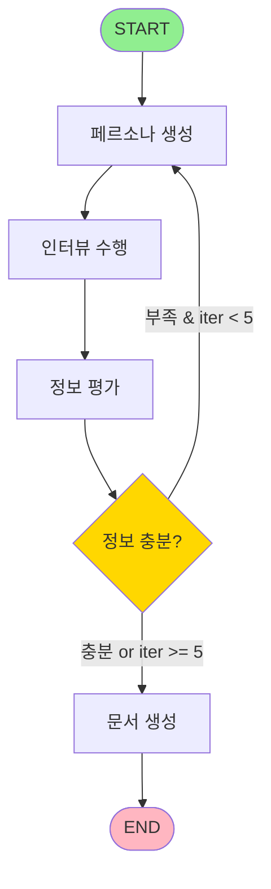

# Documentation Agent 전체 흐름 및 LLM 활용 분석

## 📋 목차
1. [프로그램 개요](#프로그램-개요)
2. [전체 실행 흐름](#전체-실행-흐름)
3. [LLM 사용 영역 상세 분석](#llm-사용-영역-상세-분석)
4. [LangGraph 상태 관리 메커니즘](#langgraph-상태-관리-메커니즘)
5. [LLM API 호출 횟수 분석](#llm-api-호출-횟수-분석)
6. [핵심 설계 원칙](#핵심-설계-원칙)

---

## 프로그램 개요

Documentation Agent는 **LangGraph 기반의 AI 에이전트 시스템**으로, 사용자의 요청을 분석하여 자동으로 포괄적인 요구사항 정의서를 생성합니다.

### 핵심 컴포넌트

| 컴포넌트 | 역할 | LLM 사용 | 출력 형태 |
|---------|------|----------|----------|
| **PersonaGenerator** | 다양한 페르소나 생성 | ✅ 구조화된 출력 | Personas 객체 |
| **InterviewConductor** | 페르소나별 인터뷰 수행 | ✅ 배치 처리 | InterviewResult 객체 |
| **InformationEvaluator** | 정보 충분성 평가 | ✅ 구조화된 출력 | EvaluationResult 객체 |
| **RequirementsDocumentGenerator** | 최종 문서 생성 | ✅ 자유 형식 | 마크다운 문자열 |

---

## 전체 실행 흐름

### 1. 초기화 단계

```
사용자 CLI 입력 (--task "건강 관리 앱 개발")
         ↓
DocumentationAgent 생성
         ↓
4개 컴포넌트 초기화:
  • PersonaGenerator (llm, k=5)
  • InterviewConductor (llm)
  • InformationEvaluator (llm)
  • RequirementsDocumentGenerator (llm)
         ↓
LangGraph 워크플로우 컴파일
```

### 2. LangGraph 워크플로우 구조



### 3. 반복 실행 시나리오

#### Iteration 1 (첫 번째 시도)

```
1. 페르소나 생성 (5개)
   → [IT 전문가, 일반 사용자, 주부, 학생, 의료진]

2. 인터뷰 수행 (5개)
   → 질문 생성 (병렬 5회)
   → 답변 생성 (병렬 5회)

3. 정보 평가
   → LLM 판단: "기술적 관점은 충분하나,
                 의료 전문가 관점 부족"
   → is_sufficient = False

4. 조건 판단: 정보 부족 & iteration(1) < 5
   → 다시 페르소나 생성으로
```

#### Iteration 2 (추가 반복)

```
1. 페르소나 추가 생성 (5개)
   → [전문의, 간호사, 물리치료사, 영양사, 약사]
   → 총 페르소나: 10개

2. 인터뷰 수행 (최근 5개만)
   → 새로 생성된 5개 페르소나와만 인터뷰
   → 총 인터뷰: 10개

3. 정보 평가 (10개 인터뷰 기반)
   → LLM 판단: "모든 이해관계자 커버됨"
   → is_sufficient = True

4. 조건 판단: 정보 충분
   → 문서 생성으로 진행
```

#### 최종 단계 (문서 생성)

```
RequirementsDocumentGenerator 실행
   → 10개 인터뷰 종합 분석
   → 7개 섹션 마크다운 문서 생성

출력:
# 건강 관리 앱 요구사항 정의서
## 1. 프로젝트 개요
## 2. 주요 기능
## 3. 비기능 요구사항
...
```

---

## LLM 사용 영역 상세 분석

### 1. PersonaGenerator - 페르소나 생성

#### 🎯 사용 목적
다양한 사용자 관점을 대표하는 가상의 페르소나 생성

#### 🤖 LLM 동작 방식

**프롬프트 구조:**
```python
System Message:
"당신은 사용자 인터뷰용 다양한 페르소나를 만드는 전문가입니다."

Human Message:
"""
다음 사용자 요청에 관한 인터뷰를 위해 5명의 다양한 페르소나를 생성해주세요.

사용자 요청: 건강 관리 앱을 개발하고 싶다

각 페르소나에는 이름과 간단한 배경을 포함해주세요.
나이, 성별, 직업, 기술적 전문 지식에서 다양성을 확보해 주세요.
"""
```

**LLM 출력 (구조화된 JSON):**
```json
{
  "personas": [
    {
      "name": "김철수",
      "background": "35세 직장인, IT 전문가, 업무 자동화에 관심"
    },
    {
      "name": "이영희",
      "background": "60세 주부, 기술 초보, 큰 버튼 선호"
    },
    {
      "name": "박민수",
      "background": "28세 대학생, 피트니스 애호가"
    },
    {
      "name": "최의사",
      "background": "45세 전문의, 환자 모니터링 필요"
    },
    {
      "name": "정간호사",
      "background": "32세 간호사, 실시간 데이터 중요"
    }
  ]
}
```

#### 🔧 핵심 기술

```python
# with_structured_output 사용
self.llm = llm.with_structured_output(Personas)

# Pydantic 모델 정의
class Persona(BaseModel):
    name: str = Field(..., description="페르소나의 이름")
    background: str = Field(..., description="페르소나의 배경")

class Personas(BaseModel):
    personas: list[Persona]
```

**장점:**
- ✅ JSON 스키마 자동 생성
- ✅ LLM이 구조화된 형태로 응답 강제
- ✅ Pydantic 자동 검증 (타입, 필수 필드)
- ✅ 파싱 오류 방지

#### 📊 API 호출 정보
- **호출 횟수:** 1회 (한 번에 5개 페르소나 생성)
- **처리 방식:** 동기
- **예상 토큰:** 약 500-800 tokens

---

### 2. InterviewConductor - 인터뷰 수행

#### Phase 1: 질문 생성

##### 🎯 사용 목적
각 페르소나의 특성에 맞는 맞춤형 질문 생성

##### 🤖 LLM 동작 방식 (배치 처리)

**5개 병렬 요청 예시:**

```python
# 요청 1 (김철수 - IT 전문가)
System: "질문 생성 전문가"
Human: """
사용자 요청: 건강 관리 앱
페르소나: 김철수 - 35세 직장인, IT 전문가
→ 적절한 질문 1개 생성
"""
→ 출력: "API 연동과 데이터 동기화 기능에 대한 요구사항이 있으신가요?"

# 요청 2 (이영희 - 주부)
페르소나: 이영희 - 60세 주부, 기술 초보
→ 출력: "버튼 크기와 메뉴 구성의 단순함이 중요하신가요?"

# 요청 3 (박민수 - 학생)
페르소나: 박민수 - 28세 대학생, 피트니스 애호가
→ 출력: "운동 기록과 목표 설정 기능이 필요하신가요?"

# 요청 4 (최의사 - 전문의)
페르소나: 최의사 - 45세 전문의
→ 출력: "환자 데이터 분석 및 리포트 기능이 필요하신가요?"

# 요청 5 (정간호사)
페르소나: 정간호사 - 32세 간호사
→ 출력: "실시간 알림과 응급 상황 대응 기능이 필요하신가요?"
```

##### 🔧 핵심 기술

```python
# 배치 처리를 위한 입력 준비
question_queries = [
    {
        "user_request": user_request,
        "persona_name": persona.name,
        "persona_background": persona.background,
    }
    for persona in personas
]

# 병렬 실행
questions = question_chain.batch(question_queries)
```

**성능 비교:**
```
순차 처리 (for loop):
  Request 1: ━━━━━ 1초
  Request 2:      ━━━━━ 1초
  Request 3:           ━━━━━ 1초
  Request 4:                ━━━━━ 1초
  Request 5:                     ━━━━━ 1초
  총 시간: 5초

배치 처리 (batch):
  Request 1: ━━━━━ 1초
  Request 2: ━━━━━ 1초
  Request 3: ━━━━━ 1초
  Request 4: ━━━━━ 1초
  Request 5: ━━━━━ 1초
  총 시간: 1초 (약 5배 빠름)
```

##### 📊 API 호출 정보
- **호출 횟수:** 5회 (병렬)
- **처리 방식:** ThreadPoolExecutor 기반 병렬
- **예상 시간:** 1-2초

#### Phase 2: 답변 생성

##### 🎯 사용 목적
각 페르소나의 관점에서 질문에 답변 (역할극)

##### 🤖 LLM 동작 방식 (Role-playing)

**5개 병렬 요청 예시:**

```python
# 요청 1 (김철수 역할극)
System: "당신은 김철수(35세 IT 전문가)입니다"
Human: "API 연동과 데이터 동기화 기능에 대한 요구사항이 있으신가요?"
→ 출력: """
네, 저는 Fitbit과 Apple Watch 같은 웨어러블 기기와의
자동 연동이 필수적입니다. RESTful API를 통한
실시간 데이터 동기화와 충돌 해결 로직이 필요합니다.
또한 데이터 백업과 복원 기능도 중요합니다.
"""

# 요청 2 (이영희 역할극)
System: "당신은 이영희(60세 주부, 기술 초보)입니다"
Human: "버튼 크기와 메뉴 구성의 단순함이 중요하신가요?"
→ 출력: """
네, 저는 작은 글씨나 복잡한 메뉴를 이해하기 어렵습니다.
큰 버튼과 아이콘, 그리고 한 화면에 3-4개 이하의
선택지만 있으면 좋겠어요. 음성 안내 기능도 있으면 좋겠습니다.
"""

# 요청 3 (박민수 역할극)
System: "당신은 박민수(28세 대학생, 피트니스 애호가)입니다"
Human: "운동 기록과 목표 설정 기능이 필요하신가요?"
→ 출력: """
당연하죠! 운동 종류별 기록, 칼로리 소모량,
목표 달성률을 한눈에 볼 수 있어야 합니다.
친구들과 경쟁할 수 있는 소셜 기능도 있으면 좋겠어요.
"""
```

##### 🔧 핵심 메커니즘

**역할극(Role-playing) 구현:**
```python
# System 메시지에 페르소나 정체성 주입
System: "당신은 {persona_name} - {persona_background}로서 답변합니다"

# 결과: LLM이 해당 페르소나의 특성을 반영한 답변 생성
# - IT 전문가 → 기술적 용어 사용
# - 노년층 → 단순함, 접근성 강조
# - 의료진 → 전문성, 정확성 강조
```

##### 📊 API 호출 정보
- **호출 횟수:** 5회 (병렬)
- **처리 방식:** 병렬
- **예상 시간:** 2-3초

#### Phase 3: Interview 객체 조립

```python
# 데이터 결합 (zip 사용)
interviews = [
    Interview(
        persona=persona,
        question=question,
        answer=answer
    )
    for persona, question, answer in zip(personas, questions, answers)
]

# 결과 예시
Interview(
    persona=Persona(name="김철수", background="35세 IT 전문가"),
    question="API 연동과 데이터 동기화...",
    answer="네, 저는 Fitbit과 Apple Watch..."
)
```

---

### 3. InformationEvaluator - 정보 충분성 평가

#### 🎯 사용 목적
수집된 인터뷰 정보로 요구사항 문서 작성이 가능한지 판단

#### 🤖 LLM 동작 방식

**프롬프트 구조:**
```python
System Message:
"당신은 포괄적인 요구사항 문서를 작성하기 위한
정보의 충분성을 평가하는 전문가입니다."

Human Message:
"""
다음 사용자 요청과 인터뷰 결과에 기반하여,
요구사항 문서 작성에 충분한 정보가 모였는지 판단해주세요.

사용자 요청: 건강 관리 앱 개발

인터뷰 결과:
페르소나: 김철수 - 35세 IT 전문가
질문: API 연동과 데이터 동기화...
답변: 네, 저는 Fitbit과 Apple Watch...

페르소나: 이영희 - 60세 주부
질문: 버튼 크기와 메뉴 구성...
답변: 네, 저는 작은 글씨나...

... (5개 또는 10개 인터뷰)
"""
```

**LLM 출력 (구조화된 평가):**

**시나리오 1: 정보 부족 판단**
```json
{
  "reason": "기술적 관점(IT 전문가)과 일반 사용자 관점(주부, 학생)은 충분히 수집되었으나, 의료 전문가의 관점이 부족합니다. 건강 관리 앱의 특성상 의료 전문가의 요구사항(데이터 정확성, 의료 표준 준수, 환자 모니터링)이 필수적입니다.",
  "is_sufficient": false
}
```

**시나리오 2: 정보 충분 판단**
```json
{
  "reason": "IT 전문가, 일반 사용자(다양한 연령대), 의료 전문가(의사, 간호사) 등 모든 주요 이해관계자의 관점이 수집되었습니다. 기능적 요구사항(데이터 수집, 분석, 알림), 비기능적 요구사항(보안, 접근성, 성능), 제약 조건(의료 규정 준수)이 모두 파악되었습니다.",
  "is_sufficient": true
}
```

#### 🔧 핵심 기술

```python
# 구조화된 출력으로 Boolean 값 강제
self.llm = llm.with_structured_output(EvaluationResult)

class EvaluationResult(BaseModel):
    reason: str = Field(..., description="판단 이유")
    is_sufficient: bool = Field(..., description="충분 여부")
```

**평가 결과 활용:**
```python
# LangGraph 조건부 엣지
workflow.add_conditional_edges(
    "evaluate_information",
    lambda state: not state.is_sufficient and state.iteration < 5,
    {
        True: "generate_personas",      # 다시 페르소나 생성
        False: "generate_requirements",  # 문서 생성으로
    }
)
```

#### 🧠 LLM 평가 기준 (자체 판단)

LLM이 다음 기준으로 자동 평가:

1. **사용자 유형 커버리지**
   - ✅ 다양한 연령대
   - ✅ 다양한 기술 수준
   - ✅ 다양한 사용 목적

2. **요구사항 완전성**
   - ✅ 기능적 요구사항
   - ✅ 비기능적 요구사항 (성능, 보안, 접근성)
   - ✅ 제약 조건

3. **충돌 식별**
   - ✅ 상충되는 요구사항 발견
   - ✅ 우선순위 판단 가능성

4. **특정 도메인 전문성**
   - ✅ 건강 관리 → 의료 전문가 필요
   - ✅ 금융 앱 → 금융 전문가 필요

#### 📊 API 호출 정보
- **호출 횟수:** 1회
- **입력 크기:** 5-10개 인터뷰 (약 2,000-4,000 tokens)
- **출력 크기:** 약 200-400 tokens

---

### 4. RequirementsDocumentGenerator - 최종 문서 생성

#### 🎯 사용 목적
모든 인터뷰를 종합하여 구조화된 요구사항 문서 작성

#### 🤖 LLM 동작 방식

**프롬프트 구조:**
```python
System Message:
"당신은 수집한 정보를 바탕으로 요구사항 문서를 작성하는 전문가입니다."

Human Message:
"""
다음 사용자 요청과 여러 페르소나의 인터뷰 결과에 기반하여,
요구사항 문서를 작성해 주세요.

사용자 요청: 건강 관리 앱 개발

인터뷰 결과:
[10개 인터뷰 전체 포함]

요구사항 문서에는 다음 섹션을 포함해주세요:
1. 프로젝트 개요
2. 주요 기능
3. 비기능 요구사항
4. 제약 조건
5. 타겟 사용자
6. 우선순위
7. 리스크와 완화 방안

출력은 반드시 한국어로 부탁드립니다.
"""
```

#### 📄 LLM 출력 예시 (마크다운)

```markdown
# 건강 관리 앱 요구사항 정의서

## 1. 프로젝트 개요

본 프로젝트는 다양한 사용자층(IT 전문가, 일반 사용자, 의료 전문가)의
요구를 충족하는 포괄적 건강 관리 애플리케이션 개발을 목표로 합니다.
웨어러블 기기 연동, 간편한 사용자 인터페이스, 의료 데이터 분석 기능을
통합하여 개인 건강 관리를 지원합니다.

## 2. 주요 기능

### 2.1 데이터 수집
- **웨어러블 기기 자동 연동**
  - Fitbit, Apple Watch, 갤럭시 워치 지원
  - RESTful API를 통한 실시간 동기화
  - 오프라인 데이터 임시 저장 및 자동 동기화

- **수동 입력 기능**
  - 큰 버튼과 단순한 UI
  - 음성 입력 지원
  - 사진 기반 식단 기록

### 2.2 데이터 분석 및 시각화
- AI 기반 건강 패턴 분석
- 대시보드를 통한 시각화 (차트, 그래프)
- 주간/월간 리포트 자동 생성

### 2.3 알림 및 모니터링
- 운동 목표 달성 알림
- 약물 복용 리마인더
- 이상 패턴 감지 시 의료진 알림

### 2.4 소셜 기능
- 친구와 운동 기록 공유
- 목표 달성 경쟁 (리더보드)
- 건강 챌린지 참여

## 3. 비기능 요구사항

### 3.1 성능
- 데이터 동기화 응답 시간: 3초 이내
- 앱 초기 로딩 시간: 2초 이내
- 대시보드 렌더링: 1초 이내

### 3.2 보안
- HIPAA 준수 (미국 의료 정보 보호법)
- 종단간 암호화 (E2E Encryption)
- 생체 인증 (지문, Face ID)
- 주기적 보안 감사

### 3.3 접근성
- WCAG 2.1 AA 등급 준수
- 스크린 리더 지원
- 고대비 모드
- 큰 글꼴 지원

### 3.4 호환성
- iOS 14 이상
- Android 10 이상
- 태블릿 최적화

## 4. 제약 조건

### 4.1 기술적 제약
- 오프라인 모드 필수 (최소 7일치 데이터 로컬 저장)
- 배터리 소모 최소화 (백그라운드 동기화 제한)
- 저사양 기기 지원 (2GB RAM 이상)

### 4.2 법적 제약
- 의료 기기 규정 준수 (식약처 신고 필요 시)
- 개인정보보호법 준수
- 의료 데이터 보관 기간 준수

### 4.3 비즈니스 제약
- 개발 기간: 6개월
- 초기 예산: 1억 원
- MVP 출시 후 단계적 기능 확장

## 5. 타겟 사용자

### 5.1 1차 사용자 (Primary)
- **연령:** 30-50세
- **특성:** 건강 관심 높은 직장인
- **니즈:** 업무 중 자동 건강 관리

### 5.2 2차 사용자 (Secondary)
- **연령:** 60세 이상
- **특성:** 만성질환 보유자
- **니즈:** 간편한 조작, 의료진 연동

### 5.3 3차 사용자 (Tertiary)
- **역할:** 의료 전문가 (의사, 간호사)
- **니즈:** 환자 모니터링, 데이터 분석

## 6. 우선순위

### Phase 1: MVP (3개월)
1. 기본 데이터 수집 (수동 입력)
2. 간단한 대시보드
3. 기본 알림 기능
4. 회원 가입 및 로그인

### Phase 2: 핵심 기능 (6개월)
1. 웨어러블 기기 연동
2. AI 기반 분석
3. 의료진 연동 기능
4. 보안 강화

### Phase 3: 확장 기능 (9개월)
1. 소셜 기능
2. 음성 입력
3. 다국어 지원
4. 애플 워치 전용 앱

## 7. 리스크와 완화 방안

### 7.1 기술적 리스크

**리스크 1: 웨어러블 기기 API 변경**
- **영향도:** 높음
- **발생 확률:** 중간
- **완화 방안:**
  - 추상화 레이어 구축
  - 정기적 API 문서 모니터링
  - 대체 연동 방법 사전 준비

**리스크 2: 데이터 동기화 충돌**
- **영향도:** 중간
- **발생 확률:** 높음
- **완화 방안:**
  - 충돌 해결 알고리즘 구현 (타임스탬프 기반)
  - 사용자 선택 옵션 제공
  - 자동 백업 시스템

### 7.2 보안 리스크

**리스크 1: 의료 데이터 유출**
- **영향도:** 매우 높음
- **발생 확률:** 낮음
- **완화 방안:**
  - 정기 보안 감사 (분기 1회)
  - 버그 바운티 프로그램 운영
  - 침투 테스트 실시

**리스크 2: 인증 우회**
- **영향도:** 높음
- **발생 확률:** 중간
- **완화 방안:**
  - 다중 인증 (MFA) 적용
  - 생체 인증 필수화
  - 세션 타임아웃 엄격 설정

### 7.3 사용자 경험 리스크

**리스크 1: 복잡한 UI로 인한 사용자 이탈**
- **영향도:** 높음
- **발생 확률:** 중간
- **완화 방안:**
  - 반복적 사용성 테스트 (주 1회)
  - A/B 테스팅으로 UI 개선
  - 온보딩 튜토리얼 제공

**리스크 2: 배터리 과소비**
- **영향도:** 중간
- **발생 확률:** 높음
- **완화 방안:**
  - 백그라운드 작업 최적화
  - 동기화 주기 사용자 설정 가능
  - 절전 모드 제공

### 7.4 비즈니스 리스크

**리스크 1: 경쟁사 유사 제품 출시**
- **영향도:** 중간
- **발생 확률:** 높음
- **완화 방안:**
  - 차별화된 기능 개발 (AI 분석)
  - 빠른 MVP 출시
  - 사용자 커뮤니티 구축

**리스크 2: 의료 규제 강화**
- **영향도:** 높음
- **발생 확률:** 중간
- **완화 방안:**
  - 법률 자문 정기 자문
  - 규제 준수 전담 팀 구성
  - 유연한 아키텍처 설계

---

**문서 생성 일시:** 2025-01-15
**버전:** 1.0
**작성자:** Documentation Agent (AI-Generated)
```

#### 🔧 핵심 특징

1. **종합 분석 능력**
   - 10개 인터뷰의 핵심 내용 추출
   - 공통 요구사항 식별
   - 충돌 요구사항 조정

2. **구조화된 문서 생성**
   - 7개 섹션 자동 구성
   - 마크다운 포맷 준수
   - 계층적 정보 구조

3. **자유 형식 출력**
   - `with_structured_output` 미사용
   - 자연스러운 텍스트 생성
   - 창의적 표현 가능

#### 📊 API 호출 정보
- **호출 횟수:** 1회
- **입력 크기:** 10개 인터뷰 (약 5,000-8,000 tokens)
- **출력 크기:** 약 2,000-3,000 tokens

---

## LangGraph 상태 관리 메커니즘

### InterviewState 구조

```python
class InterviewState(BaseModel):
    # 일반 필드 (덮어쓰기)
    user_request: str
    requirements_doc: str = ""
    iteration: int = 0
    is_information_sufficient: bool = False

    # 누적 필드 (operator.add)
    personas: Annotated[list[Persona], operator.add] = []
    interviews: Annotated[list[Interview], operator.add] = []
```

### 상태 업데이트 방식

#### 1. operator.add 필드 (누적)

```python
# Iteration 1
state.personas = []  # 초기값
_generate_personas() returns {"personas": [P1, P2, P3, P4, P5]}

# LangGraph 내부 동작
state.personas = state.personas + [P1, P2, P3, P4, P5]
# 결과: [P1, P2, P3, P4, P5]

# Iteration 2
_generate_personas() returns {"personas": [P6, P7, P8, P9, P10]}

# LangGraph 내부 동작
state.personas = [P1-P5] + [P6-P10]
# 결과: [P1, P2, P3, P4, P5, P6, P7, P8, P9, P10]
```

#### 2. 일반 필드 (덮어쓰기)

```python
# Iteration 1
state.iteration = 0  # 초기값
_generate_personas() returns {"iteration": 1}

# 결과: state.iteration = 1 (이전 값 무시)

# Iteration 2
_generate_personas() returns {"iteration": 2}

# 결과: state.iteration = 2
```

### 상태 진화 과정

```
[초기 상태]
user_request: "건강 관리 앱"
personas: []
interviews: []
iteration: 0
is_information_sufficient: False
requirements_doc: ""

↓ _generate_personas()

[Iteration 1 - 페르소나 생성 후]
personas: [P1, P2, P3, P4, P5]
iteration: 1

↓ _conduct_interviews()

[Iteration 1 - 인터뷰 후]
interviews: [I1, I2, I3, I4, I5]

↓ _evaluate_information()

[Iteration 1 - 평가 후]
is_information_sufficient: False

↓ 조건 판단: 부족 & iteration < 5 → 반복

[Iteration 2 - 페르소나 추가]
personas: [P1-P10]  # 누적
iteration: 2

↓ _conduct_interviews()

[Iteration 2 - 인터뷰 추가]
interviews: [I1-I10]  # 누적

↓ _evaluate_information()

[Iteration 2 - 재평가]
is_information_sufficient: True

↓ 조건 판단: 충분 → 문서 생성

[최종 상태]
requirements_doc: "# 요구사항 정의서\n..."
```

### 조건부 엣지 동작

```python
workflow.add_conditional_edges(
    "evaluate_information",
    lambda state: not state.is_sufficient and state.iteration < 5,
    {
        True: "generate_personas",      # 정보 부족 → 반복
        False: "generate_requirements",  # 정보 충분 → 종료
    }
)
```

**조건 판단 케이스:**

| is_sufficient | iteration | 조건 결과 | 다음 노드 |
|--------------|-----------|----------|----------|
| False | 1 | True | generate_personas |
| False | 5 | False | generate_requirements |
| True | 2 | False | generate_requirements |
| True | 5 | False | generate_requirements |

---

## LLM API 호출 횟수 분석

### 시나리오 1: 1회 반복 (이상적)

```
페르소나 생성: 1회
질문 생성:    5회 (병렬)
답변 생성:    5회 (병렬)
정보 평가:    1회
문서 생성:    1회
────────────────────
총: 13회 API 호출

실제 시간: 약 4-5초 (병렬 처리)
예상 비용: $0.05-0.08 (GPT-4o 기준)
```

### 시나리오 2: 2회 반복 (일반적)

```
[Iteration 1]
페르소나 생성: 1회
질문 생성:    5회 (병렬)
답변 생성:    5회 (병렬)
정보 평가:    1회

[Iteration 2]
페르소나 생성: 1회
질문 생성:    5회 (병렬)
답변 생성:    5회 (병렬)
정보 평가:    1회

[최종]
문서 생성:    1회
────────────────────
총: 25회 API 호출

실제 시간: 약 8-10초
예상 비용: $0.10-0.15
```

### 시나리오 3: 최대 5회 반복 (최악)

```
페르소나 생성: 5회
질문 생성:    25회 (5 × 5, 병렬)
답변 생성:    25회 (5 × 5, 병렬)
정보 평가:    5회
문서 생성:    1회
────────────────────
총: 61회 API 호출

생성된 데이터:
- 페르소나: 25개
- 인터뷰: 25개

실제 시간: 약 20-25초
예상 비용: $0.30-0.50
```

### API 호출 최적화 요약

| 최적화 기법 | 효과 |
|-----------|------|
| **배치 처리 (batch)** | 5배 속도 향상 |
| **병렬 실행** | 네트워크 지연 감소 |
| **최근 5개만 인터뷰** | 중복 작업 방지 |
| **구조화된 출력** | 재시도 불필요 |
| **반복 제한 (5회)** | 비용 통제 |

---

## 핵심 설계 원칙

### 1. LLM 활용 패턴

#### ✅ 구조화된 출력 (Structured Output)

**사용 컴포넌트:**
- PersonaGenerator
- InformationEvaluator

**장점:**
```python
# Before (파싱 오류 위험)
response = llm.invoke("Generate 5 personas")
personas = json.loads(response)  # 실패 가능

# After (타입 안전)
llm_structured = llm.with_structured_output(Personas)
personas = llm_structured.invoke("Generate 5 personas")
# personas는 검증된 Personas 객체
```

#### ✅ 배치 처리 (Batch Processing)

**성능 비교:**
```python
# Sequential: 5초
for persona in personas:
    question = chain.invoke({"persona": persona})

# Batch: 1초 (5배 빠름)
questions = chain.batch([{"persona": p} for p in personas])
```

#### ✅ 역할극 (Role-playing)

**시스템 메시지 활용:**
```python
System: "당신은 {persona_name} - {persona_background}입니다"
Human: "{question}"

# 결과: 페르소나 특성이 답변에 반영
# - IT 전문가 → 기술 용어 사용
# - 노년층 → 단순함 강조
```

#### ✅ 자기 평가 (Self-Evaluation)

**LLM이 자신의 출력 평가:**
```python
# 정보 충분성 평가
evaluation = evaluator.run(user_request, interviews)
if evaluation.is_sufficient:
    generate_document()
else:
    collect_more_data()
```

### 2. 워크플로우 제어

#### ✅ 조건부 분기

```python
# LangGraph 조건부 엣지
workflow.add_conditional_edges(
    source="evaluate_information",
    condition=lambda state: not state.is_sufficient and state.iteration < 5,
    edge_mapping={
        True: "generate_personas",      # 계속
        False: "generate_requirements", # 종료
    }
)
```

#### ✅ 반복 제한

```python
# 무한 루프 방지
MAX_ITERATIONS = 5

if state.iteration >= MAX_ITERATIONS:
    # 강제로 문서 생성
    generate_requirements()
```

#### ✅ 상태 누적

```python
# operator.add로 데이터 축적
personas: Annotated[list[Persona], operator.add]

# Iteration 1: [P1-P5]
# Iteration 2: [P1-P5] + [P6-P10]
# → 모든 페르소나 보존
```

### 3. 성능 최적화

#### ✅ 병렬 API 호출

```python
# ThreadPoolExecutor 기반
questions = question_chain.batch(queries)  # 5개 동시 처리
```

#### ✅ 중복 작업 제거

```python
# 최근 5개만 인터뷰
new_interviews = conductor.run(
    user_request,
    state.personas[-5:]  # 슬라이싱
)
```

#### ✅ Early Exit

```python
# 충분하면 즉시 종료
if evaluation.is_sufficient:
    return generate_document()
```

### 4. 디자인 패턴

#### Facade Pattern

```python
class DocumentationAgent:
    """복잡한 내부 시스템을 단순한 인터페이스로"""
    def run(self, user_request: str) -> str:
        # 내부 복잡도 숨김
        return final_document
```

#### Builder Pattern

```python
# LangGraph 그래프 빌드
workflow = StateGraph(InterviewState)
workflow.add_node("node1", func1)
workflow.add_edge("node1", "node2")
graph = workflow.compile()  # 최종 제품
```

#### Strategy Pattern

```python
# 조건에 따라 다른 전략 선택
{
    True: "generate_personas",      # 전략 A
    False: "generate_requirements", # 전략 B
}
```

---

## 결론

### 이 시스템의 강점

1. **LLM 능력의 종합 활용**
   - 창의성 (페르소나 생성)
   - 역할극 (인터뷰 답변)
   - 분석 능력 (정보 평가)
   - 종합 능력 (문서 작성)

2. **효율적인 워크플로우**
   - LangGraph의 상태 기반 제어
   - 조건부 분기로 동적 흐름
   - 반복 제한으로 비용 통제

3. **성능 최적화**
   - 배치 처리로 병렬 실행
   - 구조화된 출력으로 재시도 불필요
   - 중복 작업 제거

4. **타입 안전성**
   - Pydantic 모델로 런타임 검증
   - IDE 자동완성 지원
   - 명확한 데이터 구조

### 실무 적용 가이드

**이 패턴을 사용해야 할 때:**
- ✅ 복잡한 다단계 AI 워크플로우
- ✅ 조건에 따른 분기가 필요한 경우
- ✅ 반복적 개선이 필요한 태스크
- ✅ 여러 관점의 정보 수집

**주의사항:**
- ⚠️ LLM API 비용 모니터링 필수
- ⚠️ 반복 횟수 제한 설정 필요
- ⚠️ 오류 처리 및 로깅 강화
- ⚠️ 출력 품질 검증 메커니즘 필요

---

**분석 일시:** 2025-11-13
**분석 대상:** [chapter10/documentation_agent/main.py](chapter10/documentation_agent/main.py)
**LangGraph 버전:** 0.2.x
**LangChain 버전:** 0.3.x
