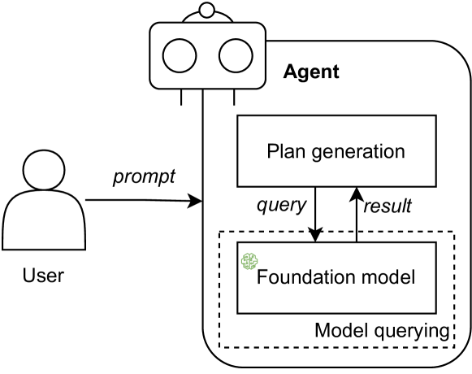
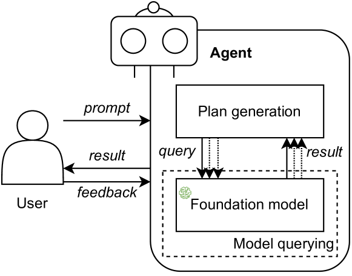
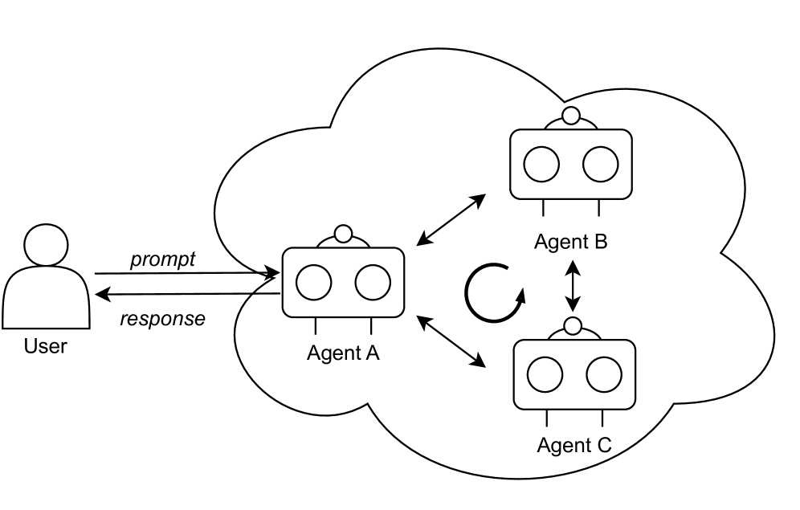
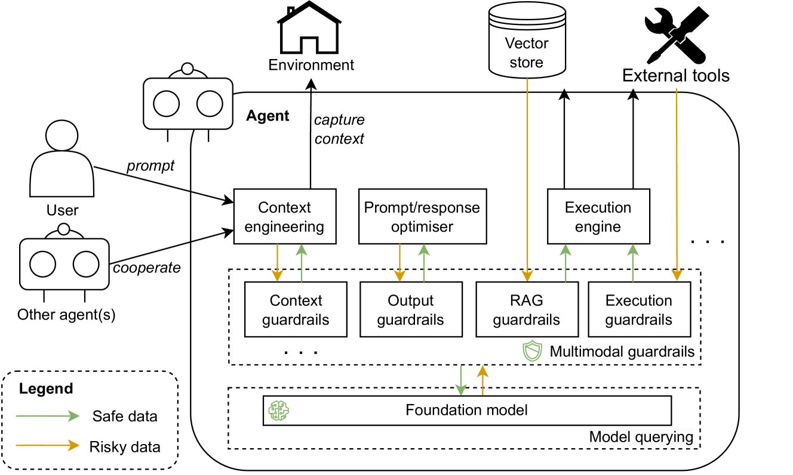
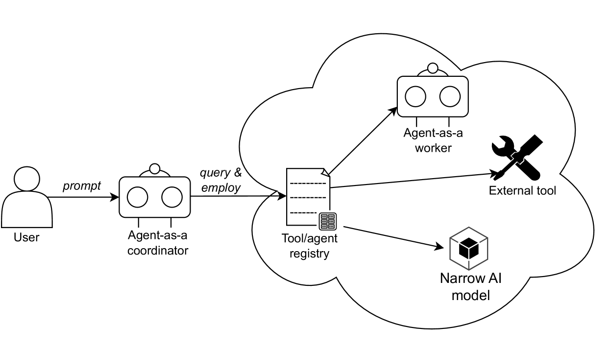
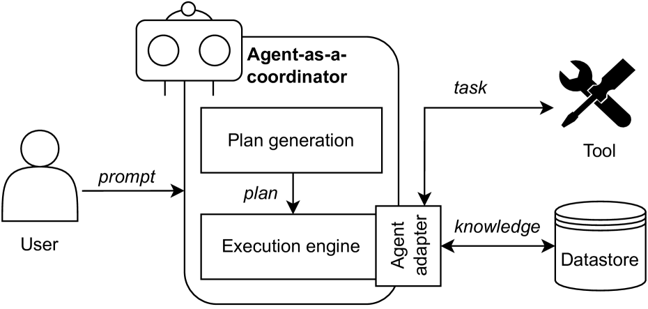
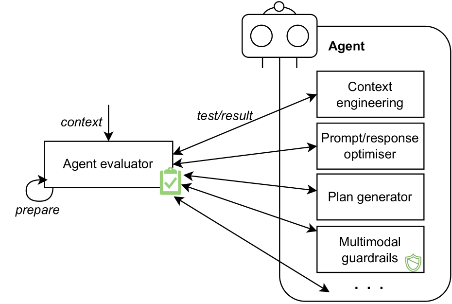

# 10. 원샷 모델 쿼리(One-shot Model Query)

## 요약
기초 모델에 단일 인스턴스로 접근하여 계획에 필요한 모든 단계를 생성합니다.

## 컨텍스트
사용자가 특정 목표를 위해 에이전트와 상호 작용할 때 포함된 기초 모델이 쿼리되어 계획이 생성됩니다.

## 문제
에이전트는 어떻게 효율적으로 계획 단계를 생성할 수 있을까?

## Forces

- **효율성**. **긴급한** 특정 업무의 경우, 상담원은 계획을 수립하고 **짧은 시간 내에 대응**할 수 있어야 합니다.
- **간접비**. 사용자는 상업적 기반 모델과의 각 상호작용에 대해 **비용을 지불해야** 합니다.

## 해결책
그림  7은 원샷 모델 쿼리 내에서 **사용자와 에이전트 간의 상호작용**을 보여줍니다 . 이 시나리오에서 에이전트는 통합된 기초 모델을 쿼리하여 사용자가 지정한 목표와 제약 조건에 따라 해당 계획을 생성합니다. 기초 모델은 제공된 입력을 이해하기 위해 사용자의 요구 사항(예: 제한된 예산)과 관련하여 **한 번만 쿼리**됩니다. 이러한 방식으로 에이전트는 광범위한 목표를 달성하기 위한 다단계 계획을 수립하고, 세부적인 추론 단계를 거치지 않고도 이 계획에 대한 전체적인 설명을 제공할 수 있습니다. 이 패턴은 다른 구성 요소가 통합된 기초 모델을 쿼리할 때도 적용됩니다.

## 결과

### 이익

- 효율성. 에이전트는 기본 모델을 한 번만 쿼리하여 사용자 목표를 달성하기 위한 계획을 생성할 수 있으므로, 소요되는 시간이 절약됩니다.
- 비용 효율성. 기반 모델을 한 번만 쿼리하므로 사용자 비용을 줄일 수 있습니다.
- 단순성. 원샷 모델 쿼리는 복잡한 작업 계획이 필요하지 않은 작업도 처리할 수 있습니다.

### 단점

- **과도한 단순화**. 복잡한 작업의 경우, 단발성 모델 쿼리는 모든 요구 사항을 한 번에 완벽하게 파악하지 못할 수 있으며, 이로 인해 작업이 지나치게 단순화되고 올바른 응답을 반환하지 못할 수 있습니다.
- **설명 가능성 부족**. 원샷 모델 쿼리는 통합 기반 모델을 한 번만 쿼리하므로 설명 가능성이 부족할 수 있으며, 이는 계획 생성을 위한 세부적인 추론 단계를 제공하지 못할 수 있습니다.
- 컨텍스트 창의 크기입니다. 긴 대화 컨텍스트를 처리하는 기반 모델의 현재 성능과 토큰 제한을 고려할 때 **응답 품질이 제한될 수 있습니다**.

## 알려진 사용 사례
사용자가 기초 모델을 활용할 때  원샷 모델 쿼리는 기본적으로 구성 또는 사용으로 간주될 수 있으며 CoT와 Zero-shot-CoT는 모두 이 패턴을 예시합니다

## 관련 패턴

- **증분형 모델 쿼리**. 증분형 모델 쿼리는 반복을 통한 일회성 모델 쿼리 의 대안으로 볼 수 있습니다 .
- **단일 경로 계획 생성기**. 원샷 모델 쿼리를 사용하면 기초 모델을 한 번만 쿼리하여 단일 경로 계획을 생성할 수 있습니다.
- **멀티모달 가드레일**. 멀티모달 가드레일은 모델 쿼리의 입력과 출력을 관리하는 중간 계층 역할을 합니다.

# 11. 인크리멘탈 모델 쿼리(Incremental Model Query)

## 요약
증분 모델 쿼리에는 계획 생성 프로세스의 각 단계에서 기초 모델에 액세스하는 것이 포함됩니다.

## 컨텍스트
사용자가 특정 목표를 위해 에이전트와 상호 작용할 때 포함된 기초 모델이 쿼리되어 계획이 생성됩니다.

## 문제
기초 모델은 첫 번째 시도에서 올바른 응답을 생성하는 데 어려움을 겪을 수 있습니다. 에이전트는 어떻게 정확한 추론 과정을 수행할 수 있을까요?

## Forces

- 컨텍스트 창의 크기. 기초 모델의 컨텍스트 창은 제한적일 수 있으므로 사용자가 완전하고 포괄적인 프롬프트를 제공하지 못할 수 있습니다.
- 과도한 단순화. 추론 과정이 지나치게 단순화되어 모델 질의를 단 한 번만 시도해도 불확실성이 발생할 수 있습니다.
- 설명 가능성 부족. 기초 모델에서 생성된 응답은 설명 가능성과 최종 신뢰성을 유지하기 위해 세부적인 추론 과정을 필요로 합니다.

## 해결책
그림  8은 계획 생성 구성 요소와 통합 기반 모델 간의 상호 작용과 증분 모델 쿼리를 보여줍니다 . 에이전트는 기반 모델에 대한 여러 쿼리를 통해 목표 달성을 위한 계획을 개발하기 위해 단계별 추론 프로세스에 참여할 수 있습니다. 한편, 추론 프로세스와 생성된 계획 모두에 대한 사용자 피드백을 언제든지 제공할 수 있으며, 모델 쿼리 중에 그에 따라 조정할 수 있습니다. 쿼리 수는 에이전트 구성에서 미리 정의하거나 사용자 프롬프트에서 지정할 수 있습니다. 증분 모델 쿼리는 컨텍스트 주입 또는 명시적인 워크플로/계획 저장소 및 관리 시스템을 통해 프로세스를 안내하는 재사용 가능한 템플릿을 사용할 수 있습니다. 이 패턴은 다른 구성 요소가 통합 기반 모델을 쿼리할 때 적용 가능합니다.

## 결과

### 이익

- 보충적 컨텍스트. 증분적 모델 쿼리를 통해 사용자는 컨텍스트를 여러 프롬프트로 분할하여 제한된 컨텍스트 창 문제를 해결할 수 있습니다.
- 추론 확실성. 기초 모델은 자체 점검이나 사용자 피드백을 통해 추론 단계를 반복적으로 개선합니다.
- 설명 가능성. 사용자는 증분형 모델 쿼리를 통해 기초 모델을 쿼리하여 자세한 추론 단계를 제공할 수 있습니다 .

### 단점

- 오버헤드. i) 증분 모델 쿼리에는 기초 모델과의 여러 번의 상호 작용이 필요하므로 계획 결정에 소요되는 시간이 늘어날 수 있습니다. ii) 상용 기초 모델을 활용할 경우 사용자 쿼리의 양이 많으면 비용이 많이 들 수 있습니다.
알려진 용도:
- HuggingGPT 9. HuggingGPT의 기본 모델은 사용자 요청을 세분화된 작업으로 분해하고 작업의 종속성과 실행 순서를 결정하기 위해 여러 번 쿼리됩니다  .37] .
- 에코어시스턴트  [38] . EcoAssistant는 기초 모델과 상호 작용하는 코드 실행기를 적용하여 코드를 반복적으로 개선합니다.
- 리우  [39] . ReWOO는 기초 모델을 쿼리하여 i) 상호 의존적인 계획 목록을 생성하고, ii) 도구에서 가져온 관찰 증거를 해당 작업과 결합합니다.

## 관련 패턴:

- 원샷 모델 쿼리. 증분형 모델 쿼리는 반복을 통한 원샷 모델 쿼리 의 대안으로 볼 수 있습니다 .
- 다중 경로 계획 생성기. 에이전트는 각 단계에서 사용자의 선호도를 파악하고, 기반 모델을 반복적으로 쿼리하여 다중 경로 계획을 생성할 수 있습니다.
- 자기성찰. 자기성찰을 위해서는 상담원이 통합 기반 모델을 여러 번 조회하여 응답을 검토하고 평가해야 합니다.
- 인간 반영. 인간 반영은 사용자/전문가와 에이전트 간의 반복적인 소통을 위한 증분적 모델 쿼리를 통해 가능합니다 .
- 멀티모달 가드레일 . 멀티모달 가드레일은 모델 쿼리의 입력과 출력을 관리하는 중간 계층 역할을 합니다.

# 12. 투표 기반 협력(Voting-based Cooperation)

## 요약
에이전트는 투표 기반 협력을 통해 자유롭게 의견을 제공하고 합의에 도달할 수 있습니다.

## 맥락
복합 AI 시스템 내에서 여러 에이전트를 활용할 수 있습니다. 에이전트는 각자의 관점을 가지고 동일한 작업에 협업해야 합니다.

## 문제
다양한 에이전트 간의 공정성을 보장하기 위해 에이전트의 결정을 적절하게 마무리하는 방법은 무엇인가?

## Forces		

- 다양성. 고용된 담당자들은 계획이 어떻게 구성되는지 또는 작업이 어떻게 완료되어야 하는지에 대해 다양한 의견을 가질 수 있습니다.
- 공정성. 대리인 간의 의사 결정은 공정성을 유지하기 위해 각자의 권리와 책임을 고려해야 합니다.
- 책임. 협업 결과에서 위반 사항이 발견될 경우 향후 감사를 위해 담당자의 행동을 기록해야 합니다.
캡션을 참조하세요

## 해결책
그림  12는 에이전트들이 투표를 통해 어떻게 협력하여 결정을 내릴 수 있는지 보여줍니다. 구체적으로, 에이전트는 사용자의 프롬프트에 대한 후보 응답을 먼저 생성한 후, 다양한 성찰적 제안을 선택지로 제시하는 투표를 진행합니다. 추가 에이전트는 자신의 능력과 경험에 따라 가장 적합한 피드백을 선택하기 위해 투표를 제출해야 합니다. 이 경우, 에이전트는 중앙 집중화된 방식으로 원래 에이전트가 코디네이터 역할을 수행한다는 것을 전달합니다. 투표 결과는 공식화되어 원래 에이전트에게 다시 전송되며, 원래 에이전트는 사용자에게 답변하기 전에 응답을 적절히 수정할 수 있습니다. 투표 프로세스는 코디네이터 역할을 하는 에이전트와 다른 에이전트 간의 직접 통신, 블록체인 기반 스마트 계약 등 다양한 방법을 통해 구현될 수 있습니다. 또한, 투표의 추적성과 검증성을 보장하기 위해서는 모든 참여 에이전트의 신원 관리가 중요합니다.

## 결과

### 이익

- 공정성. 공정성을 유지하기 위해 투표는 여러 가지 방식으로 진행될 수 있습니다. 예를 들어, 대리인의 권리가 동등하도록 인두수를 세거나, 대리인의 역할을 고려하여 가중치를 배분하는 등의 방법이 있습니다.
- 책임성. 전체 절차와 최종 결과는 해당 투표 시스템에 기록됩니다. 이해관계자는 특정 옵션을 선택한 책임자를 추적하여 파악할 수 있습니다.
- 집단 지성. 투표 후 최종 결정은 여러 에이전트(예: 포괄적인 지식 기반)의 장점을 활용할 수 있으므로, 단일 에이전트가 생성한 결정보다 더 정확하고 신뢰할 수 있는 것으로 간주됩니다.

### 단점:
- 중앙집중화. 특정 대리인이 대부분의 의사결정권을 획득하여 투표 과정을 방해할 수 있습니다.
- 오버헤드. 투표를 주최하면 상담원이 선택 사항을 검토하고 투표하는 데 드는 통신 오버헤드가 증가할 수 있습니다.

### 알려진 용도

- 해밀턴  [54] 는 9명의 에이전트를 활용하여 에이전트가 접수된 사건에 대해 투표해야 하는 법정을 시뮬레이션합니다. 각 사건은 우세한 투표 결과에 따라 결정됩니다.
- 채팅평가  [55] . 에이전트는 투표를 통해 사용자의 프롬프트에 대한 합의에 도달할 수 있으며, 투표 결과는 다수결이나 평균 점수를 계산하여 합산할 수 있습니다.
- 양 등  [56] GPT-4와 LLaMA-2를 기반으로 한 에이전트 유권자와 24개 도시 프로젝트에 대한 인간 유권자의 정렬을 살펴보았습니다. 그 결과, 에이전트 유권자는 획일적인 선택을 하는 경향이 있는 반면, 인간 유권자는 다양한 선호도를 가지는 것으로 나타났습니다.
- 리 등  [57] 기초 모델을 점진적으로 쿼리하여 생성합니다. N 샘플을 활용하고 여러 에이전트를 활용하여 다수결 투표를 통해 최종 응답을 선택합니다.

## 관련 패턴
- 교차 반사. 에이전트는 여러 에이전트에게 피드백을 요청하여 제공할 수 있으며, 이는 반사 에이전트 간의 투표 기반 협력을 통해 결정될 수 있습니다.
- 역할 기반 및 토론 기반 협력 . 투표 기반 협력은 에이전트 간 투표를 주관하는 다른 협력 패턴의 대안으로 볼 수 있으며, 두 협력은 상호 보완적으로 적용될 수 있습니다.
- 도구/대리인 등록 . 투표 과정에 참여하는 대리인은 도구/대리인 등록을 통해 고용될 수 있습니다 .

# 13. 역할 기반 협력(Role-based Cooperation)

## 요약
에이전트에게는 다양한 역할이 할당되고, 역할에 따라 최종 결정이 내려집니다.

## 맥락
복합 AI 시스템 내에서 여러 에이전트를 활용할 수 있습니다. 에이전트는 각자의 관점을 가지고 동일한 작업에 협업해야 합니다.

## 문제
에이전트는 자신의 전문 분야를 고려하여 특정 작업에 대해 어떻게 협력할 수 있습니까?

## Forces
- 다양성. 고용된 담당자들은 계획이 어떻게 구성되는지 또는 작업이 어떻게 완료되어야 하는지에 대해 다양한 의견을 가질 수 있습니다.
- 업무 분담. 에이전트는 다양한 목적에 따라 서로 다른 코퍼스로 훈련될 수 있으므로, 작업 완료를 위해서는 에이전트의 강점과 전문성을 고려해야 합니다.
- 내결함성. 협력 중 상담원이 부재할 수 있으며, 이는 최종 작업 결과에 영향을 미칠 수 있습니다.

## 해결책
그림  13은 에이전트들이 계층 구조로 협력하는 역할 기반 협업 의 고수준 그래픽 표현을 보여줍니다 . 특히, 에이전트는 특정 역할을 할당받고 페르소나 지정, 작업 정의, 도구 사용 및 프로세스 오케스트레이션을 통해 워크플로를 구축할 수 있습니다. 예를 들어, 계획자 역할을 하는 에이전트는 사용자의 목표를 일련의 작업으로 분해하여 다단계 계획을 생성할 수 있습니다. 이후, 할당자 역할을 하는 에이전트는 작업 할당을 조율할 수 있습니다. 즉, 일부 작업은 할당자가 직접 완료하고, 다른 작업은 도메인별 역량 및 전문성을 기반으로 특정 작업자 역할을 하는 에이전트에게 위임할 수 있습니다. 또한, 사용 가능한 에이전트가 없는 경우, 생성자 역할을 하는 에이전트를 호출하여 필요한 리소스, 명확한 목표 및 초기 지침을 제공하여 작업 및 책임의 원활한 전환을 보장함으로써 특정 역할을 가진 새로운 에이전트를 생성할 수 있습니다. 에이전트에게 더욱 정교한 역할을 정의하고 할당할 수 있습니다.

## 결과

### 이익

- 분업. 에이전트는 자신의 역할에 따라 현실 세계의 분업을 시뮬레이션하여 사회 현상을 관찰할 수 있습니다.
- 장애 허용. 여러 에이전트를 활용하므로 비활성 에이전트를 동일한 역할을 하는 다른 에이전트로 교체하여 시스템을 계속 운영할 수 있습니다.
- 확장성. 새로운 역할의 에이전트를 언제든지 고용하거나 생성하여 작업 워크플로를 개선하고 전체 시스템의 기능을 확장할 수 있습니다.
- 책임감. 담당자의 역할에 대한 책임이 명확하게 부여되면 책임감이 강화됩니다.

### 단점
- 간접비. 상담원 간 협력은 의사소통 간접비를 증가시키고, 역할에 따라 상담원 서비스 가격이 달라질 수 있습니다.
알려진 용도:
- XAgent 18. XAgent는 작업 생성을 위한 플래너 에이전트, 작업 할당을 위한 디스패처 에이전트, 작업 완료를 위한 툴 에이전트의 세 가지 주요 부분으로 구성됩니다.
- 메타GPT  [58] . MetaGPT는 표준화된 운영 절차에서 다양한 역할(예: 건축가, 프로젝트 관리자, 엔지니어)을 수행하는 다양한 에이전트를 활용합니다.
- 메드에이전트  [59] . 에이전트는 다양한 분야 전문가(예: 심장학, 외과, 위장병학)로서 역할을 할당받아 전문 분석을 제공하고 의료 문제에 대해 협력적으로 작업합니다.
- 왕 등  [60] 제안자 에이전트가 집계자 에이전트에게 유용한 참조 응답을 제공하고, 집계자 에이전트가 응답을 합성하고 개선하기 위해 계층으로 구성되는 혼합 에이전트를 제안합니다.

## 관련 패턴
- 교차 반영. 에이전트는 여러 에이전트에게 피드백을 요청하여 제공할 수 있으며, 이는 반영 에이전트 간의 역할 기반 협력을 통해 결정될 수 있습니다.
- 투표 기반 및 토론 기반 협력 . 역할 기반 협력은 에이전트에게 역할을 명확하게 할당하고, 에이전트는 주어진 역할에 따라 작업하고 협업하는 다른 협력 패턴의 대안으로 볼 수 있습니다. 또한, 이러한 패턴은 서로 보완적으로 적용될 수 있습니다.
- 도구/에이전트 레지스트리 . 도구/에이전트 레지스트리를 통해 다양한 역할을 가진 에이전트를 검색하고 고용할 수 있습니다 .

# 14. 토론 기반 협력(Debate-Based Cooperation)

## 요약
에이전트는 다른 에이전트로부터 피드백을 받고, 합의에 도달할 때까지 다른 에이전트와의 토론 중에 생각과 행동을 조정합니다.

## 맥락
복합 AI 시스템은 여러 에이전트를 통합하여 더욱 포괄적인 서비스를 제공할 수 있습니다. 포함된 에이전트는 각자의 관점을 가지고 동일한 작업에 대해 협업해야 합니다.

## 문제
여러 에이전트를 활용하여 정교한 응답을 생성하는 동시에 에이전트의 진화를 촉진하는 방법.

## Forces
- 다양성. 에이전트마다 다양한 의견을 제시하여 사용자에게 생성된 응답을 개선하는 데 도움이 될 수 있습니다.
- 적응력 부족. 에이전트는 새로운 상황이나 과제가 주어졌을 때 추론 및 반응 생성에 있어 창의성이 제한될 수 있습니다.
- 설명 가능성 부족. 위반 사항이 감지되면 감사를 위해 에이전트의 상호작용 과정을 해석해야 합니다.
캡션을 참조하세요

## 해결책
그림  14는 토론 기반 협력 의 고수준 그래픽 표현을 보여줍니다 . 사용자는 에이전트에게 질의를 보낼 수 있으며, 에이전트는 다른 에이전트와 질문을 공유합니다. 공유된 질문이 주어지면 각 에이전트는 자체적인 초기 응답을 생성하고, 이후 에이전트 간에 토론 라운드가 시작됩니다. 에이전트는 검증을 위해 분산된 방식으로 초기 응답을 서로에게 전파하는 동시에 포괄적이고 집단적인 결과에 기반하여 보다 포괄적인 응답을 구성하기 위한 지침과 잠재적 방향을 제공합니다. 또한 에이전트는 특정 상황에서 공유 메모리를 활용하거나 토론을 촉진하기 위해 서로가 해당 메모리에 접근하도록 허용할 수 있습니다. 이 토론 프로세스는 참여하는 모든 에이전트의 성과를 향상시키기 위해 반복될 수 있습니다. 토론 기반 협력은 미리 정의된 토론 라운드 수에 따라 종료될 수도 있고, 에이전트는 합의된 답변을 얻을 때까지 절차를 계속할 수도 있습니다.

## 결과:

### 이익:

- 적응성. 에이전트는 토론 과정 중에 다른 에이전트에 적응하여 지속적인 학습과 진화를 이룰 수 있습니다.
- 설명 가능성. 토론 기반 협력은 담당자의 주장과 제시된 증거를 바탕으로 구성되며, 전체 절차의 투명성과 설명 가능성을 유지합니다.
- 비판적 사고. 다른 에이전트와 논쟁하는 것은 에이전트가 향후 추론 과정에 필요한 비판적 사고 능력을 개발하는 데 도움이 될 수 있습니다.

### 단점:

- 제한된 역량. 토론 기반 협력 의 효과는 에이전트의 추론, 논증, 그리고 다른 에이전트의 진술에 대한 평가 능력에 달려 있습니다.
- 데이터 개인정보 보호. 상담원은 토론 과정에 영향을 미칠 수 있는 특정 민감한 정보를 공개하지 않아야 할 수도 있습니다.
- 오버헤드. 토론의 복잡성으로 인해 의사소통 및 계산 오버헤드가 증가할 수 있습니다.
- 확장성 유지. 참여 에이전트 수가 증가함에 따라 시스템 확장성이 영향을 받을 수 있습니다. 에이전트의 조정 및 인수 처리가 복잡해질 수 있습니다.

## 알려진 용도:

- crewAI 19 . crewAI는 주어진 주제에 대한 토론을 위해 여러 에이전트를 그룹화할 수 있는 다중 에이전트 오케스트레이션 프레임워크를 제공합니다.
- Liang et al.  [61] 다중 에이전트 토론을 활용하여 "사고의 퇴화" 문제를 해결합니다. 토론에서 한 에이전트는 다른 에이전트를 설득하고 실수를 바로잡아야 합니다.
- Du et al.  [62] 여러 에이전트를 사용하여 주어진 사용자 입력에 대해 논의하고, 실험 결과에 따르면 에이전트는 여러 라운드를 거친 후 합의된 답변에 수렴할 수 있는 것으로 나타났습니다.
- Chen et al.  [63] 각 에이전트가 다른 에이전트의 결과를 인식하고 자신의 전략을 조정할 수 있는 다중 에이전트 시스템에서 협상 과정을 살펴봅니다.
- 리 등  [64] 자동 평가 프로세스의 편향을 완화하기 위해 동료 순위와 에이전트 간 토론을 포함하는 프레임워크를 제안합니다.

## 관련 패턴:

- 교차 반영. 에이전트는 토론 기반 협력을 통해 다른 에이전트에게 반영 피드백을 제공할지 결정할 수 있습니다 .
- 투표 기반 협력 과 역할 기반 협력 . 토론 기반 협력은 행위자 간 토론을 주관하는 다른 협력 패턴의 대안으로 볼 수 있으며, 서로 보완적으로 함께 적용될 수 있습니다.
- 도구/대리인 등록 . 토론 과정에 참여하는 대리인은 도구/대리인 등록을 통해 고용될 수 있습니다 .

# 15. 멀티모달 가드레일(Multimodal Guardrails)

## 요약: 
다중 모드 가드레일은 사용자 요구 사항, 윤리 기준, 법률 등 특정 요구 사항을 충족하도록 기초 모델의 입력과 출력을 제어할 수 있습니다.

## 맥락: 
에이전트는 기반 모델과 기타 구성 요소로 구성됩니다. 사용자가 에이전트에 특정 목표를 요청하면, 목표 달성을 위해 기반 기반 모델이 쿼리됩니다.

## 문제: 
기반 모델이 적대적인 입력에 의해 영향을 받는 것을 방지하거나, 사용자 및 다른 구성 요소에 해롭거나 바람직하지 않은 출력을 생성하는 것을 방지하려면 어떻게 해야 할까요?

## Forces:

- 견고성. 적대적 정보가 기반 모델로 전송될 수 있으며, 이는 모델의 메모리와 모든 후속 추론 과정 및 결과에 영향을 미칩니다.
- 안전. Foundation 모델은 환각으로 인해 부적절한 반응을 생성할 수 있으며, 이는 사용자에게 불쾌감을 줄 수 있으며 다른 구성 요소(예: 다른 에이전트, 외부 도구)의 작동을 방해할 수 있습니다.
- 표준 정렬. 에이전트와 기반 기반 모델은 업계 및 조직의 특정 표준 및 요구 사항을 준수해야 합니다.

## 해결책: 
그림  15는 다중 모드 가드레일 의 단순화된 그래픽 표현을 보여줍니다 . 가드레일은 복합 AI 시스템의 기초 모델과 다른 모든 구성 요소 사이의 중간 계층으로 적용될 수 있습니다. 사용자가 프롬프트를 입력하거나 다른 구성 요소(예: 메모리)가 기초 모델에 메시지를 보내면 가드레일은 먼저 정보가 특정 사전 정의된 요구 사항을 충족하는지 확인할 수 있습니다. 유효한 정보만 기초 모델에 전달되고, 위험하거나 민감한 데이터는 전송되기 전에 처리됩니다. 예를 들어, 개인 식별 정보는 개인 정보 보호를 위해 신중하게 처리하거나 제거해야 합니다. 가드레일은 사전 정의된 예시에 의존하거나 "참조 없는" 방식으로 콘텐츠를 평가할 수 있습니다. 마찬가지로 기초 모델이 결과를 생성할 때 가드레일은 응답에 사용자에게 편향되거나 무관한 정보가 포함되지 않거나 다른 시스템 구성 요소의 특정 요구 사항을 충족하지 않도록 해야 합니다. 각각이 데이터 저장소에서 정보 검색, 사용자 입력 검증, 외부 API 호출 등 전문적인 상호작용을 담당하는 일련의 가드레일을 구현할 수 있습니다. 한편, 가드레일은 텍스트, 오디오, 비디오와 같은 다중 모드 데이터를 처리하여 포괄적인 모니터링과 제어를 제공할 수 있습니다.

## 결과:

### 이익:

- 견고성. 가드레일은 부적절한 맥락 정보를 필터링하여 기초 모델의 견고성을 유지합니다.
- 안전. 가드레일은 기초 모델 결과의 검증자 역할을 하며, 생성된 응답이 상담원 사용자에게 해를 끼치지 않도록 보장합니다.
- 표준 정렬. 조직의 정책 및 전략, 윤리 기준, 그리고 재단 모델의 행동을 규제하는 법적 요건을 참조하여 가드레일을 구성할 수 있습니다.
- 적응성. 가드레일은 다양한 기반 모델과 에이전트에 걸쳐 구현될 수 있으며, 맞춤형 요구 사항에 따라 배포될 수 있습니다.

### 단점:

- 오버헤드. i) 다중 모드 가드레일을 개발하기 위해 다양하고 고품질의 코퍼스를 수집하는 것은 많은 리소스를 필요로 할 수 있습니다. ii) 다중 모드 데이터를 실시간으로 처리하면 컴퓨팅 요구 사항과 비용이 증가할 수 있습니다.
- 설명 가능성 부족. 다중 모드 가드레일 의 복잡성으로 인해 최종 결과물을 설명하기 어렵습니다.

## 알려진 용도:

- NeMo 가드레일  [65] . NVIDIA는 사용자와 AI 시스템 간 대화의 일관성을 보장하고 잘못된 정보와 민감한 주제의 부정적인 영향을 방지하도록 특별히 설계된 NeMo 가드레일을 출시했습니다.
- 라마 가드  [66] . Meta는 안전 위험 분류법을 통해 세부 조정된 기반 모델 기반 안전 보호 모델인 Llama Guard를 공개했습니다. Llama Guard는 사용자 프롬프트 및 모델 출력에서 ​​잠재적으로 위험하거나 위반 가능성이 있는 콘텐츠를 식별할 수 있습니다.
- 가드레일 AI 20. 가드레일 AI는 기초 모델의 입력 및 출력에서 ​​다양한 위험을 처리하기 위한 다양한 검증 도구를 나열하는 허브를 제공합니다 .

## 관련 패턴:

- 선제적 목표 생성자. 다중 모드 가드레일은 선제적 목표 생성자가 수집한 다중 모드 데이터를 처리하는 데 도움이 될 수 있습니다 .
- 원샷 및 증분형 모델 쿼리 . 멀티모달 가드레일은 모델 쿼리의 입력과 출력을 관리하는 중간 계층 역할을 합니다.

# 16. 툴/에이전트 레지스트리(Tool/Agent Registry)

## 요약: 
도구/에이전트 레지스트리는 다양한 에이전트와 도구를 선택할 수 있는 통합적이고 편리한 소스를 유지합니다.

## 맥락: 
에이전트 내에서 작업 실행자는 다른 에이전트와 협력하거나 외부 도구를 활용하여 기능을 확장할 수 있습니다.

## 문제: 
다양한 에이전트와 도구가 있는데, 에이전트는 어떻게 효율적으로 적절한 외부 에이전트와 도구를 선택할 수 있을까?

## Forces:

- 검색 가능성. 사용자와 에이전트가 다양한 에이전트와 도구를 쉽게 찾을 수 있도록 지원하는 기능이 다양하기 때문에 찾기 어려울 수 있습니다.
- 효율성. 사용자/에이전트는 일정 기간 내에 에이전트와 도구 선택을 완료해야 합니다.
- 도구 적합성. 특정 작업에는 에이전트/도구에 대한 특정 요구 사항(예: 특정 기능)이 있을 수 있습니다.

## 해결책: 
그림  16은 에이전트가 도구/에이전트 레지스트리를 통해 외부 에이전트와 도구를 검색하는 방법을 보여줍니다 . 사용자가 에이전트에게 목표를 요청하면 에이전트는 목표를 세분화된 작업으로 분해합니다. 에이전트는 도구/에이전트 레지스트리 에 쿼리를 보낼 수 있습니다. 도구/에이전트 레지스트리는 다양한 도구와 에이전트를 일련의 지표(예: 도메인별 기능, 가격, 컨텍스트 윈도우)를 기준으로 수집하고 분류하는 주요 진입점입니다. 반환된 정보를 기반으로 에이전트는 각 도구와 에이전트에 작업을 할당하고 할당할 수 있습니다. 레지스트리는 특정 지식 기반을 갖춘 코디네이터 에이전트, 블록체인 기반 스마트 계약 등 다양한 방식으로 구현될 수 있으며, 레지스트리는 도구/에이전트 서비스 거래를 위한 마켓플레이스로 확장될 수 있습니다.

## 결과:

### 이익:

- 검색 가능성. 레지스트리는 사용자와 에이전트가 다양한 기능을 갖춘 도구와 에이전트를 검색할 수 있는 카탈로그를 제공합니다.
- 효율성. 레지스트리는 도구 및 에이전트의 속성(예: 성능, 가격)을 나열하는 직관적인 목록을 제공하여 비교 시간을 절약합니다.
- 도구 적합성. 작업 요구 사항 및 조건을 고려하여 사용자와 에이전트는 제공된 속성에 따라 가장 적합한 도구/에이전트를 선택할 수 있습니다.
- 확장성. 레지스트리는 도구와 에이전트에 대한 특정 메타데이터만 저장하므로 데이터 구조가 간단하고 가벼워 레지스트리의 확장성이 보장됩니다.

### 단점:

- 중앙 집중화. 레지스트리는 특정 공급업체에 종속되는 솔루션이 되어 단일 장애 지점을 초래할 수 있습니다. 외부 기관에서 관리하는 경우 조작 및 손상될 수 있습니다.
- 오버헤드. 도구/에이전트 레지스트리를 구현하고 유지 관리하는 데는 추가적인 복잡성과 오버헤드가 발생할 수 있습니다.

## 알려진 용도:

- GPTStore 21. GPTStore는 ChatGPT 기반 에이전트를 검색하기 위한 카탈로그를 제공합니다.
- TPTU  [67] . TPTU는 AI 에이전트의 기능을 확장하기 위한 툴셋을 통합합니다.
- 보이저  [68] . VOYAGER는 액션 프로그램을 저장할 수 있으므로 재사용을 위한 기술 라이브러리를 점진적으로 구축할 수 있습니다.
- 오픈에이전츠  [69] . 에이전트는 플러그인의 API 호출을 관리하기 위해 특별히 개발되었습니다.

## 관련 패턴:

- 교차 반사. 에이전트는 도구/에이전트 레지스트리를 통해 교차 반사 를 위해 반사 에이전트를 검색할 수 있습니다 .
- 투표 기반, 역할 기반 , 토론 기반 협력. 도구/에이전트 레지스트리는 협력 패턴에 대한 에이전트 소스를 제공할 수 있습니다.
- 에이전트 어댑터. 도구/에이전트 레지스트리는 사용 가능한 외부 도구를 기록하고, 에이전트 어댑터는 선택된 도구의 인터페이스를 에이전트 친화적인 형식으로 변환할 수 있습니다.

# 17. 에이전트 어댑터(Agent Adapter)

## 요약: 
에이전트 어댑터는 작업 완료를 위해 에이전트와 외부 도구를 연결하는 인터페이스를 제공합니다.

## 맥락: 
에이전트는 확장된 역량을 위해 외부 도구를 활용하여 특정 작업을 완료할 수 있습니다.

## 문제: 
에이전트는 다양한 도구의 서로 다른 인터페이스를 처리해야 하는데, 특정 인터페이스는 에이전트와 상호 작용하기에 호환되지 않거나 비효율적일 수 있습니다. 에이전트는 어떻게 외부 도구에 작업을 할당하고 결과를 처리할 수 있을까요?

## Forces:
- 상호 운용성. 특정 작업을 완료하려면 외부 도구가 필요하며, 도구에는 중간 단계에서 특정 정보를 처리하는 에이전트가 필요할 수 있습니다.
- 적응성. 에이전트는 작업 복잡성, 도구 성능, 비용 등을 고려하여 새로운 도구를 활용할 수 있습니다.
- 오버헤드. 에이전트와 외부 도구에 대한 호환 인터페이스를 수동으로 개발하는 것은 비용이 많이 들고 비효율적일 수 있습니다.

## 해결책: 
그림  17은 에이전트 어댑터 의 단순화된 그래픽 표현을 보여줍니다 . 사용자의 지시를 받으면 에이전트는 사용자 목표를 달성하기 위한 일련의 작업으로 구성된 계획을 생성합니다. 특히, 에이전트는 다양한 외부 도구를 사용하여 다양한 작업을 완료할 수 있습니다. 그러나 도구는 각각 다른 인터페이스를 가지고 있으며, 에이전트가 처리해야 할 추상화 수준이 다르거나 특정 형식 요구 사항이 있을 수 있습니다. 에이전트 어댑터는 에이전트 메시지를 필요한 형식이나 콘텐츠로 변환하거나, 반대로 변환하여 이러한 인터페이스를 호출하고 관리할 수 있도록 지원합니다. 특히, 어댑터는 데이터 저장소에서 도구 설명서나 튜토리얼을 검색하여 사용 가능한 인터페이스를 확보하고 사용법을 익힐 수 있습니다. 그런 다음 인터페이스 요구 사항에 따라 에이전트 출력을 변환하고 서비스를 호출합니다  .70] . 세밀한 인터페이스 설명은 에이전트의 이해를 높이고 결과적으로 성능을 향상시킬 수 있습니다. 어댑터는 또한 도구에서 실행 결과를 수신하여 추가 분석을 위해 기반 기반 모델로 전송합니다(예: 다른 도구에 대한 작업 할당, 도구 사용을 위한 자체 분석). 예를 들어, 어댑터는 로컬 파일 시스템과 상호 작용할 때 작업을 시스템 메시지로 변환하거나, 비디오 게임을 할 때 그래픽 사용자 인터페이스를 캡처하여 작동시킬 수 있습니다.

## 결과:

### 이익:

- 상호 운용성. 에이전트 어댑터는 에이전트와 외부 도구 간의 상호 운용성을 용이하게 합니다.
- 적응성. 에이전트는 에이전트 어댑터를 통해 새로운 도구를 활용할 수 있으며 , 해당 매뉴얼이나 튜토리얼을 통해 도구 API를 획득하고 변환할 수 있습니다.
- 개발 비용 절감. 에이전트 어댑터를 사용하면 인터페이스의 자동 변환이 가능하므로, 다양한 도구에 맞는 호환 인터페이스를 개발할 필요가 없으므로 개발 비용이 절감됩니다.

### 단점:

- 유지 관리 오버헤드. i) 에이전트 어댑터 자체에는 출력의 정확성을 보장하기 위해 적절한 유지 관리 및 평가가 필요합니다. ii) 에이전트 어댑터에는 과거 도구 인터페이스를 기록하기 위한 추가 메모리나 외부 데이터 저장소가 필요할 수 있습니다.

## 알려진 용도:

- AutoGen  22. 사용자는 에이전트에 다양한 도구를 등록하고 사용 설명을 지정할 수 있습니다. 등록된 도구는 에이전트가 사용자와 대화하는 동안 활용됩니다.
- Apple Intelligence  23. Apple Intelligence는 다양한 제품과 앱에서 글쓰기, 이미지 생성, 일정 관리를 지원합니다. 예를 들어, 사용자의 사진 라이브러리에 있는 항목을 캡처하고 이모지를 만들 수 있습니다.
- 시맨틱 커널  24. 시맨틱 커널은 에이전트와 플러그인을 조율하여 에이전트의 기능을 확장할 수 있습니다. 플러그인은 에이전트가 이해할 수 있도록 의미적 설명(예: 입력, 출력, 부작용)을 제공해야 합니다.
- 양 등  [71] SWE 에이전트를 고안하여 에이전트-컴퓨터 인터페이스를 제공하고, 이를 통해 기초 모델 기반 에이전트가 코드 명령을 처리하고 소프트웨어 엔지니어링 작업을 해결할 수 있도록 합니다.

## 관련 패턴:

- 프롬프트/응답 최적화 도구. 프롬프트/응답 최적화 도구는 사용자 입력을 개선하고, 최적화된 프롬프트를 다른 에이전트에게 전송하여 목표 달성을 지원할 수 있습니다. 반면, 에이전트 어댑터는 외부 도구 활용에 더욱 중점을 둡니다.
- 도구/에이전트 레지스트리. 도구/에이전트 레지스트리는 사용 가능한 외부 도구를 기록하고, 에이전트 어댑터는 선택된 도구의 인터페이스를 에이전트 친화적인 형식으로 변환할 수 있습니다.

# 18. 에이전트 평가기(Agent Evaluator)

## 요약: 
에이전트 평가자는 다양한 요구 사항과 측정 항목을 기준으로 에이전트를 평가하기 위한 테스트를 수행할 수 있습니다.

## 컨텍스트: 
에이전트 내에서 기본 모델과 일련의 구성 요소가 조정되어 추론을 수행하고 사용자의 프롬프트에 따라 응답을 생성합니다.

## 문제: 
에이전트의 성과를 평가하여 의도한 대로 동작하는지 확인하는 방법은 무엇인가?

## 힘:

- 기능적 적합성 보장. 에이전트 개발자는 배포된 에이전트가 의도한 대로 작동하여 사용자에게 완전하고 정확하며 적절한 서비스를 제공하는지 확인해야 합니다.
- 적응성 향상. 에이전트 개발자는 특정 시나리오에서 에이전트의 사용을 이해하고 분석하여 적절한 적응을 수행해야 합니다.

## 해결책: 
그림  18은 에이전트 평가기를 단순화된 그래픽으로 표현한 것입니다 . 개발자는 평가기를 배포하여 설계 시점과 런타임 시점 모두에서 에이전트의 응답 및 추론 과정을 평가할 수 있습니다. 특히, 개발자는 특정 시나리오 기반 요구 사항, 지표 및 에이전트의 예상 출력을 정의하는 등 평가 파이프라인을 구축해야 합니다. 특정 상황에서 에이전트 평가기는 상황에 맞는 테스트 케이스(외부 리소스에서 검색하거나 직접 생성)를 준비하고 에이전트 구성 요소에 대한 평가를 수행합니다. 평가 결과는 경계 사례, 근접 사고 등과 같은 귀중한 피드백을 제공하며, 개발자는 에이전트를 더욱 세부적으로 조정하거나 해당 위험 완화 솔루션을 적용하고 결과를 기반으로 평가기를 업그레이드할 수 있습니다.

## 결과:

### 이익:

- 기능적 적합성. 에이전트 개발자는 에이전트의 행동을 학습하고, 평가 결과를 통해 실제 응답과 예상 응답을 비교할 수 있습니다.
- 적응성. 에이전트 개발자는 시나리오 기반 요구사항에 대한 평가 결과를 분석하고, 에이전트가 새로운 요구사항이나 테스트 사례에 적응해야 하는지 여부를 결정할 수 있습니다.
- 유연성. 에이전트 개발자는 에이전트의 특정 측면을 테스트하기 위해 맞춤형 지표와 예상 출력을 정의할 수 있습니다.

### 단점:

- 계량적 정량화. 소프트웨어 품질 속성 평가를 위한 정량적 기준을 설계하는 것은 어렵습니다.
- 평가의 질. 평가의 질은 준비된 테스트 케이스에 따라 달라집니다.

## 알려진 용도:

- 25. 영국 AI 안전 연구소는 신속한 엔지니어링, 도구 사용 등을 포함한 일련의 기본 구성 요소를 제공하는 대규모 언어 모델에 대한 평가 프레임워크를 고안했습니다 .
- DeepEval 26. DeepEval은 14개의 평가 지표를 통합하고 LlamaIndex, Hugging Face 등의 에이전트 개발 프레임워크를 지원합니다.
- Promptfoo 27. Promptfoo는 캐싱, 동시성, 라이브 리로딩을 통해 효율적인 평가 서비스를 제공할 수 있으며, 사용자 정의 메트릭을 기반으로 자동 점수 매기기 기능도 제공합니다.
- Ragas 28. Ragas는 테스트 데이터 세트 생성과 LLM 지원 평가 지표 활용을 통해 RAG 파이프라인에 대한 평가를 용이하게 합니다.

## 관련 패턴: 
에이전트 평가기는 설계 시점과 런타임 모두에서 다른 패턴 지향 에이전트 구성 요소의 성능을 평가하도록 구성 및 배포될 수 있습니다.
