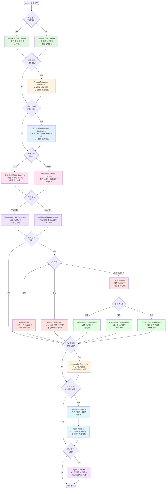
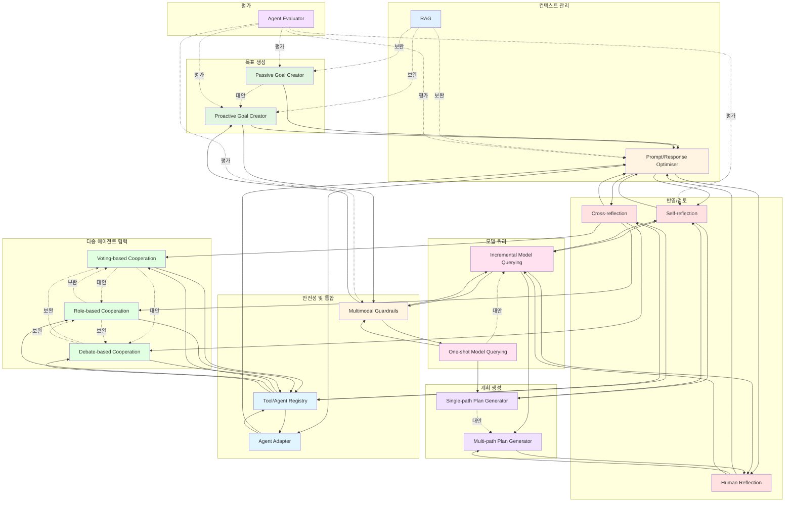
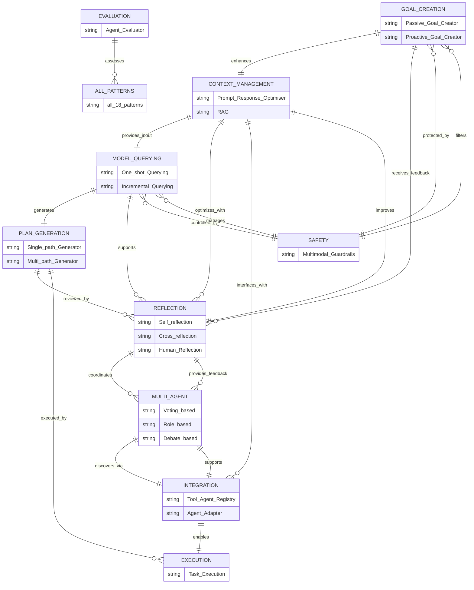
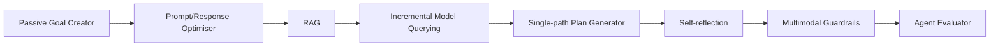
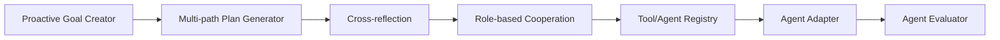
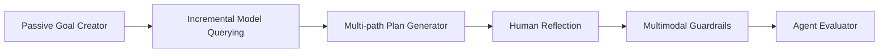
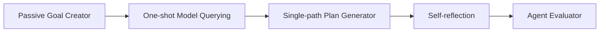
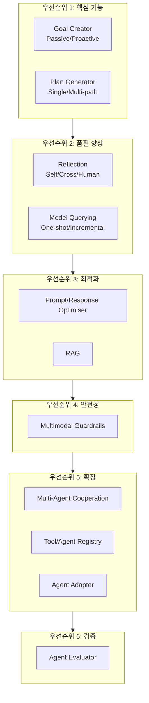

# Agent Design Pattern Selection Diagrams

## 1. 패턴 선택 의사결정 플로우차트

## 2. 패턴 카테고리 및 관계도

## 3. 패턴 간 관계 타입 (ERD 스타일)

## 4. 패턴 선택 매트릭스

| 요구사항 | 추천 패턴 | 대안 패턴 | 보완 패턴 |
|---------|----------|----------|----------|
| **접근성 향상** | Proactive Goal Creator | Passive Goal Creator | Multimodal Guardrails |
| **효율성 우선** | One-shot Model Querying, Passive Goal Creator | Incremental Model Querying | Single-path Plan Generator |
| **추론 확실성** | Incremental Model Querying, Self-reflection | One-shot Model Querying | Cross-reflection, RAG |
| **인간 선호 정렬** | Human Reflection, Multi-path Plan Generator | Self-reflection | Prompt/Response Optimiser |
| **확장성** | Role-based Cooperation, Cross-reflection | Voting-based Cooperation | Tool/Agent Registry |
| **데이터 프라이버시** | RAG | Fine-tuning | Multimodal Guardrails |
| **비용 최적화** | One-shot Model Querying | Incremental Model Querying | Self-reflection |
| **설명 가능성** | Incremental Model Querying, Self-reflection | One-shot Model Querying | Human Reflection, Debate-based |
| **안전성** | Multimodal Guardrails | Human Reflection | Self-reflection |
| **상호운용성** | Agent Adapter, Tool/Agent Registry | - | Prompt/Response Optimiser |
| **공정성** | Voting-based Cooperation | Role-based Cooperation | Human Reflection |
| **적응성** | Debate-based Cooperation, Agent Adapter | Role-based Cooperation | Agent Evaluator |

## 5. 패턴 조합 예시

### 예시 1: 고신뢰성 에이전트

### 예시 2: 협업 에이전트 시스템

### 예시 3: 인간 중심 에이전트

### 예시 4: 비용 효율적 에이전트

## 6. 패턴 선택 체크리스트

### Step 1: 목표 생성 방식 결정
- [ ] 사용자가 명확한 프롬프트를 제공하는가? → Passive Goal Creator
- [ ] 멀티모달 컨텍스트 캡처가 필요한가? → Proactive Goal Creator
- [ ] 접근성이 중요한가? → Proactive Goal Creator

### Step 2: 컨텍스트 관리 결정
- [ ] 프롬프트 표준화가 필요한가? → Prompt/Response Optimiser
- [ ] 외부 지식 베이스가 필요한가? → RAG
- [ ] 데이터 프라이버시가 중요한가? → RAG

### Step 3: 모델 쿼리 전략 결정
- [ ] 비용이 제한적인가? → One-shot Model Querying
- [ ] 상세한 추론 과정이 필요한가? → Incremental Model Querying
- [ ] 설명 가능성이 중요한가? → Incremental Model Querying

### Step 4: 계획 생성 방식 결정
- [ ] 효율성이 최우선인가? → Single-path Plan Generator
- [ ] 사용자 맞춤화가 필요한가? → Multi-path Plan Generator
- [ ] 복잡한 작업인가? → Multi-path Plan Generator

### Step 5: 검토 메커니즘 결정
- [ ] 자동화된 검토가 필요한가? → Self-reflection
- [ ] 다양한 관점이 필요한가? → Cross-reflection
- [ ] 인간의 판단이 중요한가? → Human Reflection

### Step 6: 협력 방식 결정 (다중 에이전트의 경우)
- [ ] 공정한 의사결정이 필요한가? → Voting-based
- [ ] 전문화된 역할 분담이 필요한가? → Role-based
- [ ] 적응적 학습이 필요한가? → Debate-based

### Step 7: 안전성 및 통합 결정
- [ ] 입출력 제어가 필요한가? → Multimodal Guardrails
- [ ] 외부 도구/에이전트 관리가 필요한가? → Tool/Agent Registry
- [ ] 도구 인터페이스 변환이 필요한가? → Agent Adapter

### Step 8: 평가 결정
- [ ] 성능 평가가 필요한가? → Agent Evaluator

## 7. 패턴 적용 우선순위

## 범례

**관계 타입:**
- 실선 화살표 (→): 직접적인 연결/의존성
- 점선 화살표 (-.->): 대안 관계
- 이중선 (==>): 강한 의존성
- "보완": 함께 사용하면 시너지

**색상 의미:**
- 🟢 녹색: 목표 생성 관련
- 🟡 노란색: 컨텍스트 관리
- 🔵 파란색: 데이터/지식 관련
- 🔴 분홍/빨강: 추론 및 검토
- 🟣 보라: 계획 생성
- 🟠 주황: 안전성
- 🔷 청록: 통합 및 도구
