# LangChain/LangGraph 에이전트 디자인 패턴 완벽 가이드

> 이 문서는 Chapter 12의 7가지 에이전트 디자인 패턴을 초심자도 이해할 수 있도록 상세하게 설명합니다.

## 목차

1. [개요](#개요)
2. [전체 아키텍처](#전체-아키텍처)
3. [기본 구성 요소](#기본-구성-요소)
4. [7가지 디자인 패턴](#7가지-디자인-패턴)
5. [패턴 간의 관계와 발전](#패턴-간의-관계와-발전)
6. [실습 예제](#실습-예제)

---

## 개요

### 이 프로젝트는 무엇인가?

이 프로젝트는 **LLM 기반 에이전트를 설계하는 7가지 핵심 패턴**을 구현한 것입니다. 각 패턴은 에이전트가 사용자의 복잡한 요청을 처리하는 방식을 개선하고 발전시킵니다.

### 왜 여러 패턴이 필요한가?

단순히 LLM에게 질문하고 답을 받는 것만으로는 복잡한 작업을 처리하기 어렵습니다. 예를 들어:

- ❌ **단순 질문**: "카레라이스 만드는 방법 알려줘"
  - 문제: 모호하고, 측정 불가능하며, 구체적이지 않음

- ✅ **개선된 접근**:
  1. 목표를 명확히 정의
  2. 실행 가능한 단계로 분해
  3. 각 단계를 체계적으로 수행
  4. 결과를 검증하고 개선

### 핵심 개념

```
사용자 입력 (모호한 요청)
    ↓
목표 명확화 (Goal Setting)
    ↓
계획 수립 (Planning)
    ↓
실행 (Execution)
    ↓
성찰 및 개선 (Reflection)
    ↓
최종 결과
```

---

## 전체 아키텍처

### 시스템 구성도

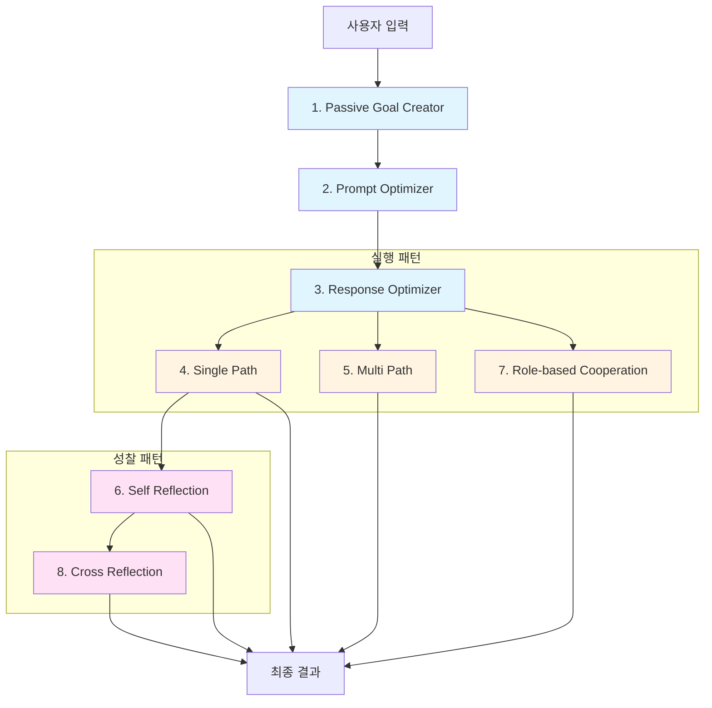

### 레이어별 분류

| 레이어 | 패턴 | 역할 |
|--------|------|------|
| **🎯 목표 설정** | Passive Goal Creator | 모호한 입력을 명확한 목표로 변환 |
| **⚡ 최적화** | Prompt Optimizer | SMART 원칙으로 목표 구체화 |
| **📋 응답 정의** | Response Optimizer | 응답 형식과 구조 정의 |
| **🚀 실행** | Single Path | 단일 경로로 순차 실행 |
| **🌿 실행** | Multi Path | 여러 옵션 중 선택하며 실행 |
| **👥 실행** | Role-based Cooperation | 역할 기반 협업 실행 |
| **🔍 성찰** | Self Reflection | 자기 성찰 및 개선 |
| **🔄 성찰** | Cross Reflection | 다른 LLM과 교차 검증 |

---

## 기본 구성 요소

### 1. 공통 설정 (settings.py)

모든 패턴에서 사용하는 설정을 관리합니다:

```python
- openai_smart_model: 사용할 OpenAI 모델 (예: gpt-4)
- anthropic_smart_model: 사용할 Anthropic 모델 (예: claude-3)
- temperature: 응답의 창의성 조절 (0~1)
```

### 2. 핵심 데이터 모델

#### Goal (목표)
```python
class Goal:
    description: str  # 목표 설명
```

#### OptimizedGoal (최적화된 목표)
```python
class OptimizedGoal:
    description: str  # 목표 설명
    metrics: str      # 측정 기준
```

#### Task (태스크)
```python
class Task:
    description: str  # 태스크 설명
    role: Role       # 배정된 역할 (선택적)
```

### 3. 실행 흐름

모든 패턴은 기본적으로 다음 단계를 따릅니다:

```
1. 입력 받기 (--task 인자)
2. LLM 초기화
3. 목표 설정/최적화
4. 태스크 분해
5. 태스크 실행
6. 결과 집계
7. 최종 출력
```

---

## 7가지 디자인 패턴

### 패턴 1: Passive Goal Creator (패시브 골 크리에이터)

#### 🎯 목적
사용자의 모호한 입력을 **실행 가능한 명확한 목표**로 변환합니다.

#### 📊 처리 흐름

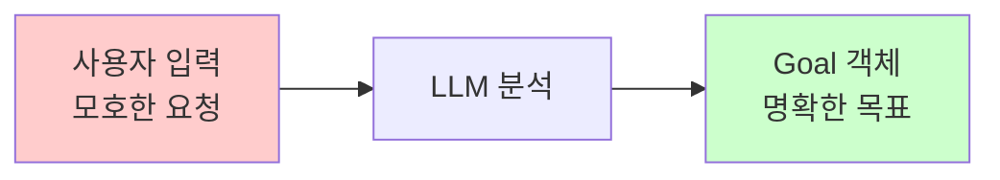

#### 💡 예시

**입력**: "카레라이스 만드는 방법"

**출력**:
```
Goal {
  description: "인터넷을 이용하여 카레라이스를 만드는
                구체적인 방법을 조사하고, 사용자에게
                단계별 레시피를 제공한다."
}
```

#### 🔑 핵심 코드

```python
class PassiveGoalCreator:
    def run(self, query: str) -> Goal:
        # LLM에게 목표 생성 요청
        prompt = "사용자 입력을 분석하여 명확하고
                  실행 가능한 목표를 생성해 주세요."
        return llm.invoke(query)
```

#### ⚠️ 제약사항
- 인터넷 조사만 가능
- 보고서 생성만 가능
- 다른 행동(파일 수정, 이메일 발송 등)은 불가

---

### 패턴 2: Prompt Optimizer (프롬프트 최적화)

#### 🎯 목적
기본 목표를 **SMART 원칙**에 따라 최적화합니다.

#### 📚 SMART 원칙

| 원칙 | 의미 | 예시 |
|------|------|------|
| **S**pecific | 구체적 | "카레 만들기" → "4인분 일본식 카레라이스 만들기" |
| **M**easurable | 측정 가능 | "필요한 재료 5가지 이상, 조리 시간 명시" |
| **A**chievable | 달성 가능 | "인터넷 조사로 달성 가능한 범위" |
| **R**elevant | 관련성 | "사용자 요청과 직접 관련됨" |
| **T**ime-bound | 기한 | "즉시 조사 가능" (선택적) |

#### 📊 처리 흐름


#### 💡 예시

**입력 (Goal)**:
```
"카레라이스 만드는 방법을 조사한다."
```

**출력 (OptimizedGoal)**:
```
OptimizedGoal {
  description: "4인분 기준 일본식 카레라이스 레시피를
                인터넷에서 조사하여, 재료 목록(최소 5가지),
                단계별 조리법(5~7단계), 조리 시간을
                포함한 상세한 가이드를 작성한다.",

  metrics: "1) 재료 목록이 5가지 이상인가?
            2) 각 단계가 구체적으로 기술되었는가?
            3) 조리 시간이 명시되었는가?
            4) 초보자도 따라할 수 있는가?"
}
```

#### 🔑 핵심 코드

```python
class PromptOptimizer:
    def run(self, query: str) -> OptimizedGoal:
        prompt = """
        SMART 원칙에 따라 목표를 최적화하세요:
        1. 구체적이고 명확하게
        2. 측정 가능한 기준 포함
        3. 추상적 표현 금지
        """
        return llm.with_structured_output(OptimizedGoal)
```

---

### 패턴 3: Response Optimizer (응답 최적화)

#### 🎯 목적
최종 응답이 **어떤 형식과 구조**를 가져야 하는지 정의합니다.

#### 📊 처리 흐름

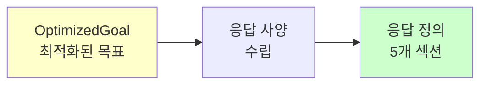

#### 📋 응답 정의 구조

Response Optimizer는 다음 5가지 섹션으로 구성된 응답 가이드를 생성합니다:

1. **목표 분석**: 목표의 핵심 요소와 의도 파악
2. **응답 사양**: 톤, 구조, 내용 초점 정의
3. **AI 에이전트 지침**: 구체적인 작성 지침
4. **응답 예시**: 목표에 맞는 샘플 응답
5. **평가 기준**: 품질 측정 기준

#### 💡 예시

**입력 (OptimizedGoal)**:
```
"4인분 카레라이스 레시피 조사"
```

**출력 (응답 정의)**:
```markdown
### 목표 분석
사용자는 실제로 요리할 수 있는 구체적이고
따라하기 쉬운 카레 레시피를 원함

### 응답 사양
- 톤: 친근하고 이해하기 쉬운 설명
- 구조: 재료 → 준비 → 조리 → 팁 순서
- 초점: 초보자도 실패 없이 만들 수 있도록

### AI 에이전트 지침
1. 재료는 분량과 함께 나열
2. 각 단계는 "~하세요" 형태로 작성
3. 중요한 포인트는 별도 표시
4. 조리 시간은 각 단계별로 명시

### 응답 예시
[재료 (4인분)]
- 카레 루: 4~5조각
- 감자: 2개 (중간 크기)
...

### 평가 기준
1. 재료가 정확한 분량과 함께 제시되었는가?
2. 각 단계가 순서대로 명확하게 설명되었는가?
3. 초보자가 따라하기에 충분히 상세한가?
```

#### 🔑 핵심 코드

```python
class ResponseOptimizer:
    def run(self, query: str) -> str:
        prompt = """
        다음 5단계로 응답 최적화 프롬프트를 작성하세요:
        1. 목표 분석
        2. 응답 사양 수립 (톤, 구조, 초점)
        3. 구체적 지침 작성
        4. 예시 제공
        5. 평가 기준 설정
        """
        return llm.invoke(query)
```

---

### 패턴 4: Single Path Plan Generation (단일 경로 계획)

#### 🎯 목적
목표를 **순차적으로 실행할 수 있는 단계**로 분해하여 하나씩 수행합니다.

#### 📊 처리 흐름

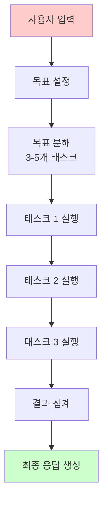

#### 🔄 워크플로우 상세

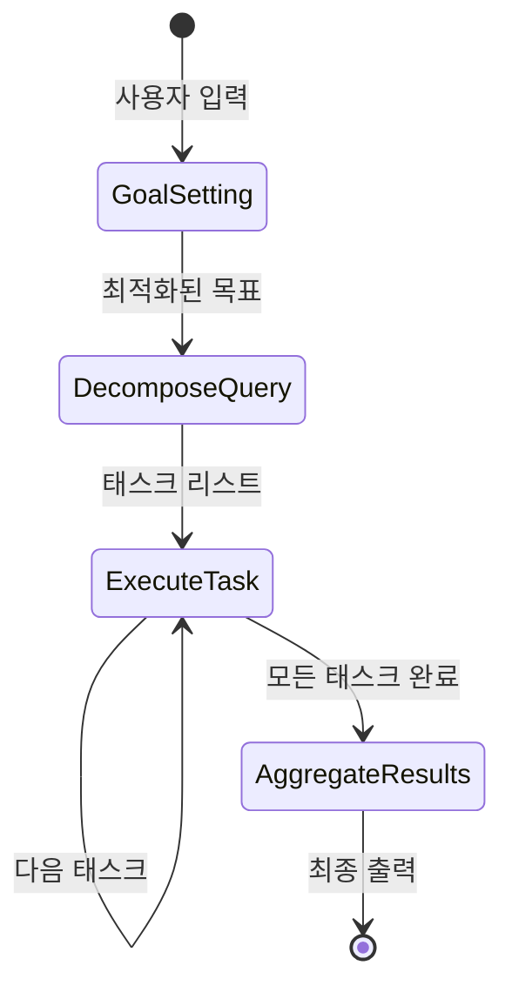

#### 💡 예시

**1단계: 목표 분해**
```python
DecomposedTasks {
  values: [
    "카레라이스 기본 레시피를 인터넷에서 검색하여
     필요한 재료 목록과 기본 조리 순서를 파악한다.",

    "카레 루를 사용한 조리법과 가루 카레를 사용한
     조리법의 차이점을 조사한다.",

    "초보자를 위한 팁과 주의사항, 맛을 더하는
     비법을 수집한다."
  ]
}
```

**2단계: 순차 실행**
```
Task 1 실행 → [Tavily 검색] → 결과 1 저장
Task 2 실행 → [Tavily 검색] → 결과 2 저장
Task 3 실행 → [Tavily 검색] → 결과 3 저장
```

**3단계: 결과 집계**
```
모든 결과를 종합하여 응답 정의에 맞게
최종 보고서 생성
```

#### 🔑 핵심 컴포넌트

```python
# 1. 목표 분해기
class QueryDecomposer:
    def run(self, query: str) -> DecomposedTasks:
        # 목표를 3-5개의 구체적 태스크로 분해

# 2. 태스크 실행기
class TaskExecutor:
    def run(self, task: str) -> str:
        # ReAct 에이전트로 태스크 실행
        # Tavily 검색 도구 사용

# 3. 결과 집계기
class ResultAggregator:
    def run(self, results: list[str]) -> str:
        # 모든 결과를 종합하여 최종 응답 생성
```

#### ⚙️ 상태 관리

```python
class SinglePathPlanGenerationState:
    query: str                    # 사용자 쿼리
    optimized_goal: str          # 최적화된 목표
    optimized_response: str      # 응답 정의
    tasks: list[str]            # 태스크 리스트
    current_task_index: int     # 현재 실행 중인 태스크
    results: list[str]          # 실행 결과들
    final_output: str           # 최종 출력
```

---

### 패턴 5: Multi Path Plan Generation (다중 경로 계획)

#### 🎯 목적
각 태스크마다 **여러 접근 방법(옵션)**을 제시하고, 에이전트가 최적의 옵션을 선택하며 진행합니다.

#### 🌿 Single Path vs Multi Path

| 구분 | Single Path | Multi Path |
|------|-------------|------------|
| **접근법** | 고정된 한 가지 방법 | 각 태스크당 2-3가지 옵션 |
| **유연성** | 낮음 | 높음 |
| **의사결정** | 없음 | 각 단계에서 선택 |
| **예시** | "A → B → C" | "A1/A2 → B1/B2/B3 → C1/C2" |

#### 📊 처리 흐름

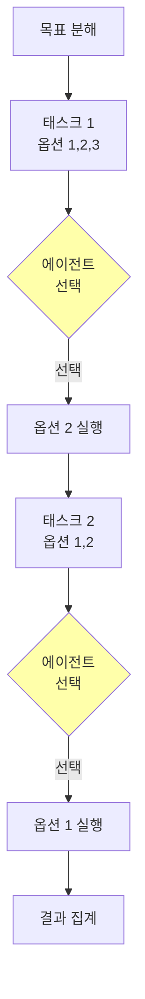

#### 💡 예시

**1단계: 옵션이 포함된 태스크 생성**

```python
Task {
  task_name: "카레 레시피 기본 정보 조사",
  options: [
    {
      description: "일본식 카레 레시피 전문 블로그에서
                    상세한 레시피를 검색한다."
    },
    {
      description: "유튜브 요리 채널의 카레 만들기
                    영상을 참고하여 단계별 정보를 수집한다."
    },
    {
      description: "카레 제품 제조사의 공식 레시피
                    페이지에서 표준 조리법을 확인한다."
    }
  ]
}
```

**2단계: 에이전트의 선택**

```
=== 태스크: 카레 레시피 기본 정보 조사 ===
1. 일본식 카레 레시피 전문 블로그에서 검색
2. 유튜브 요리 채널 영상 참고
3. 제조사 공식 레시피 확인

==> 에이전트의 선택: 1

이유: 블로그는 텍스트 기반으로 상세한 재료 분량과
      단계별 설명이 체계적으로 정리되어 있어
      조사에 가장 효율적
```

**3단계: 선택된 옵션 실행**

```
[Tavily 검색] "일본식 카레 레시피 블로그"
→ 결과 수집 및 저장
```

#### 🔑 핵심 컴포넌트

```python
# 1. 다중 옵션 모델
class TaskOption:
    description: str  # 옵션 설명

class Task:
    task_name: str           # 태스크 이름
    options: list[TaskOption]  # 2-3개 옵션

# 2. 옵션 제시자
class OptionPresenter:
    def run(self, task: Task) -> int:
        # 옵션들을 LLM에 제시하고
        # 최적의 옵션 선택 (인덱스 반환)

# 3. 태스크 실행기
class TaskExecutor:
    def run(self, task: Task, chosen_option: TaskOption) -> str:
        # 선택된 옵션으로 태스크 실행
```

#### ⚙️ 상태 관리

```python
class MultiPathPlanGenerationState:
    query: str
    tasks: DecomposedTasks        # 옵션 포함 태스크들
    current_task_index: int
    chosen_options: list[int]     # 각 태스크에서 선택한 옵션
    results: list[str]
    final_output: str
```

#### 🎯 장점

1. **적응성**: 상황에 맞는 최적의 방법 선택
2. **유연성**: 다양한 접근법 탐색 가능
3. **자율성**: 에이전트의 의사결정 능력 향상

---

### 패턴 6: Self Reflection (자기 성찰)

#### 🎯 목적
에이전트가 자신의 작업 결과를 **스스로 평가**하고, 필요시 **재시도**하여 품질을 개선합니다.

#### 🔍 Reflection이란?

**Reflection (성찰)**: 작업 완료 후 결과를 돌아보고 평가하는 과정

```
실행 → 결과 확인 → 문제점 발견 → 개선 → 재실행
```

#### 📊 처리 흐름

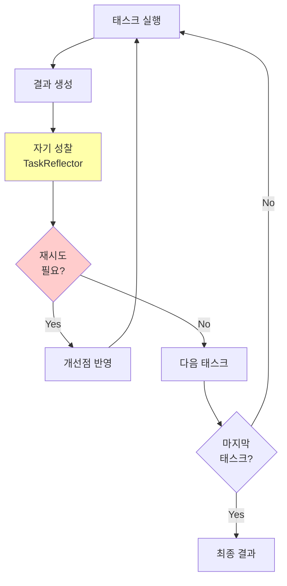

#### 💡 리플렉션 프로세스

**1단계: 태스크 실행**
```python
task = "카레 레시피의 재료 목록을 조사한다."
result = execute_task(task)
# 결과: "카레 루, 감자, 당근, 고기 필요"
```

**2단계: 성찰 (Reflection)**
```python
class Reflection:
    task: str              # 수행한 태스크
    result: str           # 실행 결과
    reflection: str       # 성찰 내용
    judgment: Judgment    # 판단

class Judgment:
    needs_retry: bool     # 재시도 필요 여부
    reason: str          # 이유
```

**성찰 예시**:
```python
Reflection {
  task: "카레 레시피의 재료 목록을 조사한다.",
  result: "카레 루, 감자, 당근, 고기 필요",

  reflection: """
    재료 목록이 너무 간략합니다.

    문제점:
    1. 정확한 분량이 명시되지 않음
    2. 고기의 종류가 불명확
    3. 양파, 물 등 기본 재료 누락
    4. 4인분 기준이 반영되지 않음

    개선 방향:
    - 각 재료의 구체적 분량 추가
    - 고기 종류 명시 (소고기/돼지고기)
    - 누락된 기본 재료 보완
  """,

  judgment: {
    needs_retry: true,
    reason: "재료 목록이 불완전하여 재조사 필요"
  }
}
```

**3단계: 재시도 (필요시)**
```python
# 성찰 결과를 반영하여 재실행
result_v2 = execute_task_with_reflection(task, reflection)

# 개선된 결과:
"""
[재료 - 4인분]
- 카레 루: 4~5조각 (100g)
- 소고기 (또는 돼지고기): 300g
- 감자: 중간 크기 2개 (약 300g)
- 당근: 중간 크기 1개 (약 150g)
- 양파: 중간 크기 1개 (약 200g)
- 물: 800ml
- 식용유: 2큰술
"""
```

#### 🔑 핵심 컴포넌트

```python
# 1. 리플렉션 관리자
class ReflectionManager:
    def save_reflection(self, reflection: Reflection)
    def get_relevant_reflections(self, query: str)
    # 파일에 저장하여 다음 실행 시에도 활용

# 2. 태스크 리플렉터
class TaskReflector:
    def run(self, task: str, result: str) -> Reflection:
        # 태스크와 결과를 분석하여 성찰 생성

# 3. 재시도 로직
def _should_retry_or_continue(state) -> str:
    if needs_retry and retry_count < max_retries:
        return "retry"  # 재시도
    elif more_tasks:
        return "continue"  # 다음 태스크
    else:
        return "finish"  # 완료
```

#### 📝 과거 성찰 활용

Self Reflection의 강력한 특징은 **과거 성찰을 학습**한다는 것입니다:

```python
# 이전 실행의 성찰이 저장됨
previous_reflection = """
"재료 목록 조사" 태스크에서 분량 표기가
부족했던 문제 발생. 앞으로는 반드시
정확한 분량과 단위를 포함할 것.
"""

# 다음 실행 시 자동으로 반영
new_task_prompt = f"""
{task}

과거 회고를 고려할 것:
{previous_reflection}
"""
```

#### ⚙️ 상태 관리

```python
class ReflectiveAgentState:
    query: str
    tasks: list[str]
    current_task_index: int
    results: list[str]
    reflection_ids: list[str]     # 리플렉션 ID 목록
    retry_count: int              # 재시도 횟수
    final_output: str
```

#### 🎯 장점

1. **품질 향상**: 결과를 검증하고 개선
2. **학습 효과**: 과거 실수를 반복하지 않음
3. **자율성**: 스스로 판단하고 수정

---

### 패턴 7: Cross Reflection (교차 성찰)

#### 🎯 목적
**서로 다른 LLM**이 상호 검증하여 편향을 줄이고 품질을 높입니다.

#### 🔄 Self vs Cross Reflection

| 구분 | Self Reflection | Cross Reflection |
|------|----------------|------------------|
| **성찰 주체** | 같은 LLM | 다른 LLM |
| **예시** | GPT-4 → GPT-4 검증 | GPT-4 → Claude 검증 |
| **장점** | 일관성 | 다양한 관점 |
| **단점** | 동일한 편향 | 약간 느림 |

#### 📊 처리 흐름

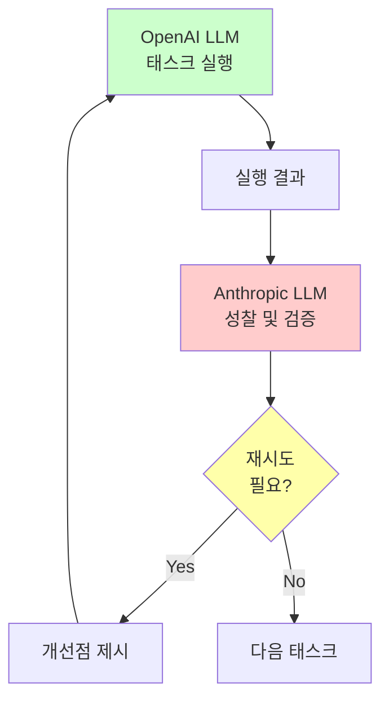

#### 💡 예시

**1단계: OpenAI로 실행**
```python
# OpenAI GPT-4로 태스크 실행
openai_llm = ChatOpenAI(model="gpt-4")
agent = ReflectiveAgent(llm=openai_llm, ...)

result = """
카레 만들기 재료:
- 카레 루 100g
- 고기 300g
- 야채 적당량
"""
```

**2단계: Anthropic으로 성찰**
```python
# Anthropic Claude로 검증
anthropic_llm = ChatAnthropic(model="claude-3")
reflector = TaskReflector(llm=anthropic_llm, ...)

reflection = reflector.run(task, result)
```

**교차 성찰 결과**:
```python
Reflection {
  reflection: """
    OpenAI 모델의 결과를 검토한 결과:

    장점:
    - 기본 재료 카테고리 정확히 파악
    - 분량 단위 적절히 사용

    문제점:
    1. "야채 적당량"이 너무 모호함
       → 감자, 당근, 양파로 구체화 필요
    2. 고기 종류 미명시
       → 소고기 또는 돼지고기 명시 필요
    3. 물, 기름 등 액체 재료 누락

    다른 관점 (Anthropic 시각):
    OpenAI는 간결함을 선호하는 경향이 있으나,
    요리 레시피에서는 구체성이 더 중요합니다.
    초보자 관점에서 더 상세한 정보가 필요합니다.
  """,

  judgment: {
    needs_retry: true,
    reason: "구체성 부족, 교차 검증 결과 재작성 권장"
  }
}
```

#### 🔑 핵심 구현

```python
def main():
    # 1. 작업 수행용 LLM (OpenAI)
    openai_llm = ChatOpenAI(
        model="gpt-4",
        temperature=0.7
    )

    # 2. 검증용 LLM (Anthropic)
    anthropic_llm = ChatAnthropic(
        model="claude-3",
        temperature=0.7
    )

    # 3. Anthropic LLM으로 Reflector 구성
    task_reflector = TaskReflector(
        llm=anthropic_llm,  # 다른 LLM 사용!
        reflection_manager=reflection_manager
    )

    # 4. OpenAI LLM으로 Agent 구성
    agent = ReflectiveAgent(
        llm=openai_llm,
        task_reflector=task_reflector  # 교차 검증
    )
```

#### 🎯 교차 검증의 이점

1. **편향 감소**: 한 모델의 고유한 편향을 다른 모델이 발견
2. **다양한 관점**: 서로 다른 학습 데이터로 인한 다각적 시각
3. **품질 향상**: 두 모델의 강점을 모두 활용

#### 📊 비교: Self vs Cross

**시나리오**: "카레 조리 시간 조사"

| 항목 | Self (GPT-4 → GPT-4) | Cross (GPT-4 → Claude) |
|------|---------------------|----------------------|
| 결과 | "약 30분" | "약 30분" |
| 성찰 | "적절함" | "구체적 단계별 시간 명시 권장" |
| 개선 | 없음 | "준비 10분 + 조리 20분"으로 상세화 |

---

### 패턴 8: Role-based Cooperation (역할 기반 협업)

#### 🎯 목적
각 태스크에 **전문화된 역할(페르소나)**을 배정하여 더 나은 결과를 얻습니다.

#### 👥 역할 기반 접근의 핵심

일반적인 에이전트:
```
"카레 레시피를 조사해줘"
```

역할 기반 에이전트:
```
당신은 "10년 경력의 일식 전문 요리사"입니다.
주요 스킬: 재료 선택, 온도 조절, 맛의 균형
→ "카레 레시피를 조사해줘"
```

#### 📊 처리 흐름

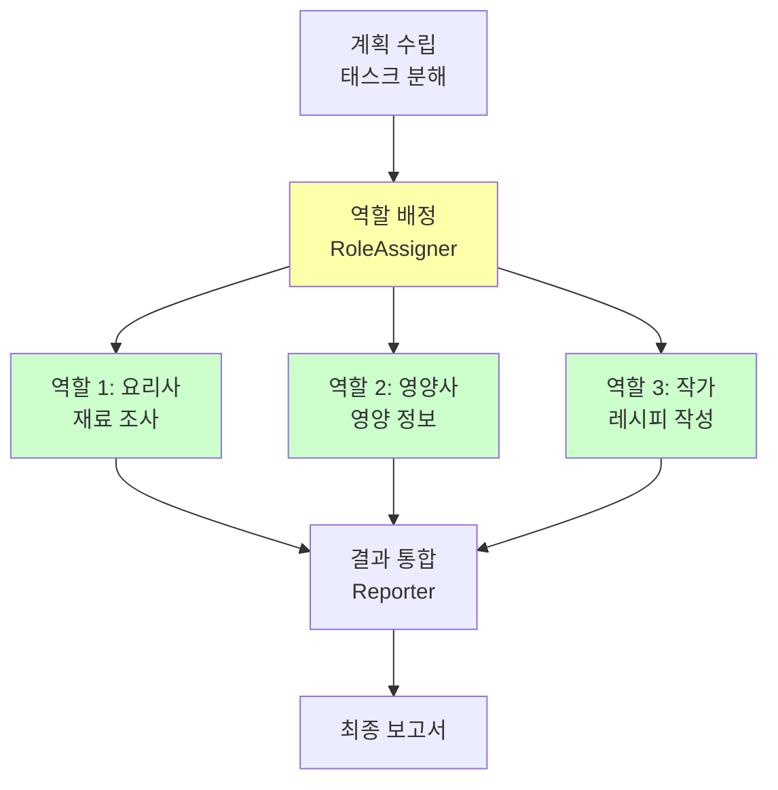

#### 💡 예시

**1단계: 태스크 분해**
```python
tasks = [
    "카레에 필요한 재료와 각 재료의 역할을 조사한다.",
    "카레의 영양 성분과 건강상 이점을 분석한다.",
    "초보자도 따라할 수 있는 단계별 레시피를 작성한다."
]
```

**2단계: 역할 배정**
```python
# LLM이 각 태스크에 적합한 역할을 창의적으로 생성

Task 1: 재료 조사
Role {
  name: "식재료 큐레이터",
  description: """
    10년 이상의 경력을 가진 식재료 전문가로,
    각 재료의 특성과 조리 시 역할을 깊이 이해하고 있습니다.
    재료의 신선도 판별과 대체 재료 제안에도 능숙합니다.
  """,
  key_skills: [
    "재료별 특성 분석",
    "최적의 재료 조합 제안",
    "대체 재료 추천"
  ]
}

Task 2: 영양 분석
Role {
  name: "요리 영양 컨설턴트",
  description: """
    영양학과 요리를 결합한 전문가로,
    맛과 건강을 모두 고려한 조언을 제공합니다.
  """,
  key_skills: [
    "영양 성분 분석",
    "건강 효능 평가",
    "균형잡힌 식단 설계"
  ]
}

Task 3: 레시피 작성
Role {
  name: "레시피 스토리텔러",
  description: """
    복잡한 요리 과정을 이해하기 쉽게 설명하는
    레시피 작가입니다. 초보자의 눈높이에 맞춰
    단계별로 친절하게 안내합니다.
  """,
  key_skills: [
    "명확한 단계별 설명",
    "초보자 친화적 표현",
    "유용한 팁 제공"
  ]
}
```

**3단계: 역할별 실행**

```python
# 역할 1: 식재료 큐레이터로 실행
system_prompt = """
당신은 식재료 큐레이터입니다.
설명: 10년 이상의 경력을 가진 식재료 전문가...
주요 스킬: 재료별 특성 분석, 최적의 재료 조합 제안...
당신의 역할에 기반하여 주어진 태스크를 최고의 능력으로 수행해 주세요.
"""

result_1 = execute_with_role(task_1, role_1)
# → 전문가 시각으로 상세한 재료 분석

result_2 = execute_with_role(task_2, role_2)
# → 영양학적 관점의 분석

result_3 = execute_with_role(task_3, role_3)
# → 친절하고 이해하기 쉬운 레시피
```

**4단계: 결과 통합**
```python
# Reporter가 모든 역할의 결과를 하나로 종합

final_report = """
# 4인분 카레라이스 완벽 가이드

## 재료 (식재료 큐레이터 선정)
[각 재료의 역할과 선택 기준 상세 설명]

## 영양 정보 (영양 컨설턴트 분석)
[영양 성분 및 건강 효능 분석]

## 조리법 (레시피 스토리텔러 작성)
[단계별 친절한 설명]
"""
```

#### 🔑 핵심 컴포넌트

```python
# 1. 역할 모델
class Role:
    name: str              # 역할 이름
    description: str       # 역할 설명
    key_skills: list[str]  # 주요 스킬 3가지

# 2. 역할 배정자
class RoleAssigner:
    def run(self, tasks: list[Task]) -> list[Task]:
        # 각 태스크에 최적의 역할을 창의적으로 생성

# 3. 실행자
class Executor:
    def run(self, task: Task) -> str:
        # 배정된 역할의 시스템 프롬프트로 실행
        system_prompt = f"""
        당신은 {task.role.name}입니다.
        설명: {task.role.description}
        주요 스킬: {task.role.key_skills}
        """

# 4. 보고서 작성자
class Reporter:
    def run(self, results: list[str]) -> str:
        # 모든 역할의 결과를 하나로 통합
```

#### 🎯 역할 기반 접근의 장점

1. **전문성**: 각 태스크에 맞는 전문가 시각
2. **일관성**: 역할에 맞는 톤과 스타일 유지
3. **창의성**: LLM이 독창적인 역할을 생성
4. **품질**: 역할에 특화된 고품질 결과

#### 📊 비교: 일반 vs 역할 기반

**태스크**: "카레 재료 조사"

| 항목 | 일반 에이전트 | 역할 기반 (식재료 큐레이터) |
|------|-------------|--------------------------|
| 결과 | "카레 루, 감자, 당근 필요" | "카레 루는 음식의 깊은 맛을 담당하며, 감자는 전분으로 농도를 조절합니다. 당근은 단맛과 색감을 더해..." |
| 깊이 | 표면적 | 전문가 수준 |
| 유용성 | 기본 정보 | 실용적 인사이트 |

---

## 패턴 간의 관계와 발전

### 진화 단계

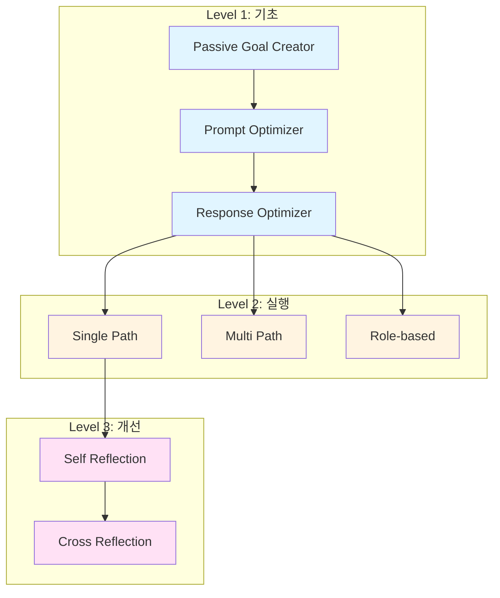

### 패턴 조합 가능성

각 패턴은 독립적으로 사용할 수도 있고, 조합하여 사용할 수도 있습니다:

#### 조합 1: 기본 파이프라인
```
Passive Goal Creator
→ Prompt Optimizer
→ Response Optimizer
→ Single Path
```
**용도**: 간단한 조사 작업

#### 조합 2: 고급 파이프라인
```
Passive Goal Creator
→ Prompt Optimizer
→ Response Optimizer
→ Multi Path
→ Self Reflection
```
**용도**: 복잡하고 품질이 중요한 작업

#### 조합 3: 최고급 파이프라인
```
Passive Goal Creator
→ Prompt Optimizer
→ Response Optimizer
→ Role-based Cooperation
→ Cross Reflection
```
**용도**: 전문성과 검증이 모두 필요한 작업

### 각 레이어의 역할

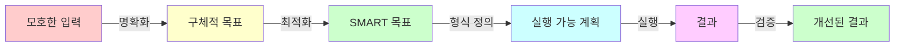

### 패턴 선택 가이드

| 상황 | 추천 패턴 | 이유 |
|------|----------|------|
| 간단한 정보 검색 | Single Path | 빠르고 효율적 |
| 여러 접근법 비교 | Multi Path | 유연한 의사결정 |
| 높은 품질 요구 | Self Reflection | 자체 검증 |
| 편향 제거 필요 | Cross Reflection | 다각적 검증 |
| 전문성 필요 | Role-based | 전문가 시뮬레이션 |
| 복합적 요구사항 | 조합 사용 | 각 장점 활용 |

---

## 실습 예제

### 예제 1: 기본 실행

**목표**: "카레라이스 만드는 방법" 조사

#### 1단계: Passive Goal Creator

```bash
python -m passive_goal_creator.main --task "카레라이스 만드는 방법"
```

**출력**:
```
인터넷을 이용하여 카레라이스를 만드는 구체적인 방법을 조사하고,
사용자를 위한 레시피 보고서를 생성한다.
```

#### 2단계: Prompt Optimizer

```bash
python -m prompt_optimizer.main --task "카레라이스 만드는 방법"
```

**출력**:
```
4인분 기준 일본식 카레라이스 레시피를 인터넷에서 조사하여,
재료 목록(최소 5가지), 단계별 조리법(5~7단계), 조리 시간을
포함한 상세한 가이드를 작성한다.

(측정 기준: 재료 5가지 이상, 각 단계 구체적 기술,
조리 시간 명시, 초보자 이해 가능)
```

#### 3단계: Single Path 실행

```bash
python -m single_path_plan_generation.main --task "카레라이스 만드는 방법"
```

**내부 프로세스**:
```
1. 목표 설정 및 최적화
2. 태스크 분해:
   - Task 1: 기본 레시피 검색
   - Task 2: 조리법 차이점 조사
   - Task 3: 초보자 팁 수집
3. 각 태스크 순차 실행 (Tavily 검색)
4. 결과 집계
5. 최종 보고서 생성
```

### 예제 2: Multi Path 실행

```bash
python -m multi_path_plan_generation.main --task "카레라이스 만드는 방법"
```

**실행 과정**:
```
태스크 1: 카레 레시피 기본 정보 조사
1. 일본식 카레 레시피 블로그 검색
2. 유튜브 요리 채널 참고
3. 제조사 공식 레시피 확인
==> 에이전트의 선택: 1

[태스크 1 실행...]

태스크 2: 조리 방법 상세 조사
1. 카레 루 사용법 조사
2. 가루 카레 사용법 조사
3. 비교 분석 자료 검색
==> 에이전트의 선택: 3

[태스크 2 실행...]
...
```

### 예제 3: Self Reflection

```bash
python -m self_reflection.main --task "카레라이스 만드는 방법"
```

**실행 과정**:
```
[태스크 1 실행]
결과: "카레 루, 감자, 당근 필요"

[자기 성찰]
문제점: 분량 미명시, 고기 누락
판단: 재시도 필요

[재실행]
결과: "카레 루 100g, 소고기 300g, 감자 2개(300g),
      당근 1개(150g), 양파 1개(200g)"

[자기 성찰]
판단: 통과, 다음 태스크로 진행
```

### 예제 4: Cross Reflection

```bash
python -m cross_reflection.main --task "카레라이스 만드는 방법"
```

**실행 과정**:
```
[OpenAI로 태스크 1 실행]
결과: "재료 목록과 기본 조리법"

[Anthropic으로 검증]
성찰: "재료 목록은 적절하나, 조리 순서가
      초보자에게 다소 복잡할 수 있음"
판단: 재시도 필요

[OpenAI로 재실행]
결과: "개선된 단계별 레시피"

[Anthropic으로 재검증]
판단: 통과
```

### 예제 5: Role-based Cooperation

```bash
python -m role_based_cooperation.main --task "카레라이스 만드는 방법"
```

**실행 과정**:
```
[계획 수립]
- Task 1: 재료 조사
- Task 2: 영양 분석
- Task 3: 레시피 작성

[역할 배정]
- Task 1 → "식재료 큐레이터"
- Task 2 → "요리 영양 컨설턴트"
- Task 3 → "레시피 스토리텔러"

[역할별 실행]
각 전문 역할로 태스크 수행

[통합 보고서 생성]
모든 결과를 하나의 완성된 가이드로 통합
```

---

## 고급 활용

### 커스터마이징

#### 1. 새로운 도구 추가

```python
from langchain_community.tools import WikipediaQueryRun

tools = [
    TavilySearchResults(max_results=3),
    WikipediaQueryRun(),  # Wikipedia 추가
]

executor = TaskExecutor(llm=llm, tools=tools)
```

#### 2. 프롬프트 수정

```python
# prompt_optimizer/main.py에서
prompt = ChatPromptTemplate.from_template(
    "당신은 목표 설정 전문가입니다. "
    "아래의 목표를 SMART 원칙에 따라 최적화하되, "
    "특히 '측정 가능성'을 강조해 주세요."  # 수정
    # ...
)
```

#### 3. 모델 변경

```python
# settings.py에서
openai_smart_model = "gpt-4-turbo"  # 더 강력한 모델
temperature = 0.3  # 더 결정적인 응답
```

### 디버깅 팁

#### 1. LangSmith 활용

```python
os.environ["LANGCHAIN_TRACING_V2"] = "true"
os.environ["LANGCHAIN_ENDPOINT"] = "https://api.smith.langchain.com"
os.environ["LANGCHAIN_API_KEY"] = "your-key"
```

→ https://smith.langchain.com 에서 전체 실행 과정 시각화

#### 2. 로깅 추가

```python
import logging
logging.basicConfig(level=logging.INFO)

logger = logging.getLogger(__name__)
logger.info(f"태스크 실행: {task}")
logger.info(f"결과: {result}")
```

#### 3. 단계별 출력

```python
# 각 노드에서 상태 출력
def _execute_task(self, state):
    print(f"=== 현재 상태 ===")
    print(f"진행: {state.current_task_index + 1}/{len(state.tasks)}")
    print(f"태스크: {state.tasks[state.current_task_index]}")
    # ...
```

### 성능 최적화

#### 1. 병렬 실행

```python
# 독립적인 태스크들을 병렬로 실행
from concurrent.futures import ThreadPoolExecutor

with ThreadPoolExecutor(max_workers=3) as executor:
    futures = [executor.submit(task_executor.run, task)
               for task in independent_tasks]
    results = [f.result() for f in futures]
```

#### 2. 캐싱

```python
from langchain.cache import InMemoryCache
from langchain.globals import set_llm_cache

set_llm_cache(InMemoryCache())
```

#### 3. 스트리밍

```python
# 긴 응답은 스트리밍으로
for chunk in llm.stream(prompt):
    print(chunk.content, end="", flush=True)
```

---

## 문제 해결

### 자주 발생하는 오류

#### 1. API 키 오류
```
Error: Invalid API key
```

**해결**:
```python
# .env 파일 확인
OPENAI_API_KEY=sk-...
TAVILY_API_KEY=tvly-...
```

#### 2. 모듈 임포트 오류
```
ModuleNotFoundError: No module named 'passive_goal_creator'
```

**해결**:
```bash
# chapter12 디렉토리에서 실행해야 함
cd chapter12
python -m passive_goal_creator.main --task "..."
```

#### 3. LLM 응답 형식 오류
```
ValidationError: Invalid structured output
```

**해결**:
```python
# with_structured_output 사용 시 모델 확인
# gpt-3.5-turbo는 지원 안 함, gpt-4 이상 필요
llm = ChatOpenAI(model="gpt-4")  # ✓
```

#### 4. Reflection 파일 오류
```
FileNotFoundError: tmp/reflection_db.json
```

**해결**:
```bash
mkdir tmp  # tmp 디렉토리 생성
```

### 성능 이슈

#### 느린 실행 속도

**원인**:
- 많은 LLM 호출
- 큰 컨텍스트
- Reflection으로 인한 재시도

**해결**:
1. 더 빠른 모델 사용 (gpt-3.5-turbo)
2. 태스크 수 줄이기 (3개로 제한)
3. max_retries 줄이기 (1로 설정)

---

## 다음 단계

### 학습 로드맵

1. **기초**: Passive Goal Creator, Prompt Optimizer 이해
2. **실행**: Single Path, Multi Path 비교 실습
3. **고급**: Self Reflection, Cross Reflection 구현
4. **응용**: 자신만의 패턴 설계

### 프로젝트 아이디어

1. **개인 비서 에이전트**
   - 일정 관리 + Role-based Cooperation
   - 이메일 작성 + Self Reflection

2. **학습 도우미**
   - 개념 설명 + Multi Path (여러 관점)
   - 문제 풀이 + Cross Reflection (검증)

3. **콘텐츠 생성기**
   - 블로그 글 작성 + Role-based (작가 역할)
   - SEO 최적화 + Prompt Optimizer

### 추가 학습 자료

- [LangChain 공식 문서](https://python.langchain.com/)
- [LangGraph 튜토리얼](https://langchain-ai.github.io/langgraph/)
- [Agent Design Patterns 논문](chapter11/agent-design-pattern-catalogue.md)

---

## 부록

### 전체 디렉토리 구조

```
chapter12/
├── passive_goal_creator/
│   └── main.py                 # 목표 생성
├── prompt_optimizer/
│   └── main.py                 # 목표 최적화
├── response_optimizer/
│   └── main.py                 # 응답 정의
├── single_path_plan_generation/
│   └── main.py                 # 단일 경로 실행
├── multi_path_plan_generation/
│   └── main.py                 # 다중 경로 실행
├── self_reflection/
│   └── main.py                 # 자기 성찰
├── cross_reflection/
│   └── main.py                 # 교차 성찰
├── role_based_cooperation/
│   └── main.py                 # 역할 기반 협업
├── common/
│   └── reflection_manager.py   # 성찰 관리
├── settings.py                 # 공통 설정
├── notebook.ipynb             # 실습 노트북
└── GUIDE.md                   # 이 가이드
```

### 주요 개념 용어집

| 용어 | 의미 |
|------|------|
| **Agent** | LLM을 활용하여 자율적으로 작업을 수행하는 시스템 |
| **Goal** | 에이전트가 달성해야 할 목표 |
| **Task** | 목표를 달성하기 위한 구체적 작업 단위 |
| **Reflection** | 수행 결과를 돌아보고 평가하는 과정 |
| **Role** | 에이전트가 수행할 전문적 역할/페르소나 |
| **SMART** | 효과적인 목표 설정 원칙 (구체적, 측정가능, 달성가능, 관련성, 기한) |
| **ReAct** | Reasoning + Acting 패턴 (사고하고 행동하기) |
| **LangGraph** | 상태 기반 워크플로우를 구성하는 프레임워크 |
| **Tavily** | AI 에이전트를 위한 검색 엔진 |

### 참고 다이어그램

#### 전체 시스템 흐름 (상세)

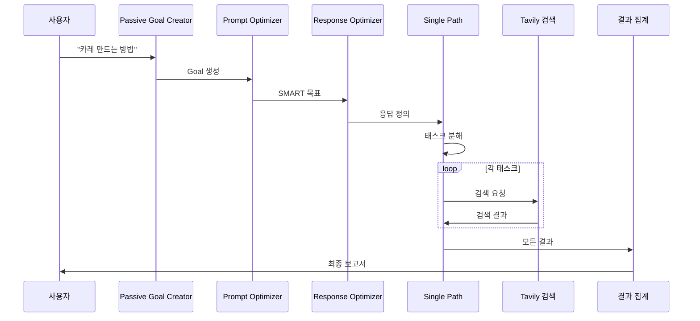

---

## 마치며

이 가이드는 LLM 기반 에이전트의 **7가지 핵심 디자인 패턴**을 소개했습니다. 각 패턴은 독립적으로도 유용하지만, 조합하여 사용할 때 진정한 힘을 발휘합니다.

### 핵심 요약

1. **목표 명확화**가 모든 것의 시작
2. **SMART 원칙**으로 실행 가능한 계획 수립
3. **단계별 분해**로 복잡한 작업을 관리 가능하게
4. **Reflection**으로 품질 향상
5. **역할 기반**으로 전문성 시뮬레이션

### 다음 단계

실제로 코드를 실행해보고, 자신만의 태스크로 실험해보세요. 각 패턴의 장단점을 이해하고, 상황에 맞게 조합하는 것이 핵심입니다.

**Happy Coding! 🚀**

---

*작성일: 2025-12-04*
*버전: 1.0*
*문의: 코드 주석 및 각 main.py 파일 참조*
