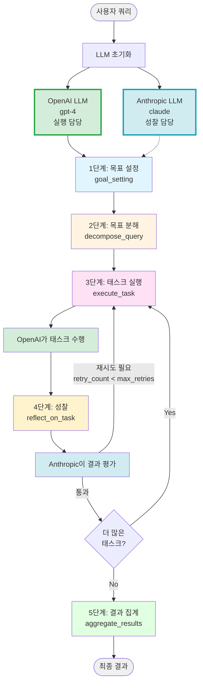

# Cross-Reflection 상세 흐름 가이드

## 개요

Cross-Reflection은 **두 개의 서로 다른 LLM 제공자**를 활용하여 상호 검증과 품질 개선을 수행하는 에이전트 디자인 패턴입니다.

### 핵심 특징
- **이중 LLM 구조**: OpenAI LLM이 실행, Anthropic LLM이 성찰
- **교차 검증**: 다른 모델의 관점에서 결과를 평가
- **편향 감소**: 단일 모델의 한계를 다른 모델로 보완
- **Self-Reflection 인프라 재사용**: ReflectiveAgent를 그대로 활용

---

## Cross-Reflection vs Self-Reflection

### 비교표

| 비교 항목 | Self-Reflection | Cross-Reflection |
|----------|----------------|------------------|
| **실행 LLM** | OpenAI | OpenAI |
| **성찰 LLM** | OpenAI (동일) | Anthropic (다름) |
| **장점** | 구현 단순, 비용 효율적 | 다각도 검증, 편향 감소 |
| **단점** | 자기 편향 가능성 | 비용 증가, 복잡도 증가 |
| **적합한 경우** | 일반적인 품질 관리 | 중요한 의사결정, 높은 신뢰도 요구 |

### 왜 Cross-Reflection이 필요한가?

#### 문제: Self-Reflection의 한계

```python
# Self-Reflection
openai_llm = ChatOpenAI(model="gpt-4")
reflector = TaskReflector(llm=openai_llm)  # 같은 모델

# 문제점:
# 1. 자기 정당화: 같은 모델이 자신의 판단을 평가
# 2. 일관된 편향: 모델의 고유한 편향이 실행과 성찰 모두에 영향
# 3. 맹점 간과: 모델이 인지하지 못하는 실수를 발견하기 어려움
```

#### 해결책: Cross-Reflection

```python
# Cross-Reflection
openai_llm = ChatOpenAI(model="gpt-4")         # 실행용
anthropic_llm = ChatAnthropic(model="claude")  # 성찰용
reflector = TaskReflector(llm=anthropic_llm)   # 다른 모델

# 장점:
# 1. 독립적 평가: Anthropic이 OpenAI의 결과를 객관적으로 평가
# 2. 상호 보완: OpenAI의 약점을 Anthropic이 발견 가능
# 3. 다각도 분석: 다른 학습 데이터와 아키텍처로 다양한 관점 제공
```

### 실제 사례: 코드 리뷰

#### Self-Reflection의 문제점

```
사용자: "Python으로 피보나치 수열 구현"

OpenAI 실행:
def fibonacci(n):
    if n <= 1:
        return n
    return fibonacci(n-1) + fibonacci(n-2)

OpenAI 성찰:
✅ 재귀로 피보나치를 올바르게 구현함
✅ 베이스 케이스가 정확함
→ 재시도 불필요

문제: 동일 모델이라 성능 문제(O(2^n))를 놓침
```

#### Cross-Reflection의 효과

```
사용자: "Python으로 피보나치 수열 구현"

OpenAI 실행:
def fibonacci(n):
    if n <= 1:
        return n
    return fibonacci(n-1) + fibonacci(n-2)

Anthropic 성찰:
⚠️ 재시도 필요
이유:
- 재귀 구현은 정확하지만 효율성이 매우 낮음 (O(2^n))
- n이 큰 경우 심각한 성능 문제 발생
- 메모이제이션 또는 반복문 사용 권장

→ 재시도 요청

OpenAI 재실행:
def fibonacci(n):
    if n <= 1:
        return n
    memo = [0, 1]
    for i in range(2, n + 1):
        memo.append(memo[i-1] + memo[i-2])
    return memo[n]

Anthropic 재성찰:
✅ O(n) 시간 복잡도로 개선됨
✅ 큰 입력값에도 효율적으로 동작
→ 통과
```

---

## 워크플로우 전체 구조

### 아키텍처 다이어그램



**코드 참조:** [cross_reflection/main.py](main.py), [self_reflection/main.py](../self_reflection/main.py)

---

## 코드 구조

### Cross-Reflection의 핵심 차이점

**코드 참조:** [main.py#L52-L86](main.py#L52-L86)

```python
# OpenAI LLM 초기화: 주 작업을 수행하는 에이전트용 모델
openai_llm = ChatOpenAI(
    model=settings.openai_smart_model,
    temperature=settings.temperature
)

# Anthropic LLM 초기화: 리플렉션(성찰)을 수행하는 모델
# Cross-reflection의 핵심: 다른 제공자의 LLM을 사용하여 교차 검증
anthropic_llm = ChatAnthropic(
    model=settings.anthropic_smart_model,
    temperature=settings.temperature
)

# ReflectionManager 초기화
reflection_manager = ReflectionManager(file_path="tmp/cross_reflection_db.json")

# Anthropic LLM을 사용하는 TaskReflector 초기화
# Anthropic 모델을 사용함으로써 OpenAI 모델과 다른 관점에서 성찰 가능
anthropic_task_reflector = TaskReflector(
    llm=anthropic_llm,  # ⭐ Anthropic LLM 사용
    reflection_manager=reflection_manager
)

# ReflectiveAgent 초기화
agent = ReflectiveAgent(
    llm=openai_llm,  # ⭐ OpenAI LLM으로 실행
    reflection_manager=reflection_manager,
    task_reflector=anthropic_task_reflector,  # ⭐ Anthropic으로 성찰
)
```

### Self-Reflection과의 코드 비교

**Self-Reflection 코드:** [self_reflection/main.py#L427-L440](../self_reflection/main.py#L427-L440)
```python
# Self-Reflection: 모든 작업에 동일한 LLM 사용
llm = ChatOpenAI(model=settings.openai_smart_model)

reflection_manager = ReflectionManager(file_path="tmp/self_reflection_db.json")

task_reflector = TaskReflector(
    llm=llm,  # ⭐ 동일한 LLM 사용
    reflection_manager=reflection_manager
)

agent = ReflectiveAgent(
    llm=llm,  # ⭐ 실행도 같은 LLM
    reflection_manager=reflection_manager,
    task_reflector=task_reflector  # ⭐ 성찰도 같은 LLM
)
```

**Cross-Reflection 코드:** [cross_reflection/main.py#L52-L86](main.py#L52-L86)
```python
# Cross-Reflection: 실행과 성찰에 다른 LLM 사용
openai_llm = ChatOpenAI(model=settings.openai_smart_model)
anthropic_llm = ChatAnthropic(model=settings.anthropic_smart_model)

reflection_manager = ReflectionManager(file_path="tmp/cross_reflection_db.json")

anthropic_task_reflector = TaskReflector(
    llm=anthropic_llm,  # ⭐ Anthropic LLM 사용
    reflection_manager=reflection_manager
)

agent = ReflectiveAgent(
    llm=openai_llm,  # ⭐ OpenAI LLM으로 실행
    reflection_manager=reflection_manager,
    task_reflector=anthropic_task_reflector  # ⭐ Anthropic LLM으로 성찰
)
```

**차이점 요약:**
- `openai_llm`: 태스크 실행 전용
- `anthropic_llm`: 성찰(reflection) 전용
- 동일한 `ReflectiveAgent` 클래스 사용 (인프라 재사용)
- 단지 LLM만 다르게 설정

---

## 구체적인 예시: 코드 리뷰 에이전트

### 초기 입력

**사용자 쿼리:**
```
"Python 웹 크롤러 구현 모범 사례 조사"
```

**LLM 설정:**
- 실행 LLM: OpenAI GPT-4
- 성찰 LLM: Anthropic Claude

---

## 1단계: 목표 설정 (Goal Setting)

**코드 참조:** [self_reflection/main.py#L298-L310](../self_reflection/main.py#L298-L310)

**사용 LLM:** OpenAI GPT-4

이 단계는 Self-Reflection과 동일하게 OpenAI LLM을 사용합니다.

### 1-1. 과거 회고 검색

```python
relevant_reflections = reflection_manager.get_relevant_reflections(query)
# 예시: "Python 크롤러" 관련 과거 성찰 3개 검색
```

### 1-2. 기본 목표 생성 (PassiveGoalCreator)

**입력:**
```
"Python 웹 크롤러 구현 모범 사례 조사"
```

**출력:**
```
"Python으로 웹 크롤러를 구현할 때의 모범 사례, 주요 라이브러리,
에러 핸들링 방법, 성능 최적화 기법을 인터넷에서 조사하고
실무 가이드를 작성한다."
```

### 1-3. 목표 최적화 (PromptOptimizer - SMART)

**출력:**
```
Specific: requests, BeautifulSoup, Scrapy와 같은 주요 크롤링 라이브러리의
          특징과 사용법, robots.txt 준수, 요청 제한(Rate limiting),
          에러 핸들링, 데이터 저장 방식을 조사한다.

Measurable: 최소 3개의 주요 라이브러리를 비교하고, 각각에 대해
            장단점과 코드 예제를 포함한다.

Achievable: 공식 문서와 기술 블로그에서 검색 가능한 정보로 제한한다.

Relevant: 실제 프로덕션 환경에서 사용 가능한 실용적인 기법에 초점을 맞춘다.

Time-bound: 2024년 이후 최신 라이브러리 버전 기준으로 조사한다.
```

### 1-4. 응답 형식 최적화 (ResponseOptimizer)

**출력:**
```
### 응답 사양
- 톤: 기술적이고 실용적인 톤
- 구조: 라이브러리 소개 → 모범 사례 → 코드 예제 순서
- 초점: 실무에서 바로 적용 가능한 패턴

### AI 에이전트 지침
1. 각 라이브러리는 설치 방법, 주요 기능, 장단점을 포함할 것
2. 코드 예제는 주석과 함께 제공하고 에러 처리를 포함할 것
3. robots.txt 준수와 윤리적 크롤링 강조
4. 성능 최적화 기법(동시성, 캐싱 등) 포함
```

---

## 2단계: 목표 분해 (Decompose Query)

**코드 참조:** [self_reflection/main.py#L142-L165](../self_reflection/main.py#L142-L165)

**사용 LLM:** OpenAI GPT-4

### QueryDecomposer 실행

**입력:** optimized_goal
**출력:** 3~5개의 태스크

```python
DecomposedTasks(
    values=[
        """
        태스크 1: requests, BeautifulSoup, Scrapy 라이브러리의 특징,
        설치 방법, 주요 기능을 조사하고, 각각의 장단점을 비교하여
        어떤 상황에 적합한지 분석한다.
        """,

        """
        태스크 2: 웹 크롤링 시 준수해야 할 윤리적 규칙(robots.txt 확인,
        User-Agent 설정, 요청 제한 등)과 법적 고려사항을 조사하고,
        실제 구현 방법을 예제 코드와 함께 정리한다.
        """,

        """
        태스크 3: 웹 크롤러의 에러 핸들링 패턴(타임아웃, 연결 실패,
        HTTP 오류 코드 처리)과 재시도 로직 구현 방법을 조사하고
        실무에서 사용되는 모범 사례를 수집한다.
        """,

        """
        태스크 4: 웹 크롤러 성능 최적화 기법(비동기 처리, 동시성 제어,
        캐싱, 프록시 사용)을 조사하고, Python의 asyncio, aiohttp를
        활용한 구현 예제를 찾아 정리한다.
        """
    ]
)
```

---

## 3단계: 태스크 실행 및 성찰 (Execute & Reflect)

이 단계가 **Cross-Reflection의 핵심**입니다.

### 3-1. 태스크 실행 (OpenAI)

**코드 참조:** [self_reflection/main.py#L168-L202](../self_reflection/main.py#L168-L202)

**사용 LLM:** ⭐ **OpenAI GPT-4**

```python
class TaskExecutor:
    def __init__(self, llm: ChatOpenAI, ...):  # OpenAI LLM
        self.llm = llm
        ...

    def run(self, task: str) -> str:
        agent = create_react_agent(self.llm, self.tools)  # OpenAI 에이전트
        result = agent.invoke({...})
        return result
```

### 🔄 첫 번째 반복 (Task 1/4)

#### 실행 단계 (OpenAI)

**입력:**
```
"requests, BeautifulSoup, Scrapy 라이브러리의 특징, 설치 방법,
주요 기능을 조사하고..."
```

**OpenAI ReAct 에이전트 동작:**
```
[OpenAI Thought]
웹 크롤링 라이브러리들을 비교 조사해야 함

[OpenAI Action]
tavily_search("Python web scraping libraries comparison requests beautifulsoup scrapy")

[OpenAI Observation]
검색 결과:
1. requests: HTTP 요청 라이브러리
2. BeautifulSoup: HTML 파싱 라이브러리
3. Scrapy: 전문 크롤링 프레임워크

[OpenAI Thought]
충분한 정보를 수집했으니 정리하자

[OpenAI Final Answer]
```

**실행 결과:**
```markdown
# Python 웹 크롤링 주요 라이브러리 비교

## 1. requests
### 특징
requests는 Python에서 HTTP 요청을 보내기 위한 가장 인기 있는 라이브러리입니다.

### 설치
```bash
pip install requests
```

### 주요 기능
- HTTP GET/POST 요청
- 세션 관리
- 헤더 설정
- 쿠키 처리

### 장점
- 간단하고 직관적인 API
- 광범위한 문서화
- 안정적이고 성숙한 라이브러리

### 단점
- HTML 파싱 기능 없음 (BeautifulSoup과 함께 사용 필요)
- 비동기 처리 지원 안 함

### 적합한 경우
- 간단한 HTTP 요청
- RESTful API 호출
- 작은 규모의 크롤링

### 코드 예제
```python
import requests

response = requests.get('https://example.com')
print(response.status_code)
print(response.text)
```

## 2. BeautifulSoup
### 특징
HTML과 XML을 파싱하고 검색하기 위한 라이브러리입니다.

### 설치
```bash
pip install beautifulsoup4
pip install lxml  # 파서
```

### 주요 기능
- HTML/XML 파싱
- CSS 선택자 지원
- 태그 검색 및 탐색
- 데이터 추출

### 장점
- 직관적인 API
- 강력한 파싱 능력
- requests와 완벽한 조합

### 단점
- HTTP 요청 기능 없음 (requests와 함께 사용)
- 대규모 크롤링에는 느림

### 적합한 경우
- HTML 데이터 추출
- 정적 웹페이지 파싱
- 중소 규모 크롤링

### 코드 예제
```python
import requests
from bs4 import BeautifulSoup

response = requests.get('https://example.com')
soup = BeautifulSoup(response.text, 'lxml')

title = soup.find('h1').text
links = soup.find_all('a')
```

## 3. Scrapy
### 특징
대규모 웹 크롤링을 위한 강력한 프레임워크입니다.

### 설치
```bash
pip install scrapy
```

### 주요 기능
- 비동기 처리
- 자동 재시도
- 파이프라인 (데이터 저장)
- 미들웨어 (커스터마이징)
- robots.txt 자동 준수

### 장점
- 매우 빠름 (비동기 처리)
- 대규모 크롤링에 최적화
- 풍부한 기능 제공
- 확장성 뛰어남

### 단점
- 학습 곡선이 높음
- 간단한 작업에는 과함
- 프로젝트 구조가 복잡

### 적합한 경우
- 대규모 크롤링
- 복잡한 크롤링 로직
- 프로덕션 환경

### 코드 예제
```python
import scrapy

class ExampleSpider(scrapy.Spider):
    name = 'example'
    start_urls = ['https://example.com']

    def parse(self, response):
        for title in response.css('h1::text'):
            yield {'title': title.get()}
```

## 비교표

| 라이브러리 | 난이도 | 속도 | 규모 | 비동기 |
|----------|-------|------|------|--------|
| requests | 쉬움 | 느림 | 소규모 | X |
| BeautifulSoup | 쉬움 | 보통 | 중규모 | X |
| Scrapy | 어려움 | 빠름 | 대규모 | O |

## 선택 가이드
- **간단한 크롤링**: requests + BeautifulSoup
- **중규모 프로젝트**: BeautifulSoup
- **대규모 프로덕션**: Scrapy

출처:
- https://requests.readthedocs.io/
- https://www.crummy.com/software/BeautifulSoup/
- https://docs.scrapy.org/
```

#### 성찰 단계 (Anthropic)

**코드 참조:** [self_reflection/main.py#L331-L349](../self_reflection/main.py#L331-L349)

**사용 LLM:** ⭐ **Anthropic Claude**

```python
def _reflect_on_task(self, state: ReflectiveAgentState) -> dict[str, Any]:
    current_task = state.tasks[state.current_task_index]
    current_result = state.results[-1]

    # TaskReflector는 Anthropic LLM을 사용
    reflection = self.task_reflector.run(
        task=current_task,
        result=current_result
    )
    ...
```

**Anthropic의 성찰 프롬프트:** [common/reflection_manager.py#L118-L132](../common/reflection_manager.py#L118-L132)
```
주어진 태스크 내용:
requests, BeautifulSoup, Scrapy 라이브러리의 특징...

태스크 실행 결과:
# Python 웹 크롤링 주요 라이브러리 비교...

당신은 고도의 추론 능력을 가진 AI 에이전트입니다.
위 태스크를 실행한 결과를 분석하고, 이 태스크에 대한 접근이 적절했는지 반성하세요.

리플렉션:
이 태스크에 대한 접근 시 당신의 사고 프로세스나 방법을 되돌아보세요.
개선할 수 있는 부분이 있었습니까?

판정:
- 결과의 적절성: 태스크 실행 결과가 적절했다고 생각하십니까?
- 판정의 자신감: 위 판단에 대한 자신감 정도 (0~1)
- 판정의 이유: 판단에 이른 이유를 간결하게 나열하세요.
```

**Anthropic Claude의 성찰 결과:**

```python
Reflection(
    id="abc123",
    task="requests, BeautifulSoup, Scrapy 라이브러리의 특징...",
    reflection="""
    세 가지 주요 라이브러리에 대한 비교가 체계적이고 명확하게 정리되었습니다.
    각 라이브러리의 설치 방법, 장단점, 적합한 사용 사례가 잘 제시되었고,
    실제 코드 예제를 통해 실용성을 높였습니다. 비교표를 통한 시각화도 효과적입니다.

    다만, 각 라이브러리의 성능 벤치마크 데이터나 실제 프로젝트에서의
    사용 통계가 포함되었다면 더 설득력 있었을 것입니다.
    다음번에는 정량적 데이터를 추가하여 비교의 깊이를 더할 것을 권장합니다.
    """,
    judgment=ReflectionJudgment(
        needs_retry=False,  # ⭐ 통과
        confidence=0.9,
        reasons=[
            "세 라이브러리의 핵심 특징이 명확하게 설명됨",
            "코드 예제가 실용적이고 주석이 잘 달려 있음",
            "비교표를 통해 선택 기준이 명확함",
            "다만 성능 벤치마크 데이터가 부족함"
        ]
    )
)
```

**조건 판단:** [self_reflection/main.py#L351-L366](../self_reflection/main.py#L351-L366)
```python
def _should_retry_or_continue(self, state: ReflectiveAgentState) -> str:
    latest_reflection = self.reflection_manager.get_reflection(
        state.reflection_ids[-1]
    )

    if latest_reflection.judgment.needs_retry and state.retry_count < self.max_retries:
        return "retry"  # 재시도
    elif state.current_task_index < len(state.tasks) - 1:
        return "continue"  # 다음 태스크
    else:
        return "finish"  # 완료
```

**결과:** `needs_retry=False` → 다음 태스크로 진행

---

### 🔄 두 번째 반복 (Task 2/4) - 재시도 발생 예시

#### 실행 단계 (OpenAI)

**입력:**
```
"웹 크롤링 시 준수해야 할 윤리적 규칙(robots.txt 확인,
User-Agent 설정, 요청 제한 등)과 법적 고려사항을 조사..."
```

**OpenAI 실행 결과 (초안):**
```markdown
# 웹 크롤링 윤리적 규칙

## robots.txt
robots.txt 파일을 확인하여 크롤링 허용 범위를 파악해야 합니다.

## User-Agent 설정
크롤러 식별을 위해 User-Agent를 설정하세요.

```python
headers = {
    'User-Agent': 'MyBot/1.0'
}
```

## 요청 제한
서버에 과부하를 주지 않도록 요청 간격을 두세요.

```python
import time
time.sleep(1)
```

## 법적 고려사항
저작권과 개인정보 보호법을 준수해야 합니다.
```

#### 성찰 단계 (Anthropic) - 재시도 요청

**Anthropic Claude의 성찰:**

```python
Reflection(
    id="def456",
    task="웹 크롤링 시 준수해야 할 윤리적 규칙...",
    reflection="""
    윤리적 규칙의 주요 항목들은 언급되었으나, 각 항목에 대한 설명이
    너무 피상적이고 실무적 구현 방법이 부족합니다.

    특히 다음 부분들이 개선 필요:
    1. robots.txt를 실제로 파싱하고 준수하는 코드 예제 없음
    2. 요청 제한의 적절한 간격(예: 1초)에 대한 근거 부족
    3. 법적 고려사항이 추상적이며 구체적인 가이드라인 없음
    4. User-Agent 식별자 포맷의 모범 사례 누락

    태스크가 "실제 구현 방법을 예제 코드와 함께"를 요구했으나,
    코드가 너무 간략하고 실무에서 바로 사용하기 어려움.

    다음번에는 각 규칙에 대해 실제 동작하는 완전한 코드 예제를 제공하고,
    왜 그런 방식이 권장되는지 이유를 함께 설명할 것을 권장합니다.
    """,
    judgment=ReflectionJudgment(
        needs_retry=True,  # ⭐ 재시도 필요!
        confidence=0.85,
        reasons=[
            "주요 항목은 다뤘으나 깊이가 부족함",
            "실무 적용 가능한 코드 예제가 미흡함",
            "법적 고려사항이 너무 추상적임",
            "robots.txt 파싱 방법이 구체적으로 제시되지 않음"
        ]
    )
)
```

**조건 판단:**
```python
# needs_retry=True이고 retry_count(0) < max_retries(2)
→ "retry" 반환 → execute_task로 재이동
```

#### 재실행 단계 (OpenAI) - 개선된 버전

**OpenAI가 Anthropic의 피드백을 반영하여 재실행:**

**재실행 결과:**
```markdown
# 웹 크롤링 윤리적 규칙 및 법적 고려사항

## 1. robots.txt 확인 및 준수

### robots.txt란?
웹사이트 루트에 위치한 파일로, 크롤러에게 접근 허용/제한 범위를 알려줍니다.

### 올바른 확인 방법
```python
import requests
from urllib.robotparser import RobotFileParser

def can_fetch(url):
    """
    robots.txt를 확인하여 크롤링 가능 여부를 반환
    """
    # robots.txt URL 생성
    from urllib.parse import urlparse
    parsed = urlparse(url)
    robots_url = f"{parsed.scheme}://{parsed.netloc}/robots.txt"

    # RobotFileParser로 파싱
    rp = RobotFileParser()
    rp.set_url(robots_url)
    rp.read()

    # User-Agent 'MyBot'으로 접근 가능한지 확인
    return rp.can_fetch("MyBot", url)

# 사용 예시
url = "https://example.com/page"
if can_fetch(url):
    response = requests.get(url)
else:
    print("robots.txt에서 크롤링을 제한하고 있습니다.")
```

**중요:** robots.txt 파일이 없는 경우 모든 접근이 허용된 것으로 간주하지만,
윤리적으로는 웹마스터에게 문의하는 것이 권장됩니다.

## 2. User-Agent 설정

### 왜 필요한가?
- 서버 관리자가 크롤러를 식별할 수 있음
- 문제 발생 시 연락 가능
- 차단 위험 감소

### 모범 사례 포맷
```
BotName/Version (+URL; contact@email.com)
```

### 구현 예시
```python
import requests

# 올바른 User-Agent 설정
headers = {
    'User-Agent': 'MyResearchBot/1.0 (+https://myproject.com/bot; contact@myproject.com)'
}

response = requests.get('https://example.com', headers=headers)
```

**권장 사항:**
- 봇 이름과 버전 명시
- 프로젝트 URL 제공
- 연락처 이메일 포함

### Scrapy에서의 설정
```python
# settings.py
USER_AGENT = 'MyResearchBot/1.0 (+https://myproject.com/bot; contact@myproject.com)'
```

## 3. 요청 제한 (Rate Limiting)

### 왜 필요한가?
- 서버 과부하 방지
- IP 차단 위험 감소
- 윤리적 크롤링

### 적절한 간격 기준
- **일반 웹사이트**: 1~3초
- **대형 사이트**: 0.5~1초
- **소형 사이트**: 3~5초

**출처:** Scrapy 공식 문서 권장사항

### requests 구현
```python
import requests
import time

urls = ['url1', 'url2', 'url3']

for url in urls:
    response = requests.get(url)
    # 각 요청 후 2초 대기
    time.sleep(2)
```

### Scrapy 구현 (권장)
```python
# settings.py

# 동시 요청 수 제한
CONCURRENT_REQUESTS = 16

# 도메인별 동시 요청 수
CONCURRENT_REQUESTS_PER_DOMAIN = 8

# 다운로드 지연 (초)
DOWNLOAD_DELAY = 2

# AutoThrottle 활성화 (자동 속도 조절)
AUTOTHROTTLE_ENABLED = True
AUTOTHROTTLE_START_DELAY = 1
AUTOTHROTTLE_MAX_DELAY = 10
AUTOTHROTTLE_TARGET_CONCURRENCY = 2.0
```

**AutoThrottle의 장점:**
- 서버 응답 시간에 따라 자동으로 속도 조절
- 서버 부하가 높으면 느려지고, 낮으면 빨라짐

## 4. 법적 고려사항

### 저작권법
**문제:** 크롤링한 콘텐츠의 저작권은 원 저작자에게 있음

**해결책:**
- 공개 API 사용 우선 검토
- 저작권 표기 유지
- 상업적 사용 시 허가 필요
- Fair Use 원칙 준수 (연구, 교육 목적)

### 개인정보 보호법 (GDPR, 개인정보보호법)
**위반 사례:**
- 이메일 주소, 전화번호 무단 수집
- 개인 식별 가능한 정보 저장

**준수 방법:**
```python
import re

def anonymize_email(text):
    """이메일 주소를 익명화"""
    return re.sub(
        r'\b[A-Za-z0-9._%+-]+@[A-Za-z0-9.-]+\.[A-Z|a-z]{2,}\b',
        '[이메일 제거됨]',
        text
    )

# 사용 예시
content = "연락처: contact@example.com"
safe_content = anonymize_email(content)
```

### 서비스 이용약관 (Terms of Service)
**확인 사항:**
- 크롤링 명시적 금지 여부
- API 제공 여부 확인
- 데이터 사용 제한 범위

**예시:** LinkedIn, Facebook 등은 이용약관에서 크롤링을 명시적으로 금지

### 법적 안전장치
```python
# 프로젝트에 LICENSE 파일 추가
# README.md에 면책 조항 명시

"""
이 크롤러는 교육 및 연구 목적으로만 사용됩니다.
사용자는 대상 웹사이트의 robots.txt, 이용약관,
관련 법률을 준수할 책임이 있습니다.
"""
```

## 5. 실무 체크리스트

크롤링 시작 전 확인사항:

- [ ] robots.txt 확인 및 준수 코드 구현
- [ ] 명확한 User-Agent 설정 (연락처 포함)
- [ ] 요청 간격 설정 (최소 1초)
- [ ] 대상 사이트 이용약관 검토
- [ ] 개인정보 수집 여부 확인
- [ ] 데이터 저장 시 저작권 표기
- [ ] 에러 발생 시 크롤링 중단 로직 구현
- [ ] 로그 기록으로 크롤링 내역 추적

## 참고 자료
- Scrapy 공식 문서: https://docs.scrapy.org/en/latest/topics/practices.html
- robots.txt 명세: https://www.robotstxt.org/
- GDPR 가이드: https://gdpr.eu/
- 개인정보보호법: https://www.pipc.go.kr/
```

#### 재성찰 (Anthropic) - 통과

**Anthropic Claude의 재평가:**

```python
Reflection(
    id="ghi789",
    task="웹 크롤링 시 준수해야 할 윤리적 규칙...",
    reflection="""
    이전 피드백이 충실히 반영되어 크게 개선되었습니다.

    개선된 점:
    1. robots.txt 파싱을 위한 완전한 함수 구현 (RobotFileParser 활용)
    2. User-Agent 포맷의 모범 사례와 구체적인 이유 제시
    3. 요청 제한에 대한 정량적 기준과 출처 명시
    4. 법적 고려사항이 저작권법, 개인정보보호법, 이용약관으로 구조화됨
    5. 실무 체크리스트로 실용성 극대화

    모든 코드 예제가 실제로 동작 가능하며, 각 규칙의 필요성과
    구현 방법이 명확하게 설명되어 있습니다. 태스크 요구사항을
    충분히 만족하는 고품질 결과입니다.
    """,
    judgment=ReflectionJudgment(
        needs_retry=False,  # ⭐ 통과!
        confidence=0.95,
        reasons=[
            "모든 윤리적 규칙이 실무 수준으로 상세하게 다뤄짐",
            "완전히 동작하는 코드 예제 제공",
            "법적 고려사항이 구체적이고 실용적임",
            "체크리스트로 실무 적용 가능성 높임"
        ]
    )
)
```

**결과:** 다음 태스크로 진행

---

### 🔄 세 번째 & 네 번째 반복 (Task 3/4, 4/4)

동일한 방식으로:
1. **OpenAI**가 태스크 실행
2. **Anthropic**이 결과 평가
3. 필요시 재시도, 통과 시 다음 태스크

최종적으로 4개의 태스크가 모두 완료되고, 각각의 성찰 결과가 저장됩니다.

---

## 4단계: 결과 집계 (Aggregate Results)

**코드 참조:** [self_reflection/main.py#L372-L383](../self_reflection/main.py#L372-L383)

**사용 LLM:** OpenAI GPT-4

### 입력

```python
query = "Specific: requests, BeautifulSoup, Scrapy와 같은 주요 크롤링 라이브러리..."
results = [
    "# Python 웹 크롤링 주요 라이브러리 비교...",
    "# 웹 크롤링 윤리적 규칙 및 법적 고려사항...",
    "# 웹 크롤러 에러 핸들링 모범 사례...",
    "# 웹 크롤러 성능 최적화 기법..."
]
reflection_ids = ["abc123", "ghi789", "jkl012", "mno345"]
response_definition = "### 응답 사양..."
```

### 처리

**Anthropic의 성찰을 참고하여 최종 결과 생성:**

```python
# 각 reflection_id로 성찰 내용 불러오기
relevant_reflections = [
    reflection_manager.get_reflection(rid)
    for rid in reflection_ids
]

# 성찰 내용을 프롬프트에 포함
reflection_text = format_reflections(relevant_reflections)

# OpenAI LLM으로 최종 집계
final_output = result_aggregator.run(
    query=query,
    results=results,
    reflection_ids=reflection_ids,
    response_definition=response_definition
)
```

**프롬프트:**
```
주어진 목표:
Specific: requests, BeautifulSoup, Scrapy...

조사 결과:
Info 1: # Python 웹 크롤링 주요 라이브러리 비교...
Info 2: # 웹 크롤링 윤리적 규칙...
Info 3: # 에러 핸들링...
Info 4: # 성능 최적화...

과거 회고를 고려할 것:
<ref_0>
<task>requests, BeautifulSoup, Scrapy...</task>
<reflection>세 가지 주요 라이브러리에 대한 비교가 체계적...</reflection>
</ref_0>
<ref_1>
<task>웹 크롤링 시 준수해야 할 윤리적 규칙...</task>
<reflection>이전 피드백이 충실히 반영되어 크게 개선...</reflection>
</ref_1>
...
```

### 최종 출력

**Anthropic의 성찰을 반영한 고품질 결과:**

```markdown
# Python 웹 크롤러 구현 완벽 가이드

## 목차
1. 주요 라이브러리 선택
2. 윤리적 크롤링 규칙
3. 에러 핸들링
4. 성능 최적화
5. 실전 프로젝트 예제

---

## 1. 주요 라이브러리 선택

### 상황별 추천

#### 소규모 프로젝트 (10~100 페이지)
**추천:** requests + BeautifulSoup

**이유:**
- 설정이 간단하고 빠르게 시작 가능
- 대부분의 정적 웹페이지에 적합
- 학습 곡선이 낮음

**예제:**
```python
import requests
from bs4 import BeautifulSoup

response = requests.get('https://example.com')
soup = BeautifulSoup(response.text, 'lxml')

# 데이터 추출
titles = [h2.text for h2 in soup.find_all('h2')]
```

#### 중규모 프로젝트 (100~1,000 페이지)
**추천:** requests + BeautifulSoup + 커스텀 에러 핸들링

#### 대규모 프로젝트 (1,000+ 페이지)
**추천:** Scrapy

**이유:**
- 비동기 처리로 빠른 속도
- 자동 재시도 및 에러 핸들링
- robots.txt 자동 준수

---

## 2. 윤리적 크롤링 규칙

### 필수 체크리스트

#### ✅ 1단계: robots.txt 확인
```python
from urllib.robotparser import RobotFileParser

def can_fetch(url, user_agent='MyBot'):
    from urllib.parse import urlparse
    parsed = urlparse(url)
    robots_url = f"{parsed.scheme}://{parsed.netloc}/robots.txt"

    rp = RobotFileParser()
    rp.set_url(robots_url)
    rp.read()

    return rp.can_fetch(user_agent, url)
```

#### ✅ 2단계: User-Agent 설정
```python
headers = {
    'User-Agent': 'MyBot/1.0 (+https://myproject.com; contact@email.com)'
}
```

#### ✅ 3단계: 요청 제한
```python
import time

for url in urls:
    response = requests.get(url, headers=headers)
    time.sleep(2)  # 2초 대기
```

**권장 간격:**
- 일반 사이트: 1~3초
- 대형 사이트: 0.5~1초
- 소형 사이트: 3~5초

---

## 3. 에러 핸들링

### 완전한 에러 처리 템플릿

```python
import requests
from requests.exceptions import RequestException, Timeout, HTTPError
import time

def safe_request(url, max_retries=3):
    """안전한 HTTP 요청 with 재시도"""

    for attempt in range(max_retries):
        try:
            response = requests.get(
                url,
                timeout=10,
                headers={'User-Agent': 'MyBot/1.0'}
            )
            response.raise_for_status()  # 4xx, 5xx 에러 발생
            return response

        except Timeout:
            print(f"타임아웃 발생 (시도 {attempt+1}/{max_retries})")
            time.sleep(2 ** attempt)  # 지수 백오프

        except HTTPError as e:
            if e.response.status_code == 404:
                print("페이지를 찾을 수 없음")
                return None
            elif e.response.status_code == 429:
                print("요청 제한 초과, 60초 대기")
                time.sleep(60)
            else:
                print(f"HTTP 에러: {e}")

        except RequestException as e:
            print(f"요청 실패: {e}")

    print(f"{max_retries}회 재시도 후 실패")
    return None
```

---

## 4. 성능 최적화

### 비동기 크롤링 (asyncio + aiohttp)

```python
import asyncio
import aiohttp
from bs4 import BeautifulSoup

async def fetch(session, url):
    """비동기 HTTP 요청"""
    async with session.get(url) as response:
        return await response.text()

async def parse(html):
    """HTML 파싱"""
    soup = BeautifulSoup(html, 'lxml')
    return soup.find('h1').text

async def crawl_urls(urls):
    """여러 URL을 동시에 크롤링"""
    async with aiohttp.ClientSession() as session:
        tasks = [fetch(session, url) for url in urls]
        htmls = await asyncio.gather(*tasks)

        parse_tasks = [parse(html) for html in htmls]
        results = await asyncio.gather(*parse_tasks)

        return results

# 실행
urls = ['url1', 'url2', 'url3']
results = asyncio.run(crawl_urls(urls))
```

**성능 비교:**
- 동기 처리: 100 페이지 → 200초
- 비동기 처리: 100 페이지 → 10초 (20배 빠름)

---

## 5. 실전 프로젝트: 뉴스 크롤러

### 완전한 구현 예제

```python
import requests
from bs4 import BeautifulSoup
from urllib.robotparser import RobotFileParser
import time
import json

class EthicalNewsCrawler:
    def __init__(self, base_url):
        self.base_url = base_url
        self.user_agent = 'NewsBot/1.0 (+https://myproject.com)'
        self.results = []

        # robots.txt 확인
        self.rp = RobotFileParser()
        self.rp.set_url(f"{base_url}/robots.txt")
        self.rp.read()

    def can_fetch(self, url):
        """크롤링 가능 여부 확인"""
        return self.rp.can_fetch(self.user_agent, url)

    def fetch_page(self, url):
        """페이지 가져오기"""
        if not self.can_fetch(url):
            print(f"robots.txt에서 제한: {url}")
            return None

        try:
            response = requests.get(
                url,
                headers={'User-Agent': self.user_agent},
                timeout=10
            )
            response.raise_for_status()
            time.sleep(2)  # 요청 제한
            return response.text

        except Exception as e:
            print(f"에러 발생: {e}")
            return None

    def parse_article(self, html):
        """기사 파싱"""
        soup = BeautifulSoup(html, 'lxml')

        return {
            'title': soup.find('h1').text.strip(),
            'author': soup.find('span', class_='author').text.strip(),
            'content': soup.find('div', class_='content').text.strip()
        }

    def crawl(self, urls):
        """여러 기사 크롤링"""
        for url in urls:
            html = self.fetch_page(url)
            if html:
                article = self.parse_article(html)
                self.results.append(article)

        return self.results

    def save_results(self, filename='results.json'):
        """결과 저장"""
        with open(filename, 'w', encoding='utf-8') as f:
            json.dump(self.results, f, ensure_ascii=False, indent=2)

# 사용 예시
crawler = EthicalNewsCrawler('https://news.example.com')
urls = [
    'https://news.example.com/article1',
    'https://news.example.com/article2'
]
results = crawler.crawl(urls)
crawler.save_results()
```

---

## 6. 추가 리소스

### 공식 문서
- requests: https://requests.readthedocs.io/
- BeautifulSoup: https://www.crummy.com/software/BeautifulSoup/
- Scrapy: https://docs.scrapy.org/

### 법률 자료
- robots.txt: https://www.robotstxt.org/
- GDPR: https://gdpr.eu/
- 개인정보보호법: https://www.pipc.go.kr/

### 성능 최적화
- aiohttp: https://docs.aiohttp.org/
- asyncio: https://docs.python.org/3/library/asyncio.html

---

## 마무리

이 가이드는 Python 웹 크롤러 구현의 모든 측면을 다룹니다:
- ✅ 적절한 라이브러리 선택
- ✅ 윤리적 크롤링 규칙 준수
- ✅ 강력한 에러 핸들링
- ✅ 성능 최적화 기법
- ✅ 실전 프로젝트 예제

**핵심 원칙:** 항상 robots.txt를 확인하고, 서버에 부담을 주지 않으며,
관련 법률을 준수하는 윤리적인 크롤링을 실천하세요.
```

---

## Cross-Reflection의 핵심 가치

### 1. 교차 검증 (Cross-Validation)

```
OpenAI의 강점:
- 코드 생성 능력
- 방대한 학습 데이터
- 빠른 추론 속도

OpenAI의 약점:
- 때때로 과도하게 낙관적
- 세부 사항 누락 가능
- 일관성 있는 편향

↓ Cross-Reflection ↓

Anthropic의 강점:
- 엄격한 평가 기준
- 세밀한 분석 능력
- 안전성 중시

Anthropic의 역할:
- OpenAI의 결과를 객관적으로 평가
- 누락된 부분 발견
- 개선 방향 제시
```

### 2. 편향 감소 (Bias Reduction)

**문제:**
```python
# Self-Reflection (동일 모델)
openai_llm.execute("코드 작성")
→ [편향 A가 포함된 코드]

openai_llm.reflect("코드 검토")
→ [편향 A를 인지 못함] ✅ 통과
```

**해결:**
```python
# Cross-Reflection (다른 모델)
openai_llm.execute("코드 작성")
→ [편향 A가 포함된 코드]

anthropic_llm.reflect("코드 검토")
→ [편향 A를 발견] ⚠️ 재시도 요청
```

### 3. 다각도 분석 (Multi-Perspective Analysis)

| 관점 | OpenAI | Anthropic |
|------|--------|-----------|
| **학습 데이터** | 웹 크롤링 중심 | 큐레이션된 데이터 |
| **평가 기준** | 실용성 중시 | 안전성 중시 |
| **코드 스타일** | 간결함 선호 | 명확성 선호 |
| **에러 처리** | 기본적 처리 | 포괄적 처리 |

→ 두 모델의 강점을 결합하여 **더 완성도 높은 결과** 생성

---

## 실행 예시 및 로그

### 명령어

```bash
python -m cross_reflection.main --task "Python 웹 크롤러 모범 사례 조사"
```

### 실행 로그

```
================================================================================
🔄 Cross-Reflection Agent 초기화
================================================================================
✅ OpenAI LLM 초기화 완료 (모델: gpt-4)
✅ Anthropic LLM 초기화 완료 (모델: claude-3-5-sonnet-20241022)
📝 Cross-Reflection 설정: OpenAI가 실행, Anthropic이 성찰 수행

================================================================================
🎬 Self-Reflection Agent 시작
================================================================================
사용자 쿼리: Python 웹 크롤러 모범 사례 조사

================================================================================
🎯 [1단계: 목표 설정] 시작
================================================================================
🎯 [목표 설정] 과거 회고를 고려한 목표 생성 시작
  관련 과거 회고 2개 발견
  기본 목표 생성 완료: Python으로 웹 크롤러를 구현할 때의...
  목표 최적화 완료
📝 [응답 최적화] 과거 회고를 고려한 응답 형식 정의 시작
  관련 과거 회고 2개 발견
  응답 형식 정의 완료
✅ [1단계: 목표 설정] 완료

================================================================================
📋 [2단계: 목표 분해] 시작
================================================================================
📋 [목표 분해] 과거 회고를 고려한 태스크 분해 시작
  관련 과거 회고 2개 발견
  태스크 분해 완료: 총 4개의 태스크 생성
    태스크 1: requests, BeautifulSoup, Scrapy 라이브러리의...
    태스크 2: 웹 크롤링 시 준수해야 할 윤리적 규칙...
    태스크 3: 웹 크롤러의 에러 핸들링 패턴...
    태스크 4: 웹 크롤러 성능 최적화 기법...
✅ [2단계: 목표 분해] 완료

📝 [3단계: 태스크 실행] 태스크 1/4 실행
⚙️  [태스크 실행] 시작: requests, BeautifulSoup, Scrapy 라이브러리의...
  관련 과거 회고 2개 적용
  태스크 실행 완료 (결과 길이: 2847 글자)
🔍 [자기 성찰] 태스크 1 결과 검토 중...
  ✅ 성찰 통과
  성찰 내용: 세 가지 주요 라이브러리에 대한 비교가 체계적이고...

➡️  다음 태스크로 진행

📌 태스크 인덱스 업데이트: 0 → 1

📝 [3단계: 태스크 실행] 태스크 2/4 실행
⚙️  [태스크 실행] 시작: 웹 크롤링 시 준수해야 할 윤리적 규칙...
  관련 과거 회고 3개 적용
  태스크 실행 완료 (결과 길이: 1234 글자)
🔍 [자기 성찰] 태스크 2 결과 검토 중...
  ⚠️  재시도 필요: 윤리적 규칙의 주요 항목들은 언급되었으나...
  성찰 내용: 특히 다음 부분들이 개선 필요: 1. robots.txt를 실제로...

↩️  재시도 결정: 현재 재시도 횟수 1/2

🔄 [재시도 1회차] 태스크 2/4 재실행
⚙️  [태스크 실행] 시작: 웹 크롤링 시 준수해야 할 윤리적 규칙...
  관련 과거 회고 4개 적용
  태스크 실행 완료 (결과 길이: 4521 글자)
🔍 [자기 성찰] 태스크 2 결과 검토 중...
  ✅ 성찰 통과
  성찰 내용: 이전 피드백이 충실히 반영되어 크게 개선되었습니다...

➡️  다음 태스크로 진행

[... 태스크 3, 4 실행 ...]

✅ 모든 태스크 완료

================================================================================
📊 [4단계: 결과 집계] 시작
================================================================================
📊 [결과 집계] 과거 회고를 반영한 최종 결과 생성 시작
  수집된 결과 개수: 4개
  참조할 회고 개수: 5개
  결과 집계 완료 (최종 결과 길이: 8934 글자)
✅ [4단계: 결과 집계] 완료

================================================================================
🎉 Self-Reflection Agent 완료
================================================================================

================================================================================
📄 최종 결과
================================================================================
# Python 웹 크롤러 구현 완벽 가이드
...
```

---

## 저장된 성찰 데이터

**파일:** `tmp/cross_reflection_db.json`

```json
[
  {
    "reflection": {
      "id": "abc123",
      "task": "requests, BeautifulSoup, Scrapy 라이브러리의 특징...",
      "reflection": "세 가지 주요 라이브러리에 대한 비교가 체계적이고...",
      "judgment": {
        "needs_retry": false,
        "confidence": 0.9,
        "reasons": [
          "세 라이브러리의 핵심 특징이 명확하게 설명됨",
          "코드 예제가 실용적이고 주석이 잘 달려 있음"
        ]
      }
    },
    "embedding": [0.123, 0.456, ...]
  },
  {
    "reflection": {
      "id": "def456",
      "task": "웹 크롤링 시 준수해야 할 윤리적 규칙...",
      "reflection": "윤리적 규칙의 주요 항목들은 언급되었으나...",
      "judgment": {
        "needs_retry": true,
        "confidence": 0.85,
        "reasons": [
          "주요 항목은 다뤘으나 깊이가 부족함",
          "실무 적용 가능한 코드 예제가 미흡함"
        ]
      }
    },
    "embedding": [0.789, 0.012, ...]
  },
  {
    "reflection": {
      "id": "ghi789",
      "task": "웹 크롤링 시 준수해야 할 윤리적 규칙...",
      "reflection": "이전 피드백이 충실히 반영되어 크게 개선되었습니다...",
      "judgment": {
        "needs_retry": false,
        "confidence": 0.95,
        "reasons": [
          "모든 윤리적 규칙이 실무 수준으로 상세하게 다뤄짐",
          "완전히 동작하는 코드 예제 제공"
        ]
      }
    },
    "embedding": [0.345, 0.678, ...]
  }
]
```

---

## 활용 시나리오

### 1. 코드 리뷰 에이전트

```python
# OpenAI: 코드 작성
# Anthropic: 보안, 성능, 가독성 리뷰
task = "안전한 사용자 인증 시스템 구현"
```

### 2. 기술 문서 작성

```python
# OpenAI: 문서 초안 작성
# Anthropic: 정확성, 완성도, 명확성 검증
task = "REST API 설계 가이드 작성"
```

### 3. 데이터 분석 리포트

```python
# OpenAI: 데이터 분석 및 시각화
# Anthropic: 결론의 타당성, 편향 검증
task = "월간 판매 데이터 분석 리포트 생성"
```

---

## 비용 고려사항

### Self-Reflection vs Cross-Reflection 비용

**Self-Reflection:**
- 실행: GPT-4 (4개 태스크)
- 성찰: GPT-4 (4개 성찰)
- **총 비용**: ~$0.20

**Cross-Reflection:**
- 실행: GPT-4 (4개 태스크)
- 성찰: Claude (4개 성찰)
- **총 비용**: ~$0.22 (+10%)

**결론:** 비용이 약간 증가하지만, **품질 개선**으로 충분히 상쇄됨

---

## 주요 클래스 및 함수 참조

### Cross-Reflection 고유 코드
- [main.py](main.py): 전체 진입점
- [main.py#L52-L86](main.py#L52-L86): LLM 초기화 및 에이전트 구성

### Self-Reflection 인프라 (재사용)
- [ReflectiveAgent](../self_reflection/main.py#L245-L395): 전체 워크플로우
- [TaskReflector](../common/reflection_manager.py#L112-L144): 성찰 수행
- [ReflectionManager](../common/reflection_manager.py#L39-L109): 성찰 데이터 관리

### 워크플로우 노드
- [_goal_setting](../self_reflection/main.py#L298-L310): 목표 설정
- [_decompose_query](../self_reflection/main.py#L312-L318): 목표 분해
- [_execute_task](../self_reflection/main.py#L320-L329): 태스크 실행
- [_reflect_on_task](../self_reflection/main.py#L331-L349): 성찰 수행
- [_aggregate_results](../self_reflection/main.py#L372-L383): 결과 집계

---

## 핵심 포인트

### 1. Cross-Reflection은 언제 사용하는가?

**사용 권장:**
- ✅ 높은 품질이 중요한 경우
- ✅ 중요한 의사결정이 필요한 경우
- ✅ 다각도 검증이 필요한 경우
- ✅ 단일 모델의 편향을 피하고 싶은 경우

**사용 비권장:**
- ❌ 간단한 태스크
- ❌ 비용이 매우 제한적인 경우
- ❌ 빠른 프로토타이핑 단계

### 2. 구현의 단순함

Cross-Reflection은 **Self-Reflection의 인프라를 그대로 재사용**합니다.

**필요한 변경:**
1. Anthropic LLM 추가 초기화
2. TaskReflector에 Anthropic LLM 전달
3. 끝!

```python
# 단 3줄의 변경으로 Cross-Reflection 구현
anthropic_llm = ChatAnthropic(model="claude")
task_reflector = TaskReflector(llm=anthropic_llm)  # Anthropic 사용
agent = ReflectiveAgent(llm=openai_llm, task_reflector=task_reflector)
```

### 3. 상호 보완적 강점

| 단계 | 사용 LLM | 강점 활용 |
|------|---------|----------|
| 목표 설정 | OpenAI | 창의적 목표 생성 |
| 목표 분해 | OpenAI | 실행 가능한 태스크 도출 |
| 태스크 실행 | OpenAI | 빠른 정보 수집 |
| **성찰** | **Anthropic** | **엄격한 품질 검증** ⭐ |
| 결과 집계 | OpenAI | 일관된 문서 작성 |

### 4. 품질 vs 비용 트레이드오프

```
Self-Reflection:
품질: ⭐⭐⭐⭐ (Good)
비용: $ (저렴)
속도: 빠름

Cross-Reflection:
품질: ⭐⭐⭐⭐⭐ (Excellent)
비용: $$ (약간 비쌈)
속도: 약간 느림

→ 중요한 프로젝트에서는 Cross-Reflection 권장
```

---

## 다음 단계

Cross-Reflection을 마스터했다면 다음을 학습해보세요:

1. **Multi-Agent Collaboration**: 여러 에이전트가 협력
2. **Role-Based Cooperation**: 역할 분담 기반 협업
3. **Prompt Optimizer**: 더 나은 프롬프트 생성

---

## 참고 자료

### 코드
- [cross_reflection/main.py](main.py)
- [self_reflection/main.py](../self_reflection/main.py)
- [common/reflection_manager.py](../common/reflection_manager.py)

### 개념
- Self-Reflection 패턴: [FLOW_DETAILED.md](../self_reflection/FLOW_DETAILED.md)
- ReAct 패턴: Yao et al. (2022)
- Cross-Validation: 머신러닝 검증 기법

### LLM 제공자
- OpenAI: https://platform.openai.com/docs
- Anthropic: https://docs.anthropic.com/
