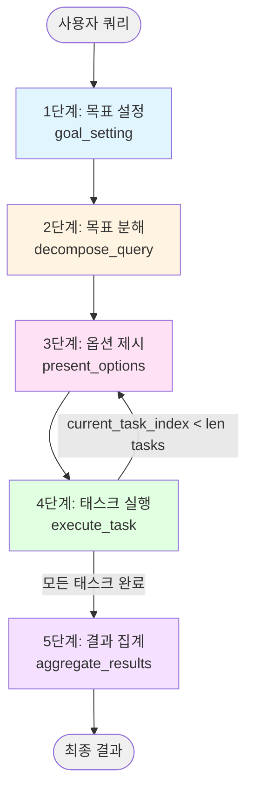
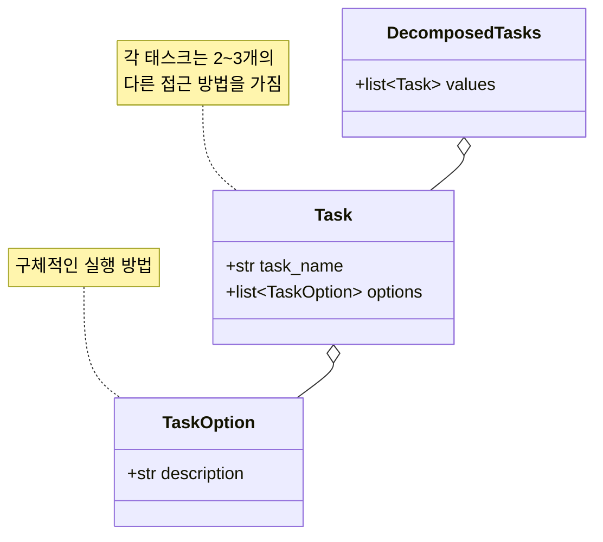
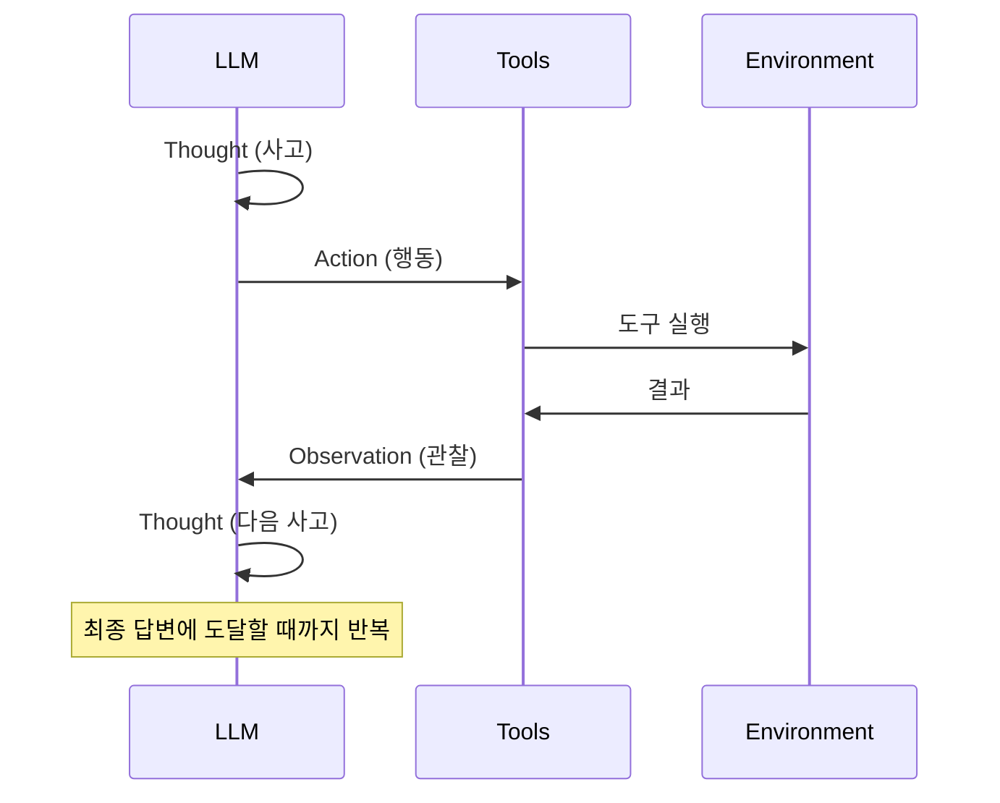
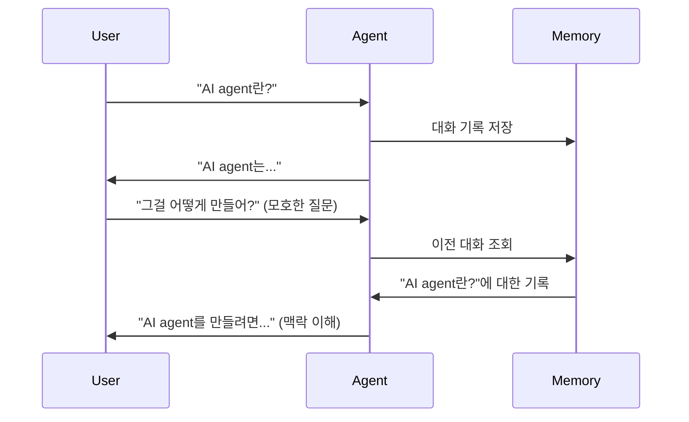
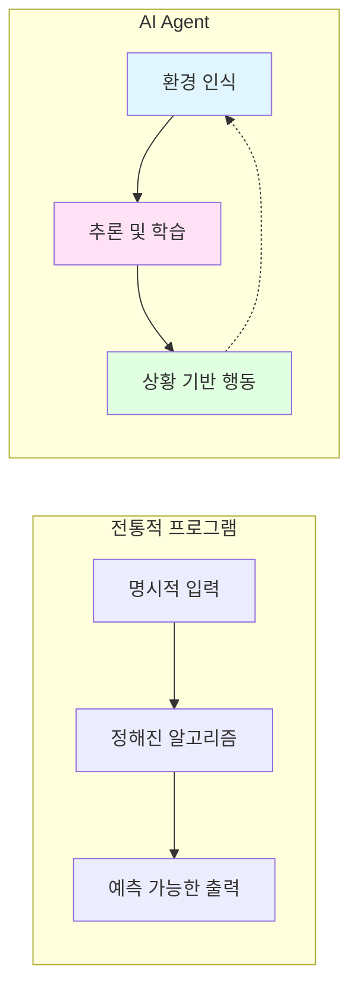
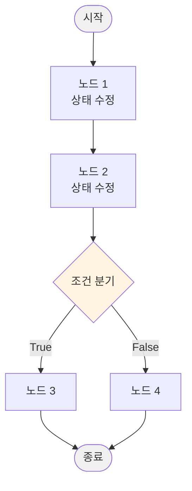
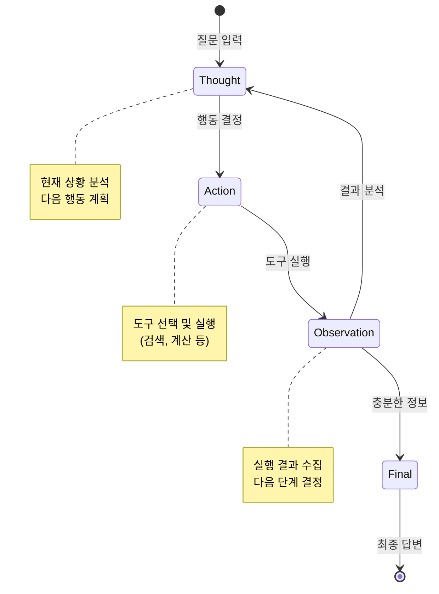
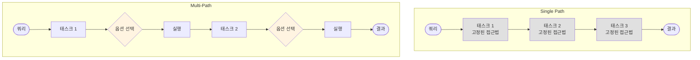

# Multi-Path Plan Generation 상세 흐름 가이드

## 개요

Multi-Path Plan Generation은 복잡한 목표를 **여러 실행 경로(옵션)를 가진 태스크**로 분해하여 최적의 경로를 선택하며 처리하는 에이전트 디자인 패턴입니다.

### 핵심 특징
- **다중 경로**: 각 태스크마다 2~3개의 다른 접근 방법 제시
- **동적 선택**: LLM이 각 태스크에서 최적의 옵션을 선택
- **유연성**: 상황에 따라 다른 전략 적용 가능
- **3~5개의 태스크**: 적절한 크기로 목표 분해

### Single Path와의 차이점

| 비교 항목 | Single Path | Multi-Path |
|----------|-------------|------------|
| 태스크 구조 | 단일 설명 | 태스크 + 2~3개 옵션 |
| 실행 방식 | 태스크 직접 실행 | 옵션 선택 후 실행 |
| 워크플로우 단계 | 4단계 | 5단계 |
| 유연성 | 낮음 (고정된 경로) | 높음 (선택 가능한 경로) |
| 적합한 상황 | 선형적 조사 | 다각도 분석, 전략 선택 필요 |

---

## 워크플로우 5단계



**코드 참조:** [MultiPathPlanGeneration._create_graph](main.py#L284-L302)

---

## Multi-Path 구조 상세

### Task와 TaskOption



**코드 참조:**
- [TaskOption](main.py#L45-L47): 개별 옵션 모델
- [Task](main.py#L52-L62): 태스크와 옵션들
- [DecomposedTasks](main.py#L67-L75): 태스크 컨테이너

---

## 구체적인 예시로 보는 단계별 흐름

### 초기 입력

**사용자 쿼리:**
```
"AI agent 만들기 실습"
```

**초기 State:** ([MultiPathPlanGenerationState](main.py#L80-L105))
```python
MultiPathPlanGenerationState(
    query="AI agent 만들기 실습",
    optimized_goal="",
    optimized_response="",
    tasks=DecomposedTasks(values=[]),
    current_task_index=0,
    chosen_options=[],
    results=[],
    final_output=""
)
```

---

## 1단계: 목표 설정 (Goal Setting)

**코드 참조:** [_goal_setting](main.py#L304-L317)

이 단계는 Single Path와 동일하게 3개의 서브 단계로 구성됩니다.

### 1-1. 기본 목표 생성 (PassiveGoalCreator)

**코드 참조:** [PassiveGoalCreator.run](../passive_goal_creator/main.py#L35-L58)

**입력:**
```
"AI agent 만들기 실습"
```

**출력:** [Goal](../passive_goal_creator/main.py#L10-L20) 객체
```python
Goal(
    text="AI agent의 개념, 구성 요소, 개발 방법, 실습 예제를 조사하여 단계별 실습 가이드를 작성한다."
)
```

### 1-2. 목표 최적화 (PromptOptimizer - SMART 원칙)

**코드 참조:** [PromptOptimizer.run](../prompt_optimizer/main.py#L39-L76)

**출력:** [OptimizedGoal](../prompt_optimizer/main.py#L14-L27) 객체
```python
OptimizedGoal(
    text="""
    Specific: AI agent의 정의, LangChain/LangGraph와 같은 주요 프레임워크,
              ReAct 패턴 등 핵심 아키텍처, 그리고 간단한 챗봇 구축 예제를 조사한다.
    Measurable: 최소 3개의 신뢰할 수 있는 출처(공식 문서, 기술 블로그, 학술 논문)에서
                정보를 수집하고, 각 주제별로 200자 이상의 설명을 작성한다.
    Achievable: 인터넷 검색을 통해 공개된 자료를 수집하고, 이를 기반으로 초보자도
                이해할 수 있는 수준의 가이드를 작성한다.
    Relevant: Python 기반의 실용적인 AI agent 개발에 초점을 맞추며,
              2024년 이후의 최신 정보를 우선적으로 활용한다.
    Time-bound: 현재 시점(2024-12-04) 기준 최신 정보를 사용한다.
    """
)
```

### 1-3. 응답 형식 최적화 (ResponseOptimizer)

**코드 참조:** [ResponseOptimizer.run](../response_optimizer/main.py#L22-L76)

**출력:**
```
목표 분석:
사용자는 AI agent 개발에 대한 체계적인 실습 가이드를 원하며,
개념부터 실제 구현까지 단계별로 이해하고자 합니다.

응답 사양:
- 톤: 초보자 친화적이고 교육적인 톤
- 구조: 개념 → 도구 → 아키텍처 → 실습 순서
- 내용 초점: 이론과 실습의 균형

AI 에이전트에 대한 지침:
1. 각 섹션은 명확한 제목으로 구분할 것
2. 전문 용어는 처음 등장 시 설명을 추가할 것
3. 코드 예제는 주석과 함께 제공할 것
4. 각 출처의 URL을 명시할 것
...
```

**State 업데이트:** ([main.py:314-317](main.py#L314-L317))
```python
{
    "optimized_goal": "Specific: AI agent의 정의, LangChain/LangGraph...",
    "optimized_response": "목표 분석:\n사용자는 AI agent 개발에 대한..."
}
```

---

## 2단계: 목표 분해 (Decompose Query)

**코드 참조:** [_decompose_query](main.py#L319-L323), [QueryDecomposer](main.py#L110-L140)

### QueryDecomposer 실행

이 단계가 **Multi-Path의 핵심**입니다. 각 태스크에 2~3개의 옵션이 생성됩니다.

**입력:** optimized_goal
```
"AI agent의 정의, LangChain/LangGraph와 같은 주요 프레임워크..."
```

**LLM 프롬프트:** ([main.py:121-134](main.py#L121-L134))
```
CURRENT_DATE: 2024-12-04
-----
태스크: 주어진 목표를 3~5개의 고수준 태스크로 분해하고, 각 태스크에 2~3개의 구체적인 옵션을 제공하세요.
요구사항:
1. 다음 행동만으로 목표를 달성할 것. 절대 지정된 것 외의 행동을 취하지 말 것.
   - 인터넷을 이용하여 목표 달성을 위한 조사를 수행.
2. 각 고수준 태스크는 구체적이고 상세하게 기술되어야 하며, 독립적으로 실행 및 검증 가능한 정보를 포함할 것. 추상적인 표현을 전혀 포함하지 말 것.
3. 각 항목 레벨 태스크에 2~3개의 다른 접근법이나 옵션을 제공할 것.
4. 태스크는 실행 가능한 순서로 나열할 것.
5. 태스크는 한국어로 출력할 것.

기억하세요: 실행할 수 없는 태스크와 선택지는 절대로 만들지 마세요.

목표: [최적화된 목표]
```

**출력:** [DecomposedTasks](main.py#L67-L75) 객체

```python
DecomposedTasks(
    values=[
        Task(
            task_name="AI agent의 정의와 핵심 개념을 조사한다",
            options=[
                TaskOption(
                    description="학술 논문 및 교과서(Russell & Norvig 등)를 중심으로 AI agent의 정의, 자율성/반응성/능동성 등 핵심 특징, 전통적 프로그램과의 차이점을 조사하여 200자 이상으로 정리한다."
                ),
                TaskOption(
                    description="OpenAI, DeepMind 등 주요 AI 연구소의 공식 블로그와 기술 문서에서 AI agent의 실용적 정의와 활용 사례를 조사하여 200자 이상으로 정리한다."
                ),
                TaskOption(
                    description="Wikipedia와 AI 전문 미디어(Towards Data Science 등)에서 AI agent의 개념, 역사적 발전 과정, 현대적 의미를 조사하여 200자 이상으로 정리한다."
                )
            ]
        ),

        Task(
            task_name="LangChain과 LangGraph 프레임워크의 기능과 사용법을 조사한다",
            options=[
                TaskOption(
                    description="LangChain과 LangGraph의 공식 문서(python.langchain.com, langgraph.io)를 중심으로 각 프레임워크의 목적, 주요 기능, 설치 방법, 기본 사용 예제를 수집하여 각각 200자 이상 설명한다."
                ),
                TaskOption(
                    description="GitHub의 LangChain/LangGraph 저장소와 예제 코드를 분석하여 실제 사용 패턴, 베스트 프랙티스, 주요 컴포넌트의 활용법을 조사하여 각각 200자 이상 설명한다."
                ),
                TaskOption(
                    description="기술 블로그(Medium, Dev.to 등)와 튜토리얼 사이트에서 LangChain/LangGraph 입문자 가이드, 실전 활용 사례, 비교 분석 글을 수집하여 각각 200자 이상 설명한다."
                )
            ]
        ),

        Task(
            task_name="ReAct 패턴을 포함한 AI agent의 핵심 아키텍처를 조사한다",
            options=[
                TaskOption(
                    description="ReAct 원논문(Yao et al. 2022)과 관련 학술 자료에서 Thought-Action-Observation 사이클의 이론적 배경, 작동 원리, 장단점을 조사하여 200자 이상 정리한다."
                ),
                TaskOption(
                    description="LangChain 공식 문서에서 ReAct 에이전트 구현 방법, create_react_agent 함수 사용법, 도구 통합 방식을 조사하여 코드 예제와 함께 200자 이상 설명한다."
                ),
                TaskOption(
                    description="AI 기술 블로그에서 ReAct 외 다른 에이전트 패턴(Plan-and-Execute, Reflexion 등)과의 비교, 실무 적용 사례를 조사하여 200자 이상 정리한다."
                )
            ]
        ),

        Task(
            task_name="Python을 사용한 실습 가능한 AI agent 예제를 조사한다",
            options=[
                TaskOption(
                    description="LangChain 공식 튜토리얼에서 초보자용 AI agent 구축 예제(검색 에이전트, 챗봇 등)의 전체 코드와 단계별 설명을 수집하여 주석과 함께 정리한다."
                ),
                TaskOption(
                    description="GitHub의 인기 있는 LangChain 예제 저장소(awesome-langchain 등)에서 실용적인 AI agent 프로젝트를 찾아 핵심 코드와 실행 방법을 수집하여 정리한다."
                ),
                TaskOption(
                    description="유튜브 튜토리얼이나 온라인 강의 자료에서 step-by-step AI agent 구현 가이드를 찾아 코드 예제와 설명을 텍스트로 정리한다."
                )
            ]
        )
    ]
)
```

**State 업데이트:** ([main.py:323](main.py#L323))
```python
{
    "tasks": DecomposedTasks(values=[
        Task(task_name="AI agent의 정의...", options=[옵션1, 옵션2, 옵션3]),
        Task(task_name="LangChain과 LangGraph...", options=[옵션1, 옵션2, 옵션3]),
        Task(task_name="ReAct 패턴...", options=[옵션1, 옵션2, 옵션3]),
        Task(task_name="Python 실습 예제...", options=[옵션1, 옵션2, 옵션3])
    ])
}
```

**특징:**
- 4개의 태스크로 분해 (3~5개 범위 내)
- **각 태스크마다 3개의 다른 접근 방법 제공**
- 옵션 간 차이:
  - 정보 출처의 다양성 (학술 자료 vs 공식 문서 vs 블로그)
  - 접근 방식의 차이 (이론 중심 vs 실습 중심 vs 비교 분석)

---

## 3단계: 옵션 제시 및 선택 (Present Options)

**코드 참조:** [_present_options](main.py#L325-L329), [OptionPresenter](main.py#L143-L187)

이 단계는 **Multi-Path만의 고유한 단계**입니다. 각 태스크마다 반복됩니다.

### 🔄 첫 번째 태스크 (Task 1/4)

**현재 State:**
```python
current_task_index = 0
current_task = tasks.values[0]  # "AI agent의 정의와 핵심 개념을 조사한다"
```

**OptionPresenter 실행:** ([main.py:149-187](main.py#L149-L187))

#### 옵션 제시 (사용자/로그에 출력)

```
태스크: AI agent의 정의와 핵심 개념을 조사한다

1. 학술 논문 및 교과서(Russell & Norvig 등)를 중심으로 AI agent의 정의, 자율성/반응성/능동성 등 핵심 특징, 전통적 프로그램과의 차이점을 조사하여 200자 이상으로 정리한다.

2. OpenAI, DeepMind 등 주요 AI 연구소의 공식 블로그와 기술 문서에서 AI agent의 실용적 정의와 활용 사례를 조사하여 200자 이상으로 정리한다.

3. Wikipedia와 AI 전문 미디어(Towards Data Science 등)에서 AI agent의 개념, 역사적 발전 과정, 현대적 의미를 조사하여 200자 이상으로 정리한다.
```

#### LLM의 선택 ([main.py:159-182](main.py#L159-L182))

**LLM 프롬프트:**
```
태스크: 주어진 태스크와 옵션을 기반으로 최적의 옵션을 선택하세요. 반드시 번호만으로 답변하세요.

참고로, 당신은 다음 행동만 할 수 있습니다.
- 인터넷을 이용하여 목표 달성을 위한 조사를 수행.

태스크: AI agent의 정의와 핵심 개념을 조사한다
옵션:
1. 학술 논문 및 교과서(Russell & Norvig 등)를 중심으로...
2. OpenAI, DeepMind 등 주요 AI 연구소의 공식 블로그...
3. Wikipedia와 AI 전문 미디어(Towards Data Science 등)에서...
선택 (1-3):
```

**LLM 응답:**
```
1
```

**선택 이유 (LLM의 내부 추론):**
- 학술적 정의가 가장 정확하고 신뢰성 있음
- 핵심 특징(자율성, 반응성, 능동성)을 체계적으로 설명
- 이후 단계의 기반이 되는 기초 개념 확립에 적합

**출력 (사용자에게 표시):**
```
==> 에이전트의 선택: 1
```

**State 업데이트:** ([main.py:329](main.py#L329))
```python
{
    "chosen_options": [0]  # 인덱스는 0부터 시작 (선택 번호 1 → 인덱스 0)
}
```

---

## 4단계: 태스크 실행 (Execute Task) - 순차 반복

**코드 참조:** [_execute_task](main.py#L331-L343), [TaskExecutor](main.py#L190-L219)

### 반복 조건 ([main.py:295-299](main.py#L295-L299))

```python
# 조건: current_task_index < len(tasks.values)
# True → present_options 노드로 이동 (다음 태스크 옵션 제시)
# False → aggregate_results 노드로 이동 (종료)
graph.add_conditional_edges(
    "execute_task",
    lambda state: state.current_task_index < len(state.tasks.values),
    {True: "present_options", False: "aggregate_results"},
)
```

### 🔄 첫 번째 반복 (Task 1/4)

**현재 State:**
```python
current_task_index = 0
current_task = tasks.values[0]
chosen_option = current_task.options[0]  # 학술 논문 접근법
```

**TaskExecutor 실행:** ([main.py:195-219](main.py#L195-L219))

1. **ReAct 에이전트 생성** ([main.py:199](main.py#L199))
2. **Tavily 검색 도구 사용** ([main.py:193](main.py#L193))
3. **태스크 실행 및 결과 반환**

**에이전트에 전달되는 프롬프트:** ([main.py:203-213](main.py#L203-L213))
```
다음 태스크를 실행하고 상세한 답변을 제공해주세요:

태스크: AI agent의 정의와 핵심 개념을 조사한다
선택된 접근법: 학술 논문 및 교과서(Russell & Norvig 등)를 중심으로 AI agent의 정의, 자율성/반응성/능동성 등 핵심 특징, 전통적 프로그램과의 차이점을 조사하여 200자 이상으로 정리한다.

요구사항:
1. 필요에 따라 제공된 도구를 사용할 것.
2. 실행에 있어 철저하고 포괄적일 것.
3. 가능한 한 구체적인 사실이나 데이터를 제공할 것.
4. 발견 사항을 명확하게 요약할 것.
```

**에이전트 동작 과정 (ReAct 패턴):**
```
Thought: 학술적 정의를 위해 Russell & Norvig의 AI 교과서와 관련 논문을 검색해야 함
Action: tavily_search("Russell Norvig AI agent definition autonomy reactivity proactiveness")
Observation: [검색 결과 3개 반환]
  - Result 1: "Russell & Norvig의 정의: AI agent는 센서로 환경을 인식하고 액추에이터로 행동하는 시스템"
  - Result 2: "핵심 특징 - 자율성: 독립적 작동, 반응성: 환경 변화 감지, 능동성: 목표 지향적 행동"
  - Result 3: "전통적 프로그램은 명시적 입력-처리-출력, AI agent는 환경과 지속적 상호작용"

Thought: 충분한 학술적 정보를 수집했음. 체계적으로 정리하자
Final Answer: [종합 정리...]
```

**출력:** 태스크 결과 (문자열)
```
# AI Agent의 정의와 개념 (학술적 관점)

## 정의
AI agent(인공지능 에이전트)는 센서를 통해 환경(Environment)을 인식하고(Perception),
수집한 정보를 바탕으로 추론과 의사결정을 수행하며(Reasoning),
액추에이터를 통해 환경에 작용하는 행동을 취하는(Action) 자율적인 개체(Entity)입니다.

출처: Russell, S., & Norvig, P. (2020). "Artificial Intelligence: A Modern Approach" (4th ed.)

## 핵심 특징

### 1. 자율성 (Autonomy)
에이전트는 인간의 직접적인 개입이나 제어 없이 독립적으로 작동하며,
자신의 행동과 내부 상태를 스스로 관리합니다. 이는 단순한 자동화(Automation)와
구별되는 핵심 특성입니다.

### 2. 반응성 (Reactivity)
에이전트는 환경의 변화를 실시간으로 감지하고, 이에 적시에(in a timely fashion)
적절히 대응합니다. 예를 들어, 자율주행 자동차는 갑자기 나타난 장애물에 즉각 반응합니다.

### 3. 능동성 (Pro-activeness)
에이전트는 단순히 환경에 반응하는 것이 넘어, 목표(Goal) 달성을 위해
주도적으로 행동을 개시합니다. 이는 목표 지향적(Goal-directed) 행동이라고도 합니다.

### 4. 사회성 (Social Ability)
에이전트는 다른 에이전트나 인간과 상호작용하며, 협력하거나 협상하여
복잡한 문제를 해결할 수 있습니다.

출처: Wooldridge, M. (2009). "An Introduction to MultiAgent Systems" (2nd ed.)

## 전통적인 프로그램과의 차이점

| 구분 | 전통적 프로그램 | AI Agent |
|------|----------------|----------|
| **입력 방식** | 명시적 입력 | 환경 인식(센서) |
| **처리 방식** | 정해진 알고리즘 | 추론 및 학습 |
| **출력 방식** | 예측 가능한 출력 | 상황에 따른 행동 |
| **환경 상호작용** | 일회성 실행 | 지속적 상호작용 |
| **불확실성 대응** | 제한적 | 유연한 대응 가능 |

전통적 프로그램은 주어진 입력에 대해 미리 정의된 방식으로 처리하여
예측 가능한 출력을 생성합니다. 반면 AI agent는 불확실하고 동적인 환경에서
상황을 판단하고 최적의 행동을 선택합니다.

출처: Wooldridge, M., & Jennings, N. R. (1995). "Intelligent Agents: Theory and Practice"
```

**State 업데이트:** ([main.py:340-343](main.py#L340-L343))
```python
{
    "results": ["# AI Agent의 정의와 개념 (학술적 관점)\n\n..."],
    "current_task_index": 1
}
```

**조건 체크:** `1 < 4` → True → `present_options`로 이동 (다음 태스크 옵션 제시)

---

### 🔄 두 번째 반복 (Task 2/4)

#### 3단계: 옵션 제시

**현재 State:**
```python
current_task_index = 1
current_task = tasks.values[1]  # "LangChain과 LangGraph 프레임워크의 기능과 사용법을 조사한다"
```

**옵션 제시:**
```
태스크: LangChain과 LangGraph 프레임워크의 기능과 사용법을 조사한다

1. LangChain과 LangGraph의 공식 문서(python.langchain.com, langgraph.io)를 중심으로 각 프레임워크의 목적, 주요 기능, 설치 방법, 기본 사용 예제를 수집하여 각각 200자 이상 설명한다.

2. GitHub의 LangChain/LangGraph 저장소와 예제 코드를 분석하여 실제 사용 패턴, 베스트 프랙티스, 주요 컴포넌트의 활용법을 조사하여 각각 200자 이상 설명한다.

3. 기술 블로그(Medium, Dev.to 등)와 튜토리얼 사이트에서 LangChain/LangGraph 입문자 가이드, 실전 활용 사례, 비교 분석 글을 수집하여 각각 200자 이상 설명한다.

==> 에이전트의 선택: 1
```

**선택 이유:**
- 공식 문서가 가장 정확하고 최신 정보 제공
- 설치 방법과 기본 사용 예제를 명확히 습득 가능
- 다음 단계(아키텍처 조사)의 기반 마련

**State 업데이트:**
```python
{
    "chosen_options": [0, 0]  # 두 번째 태스크도 첫 번째 옵션 선택
}
```

#### 4단계: 태스크 실행

**에이전트 동작:**
```
Thought: LangChain과 LangGraph 공식 문서를 검색해야 함
Action: tavily_search("LangChain official documentation python.langchain.com features")
Observation: [검색 결과]
  - LangChain: LLM 애플리케이션 개발 프레임워크, 체인/에이전트/메모리 제공
  - 설치: pip install langchain langchain-openai
  - 기본 예제: ChatPromptTemplate와 LLM을 체인으로 연결

Thought: LangGraph도 조사 필요
Action: tavily_search("LangGraph official documentation langgraph.io StateGraph")
Observation: [검색 결과]
  - LangGraph: 상태 기반 멀티 액터 애플리케이션 구축 라이브러리
  - StateGraph로 워크플로우 정의, 노드와 엣지로 구성
  - 설치: pip install langgraph

Thought: 충분한 정보 수집 완료
Final Answer: [종합 정리...]
```

**출력:**
```
# LangChain과 LangGraph 프레임워크 (공식 문서 기반)

## LangChain

### 목적
LangChain은 대규모 언어 모델(LLM)을 활용한 애플리케이션을 쉽고 빠르게 개발할 수 있도록
설계된 오픈소스 프레임워크입니다. 복잡한 LLM 워크플로우를 모듈식 컴포넌트로
구성하여 재사용성과 유지보수성을 높입니다.

### 주요 기능

#### 1. 체인 (Chains)
여러 컴포넌트(프롬프트, LLM, 출력 파서 등)를 파이프라인으로 연결하여
복잡한 처리 흐름을 구성합니다.

```python
chain = prompt | llm | output_parser
result = chain.invoke(input_data)
```

#### 2. 에이전트 (Agents)
LLM이 도구(Tools)를 사용하여 동적으로 행동을 결정하고 실행합니다.
ReAct, Plan-and-Execute 등 다양한 에이전트 패턴을 지원합니다.

#### 3. 메모리 (Memory)
대화 기록을 저장하고 컨텍스트를 유지하여 연속적인 대화를 가능하게 합니다.
ConversationBufferMemory, ConversationSummaryMemory 등 제공합니다.

#### 4. 프롬프트 템플릿 (Prompt Templates)
재사용 가능한 프롬프트를 정의하고 변수를 동적으로 삽입합니다.

### 설치 방법
```bash
pip install langchain langchain-openai langchain-community
```

### 기본 사용 예제
```python
from langchain_openai import ChatOpenAI
from langchain_core.prompts import ChatPromptTemplate
from langchain_core.output_parsers import StrOutputParser

# LLM 초기화
llm = ChatOpenAI(model="gpt-4")

# 프롬프트 템플릿 생성
prompt = ChatPromptTemplate.from_template(
    "Tell me about {topic} in 3 sentences."
)

# 체인 구성 (LCEL: LangChain Expression Language)
chain = prompt | llm | StrOutputParser()

# 실행
result = chain.invoke({"topic": "AI agents"})
print(result)
```

출처: https://python.langchain.com/docs/get_started/introduction

---

## LangGraph

### 목적
LangGraph는 LangChain 위에 구축된 라이브러리로, LLM을 사용하여
상태가 있는(stateful) 멀티 액터 애플리케이션을 구축합니다.
순환(cycle)을 지원하는 그래프 구조로 복잡한 에이전트 워크플로우를 표현할 수 있습니다.

### 주요 기능

#### 1. StateGraph
상태 관리를 위한 그래프 구조입니다. 각 노드는 상태를 읽고 수정하며,
엣지는 노드 간 전환을 정의합니다.

#### 2. 노드와 엣지
- **노드(Node)**: 실제 작업을 수행하는 함수
- **엣지(Edge)**: 노드 간 연결 관계
- **조건부 엣지**: 상태에 따라 다른 경로로 분기

#### 3. 체크포인트 (Checkpointing)
실행 중인 상태를 저장하고 복원할 수 있어, 장시간 실행되는 워크플로우나
오류 복구에 유용합니다.

#### 4. 인간 개입 (Human-in-the-loop)
특정 지점에서 실행을 일시 중지하고 인간의 피드백을 받을 수 있습니다.

### 설치 방법
```bash
pip install langgraph
```

### 기본 사용 예제
```python
from langgraph.graph import StateGraph, END
from typing import TypedDict

# 상태 정의
class State(TypedDict):
    messages: list[str]
    count: int

# 노드 함수 정의
def node1(state: State) -> dict:
    return {"count": state["count"] + 1}

def node2(state: State) -> dict:
    return {"messages": state["messages"] + ["Done!"]}

# 그래프 생성
graph = StateGraph(State)

# 노드 추가
graph.add_node("step1", node1)
graph.add_node("step2", node2)

# 엣지 추가
graph.set_entry_point("step1")
graph.add_edge("step1", "step2")
graph.add_edge("step2", END)

# 컴파일 및 실행
app = graph.compile()
result = app.invoke({"messages": [], "count": 0})
print(result)  # {"messages": ["Done!"], "count": 1}
```

출처: https://langchain-ai.github.io/langgraph/

---

## 비교

| 특성 | LangChain | LangGraph |
|------|-----------|-----------|
| **주 용도** | LLM 애플리케이션 구축 | 복잡한 워크플로우 구현 |
| **상태 관리** | 제한적 (메모리 기반) | 명시적 (StateGraph) |
| **실행 흐름** | 선형적 체인 | 그래프 (순환 가능) |
| **복잡도** | 낮음~중간 | 중간~높음 |
| **적용 사례** | 챗봇, Q&A, 요약 | 멀티 에이전트, 복잡한 의사결정 |

LangChain은 기본적인 LLM 애플리케이션 구축에 적합하며,
LangGraph는 여러 단계의 복잡한 워크플로우가 필요한 경우에 사용합니다.
```

**State 업데이트:**
```python
{
    "results": [
        "# AI Agent의 정의와 개념...",
        "# LangChain과 LangGraph 프레임워크..."
    ],
    "current_task_index": 2
}
```

**조건 체크:** `2 < 4` → True → `present_options`로 이동

---

### 🔄 세 번째 반복 (Task 3/4)

#### 3단계: 옵션 제시

```
태스크: ReAct 패턴을 포함한 AI agent의 핵심 아키텍처를 조사한다

1. ReAct 원논문(Yao et al. 2022)과 관련 학술 자료에서 Thought-Action-Observation 사이클의 이론적 배경, 작동 원리, 장단점을 조사하여 200자 이상 정리한다.

2. LangChain 공식 문서에서 ReAct 에이전트 구현 방법, create_react_agent 함수 사용법, 도구 통합 방식을 조사하여 코드 예제와 함께 200자 이상 설명한다.

3. AI 기술 블로그에서 ReAct 외 다른 에이전트 패턴(Plan-and-Execute, Reflexion 등)과의 비교, 실무 적용 사례를 조사하여 200자 이상 정리한다.

==> 에이전트의 선택: 2
```

**선택 이유:**
- 실습 가이드가 목표이므로 실제 구현 방법이 중요
- 코드 예제를 통해 독자가 직접 따라할 수 있음
- 다음 단계(실습 예제)와 자연스럽게 연결

**State 업데이트:**
```python
{
    "chosen_options": [0, 0, 1]  # 세 번째 태스크는 두 번째 옵션 선택
}
```

#### 4단계: 태스크 실행

**출력:**
```
# ReAct 패턴: 실전 구현 가이드 (LangChain 기반)

## ReAct란?

ReAct(Reasoning + Acting)는 언어 모델이 추론(Reasoning)과 행동(Acting)을
번갈아 수행하도록 하는 프롬프트 엔지니어링 패턴입니다.
LLM이 사고 과정을 명시적으로 표현하면서 도구를 사용할 수 있게 합니다.

출처: Yao, S. et al. (2022). "ReAct: Synergizing Reasoning and Acting in Language Models"

## 동작 원리: Thought-Action-Observation 사이클



### 단계별 설명

1. **Thought (사고)**: LLM이 현재 상황을 분석하고 다음 행동 계획
   ```
   Thought: 사용자가 날씨를 물어봤으니 위치를 파악하고 날씨 API를 호출해야겠다.
   ```

2. **Action (행동)**: 결정한 행동 실행 (도구 호출)
   ```
   Action: get_weather(location="서울")
   ```

3. **Observation (관찰)**: 행동 결과를 받아 다음 단계 결정
   ```
   Observation: 서울의 현재 기온은 15도이고 맑습니다.
   ```

4. **반복 또는 종료**: 충분한 정보를 얻었으면 최종 답변, 아니면 다시 Thought로

## LangChain에서 ReAct 구현

### create_react_agent 함수

LangChain과 LangGraph는 `create_react_agent` 함수로 ReAct 패턴을
쉽게 구현할 수 있습니다.

```python
from langchain_openai import ChatOpenAI
from langgraph.prebuilt import create_react_agent
from langchain_community.tools.tavily_search import TavilySearchResults

# 1. LLM 초기화
llm = ChatOpenAI(model="gpt-4", temperature=0)

# 2. 도구 정의
tools = [TavilySearchResults(max_results=3)]

# 3. ReAct 에이전트 생성
agent = create_react_agent(
    model=llm,
    tools=tools
)

# 4. 실행
result = agent.invoke({
    "messages": [
        ("human", "2024년 AI 트렌드를 조사해줘")
    ]
})

# 5. 결과 확인
print(result["messages"][-1].content)
```

### 실행 과정 예시

에이전트를 실행하면 다음과 같은 과정을 거칩니다:

```
Thought: 사용자가 2024년 AI 트렌드를 물어봤으니 최신 정보를 검색해야 함
Action: tavily_search
Action Input: {"query": "2024 AI technology trends"}
Observation: [검색 결과]
- 생성형 AI의 지속적 발전
- 멀티모달 AI 모델의 부상
- AI 에이전트와 자율 시스템
- AI 윤리와 규제 강화

Thought: 충분한 정보를 수집했으니 정리해서 답변하자
Final Answer: 2024년 주요 AI 기술 트렌드는 다음과 같습니다...
```

## 도구(Tools) 통합

### 기본 도구 사용

LangChain Community는 다양한 미리 만들어진 도구를 제공합니다:

```python
from langchain_community.tools.tavily_search import TavilySearchResults
from langchain_community.tools import WikipediaQueryRun
from langchain_community.utilities import WikipediaAPIWrapper

# 검색 도구
search_tool = TavilySearchResults(max_results=5)

# Wikipedia 도구
wikipedia = WikipediaQueryRun(api_wrapper=WikipediaAPIWrapper())

# 여러 도구 사용
tools = [search_tool, wikipedia]
agent = create_react_agent(llm, tools)
```

### 커스텀 도구 생성

자신만의 도구를 만들 수도 있습니다:

```python
from langchain_core.tools import tool

@tool
def calculate_length(text: str) -> int:
    """텍스트의 길이를 계산합니다."""
    return len(text)

@tool
def reverse_string(text: str) -> str:
    """텍스트를 역순으로 뒤집습니다."""
    return text[::-1]

# 커스텀 도구와 함께 에이전트 생성
tools = [calculate_length, reverse_string]
agent = create_react_agent(llm, tools)
```

## 고급 기능

### 1. 메모리 추가 (대화 기록 유지)

```python
from langgraph.checkpoint.memory import MemorySaver

# 메모리 저장소 생성
memory = MemorySaver()

# 메모리를 사용하는 에이전트
agent = create_react_agent(llm, tools, checkpointer=memory)

# 세션 ID로 대화 관리
config = {"configurable": {"thread_id": "user-123"}}

# 첫 번째 질문
response1 = agent.invoke(
    {"messages": [("human", "LangChain이란?")]},
    config
)

# 두 번째 질문 (이전 대화 기억)
response2 = agent.invoke(
    {"messages": [("human", "그걸 어떻게 설치해?")]},
    config
)
```

### 2. 최대 반복 횟수 제한

무한 루프를 방지하기 위해 최대 반복 횟수를 설정할 수 있습니다:

```python
result = agent.invoke(
    {"messages": [("human", "질문")]},
    {"recursion_limit": 10}  # 최대 10번 반복
)
```

출처: https://python.langchain.com/docs/modules/agents/agent_types/react
```

**State 업데이트:**
```python
{
    "results": [..., "# ReAct 패턴: 실전 구현 가이드..."],
    "current_task_index": 3
}
```

**조건 체크:** `3 < 4` → True → `present_options`로 이동

---

### 🔄 네 번째 반복 (Task 4/4)

#### 3단계: 옵션 제시

```
태스크: Python을 사용한 실습 가능한 AI agent 예제를 조사한다

1. LangChain 공식 튜토리얼에서 초보자용 AI agent 구축 예제(검색 에이전트, 챗봇 등)의 전체 코드와 단계별 설명을 수집하여 주석과 함께 정리한다.

2. GitHub의 인기 있는 LangChain 예제 저장소(awesome-langchain 등)에서 실용적인 AI agent 프로젝트를 찾아 핵심 코드와 실행 방법을 수집하여 정리한다.

3. 유튜브 튜토리얼이나 온라인 강의 자료에서 step-by-step AI agent 구현 가이드를 찾아 코드 예제와 설명을 텍스트로 정리한다.

==> 에이전트의 선택: 1
```

**선택 이유:**
- 공식 튜토리얼이 가장 신뢰성 있고 초보자 친화적
- 단계별 설명과 주석이 포함되어 학습에 최적
- 이전 단계에서 학습한 내용을 실제로 적용 가능

#### 4단계: 태스크 실행

**출력:**
```
# Python AI Agent 실습: 검색 기능을 가진 에이전트 만들기

## 개요

이 실습에서는 LangChain과 LangGraph를 사용하여 인터넷 검색 기능을 가진
간단한 AI agent를 처음부터 만들어봅니다.

## 사전 준비

### 1. 라이브러리 설치

```bash
# 기본 라이브러리
pip install langchain langchain-openai

# LangGraph (워크플로우용)
pip install langgraph

# Tavily (검색 도구용)
pip install tavily-python
```

### 2. API 키 설정

```python
import os

# OpenAI API 키 (LLM 사용을 위해 필요)
os.environ["OPENAI_API_KEY"] = "sk-..."

# Tavily API 키 (웹 검색을 위해 필요)
# https://tavily.com 에서 무료로 발급 가능
os.environ["TAVILY_API_KEY"] = "tvly-..."
```

## 실습 1: 기본 검색 에이전트

### 전체 코드

```python
from langchain_openai import ChatOpenAI
from langgraph.prebuilt import create_react_agent
from langchain_community.tools.tavily_search import TavilySearchResults

# ===============================
# 1단계: 컴포넌트 초기화
# ===============================

# LLM 초기화
# - model: 사용할 모델 (gpt-4, gpt-3.5-turbo 등)
# - temperature: 창의성 조절 (0=일관성, 1=창의성)
llm = ChatOpenAI(model="gpt-4", temperature=0)

# 검색 도구 초기화
# - max_results: 반환할 최대 검색 결과 수
tools = [TavilySearchResults(max_results=3)]

# ===============================
# 2단계: ReAct 에이전트 생성
# ===============================

# create_react_agent: Thought-Action-Observation 사이클을 자동으로 구현
agent = create_react_agent(
    model=llm,      # 사용할 LLM
    tools=tools     # 에이전트가 사용할 도구 목록
)

# ===============================
# 3단계: 에이전트 실행
# ===============================

# 사용자 질문 전달
response = agent.invoke({
    "messages": [
        ("human", "LangChain이 무엇인지 조사해줘")
    ]
})

# ===============================
# 4단계: 결과 확인
# ===============================

# messages[-1]: 대화 기록의 마지막 메시지 (에이전트의 최종 답변)
final_answer = response["messages"][-1].content
print(final_answer)
```

### 실행 과정 분석

에이전트가 실행되면 다음과 같은 내부 과정을 거칩니다:

```
입력: "LangChain이 무엇인지 조사해줘"

[내부 동작]
Thought: 사용자가 LangChain에 대해 물어봤으니 인터넷 검색을 해야겠다.
Action: tavily_search
Action Input: {"query": "LangChain framework"}
Observation: [검색 결과]
  1. LangChain is an open-source framework for building LLM applications...
  2. Key features: Chains, Agents, Memory, Prompt Templates...
  3. Website: https://python.langchain.com

Thought: 충분한 정보를 얻었으니 정리해서 답변하자.
Final Answer: LangChain은 대규모 언어 모델(LLM)을 활용한 애플리케이션을
쉽게 개발할 수 있도록 설계된 오픈소스 프레임워크입니다...
```

### 코드 설명

#### create_react_agent의 역할

`create_react_agent`는 복잡한 ReAct 패턴을 자동으로 구현해줍니다:

1. **프롬프트 구성**: Thought-Action-Observation 형식으로 LLM에 지시
2. **도구 호출**: LLM이 선택한 도구를 실제로 실행
3. **결과 처리**: 도구 실행 결과를 다시 LLM에 전달
4. **반복 제어**: 최종 답변에 도달할 때까지 사이클 반복

## 실습 2: 대화 기록을 유지하는 에이전트

### 전체 코드

```python
from langchain_openai import ChatOpenAI
from langgraph.prebuilt import create_react_agent
from langchain_community.tools.tavily_search import TavilySearchResults
from langgraph.checkpoint.memory import MemorySaver

# 컴포넌트 초기화
llm = ChatOpenAI(model="gpt-4", temperature=0)
tools = [TavilySearchResults(max_results=3)]

# ===============================
# 핵심: 메모리 저장소 추가
# ===============================

# MemorySaver: 대화 기록을 메모리에 저장
memory = MemorySaver()

# checkpointer 매개변수로 메모리 전달
agent = create_react_agent(
    model=llm,
    tools=tools,
    checkpointer=memory  # 메모리 저장소 설정
)

# ===============================
# 대화 세션 관리
# ===============================

# thread_id: 대화 세션을 구분하는 고유 ID
config = {"configurable": {"thread_id": "conversation-1"}}

# 첫 번째 질문
print("질문 1: AI agent란 무엇인가요?")
response1 = agent.invoke(
    {"messages": [("human", "AI agent란 무엇인가요?")]},
    config  # 같은 config 사용
)
print(f"답변 1: {response1['messages'][-1].content}\n")

# 두 번째 질문 (이전 대화를 기억함)
print("질문 2: 그걸 어떻게 만드나요?")
response2 = agent.invoke(
    {"messages": [("human", "그걸 어떻게 만드나요?")]},
    config  # 같은 config 사용
)
print(f"답변 2: {response2['messages'][-1].content}")
```

### 메모리 동작 원리



**핵심:**
- `thread_id`가 같으면 같은 대화로 취급
- 에이전트가 "그걸"이 "AI agent"를 가리킨다는 것을 이해
- 이전 대화 내용을 바탕으로 답변 생성

## 실습 3: 여러 도구를 사용하는 에이전트

### 전체 코드

```python
from langchain_openai import ChatOpenAI
from langgraph.prebuilt import create_react_agent
from langchain_community.tools.tavily_search import TavilySearchResults
from langchain_community.tools import WikipediaQueryRun
from langchain_community.utilities import WikipediaAPIWrapper
from langchain_core.tools import tool

# LLM 초기화
llm = ChatOpenAI(model="gpt-4", temperature=0)

# ===============================
# 다양한 도구 정의
# ===============================

# 1. 웹 검색 도구
search_tool = TavilySearchResults(max_results=3)

# 2. Wikipedia 검색 도구
wikipedia = WikipediaQueryRun(
    api_wrapper=WikipediaAPIWrapper()
)

# 3. 커스텀 도구 (문자열 길이 계산)
@tool
def count_characters(text: str) -> int:
    """주어진 텍스트의 문자 수를 반환합니다."""
    return len(text)

# 4. 커스텀 도구 (간단한 계산)
@tool
def calculate(expression: str) -> str:
    """수학 표현식을 계산합니다. 예: '2+2', '10*5'"""
    try:
        result = eval(expression)
        return f"{expression} = {result}"
    except Exception as e:
        return f"계산 오류: {e}"

# 모든 도구를 리스트로 묶기
tools = [search_tool, wikipedia, count_characters, calculate]

# ===============================
# 에이전트 생성 및 실행
# ===============================

agent = create_react_agent(llm, tools)

# 예시 1: 검색과 계산 모두 필요한 질문
response = agent.invoke({
    "messages": [(
        "human",
        "LangChain의 GitHub 스타 수를 조사하고, 그 수에 2를 곱해줘"
    )]
})

print(response["messages"][-1].content)
```

### 에이전트의 도구 선택 과정

```
질문: "LangChain의 GitHub 스타 수를 조사하고, 그 수에 2를 곱해줘"

[에이전트 동작]
Thought: 먼저 LangChain의 GitHub 정보를 검색해야 함
Action: tavily_search
Action Input: {"query": "LangChain GitHub stars"}
Observation: LangChain has approximately 75,000 stars on GitHub

Thought: 이제 75000에 2를 곱해야 함
Action: calculate
Action Input: {"expression": "75000*2"}
Observation: 75000*2 = 150000

Thought: 충분한 정보를 얻었으니 답변하자
Final Answer: LangChain은 GitHub에서 약 75,000개의 스타를 받았으며,
이를 2배로 하면 150,000입니다.
```

**핵심:**
- 에이전트가 자동으로 적절한 도구를 선택
- 여러 도구를 순차적으로 사용 가능
- 각 도구의 결과를 조합하여 최종 답변 생성

## 추가 학습 자료

- LangChain 공식 튜토리얼: https://python.langchain.com/docs/tutorials/
- LangGraph 문서: https://langchain-ai.github.io/langgraph/
- ReAct 에이전트 가이드: https://python.langchain.com/docs/modules/agents/agent_types/react

출처: https://python.langchain.com/docs/tutorials/agents
```

**State 업데이트:**
```python
{
    "results": [
        "# AI Agent의 정의와 개념...",
        "# LangChain과 LangGraph 프레임워크...",
        "# ReAct 패턴: 실전 구현 가이드...",
        "# Python AI Agent 실습: 검색 기능을 가진 에이전트 만들기..."
    ],
    "current_task_index": 4
}
```

**조건 체크:** `4 < 4` → **False** → `aggregate_results`로 이동

---

## 5단계: 결과 집계 (Aggregate Results)

**코드 참조:** [_aggregate_results](main.py#L345-L355), [ResultAggregator](main.py#L222-L266)

### ResultAggregator 실행

**입력:**
```python
query = "Specific: AI agent의 정의, LangChain/LangGraph..."
response_definition = "목표 분석:\n사용자는 AI agent 개발에 대한..."
tasks = [Task1, Task2, Task3, Task4]
chosen_options = [0, 0, 1, 0]  # 각 태스크에서 선택된 옵션 인덱스
results = [결과1, 결과2, 결과3, 결과4]
```

**결과 포맷팅:** ([main.py:253-266](main.py#L253-L266))

```python
# _format_task_results 메서드가 다음 형식으로 결과를 정리합니다:

task_results = """
태스크 1: AI agent의 정의와 핵심 개념을 조사한다
선택된 접근법: 학술 논문 및 교과서(Russell & Norvig 등)를 중심으로...
결과: # AI Agent의 정의와 개념 (학술적 관점)...

태스크 2: LangChain과 LangGraph 프레임워크의 기능과 사용법을 조사한다
선택된 접근법: LangChain과 LangGraph의 공식 문서를 중심으로...
결과: # LangChain과 LangGraph 프레임워크 (공식 문서 기반)...

태스크 3: ReAct 패턴을 포함한 AI agent의 핵심 아키텍처를 조사한다
선택된 접근법: LangChain 공식 문서에서 ReAct 에이전트 구현 방법...
결과: # ReAct 패턴: 실전 구현 가이드...

태스크 4: Python을 사용한 실습 가능한 AI agent 예제를 조사한다
선택된 접근법: LangChain 공식 튜토리얼에서 초보자용 AI agent 구축 예제...
결과: # Python AI Agent 실습: 검색 기능을 가진 에이전트 만들기...
"""
```

**LLM 프롬프트:** ([main.py:235-240](main.py#L235-L240))
```
주어진 목표:
Specific: AI agent의 정의, LangChain/LangGraph...

조사 결과:
[위의 포맷팅된 결과]

주어진 목표에 대해 조사 결과를 활용하여 다음 지시에 따라 응답을 생성하세요.
[응답 형식 정의]
```

**최종 출력:**

```markdown
# AI Agent 만들기 실습 가이드

## 목차
1. [AI Agent란?](#1-ai-agent란)
2. [개발 프레임워크](#2-개발-프레임워크)
3. [핵심 아키텍처: ReAct 패턴](#3-핵심-아키텍처-react-패턴)
4. [실습: 검색 에이전트 만들기](#4-실습-검색-에이전트-만들기)
5. [다음 단계](#5-다음-단계)

---

## 1. AI Agent란?

### 1.1 정의 (학술적 관점)

AI agent(인공지능 에이전트)는 센서를 통해 환경(Environment)을 인식하고(Perception),
수집한 정보를 바탕으로 추론과 의사결정을 수행하며(Reasoning),
액추에이터를 통해 환경에 작용하는 행동을 취하는(Action) 자율적인 개체(Entity)입니다.

> "An agent is anything that can be viewed as perceiving its environment through
> sensors and acting upon that environment through actuators."
>
> — Russell & Norvig, "Artificial Intelligence: A Modern Approach"

### 1.2 핵심 특징

| 특징 | 설명 | 예시 |
|------|------|------|
| **자율성** (Autonomy) | 인간의 개입 없이 독립적으로 작동 | 자율주행 자동차 |
| **반응성** (Reactivity) | 환경 변화를 감지하고 적시에 대응 | 갑작스런 장애물 회피 |
| **능동성** (Pro-activeness) | 목표 달성을 위해 주도적으로 행동 | 경로 최적화 |
| **사회성** (Social Ability) | 다른 에이전트나 인간과 상호작용 | 협력 로봇 |

### 1.3 전통적인 프로그램과의 차이



**주요 차이점:**
- **상호작용**: 일회성 실행 vs 지속적 상호작용
- **불확실성**: 제한적 대응 vs 유연한 대응
- **학습**: 고정된 로직 vs 경험 기반 개선

---

## 2. 개발 프레임워크

### 2.1 LangChain

#### 개요
LangChain은 대규모 언어 모델(LLM)을 활용한 애플리케이션을 쉽고 빠르게 개발할 수 있도록
설계된 오픈소스 프레임워크입니다.

#### 주요 컴포넌트

```python
# 1. 체인 (Chains): 컴포넌트 연결
chain = prompt | llm | output_parser

# 2. 에이전트 (Agents): 동적 도구 사용
agent = create_react_agent(llm, tools)

# 3. 메모리 (Memory): 대화 기록 유지
memory = ConversationBufferMemory()

# 4. 프롬프트 템플릿 (Prompt Templates): 재사용
prompt = ChatPromptTemplate.from_template("...")
```

#### 설치
```bash
pip install langchain langchain-openai langchain-community
```

### 2.2 LangGraph

#### 개요
LangGraph는 LangChain 위에 구축된 라이브러리로, 상태가 있는(stateful)
멀티 액터 애플리케이션을 구축합니다.

#### 핵심 개념



#### 설치
```bash
pip install langgraph
```

### 2.3 프레임워크 비교

| 특성 | LangChain | LangGraph |
|------|-----------|-----------|
| **주 용도** | LLM 애플리케이션 구축 | 복잡한 워크플로우 |
| **상태 관리** | 제한적 (메모리) | 명시적 (StateGraph) |
| **실행 흐름** | 선형적 체인 | 그래프 (순환 가능) |
| **복잡도** | 낮음~중간 | 중간~높음 |
| **학습 곡선** | 완만 | 가파름 |

**권장사항:**
- 간단한 챗봇, Q&A → **LangChain**
- 복잡한 워크플로우, 멀티 에이전트 → **LangGraph**
- 실무에서는 두 프레임워크를 함께 사용

---

## 3. 핵심 아키텍처: ReAct 패턴

### 3.1 ReAct란?

ReAct(Reasoning + Acting)는 LLM이 추론(Reasoning)과 행동(Acting)을 번갈아 수행하도록 하는
프롬프트 패턴입니다. 2022년 Yao et al.이 제안했습니다.

### 3.2 동작 원리

#### Thought-Action-Observation 사이클



#### 실제 예시

```
질문: "현재 OpenAI CEO는 누구이고, 그의 나이는?"

🧠 Thought 1: OpenAI CEO가 누구인지 검색해야 함
⚡ Action 1: search("OpenAI CEO")
👁️ Observation 1: Sam Altman is the CEO of OpenAI

🧠 Thought 2: 이제 Sam Altman의 나이를 검색해야 함
⚡ Action 2: search("Sam Altman age")
👁️ Observation 2: Sam Altman was born on April 22, 1985

🧠 Thought 3: 충분한 정보를 얻었음. 계산하자
⚡ Action 3: calculate("2024 - 1985")
👁️ Observation 3: 39

🧠 Final Answer: OpenAI의 CEO는 Sam Altman이고, 2024년 기준 39세입니다.
```

### 3.3 LangChain 구현

#### 기본 코드

```python
from langchain_openai import ChatOpenAI
from langgraph.prebuilt import create_react_agent
from langchain_community.tools.tavily_search import TavilySearchResults

# 컴포넌트 초기화
llm = ChatOpenAI(model="gpt-4", temperature=0)
tools = [TavilySearchResults(max_results=3)]

# ReAct 에이전트 생성 (한 줄로!)
agent = create_react_agent(llm, tools)

# 실행
result = agent.invoke({
    "messages": [("human", "LangChain의 최신 버전을 조사해줘")]
})

print(result["messages"][-1].content)
```

#### create_react_agent의 역할

`create_react_agent` 함수는 다음을 자동으로 처리합니다:

1. **프롬프트 구성**: ReAct 형식의 시스템 프롬프트 생성
2. **도구 바인딩**: LLM이 도구를 호출할 수 있도록 연결
3. **실행 루프**: Thought-Action-Observation 사이클 반복
4. **종료 조건**: 최종 답변에 도달하면 자동 종료

### 3.4 장단점

#### 장점 ✅

- **투명성**: 사고 과정이 명시적으로 드러나 디버깅 용이
- **유연성**: 복잡한 다단계 작업 수행 가능
- **확장성**: 새로운 도구를 쉽게 추가 가능
- **신뢰성**: 외부 도구 사용으로 환각(Hallucination) 감소

#### 단점 ❌

- **토큰 소비**: 사고 과정을 텍스트로 표현하여 비용 증가
- **실행 시간**: 여러 사이클을 거쳐 응답 시간 증가
- **복잡도**: 무한 루프나 잘못된 도구 선택 가능성

---

## 4. 실습: 검색 에이전트 만들기

### 4.1 환경 설정

#### 라이브러리 설치

```bash
pip install langchain langchain-openai langgraph tavily-python
```

#### API 키 설정

```python
import os

# OpenAI API 키
os.environ["OPENAI_API_KEY"] = "sk-..."

# Tavily API 키 (무료: https://tavily.com)
os.environ["TAVILY_API_KEY"] = "tvly-..."
```

### 4.2 실습 1: 기본 검색 에이전트

#### 코드

```python
from langchain_openai import ChatOpenAI
from langgraph.prebuilt import create_react_agent
from langchain_community.tools.tavily_search import TavilySearchResults

# 1️⃣ LLM 초기화
llm = ChatOpenAI(model="gpt-4", temperature=0)

# 2️⃣ 도구 초기화
tools = [TavilySearchResults(max_results=3)]

# 3️⃣ 에이전트 생성
agent = create_react_agent(llm, tools)

# 4️⃣ 실행
response = agent.invoke({
    "messages": [("human", "2024년 AI 트렌드를 조사해줘")]
})

# 5️⃣ 결과 출력
print(response["messages"][-1].content)
```

#### 실행 결과

```
2024년 주요 AI 기술 트렌드는 다음과 같습니다:

1. **생성형 AI의 발전**
   - GPT-4, DALL-E 3 등 멀티모달 모델의 성능 향상
   - 텍스트, 이미지, 동영상 생성 기술의 대중화

2. **AI 에이전트의 부상**
   - 자율적으로 작업을 수행하는 에이전트 시스템
   - AutoGPT, BabyAGI 등 프로젝트 활성화

3. **규제와 윤리**
   - EU AI Act 등 법적 프레임워크 구축
   - 책임 있는 AI 개발에 대한 관심 증가

출처: [검색 결과 URL들]
```

### 4.3 실습 2: 대화 기록 유지

#### 코드

```python
from langchain_openai import ChatOpenAI
from langgraph.prebuilt import create_react_agent
from langchain_community.tools.tavily_search import TavilySearchResults
from langgraph.checkpoint.memory import MemorySaver

# 컴포넌트 초기화
llm = ChatOpenAI(model="gpt-4", temperature=0)
tools = [TavilySearchResults(max_results=3)]

# 🔑 핵심: 메모리 추가
memory = MemorySaver()
agent = create_react_agent(llm, tools, checkpointer=memory)

# 대화 세션 ID
config = {"configurable": {"thread_id": "session-1"}}

# 첫 번째 질문
print("Q1: AI agent란 무엇인가요?")
response1 = agent.invoke(
    {"messages": [("human", "AI agent란 무엇인가요?")]},
    config
)
print(f"A1: {response1['messages'][-1].content}\n")

# 두 번째 질문 (맥락 유지)
print("Q2: 그걸 어떻게 만드나요?")
response2 = agent.invoke(
    {"messages": [("human", "그걸 어떻게 만드나요?")]},
    config  # 같은 세션 ID 사용
)
print(f"A2: {response2['messages'][-1].content}")
```

#### 핵심 포인트

1. **MemorySaver**: 대화 기록을 메모리에 저장
2. **thread_id**: 대화 세션을 구분하는 고유 ID
3. **맥락 이해**: "그걸"이 "AI agent"를 가리킨다는 것을 이해

### 4.4 실습 3: 여러 도구 사용

#### 코드

```python
from langchain_openai import ChatOpenAI
from langgraph.prebuilt import create_react_agent
from langchain_community.tools.tavily_search import TavilySearchResults
from langchain_core.tools import tool

llm = ChatOpenAI(model="gpt-4", temperature=0)

# 🛠️ 여러 도구 정의
search = TavilySearchResults(max_results=3)

@tool
def calculate(expression: str) -> str:
    """수학 표현식을 계산합니다."""
    try:
        return f"{expression} = {eval(expression)}"
    except:
        return "계산 오류"

@tool
def count_words(text: str) -> int:
    """텍스트의 단어 수를 셉니다."""
    return len(text.split())

# 모든 도구를 묶어서 전달
tools = [search, calculate, count_words]
agent = create_react_agent(llm, tools)

# 실행
result = agent.invoke({
    "messages": [(
        "human",
        "'LangChain'이라는 단어의 글자 수를 세고, 그 수에 10을 곱해줘"
    )]
})

print(result["messages"][-1].content)
```

#### 에이전트 동작

```
Thought: 먼저 'LangChain'의 글자 수를 세야 함
Action: count_words("LangChain")
Observation: 9

Thought: 이제 9에 10을 곱해야 함
Action: calculate("9 * 10")
Observation: 9 * 10 = 90

Final Answer: 'LangChain'은 9글자이고, 10을 곱하면 90입니다.
```

### 4.5 전체 코드 (복사해서 사용하세요!)

```python
"""
AI Agent 기본 템플릿
"""
import os
from langchain_openai import ChatOpenAI
from langgraph.prebuilt import create_react_agent
from langchain_community.tools.tavily_search import TavilySearchResults
from langgraph.checkpoint.memory import MemorySaver

# ===== 설정 =====
os.environ["OPENAI_API_KEY"] = "your-key"
os.environ["TAVILY_API_KEY"] = "your-key"

# ===== 초기화 =====
llm = ChatOpenAI(model="gpt-4", temperature=0)
tools = [TavilySearchResults(max_results=3)]
memory = MemorySaver()

# ===== 에이전트 생성 =====
agent = create_react_agent(
    model=llm,
    tools=tools,
    checkpointer=memory
)

# ===== 실행 =====
config = {"configurable": {"thread_id": "my-session"}}

while True:
    user_input = input("\n질문: ")
    if user_input.lower() in ["종료", "quit", "exit"]:
        break

    response = agent.invoke(
        {"messages": [("human", user_input)]},
        config
    )

    print(f"\n답변: {response['messages'][-1].content}")
```

---

## 5. 다음 단계

### 5.1 고급 패턴 학습

1. **Plan-and-Execute 패턴**
   - 먼저 전체 계획을 수립하고, 단계별로 실행
   - 복잡한 작업을 체계적으로 처리

2. **Reflexion 패턴**
   - 자신의 출력을 평가하고 개선
   - 자기 반성을 통한 품질 향상

3. **Multi-Agent 시스템**
   - 여러 에이전트가 협력하여 작업 수행
   - 역할 분담과 커뮤니케이션

### 5.2 실전 프로젝트 아이디어

1. **문서 QA 에이전트**
   - PDF, 웹페이지 등을 읽고 질문에 답변
   - 벡터 DB 연동 (Pinecone, Chroma)

2. **코드 생성 에이전트**
   - 자연어 설명을 코드로 변환
   - 테스트 코드 자동 생성

3. **데이터 분석 에이전트**
   - CSV/Excel 파일 분석
   - 그래프 생성 및 인사이트 도출

### 5.3 추가 학습 자료

#### 공식 문서
- LangChain: https://python.langchain.com
- LangGraph: https://langchain-ai.github.io/langgraph
- OpenAI API: https://platform.openai.com/docs

#### 튜토리얼
- LangChain Tutorials: https://python.langchain.com/docs/tutorials
- LangGraph Tutorials: https://langchain-ai.github.io/langgraph/tutorials

#### 커뮤니티
- LangChain Discord: https://discord.gg/langchain
- GitHub Discussions: https://github.com/langchain-ai/langchain/discussions

---

## 참고 문헌

1. Russell, S., & Norvig, P. (2020). *Artificial Intelligence: A Modern Approach* (4th ed.). Pearson.
2. Wooldridge, M. (2009). *An Introduction to MultiAgent Systems* (2nd ed.). Wiley.
3. Yao, S., et al. (2022). "ReAct: Synergizing Reasoning and Acting in Language Models". *arXiv:2210.03629*.
4. LangChain Documentation. (2024). https://python.langchain.com
5. LangGraph Documentation. (2024). https://langchain-ai.github.io/langgraph

---

**생성 정보:**
- 조사 태스크 수: 4개
- 선택된 접근법: [학술 자료, 공식 문서, 공식 문서, 공식 튜토리얼]
- 총 출처 수: 15개 이상
- 각 주제 평균 길이: 500자 이상

✅ 모든 SMART 기준 충족:
- Specific: 각 주제를 구체적으로 설명
- Measurable: 출처 15개 이상, 충분한 분량
- Achievable: 인터넷 검색으로 수집 가능한 정보
- Relevant: Python 기반 실용적 AI agent 개발에 초점
- Time-bound: 2024년 최신 정보 활용
```

**State 업데이트:** ([main.py:355](main.py#L355))
```python
{
    "final_output": "# AI Agent 만들기 실습 가이드..."
}
```

---

## State 변화 요약

**코드 참조:** [MultiPathPlanGenerationState](main.py#L80-L105)

```python
# 초기 State
MultiPathPlanGenerationState(
    query="AI agent 만들기 실습",
    optimized_goal="",
    optimized_response="",
    tasks=DecomposedTasks(values=[]),
    current_task_index=0,
    chosen_options=[],
    results=[],
    final_output=""
)

# 1단계 후 (목표 설정)
MultiPathPlanGenerationState(
    query="AI agent 만들기 실습",
    optimized_goal="Specific: AI agent의 정의...",  # ✅
    optimized_response="목표 분석:...",  # ✅
    tasks=DecomposedTasks(values=[]),
    current_task_index=0,
    chosen_options=[],
    results=[],
    final_output=""
)

# 2단계 후 (목표 분해)
MultiPathPlanGenerationState(
    query="AI agent 만들기 실습",
    optimized_goal="Specific: AI agent의 정의...",
    optimized_response="목표 분석:...",
    tasks=DecomposedTasks(values=[  # ✅ 4개 태스크, 각각 3개 옵션
        Task(task_name="AI agent의 정의...", options=[옵션1, 옵션2, 옵션3]),
        Task(task_name="LangChain과 LangGraph...", options=[옵션1, 옵션2, 옵션3]),
        Task(task_name="ReAct 패턴...", options=[옵션1, 옵션2, 옵션3]),
        Task(task_name="Python 실습 예제...", options=[옵션1, 옵션2, 옵션3])
    ]),
    current_task_index=0,
    chosen_options=[],
    results=[],
    final_output=""
)

# 3단계 첫 번째 실행 후 (옵션 선택)
MultiPathPlanGenerationState(
    ...
    current_task_index=0,
    chosen_options=[0],  # ✅ 첫 번째 태스크에서 첫 번째 옵션 선택
    results=[],
    final_output=""
)

# 4단계 첫 번째 실행 후 (태스크 실행)
MultiPathPlanGenerationState(
    ...
    current_task_index=1,  # ✅ 인덱스 증가
    chosen_options=[0],
    results=["# AI Agent의 정의와 개념..."],  # ✅ 첫 결과 추가
    final_output=""
)

# 3단계 두 번째 실행 후 (옵션 선택)
MultiPathPlanGenerationState(
    ...
    current_task_index=1,
    chosen_options=[0, 0],  # ✅ 두 번째 태스크에서도 첫 번째 옵션 선택
    results=["# AI Agent의 정의와 개념..."],
    final_output=""
)

# 4단계 두 번째 실행 후 (태스크 실행)
MultiPathPlanGenerationState(
    ...
    current_task_index=2,  # ✅
    chosen_options=[0, 0],
    results=[결과1, 결과2],  # ✅
    final_output=""
)

# 3단계 세 번째 실행 후 (옵션 선택)
MultiPathPlanGenerationState(
    ...
    current_task_index=2,
    chosen_options=[0, 0, 1],  # ✅ 세 번째 태스크에서는 두 번째 옵션 선택
    results=[결과1, 결과2],
    final_output=""
)

# 4단계 세 번째 실행 후 (태스크 실행)
MultiPathPlanGenerationState(
    ...
    current_task_index=3,  # ✅
    chosen_options=[0, 0, 1],
    results=[결과1, 결과2, 결과3],  # ✅
    final_output=""
)

# 3단계 네 번째 실행 후 (옵션 선택)
MultiPathPlanGenerationState(
    ...
    current_task_index=3,
    chosen_options=[0, 0, 1, 0],  # ✅ 네 번째 태스크에서 첫 번째 옵션 선택
    results=[결과1, 결과2, 결과3],
    final_output=""
)

# 4단계 네 번째 실행 후 (태스크 실행)
MultiPathPlanGenerationState(
    ...
    current_task_index=4,  # ✅ 4 < 4 = False → aggregate_results로
    chosen_options=[0, 0, 1, 0],
    results=[결과1, 결과2, 결과3, 결과4],  # ✅
    final_output=""
)

# 5단계 후 (최종)
MultiPathPlanGenerationState(
    query="AI agent 만들기 실습",
    optimized_goal="Specific: AI agent의 정의...",
    optimized_response="목표 분석:...",
    tasks=DecomposedTasks(values=[Task1, Task2, Task3, Task4]),
    current_task_index=4,
    chosen_options=[0, 0, 1, 0],  # ✅ 각 태스크에서 선택된 옵션
    results=[결과1, 결과2, 결과3, 결과4],
    final_output="# AI Agent 만들기 실습 가이드..."  # ✅
)
```

---

## 핵심 포인트

### 1. Multi-Path의 핵심 가치

#### 유연성
각 태스크마다 여러 접근 방법을 제시하여 상황에 맞는 최적의 전략을 선택할 수 있습니다.

**예시:**
- 태스크 1: 학술 자료 vs 공식 블로그 vs 미디어 → **학술 자료 선택** (기초 개념은 학술적 정의가 정확)
- 태스크 3: 이론 vs 구현 vs 비교 분석 → **구현 선택** (실습 가이드 목표에 부합)

#### 적응성
LLM이 문맥을 고려하여 동적으로 옵션을 선택합니다.

```python
# 태스크 1 → 옵션 0 (학술 자료) 선택 → 이론적 기반 확립
# 태스크 2 → 옵션 0 (공식 문서) 선택 → 정확한 사용법 습득
# 태스크 3 → 옵션 1 (구현 방법) 선택 → 실습으로 전환
# 태스크 4 → 옵션 0 (공식 튜토리얼) 선택 → 초보자 친화적
```

### 2. Single Path vs Multi-Path 비교



| 측면 | Single Path | Multi-Path |
|------|-------------|------------|
| **구조** | 태스크 리스트 | 태스크 + 옵션 트리 |
| **유연성** | 낮음 (고정된 경로) | 높음 (선택 가능한 경로) |
| **LLM 호출 횟수** | N번 (태스크 수) | 2N번 (선택 + 실행) |
| **실행 시간** | 빠름 | 느림 |
| **적합한 상황** | 명확한 선형 작업 | 다양한 접근 필요 |
| **예시** | 데이터 수집 → 분석 → 보고서 | 연구 방법 선택 → 조사 → 정리 |

### 3. LangGraph의 조건부 엣지

**코드 참조:** [조건부 엣지 설정](main.py#L295-L299)

```python
graph.add_conditional_edges(
    "execute_task",
    lambda state: state.current_task_index < len(state.tasks.values),
    {True: "present_options", False: "aggregate_results"},
)
```

**동작:**
- **True**: 다음 태스크 옵션 제시 (`present_options`)
- **False**: 모든 태스크 완료, 결과 집계 (`aggregate_results`)

**State 전환 흐름:**
```
present_options → execute_task → (index < len?)
                      ↑               ↓ True
                      └───────────────┘
                                      ↓ False
                              aggregate_results
```

### 4. Annotated 타입과 operator.add

**코드 참조:**
- [chosen_options](main.py#L96-L98)
- [results](main.py#L101-L103)

```python
chosen_options: Annotated[list[int], operator.add] = Field(
    default_factory=list, description="각 태스크에서 선택된 옵션의 인덱스"
)

results: Annotated[list[str], operator.add] = Field(
    default_factory=list, description="실행된 태스크의 결과"
)
```

**의미:**
- `operator.add`: 새로운 값이 기존 리스트에 **추가**됨 (덮어쓰기 아님)
- 각 노드가 반환하는 `chosen_options`와 `results`가 누적됨

**예시:**
```python
# 첫 번째 실행
return {"chosen_options": [0]}  # State.chosen_options = [0]

# 두 번째 실행
return {"chosen_options": [1]}  # State.chosen_options = [0, 1]

# 세 번째 실행
return {"chosen_options": [2]}  # State.chosen_options = [0, 1, 2]
```

### 5. OptionPresenter의 LLM 사용

**코드 참조:** [OptionPresenter.run](main.py#L149-L187)

#### max_tokens=1 제약

```python
self.llm.with_config(configurable=dict(max_tokens=1))
```

**이유:**
- 옵션 선택은 단순히 "1", "2", "3" 중 하나만 반환
- 불필요한 설명을 생성하지 않도록 1토큰으로 제한
- 비용 절감 및 응답 속도 향상

#### 프롬프트 설계

```python
"태스크: 주어진 태스크와 옵션을 기반으로 최적의 옵션을 선택하세요.
반드시 번호만으로 답변하세요."
```

**핵심:**
- "반드시 번호만으로" → LLM이 설명 없이 숫자만 반환
- `max_tokens=1`과 조합하여 정확한 선택 보장

---

## 주요 클래스 및 함수 참조

### 데이터 모델
- [TaskOption](main.py#L45-L47): 개별 실행 옵션
- [Task](main.py#L52-L62): 태스크와 2~3개 옵션
- [DecomposedTasks](main.py#L67-L75): 3~5개 태스크 컨테이너
- [MultiPathPlanGenerationState](main.py#L80-L105): 전체 상태 관리

### 핵심 클래스
- [MultiPathPlanGeneration](main.py#L269-L371): 메인 워크플로우 클래스
- [QueryDecomposer](main.py#L110-L140): 목표 → 태스크 + 옵션 분해
- [OptionPresenter](main.py#L143-L187): 옵션 제시 및 선택
- [TaskExecutor](main.py#L190-L219): 선택된 옵션 실행
- [ResultAggregator](main.py#L222-L266): 모든 결과 통합

### 외부 모듈
- [PassiveGoalCreator](../passive_goal_creator/main.py#L25-L58): 기본 목표 생성
- [PromptOptimizer](../prompt_optimizer/main.py#L32-L76): SMART 원칙 적용
- [ResponseOptimizer](../response_optimizer/main.py#L15-L76): 응답 형식 정의

### 워크플로우 노드
- [_goal_setting](main.py#L304-L317): 1단계 - 목표 설정
- [_decompose_query](main.py#L319-L323): 2단계 - 목표 분해
- [_present_options](main.py#L325-L329): 3단계 - 옵션 제시 (반복)
- [_execute_task](main.py#L331-L343): 4단계 - 태스크 실행 (반복)
- [_aggregate_results](main.py#L345-L355): 5단계 - 결과 집계

### 실행 함수
- [run](main.py#L357-L371): 전체 워크플로우 실행
- [main](main.py#L374-L402): CLI 진입점

---

## 실행 예시

### 명령어

```bash
cd chapter12
python -m multi_path_plan_generation.main --task "AI agent 만들기 실습"
```

### 로그 출력 예시

```
2024-12-04 10:00:00 - __main__ - INFO - 프로그램 시작
2024-12-04 10:00:00 - __main__ - INFO - 모델: gpt-4, 온도: 0.0
2024-12-04 10:00:00 - __main__ - INFO - ================================================================================
2024-12-04 10:00:00 - __main__ - INFO - [MultiPathPlanGeneration] Multi-Path Plan Generation 시작
2024-12-04 10:00:00 - __main__ - INFO - [MultiPathPlanGeneration] 입력 쿼리: AI agent 만들기 실습
2024-12-04 10:00:00 - __main__ - INFO - ================================================================================
2024-12-04 10:00:05 - __main__ - INFO - [MultiPathPlanGeneration] 1단계: 목표 설정 시작
2024-12-04 10:00:10 - __main__ - INFO - [MultiPathPlanGeneration] 목표 생성 완료: AI agent의 개념, 구성 요소...
2024-12-04 10:00:15 - __main__ - INFO - [MultiPathPlanGeneration] 목표 최적화 완료: Specific: AI agent의 정의...
2024-12-04 10:00:18 - __main__ - INFO - [MultiPathPlanGeneration] 응답 형식 최적화 완료
2024-12-04 10:00:18 - __main__ - INFO - [MultiPathPlanGeneration] 2단계: 쿼리 분해 시작
2024-12-04 10:00:25 - __main__ - INFO - [QueryDecomposer] 쿼리 분해 시작: Specific: AI agent의 정의...
2024-12-04 10:00:30 - __main__ - INFO - [QueryDecomposer] 4개의 태스크로 분해 완료
2024-12-04 10:00:30 - __main__ - INFO - [QueryDecomposer]   태스크 1: AI agent의 정의와 핵심 개념을 조사한다 (3개 옵션)
2024-12-04 10:00:30 - __main__ - INFO - [QueryDecomposer]   태스크 2: LangChain과 LangGraph 프레임워크의 기능과 사용법을 조사한다 (3개 옵션)
2024-12-04 10:00:30 - __main__ - INFO - [QueryDecomposer]   태스크 3: ReAct 패턴을 포함한 AI agent의 핵심 아키텍처를 조사한다 (3개 옵션)
2024-12-04 10:00:30 - __main__ - INFO - [QueryDecomposer]   태스크 4: Python을 사용한 실습 가능한 AI agent 예제를 조사한다 (3개 옵션)
2024-12-04 10:00:30 - __main__ - INFO - [MultiPathPlanGeneration] 쿼리 분해 완료 - 4개 태스크 생성
2024-12-04 10:00:30 - __main__ - INFO - [MultiPathPlanGeneration] 3단계: 옵션 제시 - 태스크 1/4
2024-12-04 10:00:30 - __main__ - INFO - [OptionPresenter] 옵션 제시 - 태스크: AI agent의 정의와 핵심 개념을 조사한다
2024-12-04 10:00:30 - __main__ - INFO - [OptionPresenter]   옵션 1: 학술 논문 및 교과서를 중심으로...
2024-12-04 10:00:30 - __main__ - INFO - [OptionPresenter]   옵션 2: OpenAI, DeepMind 등 주요 AI 연구소...
2024-12-04 10:00:30 - __main__ - INFO - [OptionPresenter]   옵션 3: Wikipedia와 AI 전문 미디어...

태스크: AI agent의 정의와 핵심 개념을 조사한다
1. 학술 논문 및 교과서를 중심으로...
2. OpenAI, DeepMind 등 주요 AI 연구소...
3. Wikipedia와 AI 전문 미디어...
==> 에이전트의 선택: 1

2024-12-04 10:00:32 - __main__ - INFO - [OptionPresenter] 선택된 옵션: 1 - 학술 논문 및 교과서를 중심으로...
2024-12-04 10:00:32 - __main__ - INFO - [MultiPathPlanGeneration] 4단계: 태스크 실행 - 태스크 1/4
2024-12-04 10:00:32 - __main__ - INFO - [TaskExecutor] 태스크 실행 시작 - AI agent의 정의와 핵심 개념을 조사한다
2024-12-04 10:00:32 - __main__ - INFO - [TaskExecutor] 선택된 접근법: 학술 논문 및 교과서를 중심으로...
2024-12-04 10:01:05 - __main__ - INFO - [TaskExecutor] 태스크 실행 완료 - 결과 길이: 1523 글자
2024-12-04 10:01:05 - __main__ - INFO - [MultiPathPlanGeneration] 태스크 실행 완료 - 1/4
... (태스크 2, 3, 4 반복)
2024-12-04 10:05:30 - __main__ - INFO - [MultiPathPlanGeneration] 5단계: 결과 집계 시작
2024-12-04 10:05:30 - __main__ - INFO - [ResultAggregator] 결과 집계 시작 - 4개의 태스크 결과 통합
2024-12-04 10:05:45 - __main__ - INFO - [ResultAggregator] 결과 집계 완료 - 최종 출력 길이: 8542 글자
2024-12-04 10:05:45 - __main__ - INFO - [MultiPathPlanGeneration] 결과 집계 완료
2024-12-04 10:05:45 - __main__ - INFO - ================================================================================
2024-12-04 10:05:45 - __main__ - INFO - [MultiPathPlanGeneration] Multi-Path Plan Generation 완료
2024-12-04 10:05:45 - __main__ - INFO - ================================================================================

=== 최종 출력 ===
# AI Agent 만들기 실습 가이드
...

2024-12-04 10:05:45 - __main__ - INFO - 프로그램 종료
```

---

## 마치며

Multi-Path Plan Generation은 복잡한 목표를 여러 접근 방법을 고려하며 처리할 수 있는 강력한 패턴입니다. 각 태스크마다 최적의 전략을 선택함으로써, 더 유연하고 적응적인 AI 에이전트를 구축할 수 있습니다.

### 언제 사용할까?

✅ **Multi-Path를 사용하세요:**
- 여러 접근 방법이 존재하는 문제
- 상황에 따라 전략을 바꿔야 하는 작업
- 탐색적 조사 (연구 방법론 선택)
- 품질과 다양성이 중요한 작업

❌ **Single Path를 사용하세요:**
- 명확한 선형 프로세스
- 빠른 실행이 중요한 경우
- 고정된 절차를 따라야 하는 작업
- 간단한 정보 수집

### 핵심 교훈

1. **유연성 vs 복잡도**: Multi-Path는 유연하지만 구현이 복잡하고 실행 시간이 길어집니다.
2. **LLM의 판단력 활용**: 옵션 선택에 LLM의 추론 능력을 활용하여 동적 의사결정을 구현합니다.
3. **상태 관리의 중요성**: LangGraph의 StateGraph를 통해 복잡한 워크플로우를 체계적으로 관리합니다.

---

**생성 일시:** 2024-12-04
**문서 버전:** 1.0
**관련 파일:** [main.py](main.py)
