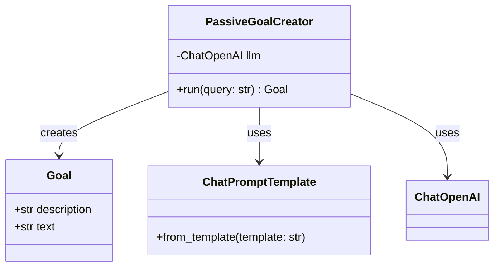
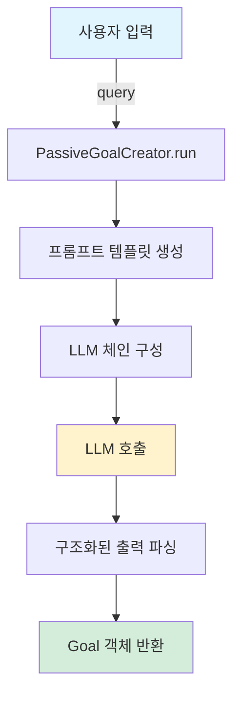

# PassiveGoalCreator 상세 흐름 가이드

> PassiveGoalCreator는 모호한 사용자 입력을 명확하고 실행 가능한 목표로 변환하는 첫 번째 단계입니다.

## 목차

1. [개요](#개요)
2. [핵심 개념](#핵심-개념)
3. [아키텍처](#아키텍처)
4. [실행 흐름](#실행-흐름)
5. [구체적 예시](#구체적-예시)
6. [프롬프트 분석](#프롬프트-분석)
7. [에이전트 패턴에서의 역할](#에이전트-패턴에서의-역할)
8. [코드 참조](#코드-참조)

---

## 개요

### PassiveGoalCreator란?

**PassiveGoalCreator**는 사용자의 모호한 입력을 받아 **명확하고 실행 가능한 목표**로 변환하는 컴포넌트입니다. 모든 에이전트 디자인 패턴에서 **첫 번째 단계**로 사용됩니다.

### "Passive"의 의미

"Passive"는 **수동적**이라는 의미로, LLM이 **직접 행동하지 않고 조사와 보고에만 집중**한다는 것을 의미합니다.

| 구분 | 설명 | 예시 |
|------|------|------|
| **Passive (수동적)** | 조사하고 보고만 함 | "Python 프레임워크를 조사하여 보고서를 작성한다" |
| **Active (능동적)** | 실제 코드 실행/파일 생성 | "FastAPI로 웹 서버를 구축한다" (실제 코드 작성) |

PassiveGoalCreator는 LLM을 **조사 작업으로 제한**하여:
- 예상치 못한 시스템 변경 방지
- 명확한 목표 정의에 집중
- 다음 단계(계획 수립)의 기반 제공

---

## 핵심 개념

### 1. 목적 (Purpose)

사용자의 모호한 입력을 LLM이 이해하고 실행할 수 있는 **구체적인 목표**로 변환합니다.

**변환 예시**:

```
입력 (모호함):
"AI agent 만들기 실습"

↓ PassiveGoalCreator 처리 ↓

출력 (명확함):
"AI agent의 개념, 주요 프레임워크(LangChain, LangGraph),
ReAct 패턴 등 핵심 아키텍처, 간단한 챗봇 구축 예제를
조사하여 단계별 실습 가이드를 작성한다."
```

### 2. 제약사항 (Constraints)

PassiveGoalCreator는 목표를 생성할 때 다음 제약을 적용합니다:

1. **조사만 가능**: 인터넷 검색을 통한 정보 수집만 허용
2. **보고서 작성만 가능**: 수집한 정보를 정리하여 보고서 생성
3. **다른 행동 금지**: 코드 실행, 파일 생성 등 금지

이를 통해 목표가 항상 **조사 중심**으로 정의되도록 보장합니다.

---

## 아키텍처

### 클래스 구조



### 데이터 모델

#### Goal 클래스

목표를 구조화된 형태로 저장하는 Pydantic 모델입니다.

```python
class Goal(BaseModel):
    description: str = Field(..., description="목표 설명")

    @property
    def text(self) -> str:
        return f"{self.description}"
```

**필드**:
- `description`: 목표에 대한 상세 설명 (필수)

**프로퍼티**:
- `text`: 목표를 텍스트 형태로 반환하는 읽기 전용 속성

---

## 실행 흐름

### 전체 프로세스



### 단계별 상세 설명

#### 1단계: 프롬프트 템플릿 생성

사용자 입력을 분석하여 목표를 생성하도록 LLM에게 지시하는 프롬프트를 생성합니다.

```python
prompt = ChatPromptTemplate.from_template(
    "사용자 입력을 분석하여 명확하고 실행 가능한 목표를 생성해 주세요.\n"
    "요건:\n"
    "1. 목표는 구체적이고 명확해야 하며, 실행 가능한 수준으로 상세화되어야 합니다.\n"
    "2. 당신이 실행할 수 있는 행동은 다음과 같은 행동뿐입니다.\n"
    "   - 인터넷을 이용하여 목표 달성을 위한 조사를 수행합니다.\n"
    "   - 사용자를 위한 보고서를 생성합니다.\n"
    "3. 절대 2.에 명시된 행동 외의 다른 행동을 취해서는 안 됩니다.\n"
    "사용자 입력: {query}"
)
```

#### 2단계: LLM 체인 구성

프롬프트와 LLM을 연결하고, 출력을 Goal 객체로 구조화하도록 설정합니다.

```python
chain = prompt | self.llm.with_structured_output(Goal)
```

**체인 구성 요소**:
- `prompt`: 사용자 입력을 포함한 완성된 프롬프트
- `|`: LangChain의 파이프 연산자 (체인 연결)
- `self.llm.with_structured_output(Goal)`: LLM 출력을 Goal 객체로 파싱

#### 3단계: LLM 호출 및 결과 반환

체인을 실행하여 Goal 객체를 생성하고 반환합니다.

```python
return chain.invoke({"query": query})
```

---

## 구체적 예시

### 예시 1: AI 에이전트 학습

#### 입력

```python
query = "AI agent 만들기 실습"
```

#### LLM에게 전달되는 프롬프트

```
사용자 입력을 분석하여 명확하고 실행 가능한 목표를 생성해 주세요.
요건:
1. 목표는 구체적이고 명확해야 하며, 실행 가능한 수준으로 상세화되어야 합니다.
2. 당신이 실행할 수 있는 행동은 다음과 같은 행동뿐입니다.
   - 인터넷을 이용하여 목표 달성을 위한 조사를 수행합니다.
   - 사용자를 위한 보고서를 생성합니다.
3. 절대 2.에 명시된 행동 외의 다른 행동을 취해서는 안 됩니다.
사용자 입력: AI agent 만들기 실습
```

#### 출력 (Goal 객체)

```python
Goal(
    description="""
    AI agent의 개념, 주요 프레임워크(LangChain, LangGraph),
    ReAct 패턴 등 핵심 아키텍처, 간단한 챗봇 구축 예제를
    조사하여 단계별 실습 가이드를 작성한다.
    """
)
```

#### Before/After 비교

| 항목 | Before (사용자 입력) | After (생성된 목표) |
|------|---------------------|---------------------|
| **명확성** | "만들기" (모호함) | "조사하여 가이드를 작성한다" (명확함) |
| **구체성** | 무엇을? → 불명확 | AI agent 개념, 프레임워크, 패턴 (구체적) |
| **실행 가능성** | 어떻게? → 불명확 | 인터넷 조사 → 보고서 작성 (실행 가능) |
| **범위** | 무한정 | 개념, 프레임워크, 예제로 제한 |
| **행동 유형** | 암묵적 | 명시적 (조사 + 보고서) |

### 예시 2: 데이터 분석

#### 입력

```python
query = "파이썬 데이터 분석 공부"
```

#### 출력 (Goal 객체)

```python
Goal(
    description="""
    파이썬을 이용한 데이터 분석의 기초 개념,
    주요 라이브러리(NumPy, Pandas, Matplotlib),
    데이터 전처리 및 시각화 기법을 인터넷에서 조사하고,
    초보자를 위한 학습 로드맵과 실습 예제를 포함한
    종합 가이드를 작성한다.
    """
)
```

#### 변환 과정

```
"파이썬 데이터 분석 공부" (8글자, 모호함)
          ↓
[LLM 처리: 구체화 + 제약 적용]
          ↓
"파이썬을 이용한 데이터 분석의 기초 개념, 주요 라이브러리...,
종합 가이드를 작성한다." (약 100글자, 명확함)
```

### 예시 3: 웹 개발 (Active 제약 확인)

#### 입력

```python
query = "FastAPI로 웹 서버 만들기"
```

#### 출력 (Goal 객체)

```python
Goal(
    description="""
    FastAPI 프레임워크의 기본 개념, 설치 방법,
    라우팅 및 미들웨어 구성, RESTful API 설계 패턴,
    데이터베이스 연동 방법을 인터넷에서 조사하고,
    단계별 구축 가이드와 예제 코드를 포함한
    실습 매뉴얼을 작성한다.
    """
)
```

#### 중요 포인트

주목할 점: "만들기"라는 능동적 표현이 입력에 있었지만, 출력에서는:
- ✅ "조사하고... 매뉴얼을 작성한다" (Passive)
- ❌ "FastAPI 서버를 구축하고 배포한다" (Active) ← 이렇게 나오지 않음

PassiveGoalCreator는 **항상 조사와 보고서 작성으로 제한**합니다.

---

## 프롬프트 분석

PassiveGoalCreator의 프롬프트는 3가지 핵심 요건을 포함합니다.

### 요건 1: 구체성과 실행 가능성

```
"1. 목표는 구체적이고 명확해야 하며, 실행 가능한 수준으로 상세화되어야 합니다."
```

**효과**:
- 모호한 표현 제거
- 측정 가능한 결과물 정의
- 다음 단계(계획 수립)에서 분해 가능한 형태로 변환

**예시**:
- ❌ "AI 공부" → 너무 광범위
- ✅ "AI agent의 개념, 프레임워크, 패턴을 조사" → 구체적

### 요건 2: 행동 범위 제한

```
"2. 당신이 실행할 수 있는 행동은 다음과 같은 행동뿐입니다.
   - 인터넷을 이용하여 목표 달성을 위한 조사를 수행합니다.
   - 사용자를 위한 보고서를 생성합니다."
```

**효과**:
- LLM의 행동을 **조사**와 **보고**로 제한
- 시스템 변경, 코드 실행 등 위험한 행동 방지
- 목표가 항상 안전한 범위 내에서 정의됨

**허용되는 행동**:
- ✅ 인터넷 검색 (Tavily Search)
- ✅ 정보 정리 및 보고서 작성
- ✅ 가이드/매뉴얼 생성

**금지되는 행동**:
- ❌ 코드 실행
- ❌ 파일 생성/수정
- ❌ 시스템 명령 실행
- ❌ API 호출 (조사 목적 외)

### 요건 3: 명시적 제약

```
"3. 절대 2.에 명시된 행동 외의 다른 행동을 취해서는 안 됩니다."
```

**효과**:
- 요건 2를 강화하는 명시적 금지 조항
- LLM이 창의적으로 해석하여 범위를 벗어나는 것 방지
- "절대"라는 강한 표현으로 제약 강조

**프롬프트 설계 원칙**:
1. 긍정적 지시 (요건 2): 무엇을 할 수 있는지 명시
2. 부정적 지시 (요건 3): 무엇을 하면 안 되는지 명시
3. 두 가지를 결합하여 **명확한 경계** 설정

---

## 에이전트 패턴에서의 역할

PassiveGoalCreator는 모든 에이전트 디자인 패턴에서 **첫 번째 단계**로 사용됩니다.

### 1. Single Path Plan Generation

```
[1단계] PassiveGoalCreator
   ↓
[2단계] PromptOptimizer (SMART 원칙)
   ↓
[3단계] ResponseOptimizer
   ↓
[4단계] QueryDecomposer (태스크 분해)
   ↓
...
```

**역할**: 사용자 입력을 조사 가능한 목표로 변환

### 2. Self Reflection

```
[1단계] PassiveGoalCreator + 과거 반성 내용
   ↓
[2단계] 목표 최적화 (과거 실패 고려)
   ↓
[3단계] 계획 수립
   ↓
[4단계] 실행 + 자기 반성
   ↓
...
```

**역할**: 과거 반성을 반영하여 개선된 목표 생성

**프롬프트 확장**:
```python
# Self Reflection에서는 과거 반성 내용이 추가됨
prompt = f"""
사용자 입력을 분석하여 명확하고 실행 가능한 목표를 생성해 주세요.

과거 반성 내용:
{past_reflections}  # 이전 실행의 문제점

요건:
1. 과거 반성 내용을 고려하여 목표를 개선하세요.
2. ...
"""
```

### 3. Cross Reflection

```
[1단계] PassiveGoalCreator
   ↓
[2단계] 계획 수립
   ↓
[3단계] 실행
   ↓
[4단계] 교차 반성 (다른 에이전트가 평가)
   ↓
...
```

**역할**: 기본 목표 생성 (다른 에이전트가 나중에 평가)

### 4. Role-Based Cooperation

```
[1단계] PassiveGoalCreator (공통 목표)
   ↓
[2단계] 역할별 목표 분배
   ├─ 에이전트 A: 조사 담당
   ├─ 에이전트 B: 분석 담당
   └─ 에이전트 C: 종합 담당
   ↓
...
```

**역할**: 모든 에이전트가 공유할 상위 목표 정의

---

## 코드 참조

### 파일 구조

```
chapter12/passive_goal_creator/
├── main.py                    # 전체 구현
│   ├── Goal 클래스            # 목표 데이터 모델
│   ├── PassiveGoalCreator     # 목표 생성 로직
│   └── main 함수              # CLI 진입점
└── FLOW_DETAILED.md           # 이 문서
```

### 주요 코드 섹션

#### Goal 클래스

[main.py#L10-L20](main.py#L10-L20)

```python
class Goal(BaseModel):
    description: str = Field(..., description="목표 설명")

    @property
    def text(self) -> str:
        return f"{self.description}"
```

#### PassiveGoalCreator 클래스

[main.py#L25-L58](main.py#L25-L58)

```python
class PassiveGoalCreator:
    def __init__(self, llm: ChatOpenAI):
        self.llm = llm

    def run(self, query: str) -> Goal:
        # 프롬프트 생성 및 LLM 호출
        ...
```

#### run 메서드 (핵심 로직)

[main.py#L35-L58](main.py#L35-L58)

```python
def run(self, query: str) -> Goal:
    prompt = ChatPromptTemplate.from_template(...)
    chain = prompt | self.llm.with_structured_output(Goal)
    return chain.invoke({"query": query})
```

### 실행 방법

#### CLI로 실행

```bash
cd /Users/iyeongbeom/YB/Repository/study/llm-agent/chapter12/passive_goal_creator

python main.py --task "AI agent 만들기 실습"
```

#### Python 스크립트에서 사용

```python
from langchain_openai import ChatOpenAI
from main import PassiveGoalCreator

# LLM 초기화
llm = ChatOpenAI(model="gpt-4o", temperature=0.1)

# PassiveGoalCreator 생성
creator = PassiveGoalCreator(llm=llm)

# 목표 생성
goal = creator.run(query="AI agent 만들기 실습")

print(goal.text)
```

---

## 핵심 기능

### 1. 모호성 제거

사용자 입력에서 불명확한 부분을 구체화합니다.

**모호한 표현**:
- "만들기" → "조사하여 가이드 작성"
- "공부" → "학습 로드맵 및 예제 조사"
- "알아보기" → "개념과 방법론 조사"

### 2. 조사 범위 명시

무한정 확장될 수 있는 목표를 **구체적인 조사 항목**으로 제한합니다.

**예시**:
```
"AI agent 만들기" (무한정)
   ↓
"AI agent의 개념, LangChain, ReAct 패턴,
챗봇 예제를 조사" (제한적)
```

### 3. Passive 행동으로 제약

모든 목표가 **조사**와 **보고**로만 표현되도록 강제합니다.

**변환 규칙**:

| 사용자 표현 | 변환 후 표현 |
|------------|-------------|
| "만들다" | "조사하여 구축 방법을 정리한다" |
| "구현하다" | "구현 방법과 예제를 조사한다" |
| "배포하다" | "배포 프로세스를 조사하여 가이드를 작성한다" |
| "분석하다" | "분석 기법을 조사하여 보고서를 작성한다" |

---

## 요약

### PassiveGoalCreator의 역할

1. **모호한 입력 → 명확한 목표**: 사용자의 간단한 표현을 상세한 목표로 확장
2. **제약 적용**: 조사와 보고만 가능하도록 목표 범위 제한
3. **다음 단계 준비**: 목표 최적화 및 태스크 분해의 기반 제공

### 왜 Passive인가?

- **안전성**: 시스템 변경이나 코드 실행 방지
- **집중성**: 정보 수집에만 집중하여 목표 명확화
- **확장성**: 조사 결과를 바탕으로 다음 단계에서 능동적 행동 수행 가능

### 다음 단계

PassiveGoalCreator가 생성한 목표는 다음 단계로 전달됩니다:

```
PassiveGoalCreator (이 컴포넌트)
   ↓
PromptOptimizer (SMART 원칙으로 목표 최적화)
   ↓
ResponseOptimizer (응답 형식 정의)
   ↓
QueryDecomposer (목표를 태스크로 분해)
   ↓
...
```

각 단계는 이전 단계의 출력을 개선하고 구체화하여, 최종적으로 실행 가능한 에이전트 워크플로우를 구성합니다.
