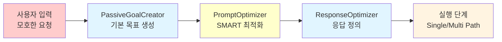
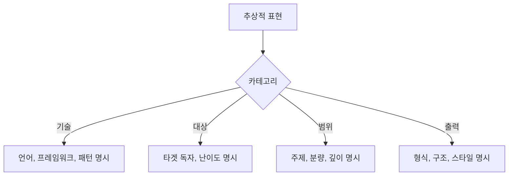
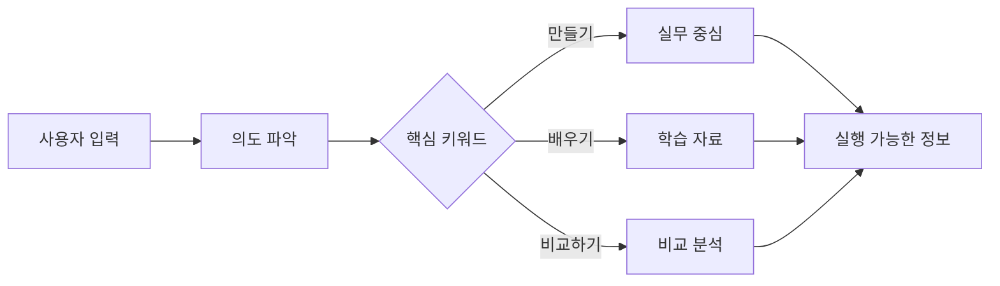
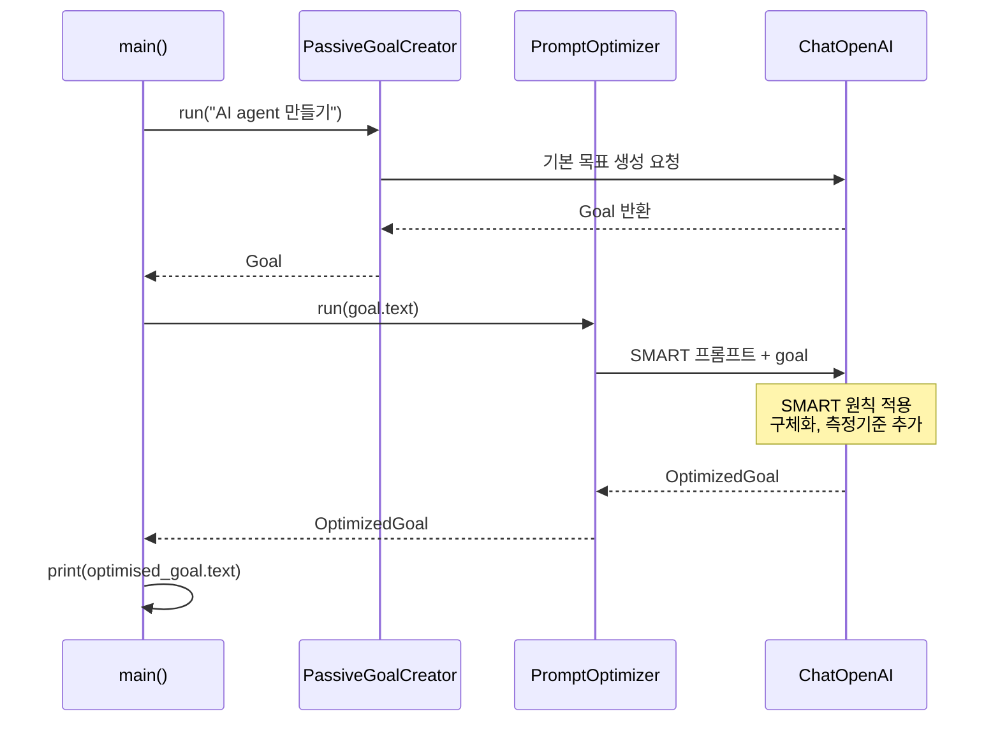

# Prompt Optimizer 실행 흐름 상세 가이드

> 이 문서는 Prompt Optimizer 패턴의 전체 실행 흐름을 구체적인 예시와 함께 설명합니다.

## 📋 목차

1. [개요](#개요)
2. [핵심 개념](#핵심-개념)
3. [SMART 원칙 상세](#smart-원칙-상세)
4. [실행 흐름](#실행-흐름)
5. [Before/After 비교](#beforeafter-비교)
6. [실제 실행 예시](#실제-실행-예시)
7. [코드 레퍼런스](#코드-레퍼런스)

---

## 개요

### Prompt Optimizer란?

**Prompt Optimizer**는 에이전트 디자인 패턴의 **두 번째 단계**로, PassiveGoalCreator에서 생성된 기본 목표를 **SMART 원칙**에 따라 최적화하는 컴포넌트입니다.

### 전체 파이프라인에서의 위치



### 핵심 역할

- ✅ **구체화**: 추상적인 표현을 구체적으로 변환
- ✅ **측정 가능화**: 측정 기준(metrics) 추가
- ✅ **실행 가능화**: 달성 가능한 범위로 조정
- ✅ **관련성 확보**: 원래 목표와의 연결성 유지
- ✅ **기한 설정**: 필요시 시간 제약 추가

### 처리 프로세스 요약

```
입력: Goal (기본 목표)
    ↓
SMART 원칙 적용
    ├─ Specific (구체적)
    ├─ Measurable (측정 가능)
    ├─ Achievable (달성 가능)
    ├─ Relevant (관련성)
    └─ Time-bound (기한)
    ↓
출력: OptimizedGoal (description + metrics)
```

---

## 핵심 개념

### 1. 데이터 모델

#### Goal (입력)

PassiveGoalCreator에서 생성된 기본 목표입니다.

```python
class Goal(BaseModel):
    description: str  # 목표 설명

    @property
    def text(self) -> str:
        return f"{self.description}"
```

**예시**:
```python
Goal {
    description: "인터넷을 이용하여 AI 에이전트 만들기에 대한
                  정보를 조사하고, 사용자를 위한 가이드를 작성한다."
}
```

#### OptimizedGoal (출력)

SMART 원칙이 적용되어 최적화된 목표입니다.

```python
class OptimizedGoal(BaseModel):
    description: str  # SMART 원칙이 적용된 목표 설명
    metrics: str      # 목표 달성도를 측정하는 방법

    @property
    def text(self) -> str:
        return f"{self.description}(측정 기준: {self.metrics})"
```

**예시**:
```python
OptimizedGoal {
    description: """
        Python 기반 AI 에이전트 개발을 위한 실무 가이드를 작성한다.
        LangChain, LangGraph, ReAct 패턴 등 최신 프레임워크를
        중심으로 2024년 12월 4일 기준 최신 정보를 조사하며,
        각 주제당 최소 3개 이상의 신뢰할 수 있는 출처를 참고하고,
        각 섹션별로 200자 이상의 상세한 설명을 포함한다.
    """,

    metrics: """
        1. LangChain, LangGraph, ReAct 패턴이 모두 포함되었는가?
        2. 각 주제당 최소 3개 이상의 출처가 인용되었는가?
        3. 각 섹션이 200자 이상으로 작성되었는가?
        4. 2024년 12월 기준 최신 정보가 반영되었는가?
        5. Python 코드 예시가 포함되었는가?
    """
}
```

### 2. SMART 원칙이란?

**SMART**는 효과적인 목표 설정을 위한 5가지 원칙의 약자입니다:

| 원칙 | 영문 | 의미 |
|------|------|------|
| **S** | Specific | 구체적 - 명확하고 세부적인 목표 |
| **M** | Measurable | 측정 가능 - 달성 여부를 확인할 수 있는 기준 |
| **A** | Achievable | 달성 가능 - 현실적으로 실행 가능한 범위 |
| **R** | Relevant | 관련성 - 본래 목적과 연결된 목표 |
| **T** | Time-bound | 기한 - 명확한 시간 제약 (선택적) |

### 3. PromptOptimizer 클래스

```python
class PromptOptimizer:
    def __init__(self, llm: ChatOpenAI):
        self.llm = llm

    def run(self, query: str) -> OptimizedGoal:
        # SMART 원칙을 적용하는 프롬프트 실행
        # OptimizedGoal 형태로 구조화된 출력 반환
```

---

## SMART 원칙 상세

### 예시 시나리오

**사용자 입력**: "AI agent 만들기"

**PassiveGoalCreator 출력 (기본 목표)**:
```
"인터넷을 이용하여 AI 에이전트 만들기에 대한 정보를 조사하고,
사용자를 위한 가이드를 작성한다."
```

이 기본 목표를 SMART 원칙으로 최적화해봅시다.

---

### S - Specific (구체적)

#### 원칙
> 목표가 명확하고 구체적이어야 합니다. 추상적인 표현을 제거하고 정확한 내용을 명시합니다.

#### Before (기본 목표)
```
"AI 에이전트 만들기에 대한 정보를 조사"
```

**문제점**:
- "AI 에이전트"가 너무 광범위함
- "만들기"가 구체적이지 않음
- "정보"가 추상적임

#### After (구체화)
```
"Python 기반 AI 에이전트 개발을 위한 실무 가이드를 작성한다.
LangChain, LangGraph, ReAct 패턴 등 최신 프레임워크를 중심으로..."
```

**개선 내용**:
- ✓ "Python 기반"으로 언어 명시
- ✓ "LangChain, LangGraph, ReAct 패턴"으로 구체적 도구 지정
- ✓ "실무 가이드"로 출력물 명확화
- ✓ "최신 프레임워크"로 초점 명시

#### 구체화 전략



---

### M - Measurable (측정 가능)

#### 원칙
> 목표 달성 여부를 객관적으로 측정할 수 있는 기준을 제시합니다.

#### Before (기본 목표)
```
"가이드를 작성한다."
```

**문제점**:
- 어떤 가이드가 "완성"인지 불명확
- 품질 기준이 없음
- 완료 여부를 판단할 수 없음

#### After (측정 기준 추가)
```
"각 주제당 최소 3개 이상의 신뢰할 수 있는 출처를 참고하고,
각 섹션별로 200자 이상의 상세한 설명을 포함한다."
```

**측정 기준 (metrics)**:
```
1. LangChain, LangGraph, ReAct 패턴이 모두 포함되었는가?
2. 각 주제당 최소 3개 이상의 출처가 인용되었는가?
3. 각 섹션이 200자 이상으로 작성되었는가?
4. 2024년 12월 기준 최신 정보가 반영되었는가?
5. Python 코드 예시가 포함되었는가?
```

#### 측정 가능한 기준의 유형

| 유형 | 예시 | 검증 방법 |
|------|------|----------|
| **수량** | "최소 3개 출처", "200자 이상" | 카운트, 글자 수 계산 |
| **포함 여부** | "LangChain 포함", "코드 예시 포함" | 존재 확인 |
| **품질** | "신뢰할 수 있는 출처", "상세한 설명" | 명확한 기준 제시 |
| **시점** | "2024년 12월 기준" | 날짜 확인 |

---

### A - Achievable (달성 가능)

#### 원칙
> 현실적으로 달성 가능한 범위 내에서 목표를 설정합니다. 에이전트의 제약사항을 고려합니다.

#### 제약사항

PromptOptimizer의 프롬프트에는 다음과 같은 제약이 명시됩니다:

```
당신이 실행할 수 있는 행동은 다음과 같습니다.
- 인터넷을 이용하여 목표 달성을 위한 조사를 수행한다.
- 사용자를 위한 보고서를 생성한다.

주의: 절대로 위 행동 이외의 다른 행동을 취해서는 안 됩니다.
```

#### Before (달성 불가능)
```
❌ "AI 에이전트를 직접 개발하고 배포한다."
❌ "코드를 실행하여 테스트한다."
❌ "GitHub 리포지토리를 생성한다."
```

**문제점**:
- 에이전트는 조사와 보고서 생성만 가능
- 직접 코드 실행이나 외부 시스템 조작은 불가능

#### After (달성 가능)
```
✓ "인터넷을 이용하여 AI 에이전트 개발 방법을 조사한다."
✓ "조사한 정보를 바탕으로 실무 가이드를 작성한다."
✓ "최신 프레임워크 사용 예시를 수집하여 정리한다."
```

**개선 내용**:
- ✓ 인터넷 조사 범위 내로 제한
- ✓ 보고서 생성에 집중
- ✓ 정보 수집과 정리에 초점

#### 달성 가능성 검증 체크리스트

```
□ 인터넷 검색으로 해결 가능한가?
□ 외부 시스템 접근이 필요하지 않은가?
□ 코드 실행이 필요하지 않은가?
□ 보고서 형태로 정리 가능한가?
□ 주어진 시간/리소스 내에서 가능한가?
```

---

### R - Relevant (관련성)

#### 원칙
> 목표가 사용자의 원래 요청 및 의도와 관련성이 높아야 합니다.

#### 원래 요청 분석

**사용자 입력**: "AI agent 만들기"

**사용자 의도 파악**:
- AI 에이전트에 대한 지식 습득
- 실제로 개발할 수 있는 방법 학습
- 실무에 적용 가능한 정보 필요

#### Before (관련성 낮음)
```
❌ "AI의 역사와 이론적 배경을 조사한다."
❌ "머신러닝 알고리즘의 수학적 원리를 설명한다."
❌ "AI 윤리와 철학적 논의를 정리한다."
```

**문제점**:
- 사용자는 "만들기"를 원하는데 이론만 제공
- 실무 개발과 거리가 먼 내용

#### After (관련성 높음)
```
✓ "Python 기반 AI 에이전트 개발을 위한 실무 가이드"
✓ "LangChain, LangGraph, ReAct 패턴 등 최신 프레임워크"
✓ "실제 개발에 활용할 수 있는 정보"
```

**개선 내용**:
- ✓ 실무 개발에 직접 활용 가능
- ✓ 구체적인 도구와 프레임워크 제시
- ✓ "만들기"라는 원래 의도에 부합

#### 관련성 확보 전략



---

### T - Time-bound (기한)

#### 원칙
> 명확한 시간 제약이나 기한을 설정합니다. (선택적)

#### PromptOptimizer의 시간 처리

프롬프트에 다음과 같이 명시되어 있습니다:

```
"원래 목표에서 기한이 지정되지 않은 경우에는
기한을 고려할 필요가 없습니다."
```

#### 시간 제약의 적용

**케이스 1: 기한이 없는 경우**
```
사용자 입력: "AI agent 만들기"
→ 기한 명시 안 함

OptimizedGoal:
"2024년 12월 4일 기준 최신 정보를 조사하며..."
```
**시간 요소**: "최신 정보"로 시점만 명시 (기한 아님)

**케이스 2: 기한이 있는 경우**
```
사용자 입력: "이번 주 내로 AI agent 개발 가이드 작성"
→ 기한 명시됨

OptimizedGoal:
"2024년 12월 8일(일)까지 완료할 수 있는 범위로,
Python 기반 AI 에이전트 개발 가이드를 작성한다..."
```
**시간 요소**: "2024년 12월 8일까지"로 기한 명시

#### 시간 정보의 유형

| 유형 | 예시 | 용도 |
|------|------|------|
| **시점** | "2024년 12월 4일 기준" | 정보의 최신성 |
| **기간** | "최근 1년간의 자료" | 조사 범위 |
| **기한** | "12월 8일까지" | 완료 시점 |
| **순서** | "단계별로 순차적으로" | 실행 순서 |

---

## 실행 흐름

### 전체 프로세스



### 단계별 상세 흐름

#### [1단계] 기본 목표 생성 (PassiveGoalCreator)

**코드 위치**: `/chapter12/passive_goal_creator/main.py`

```python
passive_goal_creator = PassiveGoalCreator(llm=llm)
goal: Goal = passive_goal_creator.run(query=args.task)
```

**입력**:
```
"AI agent 만들기"
```

**출력**:
```python
Goal {
    description: "인터넷을 이용하여 AI 에이전트 만들기에 대한
                  정보를 조사하고, 사용자를 위한 가이드를 작성한다."
}
```

#### [2단계] SMART 최적화 (PromptOptimizer)

**코드 위치**: `/chapter12/prompt_optimizer/main.py#L32-L76`

```python
prompt_optimizer = PromptOptimizer(llm=llm)
optimised_goal: OptimizedGoal = prompt_optimizer.run(query=goal.text)
```

**프롬프트 구조**:

```python
prompt = ChatPromptTemplate.from_template(
    # [1] 역할 설정
    "당신은 목표 설정 전문가입니다. "
    "아래의 목표를 SMART 원칙(Specific: 구체적, Measurable: 측정 가능, "
    "Achievable: 달성 가능, Relevant: 관련성이 높은, Time-bound: 기한이 있는)에 "
    "기반하여 최적화해 주세요.\n\n"

    # [2] 원래 목표 제시
    "원래 목표:\n"
    "{query}\n\n"

    # [3] 지시 사항
    "지시 사항:\n"
    "1. 원래 목표를 분석하고, 부족한 요소나 개선점을 파악해 주세요.\n"

    # [4] 행동 제약
    "2. 당신이 실행할 수 있는 행동은 다음과 같습니다.\n"
    "   - 인터넷을 이용하여 목표 달성을 위한 조사를 수행한다.\n"
    "   - 사용자를 위한 보고서를 생성한다.\n"

    # [5] SMART 적용
    "3. SMART 원칙의 각 요소를 고려하면서 목표를 구체적이고 상세하게 기술해 주세요.\n"
    "   - 절대 추상적인 표현을 포함해서는 안 됩니다.\n"
    "   - 반드시 모든 단어가 실행 가능하고 구체적인지 확인해 주세요.\n"

    # [6] 측정 방법
    "4. 목표의 달성도를 측정하는 방법을 구체적이고 상세하게 기술해 주세요.\n"

    # [7] 시간 처리
    "5. 원래 목표에서 기한이 지정되지 않은 경우에는 기한을 고려할 필요가 없습니다.\n"

    # [8] 안전장치
    "6. 주의: 절대로 2번 이외의 행동을 취해서는 안 됩니다."
)
```

**LLM 실행**:
```python
chain = prompt | self.llm.with_structured_output(OptimizedGoal)
return chain.invoke({"query": query})
```

**출력**:
```python
OptimizedGoal {
    description: """
        Python 기반 AI 에이전트 개발을 위한 실무 가이드를 작성한다.
        LangChain, LangGraph, ReAct 패턴 등 최신 프레임워크를 중심으로
        2024년 12월 4일 기준 최신 정보를 조사하며,
        각 주제당 최소 3개 이상의 신뢰할 수 있는 출처를 참고하고,
        각 섹션별로 200자 이상의 상세한 설명을 포함한다.
    """,

    metrics: """
        1. LangChain, LangGraph, ReAct 패턴이 모두 포함되었는가?
        2. 각 주제당 최소 3개 이상의 출처가 인용되었는가?
        3. 각 섹션이 200자 이상으로 작성되었는가?
        4. 2024년 12월 기준 최신 정보가 반영되었는가?
        5. Python 코드 예시가 포함되었는가?
    """
}
```

#### [3단계] 출력

```python
print(f"{optimised_goal.text}")
```

**최종 출력**:
```
Python 기반 AI 에이전트 개발을 위한 실무 가이드를 작성한다.
LangChain, LangGraph, ReAct 패턴 등 최신 프레임워크를 중심으로
2024년 12월 4일 기준 최신 정보를 조사하며,
각 주제당 최소 3개 이상의 신뢰할 수 있는 출처를 참고하고,
각 섹션별로 200자 이상의 상세한 설명을 포함한다.
(측정 기준: 1. LangChain, LangGraph, ReAct 패턴이 모두 포함되었는가?
2. 각 주제당 최소 3개 이상의 출처가 인용되었는가? ...)
```

---

## Before/After 비교

### 전체 비교 테이블

| 측면 | Before (기본 목표) | After (SMART 목표) |
|------|-------------------|-------------------|
| **구체성** | "AI 에이전트 만들기" | "Python 기반, LangChain, LangGraph, ReAct 패턴" |
| **측정 가능성** | 측정 기준 없음 | "최소 3개 출처, 각 섹션 200자 이상" |
| **달성 가능성** | "만들기" (실행 불가) | "조사하여 가이드 작성" (실행 가능) |
| **관련성** | 광범위한 정보 | Python 기반 실무 개발에 집중 |
| **시간 제약** | 없음 | "2024년 12월 4일 기준 최신 정보" |
| **측정 기준** | 없음 | 5가지 구체적 검증 항목 |

### 상세 비교

#### 1. 구체성 (Specific)

**Before**:
```
"AI 에이전트 만들기에 대한 정보를 조사"
```
- 범위가 너무 광범위
- 어떤 AI 에이전트인지 불명확
- 어떤 정보가 필요한지 모호

**After**:
```
"Python 기반 AI 에이전트 개발을 위한 실무 가이드를 작성한다.
LangChain, LangGraph, ReAct 패턴 등 최신 프레임워크를 중심으로..."
```
- Python 언어로 명확히 제한
- 구체적인 프레임워크 명시 (LangChain, LangGraph, ReAct)
- 실무 가이드라는 명확한 형식 지정

#### 2. 측정 가능성 (Measurable)

**Before**:
```
(측정 기준 없음)
```
- 언제 완료인지 알 수 없음
- 품질을 확인할 방법이 없음

**After**:
```
측정 기준:
1. LangChain, LangGraph, ReAct 패턴이 모두 포함되었는가?
2. 각 주제당 최소 3개 이상의 출처가 인용되었는가?
3. 각 섹션이 200자 이상으로 작성되었는가?
4. 2024년 12월 기준 최신 정보가 반영되었는가?
5. Python 코드 예시가 포함되었는가?
```
- 5가지 명확한 검증 기준
- 수치화 가능 (3개 출처, 200자)
- 포함 여부 확인 가능 (Yes/No)

#### 3. 달성 가능성 (Achievable)

**Before**:
```
"AI 에이전트 만들기"
```
- "만들기"는 직접 개발을 의미
- 에이전트가 코드를 작성하고 실행하는 것은 불가능
- 제약사항 위반

**After**:
```
"조사하며... 가이드를 작성한다"
```
- 인터넷 조사로 실행 가능
- 보고서 생성 범위 내
- 제약사항 준수

#### 4. 관련성 (Relevant)

**Before**:
```
"AI 에이전트 만들기에 대한 정보"
```
- 너무 광범위하여 초점이 흐림
- 이론적 정보도 포함될 수 있음

**After**:
```
"Python 기반 AI 에이전트 개발을 위한 실무 가이드"
"최신 프레임워크를 중심으로"
```
- 실무 개발에 직접 활용 가능한 정보로 제한
- 사용자의 "만들기" 의도에 부합
- 최신 도구 중심으로 실용성 확보

#### 5. 시간 제약 (Time-bound)

**Before**:
```
(시간 정보 없음)
```

**After**:
```
"2024년 12월 4일 기준 최신 정보를 조사하며"
```
- 명확한 시점 명시
- 최신성 보장
- (기한은 원래 목표에 없어서 추가하지 않음)

---

## 실제 실행 예시

### 실행 명령

```bash
cd /Users/iyeongbeom/YB/Repository/study/llm-agent/chapter12

python -m prompt_optimizer.main --task "AI agent 만들기"
```

### 실행 로그

```
=== 1단계: 기본 목표 생성 ===
PassiveGoalCreator 실행 중...

생성된 기본 목표:
"인터넷을 이용하여 AI 에이전트 만들기에 대한 정보를 조사하고,
사용자를 위한 가이드를 작성한다."

=== 2단계: SMART 최적화 ===
PromptOptimizer 실행 중...

[분석 단계]
- 원래 목표 분석 중...
- SMART 원칙 적용 중...
  → Specific: 구체화 필요
  → Measurable: 측정 기준 추가 필요
  → Achievable: 달성 가능 범위 확인
  → Relevant: 관련성 검토
  → Time-bound: 시점 정보 추가

[최적화 단계]
- 구체적 기술/도구 명시
- 측정 가능한 기준 설정
- 실행 가능한 행동으로 조정
- 최신 정보 수집 시점 명시

=== 최종 결과 ===
Python 기반 AI 에이전트 개발을 위한 실무 가이드를 작성한다.
LangChain, LangGraph, ReAct 패턴 등 최신 프레임워크를 중심으로
2024년 12월 4일 기준 최신 정보를 조사하며,
각 주제당 최소 3개 이상의 신뢰할 수 있는 출처를 참고하고,
각 섹션별로 200자 이상의 상세한 설명을 포함한다.
(측정 기준: 1. LangChain, LangGraph, ReAct 패턴이 모두 포함되었는가?
2. 각 주제당 최소 3개 이상의 출처가 인용되었는가?
3. 각 섹션이 200자 이상으로 작성되었는가?
4. 2024년 12월 기준 최신 정보가 반영되었는가?
5. Python 코드 예시가 포함되었는가?)
```

### 다양한 예시

#### 예시 1: "카레라이스 만드는 방법"

**기본 목표 (PassiveGoalCreator)**:
```
"인터넷을 이용하여 카레라이스를 만드는 구체적인 방법을 조사하고,
사용자를 위한 단계별 레시피 보고서를 생성한다."
```

**최적화된 목표 (PromptOptimizer)**:
```python
OptimizedGoal {
    description: """
        4인분 기준 일본식 카레라이스 레시피를 인터넷에서 조사하여,
        재료 목록(최소 5가지), 단계별 조리법(5~7단계), 조리 시간을
        포함한 상세한 가이드를 작성한다.
    """,

    metrics: """
        1. 재료 목록이 5가지 이상 포함되었는가?
        2. 각 조리 단계가 구체적으로 기술되었는가?
        3. 조리 시간이 명시되었는가?
        4. 초보자도 따라할 수 있을 정도로 상세한가?
    """
}
```

**SMART 적용**:
- **S**: "4인분 기준", "일본식", "5~7단계"로 구체화
- **M**: "최소 5가지", "5~7단계", "조리 시간" 등 측정 가능
- **A**: 인터넷 조사로 충분히 가능
- **R**: 레시피 작성이라는 목표에 부합
- **T**: (기한 없음, 시점 정보만)

#### 예시 2: "Python 웹 크롤러 개발"

**기본 목표**:
```
"인터넷을 이용하여 Python 웹 크롤러 개발에 대한 정보를 조사하고,
사용자를 위한 개발 가이드를 작성한다."
```

**최적화된 목표**:
```python
OptimizedGoal {
    description: """
        Python BeautifulSoup 및 Selenium을 활용한 웹 크롤러 개발
        가이드를 작성한다. 기본 HTML 파싱부터 동적 웹페이지 크롤링까지
        단계별로 조사하며, 각 단계마다 실제 코드 예시와 함께
        최소 2개 이상의 실무 활용 사례를 포함한다.
    """,

    metrics: """
        1. BeautifulSoup와 Selenium 모두 다루었는가?
        2. HTML 파싱, 동적 페이지 크롤링 방법이 포함되었는가?
        3. 각 단계별로 Python 코드 예시가 있는가?
        4. 최소 2개 이상의 실무 활용 사례가 제시되었는가?
        5. 법적 주의사항(robots.txt 등)이 언급되었는가?
    """
}
```

---

## 코드 레퍼런스

### 주요 파일

```
/Users/iyeongbeom/YB/Repository/study/llm-agent/chapter12/
├── passive_goal_creator/
│   └── main.py                 # 1단계: 기본 목표 생성
├── prompt_optimizer/
│   └── main.py                 # 2단계: SMART 최적화 (이 문서)
└── response_optimizer/
    └── main.py                 # 3단계: 응답 정의
```

### 핵심 코드 위치

#### 1. OptimizedGoal 클래스

**파일**: `/chapter12/prompt_optimizer/main.py#L14-L27`

```python
class OptimizedGoal(BaseModel):
    description: str = Field(..., description="목표의 설명")
    metrics: str = Field(..., description="목표의 달성도를 측정하는 방법")

    @property
    def text(self) -> str:
        return f"{self.description}(측정 기준: {self.metrics})"
```

#### 2. PromptOptimizer 클래스

**파일**: `/chapter12/prompt_optimizer/main.py#L32-L76`

```python
class PromptOptimizer:
    def __init__(self, llm: ChatOpenAI):
        self.llm = llm

    def run(self, query: str) -> OptimizedGoal:
        prompt = ChatPromptTemplate.from_template(...)
        chain = prompt | self.llm.with_structured_output(OptimizedGoal)
        return chain.invoke({"query": query})
```

#### 3. SMART 프롬프트

**파일**: `/chapter12/prompt_optimizer/main.py#L42-L71`

```python
prompt = ChatPromptTemplate.from_template(
    "당신은 목표 설정 전문가입니다. "
    "아래의 목표를 SMART 원칙(...) 에 기반하여 최적화해 주세요.\n\n"
    "원래 목표:\n{query}\n\n"
    "지시 사항:\n"
    "1. 원래 목표를 분석하고, 부족한 요소나 개선점을 파악해 주세요.\n"
    "2. 당신이 실행할 수 있는 행동은 다음과 같습니다.\n"
    "   - 인터넷을 이용하여 목표 달성을 위한 조사를 수행한다.\n"
    "   - 사용자를 위한 보고서를 생성한다.\n"
    "3. SMART 원칙의 각 요소를 고려하면서 목표를 구체적이고 상세하게 기술해 주세요.\n"
    "   - 절대 추상적인 표현을 포함해서는 안 됩니다.\n"
    "   - 반드시 모든 단어가 실행 가능하고 구체적인지 확인해 주세요.\n"
    "4. 목표의 달성도를 측정하는 방법을 구체적이고 상세하게 기술해 주세요.\n"
    "5. 원래 목표에서 기한이 지정되지 않은 경우에는 기한을 고려할 필요가 없습니다.\n"
    "6. 주의: 절대로 2번 이외의 행동을 취해서는 안 됩니다."
)
```

#### 4. main() 함수

**파일**: `/chapter12/prompt_optimizer/main.py#L81-L122`

```python
def main():
    # 설정 및 인자 파싱
    settings = Settings()
    parser = argparse.ArgumentParser(...)
    parser.add_argument("--task", type=str, required=True, ...)
    args = parser.parse_args()

    # LLM 초기화
    llm = ChatOpenAI(
        model=settings.openai_smart_model,
        temperature=settings.temperature
    )

    # 1단계: 기본 목표 생성
    passive_goal_creator = PassiveGoalCreator(llm=llm)
    goal: Goal = passive_goal_creator.run(query=args.task)

    # 2단계: 목표 최적화
    prompt_optimizer = PromptOptimizer(llm=llm)
    optimised_goal: OptimizedGoal = prompt_optimizer.run(query=goal.text)

    # 출력
    print(f"{optimised_goal.text}")
```

---

## 핵심 특징 요약

### PromptOptimizer의 강점

1. **자동 구체화**
   - 추상적 표현을 자동으로 구체화
   - LLM이 맥락을 파악하여 적절한 세부사항 추가

2. **측정 기준 자동 생성**
   - 목표에 맞는 측정 기준을 자동으로 제안
   - 수치화 가능한 지표 제공

3. **제약사항 준수**
   - 에이전트의 실행 가능 범위를 벗어나지 않도록 제한
   - 달성 불가능한 목표를 달성 가능하게 변환

4. **일관성 유지**
   - 원래 사용자 의도를 유지하면서 개선
   - 관련성이 높은 최적화 보장

### 사용 파이프라인


**PromptOptimizer의 위치**:
- 입력: PassiveGoalCreator에서 생성된 기본 목표
- 출력: SMART 원칙이 적용된 최적화된 목표
- 다음 단계: ResponseOptimizer로 전달되어 응답 형식 정의

---

## 마치며

### 핵심 포인트

1. **SMART 원칙**은 목표를 실행 가능하고 측정 가능하게 만듭니다.
2. **PromptOptimizer**는 기본 목표를 자동으로 SMART 목표로 변환합니다.
3. **측정 기준(metrics)**을 명시하여 목표 달성 여부를 객관적으로 판단할 수 있습니다.
4. **제약사항**을 준수하여 에이전트가 실제로 실행 가능한 범위로 조정합니다.
5. **구체화**를 통해 모호함을 제거하고 명확한 실행 계획을 수립합니다.

### 다음 단계

PromptOptimizer로 최적화된 목표는 **ResponseOptimizer**로 전달되어 다음 작업을 수행합니다:

```
OptimizedGoal (SMART 목표)
    ↓
ResponseOptimizer
    ↓
응답 형식 정의 (5개 섹션)
    ├─ 목표 분석
    ├─ 응답 사양
    ├─ AI 에이전트 지침
    ├─ 응답 예시
    └─ 평가 기준
```

**다음 문서**: `response_optimizer/FLOW_DETAILED.md`

---

*작성일: 2024-12-04*
*버전: 1.0*
*문서 위치: `/chapter12/prompt_optimizer/FLOW_DETAILED.md`*
