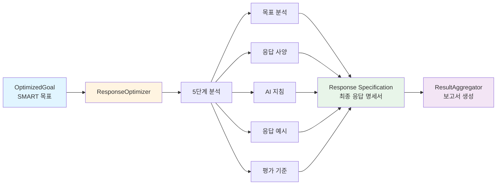
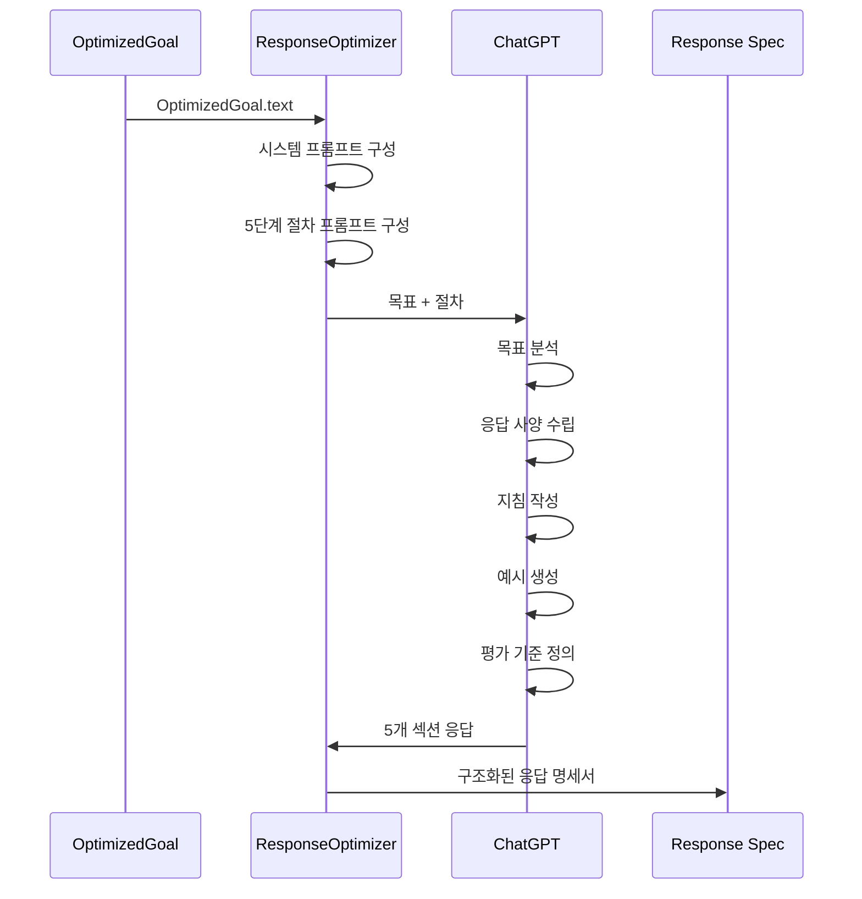
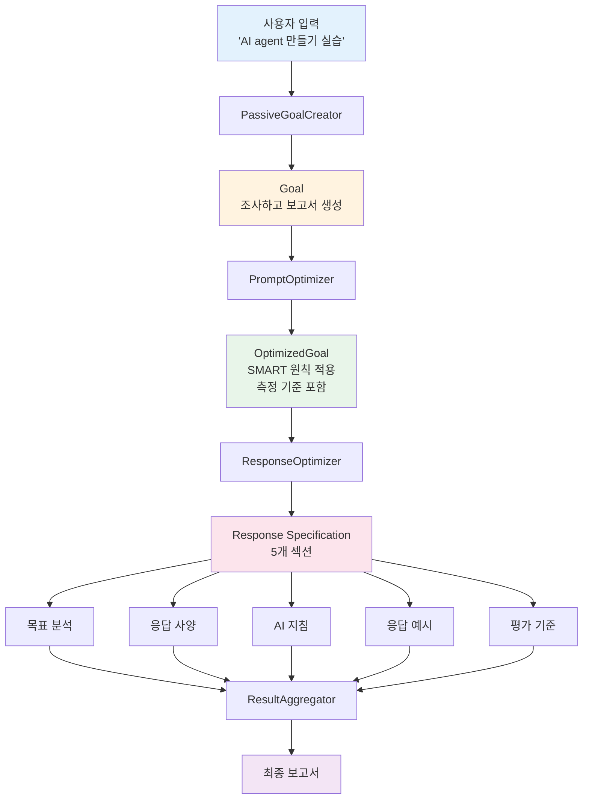
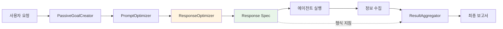

# ResponseOptimizer 상세 플로우 가이드

## 목차
1. [개요](#개요)
2. [목적](#목적)
3. [전체 아키텍처](#전체-아키텍처)
4. [5단계 프로세스](#5단계-프로세스)
5. [구체적 예제](#구체적-예제)
6. [핵심 기능](#핵심-기능)
7. [완전한 파이프라인 예제](#완전한-파이프라인-예제)
8. [에이전트에서의 사용](#에이전트에서의-사용)
9. [코드 참조](#코드-참조)
10. [실행 방법](#실행-방법)

---

## 개요

**ResponseOptimizer는 3단계 목표 설정 프로세스의 최종 단계입니다.**

### ResponseOptimizer란?

ResponseOptimizer는 최적화된 목표를 받아 **최종 응답 형식을 정의**하는 컴포넌트입니다.

- **입력**: PromptOptimizer에서 생성된 OptimizedGoal (SMART 원칙 적용된 목표)
- **처리**: 5단계 분석 프로세스를 통해 응답 사양 수립
- **출력**: 구조화된 응답 명세서 (톤, 구조, 내용 초점, 지침, 예시, 평가 기준)

### 왜 필요한가?

목표가 최적화되어도, **어떤 형식으로 응답해야 하는지**가 명확하지 않으면 일관성 없는 결과가 나옵니다.

ResponseOptimizer는:
- **명확한 응답 형식** 제공
- **일관된 품질** 보장
- **사용자 기대** 충족

> **중요**: AI 에이전트는 이미 조사된 정보만 **정리**할 수 있습니다. 인터넷 접근 권한이 없습니다.

---

## 목적

ResponseOptimizer는 **목표와 최종 보고서 형식 간의 다리** 역할을 합니다.

```
OptimizedGoal → ResponseOptimizer → Response Specification
(무엇을 달성할지)   (어떻게 표현할지)   (구체적 형식 지침)
```

### 핵심 역할

1. **형식 가이드라인 제공**: 톤, 구조, 내용 초점 정의
2. **일관성 보장**: 모든 응답이 동일한 기준 따름
3. **품질 측정**: 평가 기준을 통해 응답 품질 검증

---

## 전체 아키텍처



### 데이터 흐름



---

## 5단계 프로세스

ResponseOptimizer는 다음 5단계 절차를 통해 응답 사양을 수립합니다.

### 1단계: 목표 분석

**목적**: 최적화된 목표의 주요 요소와 의도를 파악합니다.

**수행 내용**:
- 사용자가 정확히 무엇을 원하는지 파악
- 목표의 핵심 요소 식별
- 사용자의 기대 사항 추론

**출력 예시**:
```
목표 분석:
사용자는 AI agent 개발의 체계적 실습 가이드를 원합니다.
단순히 개념 설명이 아니라, 개념부터 실제 구현까지
단계별로 이해할 수 있는 실용적 가이드가 필요합니다.
초보자도 따라할 수 있는 수준의 상세함이 요구됩니다.
```

### 2단계: 응답 사양 수립

**목적**: 목표 달성을 위한 최적의 응답 사양을 고안합니다.

**고려 사항**:
- **톤(Tone)**: 형식적/비형식적, 기술적/일반적
- **구조(Structure)**: 섹션 구성, 순서
- **내용 초점(Content Focus)**: 무엇에 집중할지

**출력 예시**:
```
응답 사양:
- 톤: 초보자 친화적이면서도 전문적인 교육적 톤
- 구조: 개념 설명 → 도구 소개 → 아키텍처 설명 → 실습 예제 순서
- 내용 초점: 이론과 실습의 균형, 코드 예제 중심
- 길이: 각 섹션 최소 200자 이상의 상세 설명
- 시각 자료: 가능하면 다이어그램이나 코드 스니펫 포함
```

### 3단계: AI 에이전트에 대한 지침 작성

**목적**: AI 에이전트가 따라야 할 명확하고 실행 가능한 지침을 작성합니다.

**중요 제약사항**:
> AI 에이전트는 **이미 조사된 결과만 정리**할 수 있습니다.
> **인터넷 접근 불가**, 새로운 조사 불가

**출력 예시**:
```
AI 에이전트에 대한 지침:
1. 각 섹션에 명확한 제목을 붙이세요
2. 전문 용어가 처음 등장할 때는 반드시 설명을 추가하세요
3. 코드 예제는 주석을 포함하여 이해하기 쉽게 작성하세요
4. 각 주장이나 정보에는 출처 URL을 명시하세요
5. 실습 가능한 예제를 최소 3개 이상 포함하세요
6. 각 섹션은 독립적으로 이해 가능하도록 작성하세요
7. 단계별로 난이도가 점진적으로 증가하도록 배치하세요
8. 일반적인 오류 사례와 해결 방법을 포함하세요
```

### 4단계: 응답 예시 제공

**목적**: 목표에 맞는 응답의 구체적 예시를 제공합니다.

**출력 예시**:
```
응답 예시:

# AI Agent 만들기 실습 가이드

## 1. AI Agent란?

AI Agent는 환경을 인식하고, 의사결정을 내리며,
행동을 수행하는 자율적인 소프트웨어 시스템입니다.

**핵심 특징**:
- 자율성(Autonomy): 인간 개입 없이 작동
- 반응성(Reactivity): 환경 변화에 대응
- 사전 행동성(Proactivity): 목표 지향적 행동
- 사회성(Social Ability): 다른 에이전트와 상호작용

[출처: https://example.com/ai-agent-definition]

## 2. 필수 도구 소개

### 2.1 LangChain
LangChain은 LLM 기반 애플리케이션 개발 프레임워크입니다.

**설치 방법**:
```python
pip install langchain langchain-openai
```

### 2.2 OpenAI API
...

## 3. 기본 아키텍처
...
```

### 5단계: 평가 기준 설정

**목적**: 응답의 효과를 측정하기 위한 기준을 정의합니다.

**출력 예시**:
```
평가 기준:
1. 완성도:
   - 개념, 도구, 아키텍처, 실습 4개 섹션 모두 포함
   - 각 섹션 최소 200자 이상

2. 정확성:
   - 최소 3개 이상의 신뢰할 수 있는 출처 인용
   - 모든 정보에 출처 URL 명시

3. 실용성:
   - 실행 가능한 코드 예제 3개 이상 포함
   - 각 예제에 설명 주석 포함

4. 명확성:
   - 전문 용어 첫 등장 시 정의 제공
   - 초보자가 이해 가능한 수준의 설명

5. 구조:
   - 논리적 순서 (기초 → 심화)
   - 각 섹션 독립적 이해 가능
```

---

## 구체적 예제

### 입력: OptimizedGoal (from PromptOptimizer)

```python
OptimizedGoal(
    description="AI agent의 개념, 주요 프레임워크(LangChain, LlamaIndex 등),
                 기본 아키텍처 패턴, 그리고 간단한 실습 예제를 포함한
                 실용적 가이드를 작성하기 위해 인터넷을 조사하고
                 초보자가 따라할 수 있는 단계별 보고서를 생성한다.",
    metrics="가이드는 다음을 포함해야 한다:
            1) AI agent 개념 정의 1개 이상
            2) 프레임워크 비교 2개 이상
            3) 아키텍처 패턴 설명 1개 이상
            4) 실행 가능한 코드 예제 3개 이상
            5) 각 주제당 최소 200자 이상의 설명
            6) 신뢰할 수 있는 출처 URL 3개 이상"
)
```

### 처리: ResponseOptimizer 실행

```python
# main.py 코드 (라인 120-124)
response_optimizer = ResponseOptimizer(llm=llm)
optimized_response: str = response_optimizer.run(
    query=optimized_goal.text
)
print(f"{optimized_response}")
```

### 시스템 프롬프트 (라인 28-31)

```python
system_prompt = """
당신은 AI 에이전트 시스템의 응답 최적화 전문가입니다.
주어진 목표에 대해 에이전트가 목표에 맞는 응답을 반환하기 위한
응답 사양을 수립해 주세요.
"""
```

### Human 프롬프트: 5단계 절차 (라인 37-68)

```python
human_prompt = """
다음 절차에 따라 응답 최적화 프롬프트를 작성해 주세요:

1. 목표 분석:
제시된 목표를 분석하고 주요 요소와 의도를 파악해 주세요.

2. 응답 사양 수립:
목표 달성을 위한 최적의 응답 사양을 고안해 주세요.
톤, 구조, 내용의 초점 등을 고려해 주세요.

3. 구체적인 지침 작성:
사전에 수집된 정보에서 사용자의 기대에 부합하는 응답을 위해 필요한,
AI 에이전트에 대한 명확하고 실행 가능한 지침을 작성해 주세요.
귀하의 지침으로 AI 에이전트가 수행할 수 있는 것은
이미 조사된 결과를 정리하는 것뿐입니다.
인터넷에 접근할 수 없습니다.

4. 예시 제공:
가능하다면, 목표에 맞는 응답의 예시를 하나 이상 포함해 주세요.

5. 평가 기준 설정:
응답의 효과를 측정하기 위한 기준을 정의해 주세요.

다음 구조로 응답 최적화 프롬프트를 출력해 주세요:

목표 분석:
[여기에 목표 분석 결과를 기입]

응답 사양:
[여기에 수립된 응답 사양을 기입]

AI 에이전트에 대한 지침:
[여기에 AI 에이전트에 대한 구체적인 지침을 기입]

응답 예시:
[여기에 응답 예시를 기입]

평가 기준:
[여기에 평가 기준을 기입]

그럼, 다음 목표에 대한 응답 최적화 프롬프트를 작성해 주세요:
{query}
"""
```

### 출력: Response Specification

```
목표 분석:
사용자는 AI agent 개발에 대한 체계적이고 실용적인 실습 가이드를 원합니다.
단순한 이론 설명이 아니라, 개념부터 실제 구현까지 단계별로 이해할 수 있는
초보자 친화적인 가이드가 필요합니다. 특히 주요 프레임워크 비교, 아키텍처 패턴,
그리고 실행 가능한 코드 예제를 통한 실습이 핵심 요구사항입니다.

응답 사양:
- 톤: 초보자 친화적이면서도 기술적으로 정확한 교육적 톤.
      전문 용어는 사용하되 반드시 설명 추가.
- 구조: 4단계 구성
  1) 개념 정의 및 소개
  2) 도구 및 프레임워크 비교
  3) 아키텍처 패턴 설명
  4) 실습 예제 및 코드
- 내용 초점: 이론(30%)과 실습(70%)의 균형.
              코드 중심으로 작성하되 각 코드의 의미 명확히 설명.
- 길이: 각 주요 섹션 최소 200자 이상 상세 설명
- 출처: 모든 정보에 신뢰할 수 있는 출처 URL 명시

AI 에이전트에 대한 지침:
1. 각 주요 섹션(개념, 도구, 아키텍처, 실습)에 명확한 제목 부여
2. 전문 용어(Agent, LLM, Chain 등)가 처음 등장 시 괄호 안에 간단한 정의 추가
3. 코드 예제는 반드시 설명 주석을 포함하여 각 줄의 의미를 이해할 수 있도록 작성
4. 각 주장이나 정보에는 [출처: URL] 형식으로 출처 명시
5. 프레임워크 비교 시 표 형식 사용하여 한눈에 비교 가능하도록 구성
6. 코드 예제는 최소 3개 이상 포함하며, 난이도 순으로 배치
7. 각 코드 예제 후에는 "실행 결과" 섹션을 추가하여 기대 출력 설명
8. 일반적인 오류 사례와 해결 방법을 "주의사항" 박스로 포함
9. 마지막에 "다음 단계" 섹션을 추가하여 학습 경로 제시
10. 마크다운 형식으로 작성하며, 코드는 ```python 블록 사용

응답 예시:

# AI Agent 만들기 실습 가이드

## 1. AI Agent란?

AI Agent(에이전트)는 환경을 인식하고, 의사결정을 내리며,
목표 달성을 위해 자율적으로 행동하는 소프트웨어 시스템입니다.

**핵심 특징**:
- **자율성(Autonomy)**: 인간의 직접적 개입 없이 독립적으로 작동
- **반응성(Reactivity)**: 환경의 변화를 감지하고 적절히 대응
- **사전 행동성(Proactivity)**: 목표를 달성하기 위해 능동적으로 행동
- **사회성(Social Ability)**: 다른 에이전트나 사용자와 상호작용

[출처: https://www.example.com/ai-agent-basics]

## 2. 주요 프레임워크 비교

| 프레임워크 | 특징 | 주요 용도 | 장점 |
|---------|------|---------|------|
| LangChain | LLM 체이닝 | 복잡한 워크플로우 | 풍부한 생태계 |
| LlamaIndex | 데이터 인덱싱 | RAG 구현 | 효율적 검색 |

[출처: https://www.example.com/framework-comparison]

## 3. 기본 아키텍처 패턴

### ReAct 패턴
ReAct(Reasoning + Acting)는 추론과 행동을 반복하는 패턴입니다.

```
사용자 질문 → 추론 → 도구 선택 → 실행 → 관찰 → 추론 → 최종 답변
```

[출처: https://www.example.com/react-pattern]

## 4. 실습 예제

### 예제 1: 기본 Agent 생성

```python
from langchain.agents import initialize_agent
from langchain.llms import OpenAI

# OpenAI LLM 초기화
llm = OpenAI(temperature=0)

# Agent 초기화 - 도구와 LLM 연결
agent = initialize_agent(
    tools=[],  # 도구 리스트
    llm=llm,   # 사용할 LLM
    agent="zero-shot-react-description"  # Agent 타입
)

# Agent 실행
response = agent.run("Hello, world!")
print(response)
```

**실행 결과**: Agent가 입력을 처리하고 적절한 응답을 반환합니다.

**주의사항**:
- OpenAI API 키가 환경변수에 설정되어 있어야 합니다
- `OPENAI_API_KEY=your_key_here`

### 예제 2: 도구를 사용하는 Agent

```python
from langchain.agents import Tool
from langchain.tools import DuckDuckGoSearchRun

# 검색 도구 생성
search = DuckDuckGoSearchRun()
tools = [
    Tool(
        name="Search",  # 도구 이름
        func=search.run,  # 실행할 함수
        description="인터넷 검색에 유용합니다"  # 도구 설명
    )
]

# 도구를 가진 Agent 초기화
agent = initialize_agent(
    tools=tools,
    llm=llm,
    agent="zero-shot-react-description"
)

# 검색이 필요한 질문 실행
result = agent.run("파이썬의 최신 버전은?")
print(result)
```

**실행 결과**: Agent가 검색 도구를 사용하여 최신 정보를 찾아 답변합니다.

[출처: https://www.example.com/langchain-tools]

### 예제 3: 커스텀 도구 생성

```python
from langchain.agents import tool

@tool
def calculate_age(birth_year: int) -> int:
    """주어진 출생연도로 나이를 계산합니다."""
    from datetime import datetime
    current_year = datetime.now().year
    return current_year - birth_year

# 커스텀 도구를 Agent에 추가
tools = [calculate_age]
agent = initialize_agent(
    tools=tools,
    llm=llm,
    agent="zero-shot-react-description"
)

# 커스텀 도구를 사용하는 질문
result = agent.run("1990년생은 몇 살인가요?")
print(result)
```

**실행 결과**: Agent가 calculate_age 도구를 사용하여 나이를 계산하고 답변합니다.

[출처: https://www.example.com/custom-tools]

## 5. 다음 단계

이 가이드를 완료한 후 다음 주제를 학습하세요:
1. **고급 Agent 패턴**: Plan-and-Execute, Self-Ask
2. **메모리 관리**: 대화 히스토리 유지
3. **멀티 Agent 시스템**: 여러 Agent 협업

평가 기준:
1. **완성도** (25점):
   - 4개 주요 섹션(개념, 도구, 아키텍처, 실습) 모두 포함: 10점
   - 각 섹션 최소 200자 이상: 10점
   - 다음 단계 학습 경로 제시: 5점

2. **정확성** (25점):
   - 신뢰할 수 있는 출처 3개 이상 인용: 10점
   - 모든 주요 정보에 출처 URL 명시: 10점
   - 기술적 정확성 (용어 정의, 코드 문법): 5점

3. **실용성** (30점):
   - 실행 가능한 코드 예제 3개 이상: 15점
   - 각 코드에 설명 주석 포함: 10점
   - 실행 결과 및 주의사항 명시: 5점

4. **명확성** (15점):
   - 전문 용어 첫 등장 시 정의 제공: 5점
   - 초보자가 이해 가능한 설명: 5점
   - 논리적 흐름과 구조: 5점

5. **형식** (5점):
   - 마크다운 형식 준수: 3점
   - 코드 블록 올바른 사용: 2점

**합격 기준**: 총 70점 이상 (100점 만점)
```

---

## 핵심 기능

### 1. 명확한 형식 가이드라인

ResponseOptimizer는 다음을 명확히 정의합니다:

- **톤(Tone)**: 형식적, 교육적, 전문적, 친근한 등
- **구조(Structure)**: 섹션 구성, 순서, 계층
- **내용 초점(Focus)**: 무엇을 강조할지, 얼마나 상세할지

### 2. 일관성 보장

모든 응답이 동일한 사양을 따르므로:
- 품질의 일관성 유지
- 사용자 기대 충족
- 평가 가능한 결과 생성

### 3. AI 에이전트의 제약사항 명시

**중요**: AI 에이전트는 **정리만** 가능합니다.

```python
# main.py 라인 46-47
"귀하의 지침으로 AI 에이전트가 수행할 수 있는 것은
이미 조사된 결과를 정리하는 것뿐입니다.
인터넷에 접근할 수 없습니다."
```

이는 다음을 의미합니다:
- 새로운 조사 불가
- 인터넷 검색 불가
- 이미 수집된 정보만 재구성

### 4. 평가 가능성

평가 기준을 명확히 정의하여:
- 응답 품질 측정 가능
- 목표 달성 여부 확인 가능
- 개선 방향 파악 가능

---

## 완전한 파이프라인 예제

3개 컴포넌트가 어떻게 연결되는지 완전한 예제를 통해 살펴봅니다.

### Step 0: 사용자 입력

```
"AI agent 만들기 실습"
```

### Step 1: PassiveGoalCreator

**입력**: `"AI agent 만들기 실습"`

**처리**:
```python
# passive_goal_creator/main.py
class PassiveGoalCreator:
    def run(self, query: str) -> Goal:
        prompt = ChatPromptTemplate.from_template(
            "사용자 입력을 분석하여 명확하고 실행 가능한 목표를 생성해 주세요.\n"
            "요건:\n"
            "1. 목표는 구체적이고 명확해야 하며, 실행 가능한 수준으로 상세화되어야 합니다.\n"
            "2. 당신이 실행할 수 있는 행동은 다음과 같은 행동뿐입니다.\n"
            "   - 인터넷을 이용하여 목표 달성을 위한 조사를 수행합니다.\n"
            "   - 사용자를 위한 보고서를 생성합니다.\n"
            "3. 절대 2.에 명시된 행동 외의 다른 행동을 취해서는 안 됩니다.\n"
            "사용자 입력: {query}"
        )
        chain = prompt | self.llm.with_structured_output(Goal)
        return chain.invoke({"query": query})
```

**출력**:
```python
Goal(
    description="AI agent의 개념, 주요 프레임워크, 기본 아키텍처,
                 실습 예제를 포함한 가이드를 작성하기 위해
                 인터넷을 조사하고 보고서를 생성한다."
)
```

**텍스트 표현**:
```
"AI agent의 개념, 주요 프레임워크, 기본 아키텍처,
실습 예제를 포함한 가이드를 작성하기 위해
인터넷을 조사하고 보고서를 생성한다."
```

---

### Step 2: PromptOptimizer

**입력**: `goal.text` (위의 출력)

**처리**:
```python
# prompt_optimizer/main.py
class PromptOptimizer:
    def run(self, query: str) -> OptimizedGoal:
        prompt = ChatPromptTemplate.from_template(
            "당신은 목표 설정 전문가입니다. "
            "아래의 목표를 SMART 원칙에 기반하여 최적화해 주세요.\n\n"
            "원래 목표:\n{query}\n\n"
            "지시 사항:\n"
            "1. 원래 목표를 분석하고, 부족한 요소나 개선점을 파악해 주세요.\n"
            "2. 당신이 실행할 수 있는 행동은 다음과 같습니다.\n"
            "   - 인터넷을 이용하여 목표 달성을 위한 조사를 수행한다.\n"
            "   - 사용자를 위한 보고서를 생성한다.\n"
            "3. SMART 원칙의 각 요소를 고려하면서 "
            "   목표를 구체적이고 상세하게 기술해 주세요.\n"
            "   - 절대 추상적인 표현을 포함해서는 안 됩니다.\n"
            "   - 반드시 모든 단어가 실행 가능하고 구체적인지 확인해 주세요.\n"
            "4. 목표의 달성도를 측정하는 방법을 구체적이고 상세하게 기술해 주세요.\n"
            "5. 원래 목표에서 기한이 지정되지 않은 경우에는 "
            "   기한을 고려할 필요가 없습니다.\n"
            "6. 주의: 절대로 2번 이외의 행동을 취해서는 안 됩니다."
        )
        chain = prompt | self.llm.with_structured_output(OptimizedGoal)
        return chain.invoke({"query": query})
```

**출력**:
```python
OptimizedGoal(
    description="AI agent의 개념(정의, 특징),
                 주요 프레임워크(LangChain, LlamaIndex 등 최소 2개 비교),
                 기본 아키텍처 패턴(ReAct 등),
                 그리고 간단한 실습 예제(코드 포함)를 포함한
                 실용적 가이드를 작성하기 위해 인터넷을 조사하고
                 초보자가 따라할 수 있는 단계별 보고서를 생성한다.",
    metrics="가이드는 다음을 포함해야 한다:
            1) AI agent 개념 정의 1개 이상
            2) 프레임워크 비교 2개 이상
            3) 아키텍처 패턴 설명 1개 이상
            4) 실행 가능한 코드 예제 3개 이상
            5) 각 주제당 최소 200자 이상의 설명
            6) 신뢰할 수 있는 출처 URL 3개 이상"
)
```

**텍스트 표현**:
```
"AI agent의 개념(정의, 특징),
주요 프레임워크(LangChain, LlamaIndex 등 최소 2개 비교),
기본 아키텍처 패턴(ReAct 등),
그리고 간단한 실습 예제(코드 포함)를 포함한
실용적 가이드를 작성하기 위해 인터넷을 조사하고
초보자가 따라할 수 있는 단계별 보고서를 생성한다.
(측정 기준: 가이드는 다음을 포함해야 한다:
1) AI agent 개념 정의 1개 이상
2) 프레임워크 비교 2개 이상
3) 아키텍처 패턴 설명 1개 이상
4) 실행 가능한 코드 예제 3개 이상
5) 각 주제당 최소 200자 이상의 설명
6) 신뢰할 수 있는 출처 URL 3개 이상)"
```

---

### Step 3: ResponseOptimizer (현재 컴포넌트)

**입력**: `optimized_goal.text` (위의 출력)

**처리**:
```python
# response_optimizer/main.py
class ResponseOptimizer:
    def run(self, query: str) -> str:
        prompt = ChatPromptTemplate.from_messages([
            ("system",
             "당신은 AI 에이전트 시스템의 응답 최적화 전문가입니다. "
             "주어진 목표에 대해 에이전트가 목표에 맞는 응답을 반환하기 위한 "
             "응답 사양을 수립해 주세요."),
            ("human",
             "다음 절차에 따라 응답 최적화 프롬프트를 작성해 주세요:\n\n"
             "1. 목표 분석:\n"
             "제시된 목표를 분석하고 주요 요소와 의도를 파악해 주세요.\n\n"
             "2. 응답 사양 수립:\n"
             "목표 달성을 위한 최적의 응답 사양을 고안해 주세요. "
             "톤, 구조, 내용의 초점 등을 고려해 주세요.\n\n"
             "3. 구체적인 지침 작성:\n"
             "사전에 수집된 정보에서 사용자의 기대에 부합하는 응답을 위해 필요한, "
             "AI 에이전트에 대한 명확하고 실행 가능한 지침을 작성해 주세요. "
             "귀하의 지침으로 AI 에이전트가 수행할 수 있는 것은 "
             "이미 조사된 결과를 정리하는 것뿐입니다. "
             "인터넷에 접근할 수 없습니다.\n\n"
             "4. 예시 제공:\n"
             "가능하다면, 목표에 맞는 응답의 예시를 하나 이상 포함해 주세요.\n\n"
             "5. 평가 기준 설정:\n"
             "응답의 효과를 측정하기 위한 기준을 정의해 주세요.\n\n"
             "다음 구조로 응답 최적화 프롬프트를 출력해 주세요:\n\n"
             "목표 분석:\n[여기에 목표 분석 결과를 기입]\n\n"
             "응답 사양:\n[여기에 수립된 응답 사양을 기입]\n\n"
             "AI 에이전트에 대한 지침:\n[여기에 AI 에이전트에 대한 구체적인 지침을 기입]\n\n"
             "응답 예시:\n[여기에 응답 예시를 기입]\n\n"
             "평가 기준:\n[여기에 평가 기준을 기입]\n\n"
             "그럼, 다음 목표에 대한 응답 최적화 프롬프트를 작성해 주세요:\n{query}")
        ])
        chain = prompt | self.llm | StrOutputParser()
        return chain.invoke({"query": query})
```

**출력**: (위의 "구체적 예제" 섹션의 출력 참조)

---

### 전체 변환 시각화



### 데이터 변환 추적

| 단계 | 컴포넌트 | 입력 | 출력 | 주요 추가 내용 |
|-----|---------|-----|------|--------------|
| 0 | User | - | "AI agent 만들기 실습" | 사용자 요청 |
| 1 | PassiveGoalCreator | 사용자 입력 | Goal 객체 | 실행 가능한 목표 |
| 2 | PromptOptimizer | Goal.text | OptimizedGoal 객체 | SMART 원칙, 측정 기준 |
| 3 | ResponseOptimizer | OptimizedGoal.text | Response Spec (str) | 5개 섹션 사양 |
| 4 | ResultAggregator | Response Spec + 조사 결과 | 최종 보고서 | 형식화된 보고서 |

---

## 에이전트에서의 사용

ResponseOptimizer는 **모든 에이전트 패턴의 1단계(목표 설정)**에서 사용됩니다.

### 사용 시나리오



### ResultAggregator와의 관계

**ResponseOptimizer** 출력 → **ResultAggregator** 입력

```python
# 에이전트 패턴에서의 사용 예시
class Agent:
    def run(self, user_query: str):
        # Step 1: 목표 설정
        goal = passive_goal_creator.run(user_query)
        optimized_goal = prompt_optimizer.run(goal.text)
        response_spec = response_optimizer.run(optimized_goal.text)

        # Step 2: 정보 수집
        collected_info = self.collect_information(optimized_goal)

        # Step 3: 결과 집계 (response_spec 사용)
        final_report = result_aggregator.run(
            goal=optimized_goal.text,
            response_spec=response_spec,  # 여기서 사용!
            collected_info=collected_info
        )

        return final_report
```

### ResultAggregator가 Response Spec를 사용하는 방법

ResultAggregator는 Response Specification의 각 섹션을 다음과 같이 활용합니다:

1. **목표 분석** → 보고서의 방향성 설정
2. **응답 사양** → 톤, 구조, 길이 결정
3. **AI 지침** → 보고서 작성 시 따라야 할 규칙
4. **응답 예시** → 형식 참고
5. **평가 기준** → 품질 자체 검증

---

## 코드 참조

### ResponseOptimizer 클래스

**파일**: `/Users/iyeongbeom/YB/Repository/study/llm-agent/chapter12/response_optimizer/main.py`

#### 클래스 정의 (라인 15-76)

```python
class ResponseOptimizer:
    def __init__(self, llm: ChatOpenAI):
        self.llm = llm

    def run(self, query: str) -> str:
        prompt = ChatPromptTemplate.from_messages([
            ("system",
             "당신은 AI 에이전트 시스템의 응답 최적화 전문가입니다. "
             "주어진 목표에 대해 에이전트가 목표에 맞는 응답을 반환하기 위한 "
             "응답 사양을 수립해 주세요."),
            ("human", "..." ) # 5단계 절차
        ])
        chain = prompt | self.llm | StrOutputParser()
        return chain.invoke({"query": query})
```

#### 5단계 프롬프트 (라인 37-68)

```python
("human",
 "다음 절차에 따라 응답 최적화 프롬프트를 작성해 주세요:\n\n"
 "1. 목표 분석:\n"
 "제시된 목표를 분석하고 주요 요소와 의도를 파악해 주세요.\n\n"
 "2. 응답 사양 수립:\n"
 "목표 달성을 위한 최적의 응답 사양을 고안해 주세요. "
 "톤, 구조, 내용의 초점 등을 고려해 주세요.\n\n"
 "3. 구체적인 지침 작성:\n"
 "사전에 수집된 정보에서 사용자의 기대에 부합하는 응답을 위해 필요한, "
 "AI 에이전트에 대한 명확하고 실행 가능한 지침을 작성해 주세요. "
 "귀하의 지침으로 AI 에이전트가 수행할 수 있는 것은 "
 "이미 조사된 결과를 정리하는 것뿐입니다. "
 "인터넷에 접근할 수 없습니다.\n\n"
 "4. 예시 제공:\n"
 "가능하다면, 목표에 맞는 응답의 예시를 하나 이상 포함해 주세요.\n\n"
 "5. 평가 기준 설정:\n"
 "응답의 효과를 측정하기 위한 기준을 정의해 주세요.\n\n"
 "다음 구조로 응답 최적화 프롬프트를 출력해 주세요:\n\n"
 "목표 분석:\n[여기에 목표 분석 결과를 기입]\n\n"
 "응답 사양:\n[여기에 수립된 응답 사양을 기입]\n\n"
 "AI 에이전트에 대한 지침:\n[여기에 AI 에이전트에 대한 구체적인 지침을 기입]\n\n"
 "응답 예시:\n[여기에 응답 예시를 기입]\n\n"
 "평가 기준:\n[여기에 평가 기준을 기입]\n\n"
 "그럼, 다음 목표에 대한 응답 최적화 프롬프트를 작성해 주세요:\n{query}")
```

#### System/Human 메시지 구조 (라인 25-71)

```python
prompt = ChatPromptTemplate.from_messages([
    ("system", "당신은 AI 에이전트 시스템의 응답 최적화 전문가입니다. ..."),
    ("human", "다음 절차에 따라 응답 최적화 프롬프트를 작성해 주세요: ...")
])
```

#### Main 함수 (라인 81-128)

```python
def main():
    # 1단계: 기본 목표 생성
    passive_goal_creator = PassiveGoalCreator(llm=llm)
    goal: Goal = passive_goal_creator.run(query=args.task)

    # 2단계: 목표 최적화
    prompt_optimizer = PromptOptimizer(llm=llm)
    optimized_goal: OptimizedGoal = prompt_optimizer.run(query=goal.text)

    # 3단계: 응답 사양 수립
    response_optimizer = ResponseOptimizer(llm=llm)
    optimized_response: str = response_optimizer.run(query=optimized_goal.text)

    print(f"{optimized_response}")
```

### 관련 컴포넌트

#### PassiveGoalCreator

**파일**: `/Users/iyeongbeom/YB/Repository/study/llm-agent/chapter12/passive_goal_creator/main.py`

- **Goal 클래스** (라인 10-20)
- **PassiveGoalCreator 클래스** (라인 25-58)

#### PromptOptimizer

**파일**: `/Users/iyeongbeom/YB/Repository/study/llm-agent/chapter12/prompt_optimizer/main.py`

- **OptimizedGoal 클래스** (라인 14-27)
- **PromptOptimizer 클래스** (라인 32-76)

---

## 실행 방법

### 전체 파이프라인 실행

```bash
cd /Users/iyeongbeom/YB/Repository/study/llm-agent/chapter12/response_optimizer

python main.py --task "AI agent 만들기 실습"
```

### 출력 구조

```
목표 분석:
[목표의 핵심 요소와 사용자 의도 분석]

응답 사양:
[톤, 구조, 내용 초점 정의]

AI 에이전트에 대한 지침:
[구체적인 작성 지침 10개]

응답 예시:
[실제 보고서 형태의 예시]

평가 기준:
[5개 카테고리별 측정 기준]
```

### 환경 설정

```bash
# .env 파일에 OpenAI API 키 설정
OPENAI_API_KEY=your_api_key_here
```

### 의존성 설치

```bash
pip install langchain langchain-openai pydantic
```

---

## 요약

### ResponseOptimizer의 역할

1. **OptimizedGoal 받기**: SMART 원칙이 적용된 목표
2. **5단계 분석**: 목표 분석 → 사양 수립 → 지침 작성 → 예시 → 평가 기준
3. **Response Spec 생성**: 구조화된 응답 명세서
4. **ResultAggregator에 전달**: 최종 보고서 작성 시 사용

### 3단계 파이프라인

```
PassiveGoalCreator → PromptOptimizer → ResponseOptimizer
(기본 목표 생성)    (SMART 최적화)   (응답 형식 정의)
```

### 핵심 특징

- **명확한 형식 지침**: 톤, 구조, 내용 정의
- **일관성 보장**: 모든 응답이 동일 기준
- **제약사항 명시**: AI는 정리만 가능 (조사 불가)
- **평가 가능성**: 측정 가능한 품질 기준

### 실제 사용

모든 에이전트 패턴의 **Step 1 (목표 설정)** 에서 사용되며,
**ResultAggregator**가 이 명세서를 따라 최종 보고서를 작성합니다.

---

## 다음 단계

ResponseOptimizer를 이해했다면:

1. **실제 실행**: 다양한 태스크로 테스트
2. **출력 분석**: 5개 섹션이 어떻게 생성되는지 관찰
3. **에이전트 패턴 학습**: ResponseOptimizer가 실제로 어떻게 사용되는지 확인
4. **ResultAggregator 이해**: 응답 명세서가 어떻게 활용되는지 학습

---

**작성일**: 2025-12-04
**문서 버전**: 1.0
**대상**: Chapter 12 - Agent Design Patterns
