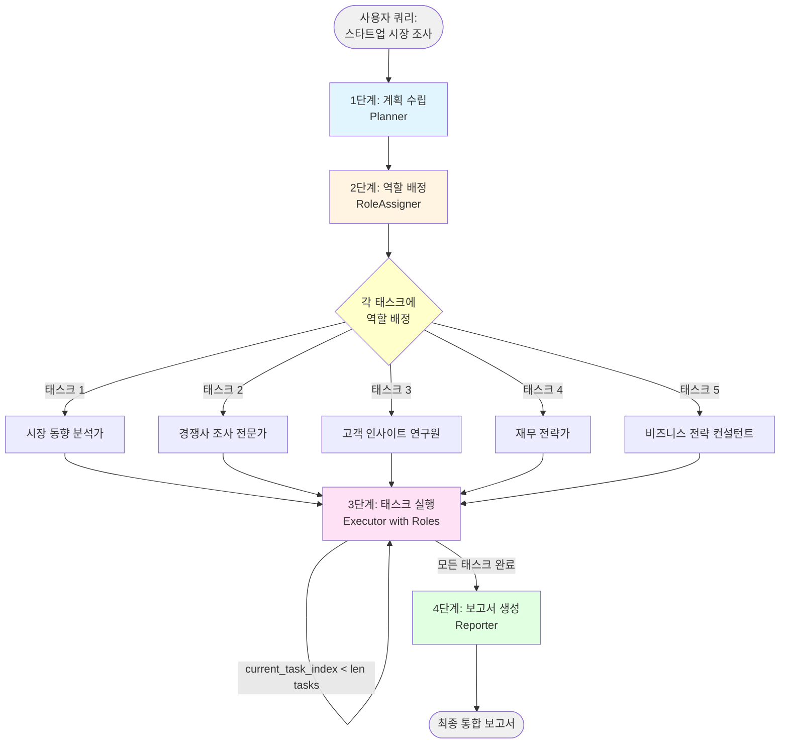

# Role-Based Cooperation 상세 흐름 가이드

## 개요

Role-Based Cooperation은 복잡한 목표를 태스크로 분해한 후, **각 태스크에 전문적인 역할(Role/Persona)을 배정**하여 실행하는 에이전트 디자인 패턴입니다.

### 핵심 특징
- 역할 기반 실행: 각 태스크마다 독특한 페르소나 배정
- 전문성 시뮬레이션: 역할별 시스템 프롬프트로 특화된 관점 제공
- 다각도 분석: 서로 다른 역할이 같은 주제를 다른 시각으로 접근
- 순차적 처리: Single Path처럼 태스크를 순서대로 실행

### 전체 프로세스 요약

```
사용자 입력 (스타트업 시장 조사)
    ↓
[1단계] 계획 수립 (Planner)
    └─ QueryDecomposer로 태스크 5개 생성
    ↓
[2단계] 역할 배정 (RoleAssigner) ★핵심★
    ├─ 시장 동향 분석가
    ├─ 경쟁사 조사 전문가
    ├─ 고객 인사이트 연구원
    ├─ 재무 전략가
    └─ 비즈니스 전략 컨설턴트
    ↓
[3단계] 태스크 실행 (Executor) - 반복
    ├─ 태스크 1 with 시장 동향 분석가 → 결과 1
    ├─ 태스크 2 with 경쟁사 조사 전문가 → 결과 2
    ├─ 태스크 3 with 고객 인사이트 연구원 → 결과 3
    ├─ 태스크 4 with 재무 전략가 → 결과 4
    └─ 태스크 5 with 비즈니스 전략 컨설턴트 → 결과 5
    ↓
[4단계] 보고서 생성 (Reporter)
    └─ 다양한 관점의 결과를 통합
    ↓
최종 보고서
```

---

## 워크플로우 다이어그램



**코드 참조:** [RoleBasedCooperation._create_graph](main.py#L214-L234)

---

## 역할 기반 협력 vs 단순 계획 생성

| 비교 항목 | Single Path Plan | Role-Based Cooperation |
|----------|-----------------|------------------------|
| 태스크 분해 | O | O |
| 역할 배정 | X | **O (핵심!)** |
| 시스템 프롬프트 | 동일 (일반적) | **역할별 맞춤** |
| 관점 다양성 | 단일 관점 | **다중 페르소나 관점** |
| 전문성 시뮬레이션 | X | **O** |
| 실행 방식 | 순차적 | 순차적 |
| 결과의 특징 | 일관적 | 다각도 분석 |
| 사용 시기 | 단순 조사 | 복합적 분석 필요 |

---

## 데이터 모델

### Role 클래스

**코드 참조:** [Role](main.py#L33-L39)

```python
class Role(BaseModel):
    name: str                    # 역할 이름 (예: "시장 동향 분석가")
    description: str             # 역할에 대한 상세 설명
    key_skills: list[str]        # 주요 스킬 3가지
```

**특징:**
- LLM이 창의적으로 역할 이름 생성
- 각 역할은 태스크에 최적화된 페르소나
- key_skills는 역할의 전문성을 구체화

**예시:**
```python
Role(
    name="시장 동향 분석가",
    description="글로벌 시장 트렌드를 파악하고 데이터 기반으로 성장 기회를 발견하는 전문가",
    key_skills=[
        "시장 데이터 분석 및 인사이트 도출",
        "산업 트렌드 예측 및 기회 발견",
        "정량적/정성적 시장 조사 방법론"
    ]
)
```

### Task 클래스

**코드 참조:** [Task](main.py#L43-L47)

```python
class Task(BaseModel):
    description: str             # 태스크 설명
    role: Role                   # 이 태스크에 배정된 역할
```

**변화:**
- Single Path의 Task는 단순 문자열
- Role-Based의 Task는 역할 정보 포함

### TasksWithRoles 클래스

**코드 참조:** [TasksWithRoles](main.py#L52-L54)

```python
class TasksWithRoles(BaseModel):
    tasks: list[Task]            # 역할이 배정된 태스크 목록
```

**역할:**
- LLM의 structured output 형식 정의
- 한 번의 LLM 호출로 모든 태스크에 역할 배정

### AgentState 클래스

**코드 참조:** [AgentState](main.py#L58-L73)

```python
class AgentState(BaseModel):
    query: str                   # 사용자 쿼리
    tasks: list[Task]            # 역할이 배정된 태스크 리스트
    current_task_index: int      # 현재 실행 중인 태스크 인덱스
    results: Annotated[list[str], operator.add]  # 각 태스크 결과 (누적)
    final_report: str            # 최종 보고서
```

---

## 구체적인 예시로 보는 단계별 흐름

### 초기 입력

**사용자 쿼리:**
```
"스타트업 시장 조사 및 전략 수립"
```

**초기 State:** ([AgentState](main.py#L58-L73))
```python
AgentState(
    query="스타트업 시장 조사 및 전략 수립",
    tasks=[],
    current_task_index=0,
    results=[],
    final_report=""
)
```

---

## 1단계: 계획 수립 (Planning)

**코드 참조:** [_plan_tasks](main.py#L236-L242), [Planner.run](main.py#L80-L85)

### Planner 실행

**입력:** 원본 쿼리
```
"스타트업 시장 조사 및 전략 수립"
```

**처리:**
- [QueryDecomposer](main.py#L78)를 사용하여 태스크 분해
- Single Path Plan Generation의 QueryDecomposer 재사용
- 3~5개의 실행 가능한 태스크로 분해

**출력:** Task 리스트 (역할은 아직 미배정)
```python
[
    Task(
        description="국내외 스타트업 시장의 최신 동향과 규모를 조사하고, 주요 성장 분야와 투자 트렌드를 파악한다.",
        role=None  # 아직 배정되지 않음
    ),
    Task(
        description="경쟁 스타트업 5~7개를 선정하여 각 기업의 비즈니스 모델, 강점, 약점, 시장 포지셔닝을 상세히 분석한다.",
        role=None
    ),
    Task(
        description="타겟 고객층을 정의하고, 고객의 니즈, 페인 포인트, 구매 행동 패턴을 조사하여 고객 페르소나를 작성한다.",
        role=None
    ),
    Task(
        description="수익 모델, 초기 투자 비용, 운영 비용, 예상 매출을 포함한 재무 계획을 수립하고 손익분기점을 분석한다.",
        role=None
    ),
    Task(
        description="6개월~1년 단위의 구체적인 실행 로드맵과 마일스톤을 설정하고, 리스크 관리 전략을 수립한다.",
        role=None
    )
]
```

**State 업데이트:** ([main.py:242](main.py#L242))
```python
{
    "tasks": [
        Task(description="국내외 스타트업 시장의 최신 동향과...", role=None),
        Task(description="경쟁 스타트업 5~7개를 선정하여...", role=None),
        Task(description="타겟 고객층을 정의하고...", role=None),
        Task(description="수익 모델, 초기 투자 비용...", role=None),
        Task(description="6개월~1년 단위의 구체적인...", role=None)
    ]
}
```

**특징:**
- 5개의 태스크로 분해 (3~5개 범위 내)
- 각 태스크는 독립적으로 실행 가능
- 아직 역할(Role)은 배정되지 않음

---

## 2단계: 역할 배정 (Role Assignment)

**코드 참조:** [_assign_roles](main.py#L244-L250), [RoleAssigner.run](main.py#L92-L124)

이 단계가 **Role-Based Cooperation의 핵심**입니다. 각 태스크에 창의적이고 전문적인 역할을 배정합니다.

### RoleAssigner 실행

**입력:** 역할이 없는 Task 리스트
```python
[
    "국내외 스타트업 시장의 최신 동향과 규모를 조사하고...",
    "경쟁 스타트업 5~7개를 선정하여...",
    "타겟 고객층을 정의하고...",
    "수익 모델, 초기 투자 비용...",
    "6개월~1년 단위의 구체적인..."
]
```

**LLM 프롬프트:** ([main.py:94-115](main.py#L94-L115))
```
System: 당신은 창의적인 역할 설계 전문가입니다. 주어진 태스크에 대해
독특하고 적절한 역할을 생성하세요.
Human: 태스크:
1. 국내외 스타트업 시장의 최신 동향과 규모를 조사하고, 주요 성장 분야와 투자 트렌드를 파악한다.
2. 경쟁 스타트업 5~7개를 선정하여 각 기업의 비즈니스 모델, 강점, 약점, 시장 포지셔닝을 상세히 분석한다.
3. 타겟 고객층을 정의하고, 고객의 니즈, 페인 포인트, 구매 행동 패턴을 조사하여 고객 페르소나를 작성한다.
4. 수익 모델, 초기 투자 비용, 운영 비용, 예상 매출을 포함한 재무 계획을 수립하고 손익분기점을 분석한다.
5. 6개월~1년 단위의 구체적인 실행 로드맵과 마일스톤을 설정하고, 리스크 관리 전략을 수립한다.

이러한 태스크에 대해 다음 지침에 따라 역할을 배정하세요:
1. 각 태스크에 대해 독창적이고 창의적인 역할을 고안하세요. 기존 직업명이나 일반적인 역할명에 얽매일 필요는 없습니다.
2. 역할명은 해당 태스크의 본질을 반영한 매력적이고 기억에 남는 것으로 지어주세요.
3. 각 역할에 대해, 그 역할이 해당 태스크에 왜 최적인지 상세히 설명하세요.
4. 그 역할이 효과적으로 태스크를 수행하기 위해 필요한 주요 스킬이나 속성을 3가지 들어주세요.

창의성을 발휘하여 태스크의 본질을 포착한 혁신적인 역할을 생성하세요.
```

**처리:** ([main.py:117-119](main.py#L117-L119))
- Structured Output으로 TasksWithRoles 반환
- 한 번의 LLM 호출로 모든 역할 생성
- 각 태스크에 최적화된 페르소나 배정

**OUTPUT: TasksWithRoles** ([TasksWithRoles](main.py#L52-L54))
```python
TasksWithRoles(
    tasks=[
        Task(
            description="국내외 스타트업 시장의 최신 동향과 규모를 조사하고, 주요 성장 분야와 투자 트렌드를 파악한다.",
            role=Role(
                name="시장 생태계 탐험가",
                description="스타트업 시장의 숨겨진 기회를 발굴하고, 데이터 기반으로 성장 가능성을 예측하는 전문가. 글로벌 트렌드와 로컬 인사이트를 연결하여 시장의 맥박을 읽어냅니다.",
                key_skills=[
                    "거시적 시장 데이터 분석 및 마이크로 트렌드 발견",
                    "투자 패턴 분석을 통한 유망 분야 예측",
                    "정성적/정량적 시장 조사 방법론 통합 활용"
                ]
            )
        ),
        Task(
            description="경쟁 스타트업 5~7개를 선정하여 각 기업의 비즈니스 모델, 강점, 약점, 시장 포지셔닝을 상세히 분석한다.",
            role=Role(
                name="경쟁 인텔리전스 아키텍트",
                description="경쟁사의 전략과 움직임을 심층 분석하여 차별화 포인트를 찾아내는 전문가. 각 기업의 DNA를 파악하고 시장 내 포지셔닝 맵을 그려냅니다.",
                key_skills=[
                    "비즈니스 모델 역설계 및 수익 구조 분석",
                    "SWOT 분석을 넘어선 전략적 포지셔닝 평가",
                    "경쟁사 동향 모니터링 및 벤치마킹 전략 수립"
                ]
            )
        ),
        Task(
            description="타겟 고객층을 정의하고, 고객의 니즈, 페인 포인트, 구매 행동 패턴을 조사하여 고객 페르소나를 작성한다.",
            role=Role(
                name="고객 심리 내비게이터",
                description="고객의 숨겨진 니즈와 행동 패턴을 발굴하여 생생한 페르소나로 구현하는 전문가. 데이터와 공감을 결합하여 고객 여정의 모든 접점을 설계합니다.",
                key_skills=[
                    "고객 여정 맵핑 및 페인 포인트 발굴",
                    "정량적 데이터와 정성적 인터뷰 통합 분석",
                    "실행 가능한 페르소나 설계 및 검증"
                ]
            )
        ),
        Task(
            description="수익 모델, 초기 투자 비용, 운영 비용, 예상 매출을 포함한 재무 계획을 수립하고 손익분기점을 분석한다.",
            role=Role(
                name="재무 시나리오 설계자",
                description="숫자로 비즈니스의 미래를 예측하고, 다양한 시나리오별 재무 모델을 구축하는 전문가. 손익분기점을 넘어 지속 가능한 성장 전략을 재무적 관점에서 설계합니다.",
                key_skills=[
                    "다중 시나리오 재무 모델링 및 민감도 분석",
                    "수익 구조 최적화 및 비용 효율화 전략",
                    "투자 유치를 위한 재무 스토리텔링"
                ]
            )
        ),
        Task(
            description="6개월~1년 단위의 구체적인 실행 로드맵과 마일스톤을 설정하고, 리스크 관리 전략을 수립한다.",
            role=Role(
                name="전략 실행 오케스트레이터",
                description="비전을 구체적인 실행 계획으로 전환하고, 마일스톤을 통해 진행을 관리하는 전문가. 불확실성을 기회로 바꾸는 리스크 관리 전략을 설계합니다.",
                key_skills=[
                    "단계별 실행 계획 수립 및 우선순위 설정",
                    "리스크 식별, 평가, 완화 전략 개발",
                    "OKR 기반 마일스톤 설계 및 성과 추적 체계 구축"
                ]
            )
        )
    ]
)
```

**State 업데이트:** ([main.py:250](main.py#L250))
```python
{
    "tasks": [
        Task(
            description="국내외 스타트업 시장의 최신 동향과...",
            role=Role(name="시장 생태계 탐험가", ...)
        ),
        Task(
            description="경쟁 스타트업 5~7개를 선정하여...",
            role=Role(name="경쟁 인텔리전스 아키텍트", ...)
        ),
        Task(
            description="타겟 고객층을 정의하고...",
            role=Role(name="고객 심리 내비게이터", ...)
        ),
        Task(
            description="수익 모델, 초기 투자 비용...",
            role=Role(name="재무 시나리오 설계자", ...)
        ),
        Task(
            description="6개월~1년 단위의 구체적인...",
            role=Role(name="전략 실행 오케스트레이터", ...)
        )
    ]
}
```

**특징:**
- 창의적인 역할명: "시장 생태계 탐험가", "경쟁 인텔리전스 아키텍트" 등
- 각 역할은 태스크의 본질을 반영
- 상세한 역할 설명으로 페르소나 명확화
- 3가지 key_skills로 전문성 구체화

**역할 배정의 창의성:**
- 단순 "분석가" 대신 → "시장 생태계 탐험가"
- 단순 "조사원" 대신 → "경쟁 인텔리전스 아키텍트"
- 단순 "디자이너" 대신 → "고객 심리 내비게이터"
- 단순 "재무 전문가" 대신 → "재무 시나리오 설계자"
- 단순 "기획자" 대신 → "전략 실행 오케스트레이터"

---

## 3단계: 태스크 실행 (Task Execution with Roles)

**코드 참조:** [_execute_task](main.py#L252-L271), [Executor.run](main.py#L133-L157)

이제 각 태스크를 **배정된 역할의 관점**으로 실행합니다. 역할별 시스템 프롬프트가 핵심입니다.

### 태스크 1 실행: 시장 생태계 탐험가

**Current State:**
```python
AgentState(
    query="스타트업 시장 조사 및 전략 수립",
    tasks=[...],  # 역할 배정된 5개 태스크
    current_task_index=0,  # 첫 번째 태스크
    results=[],
    final_report=""
)
```

**Executor.run 실행:** ([main.py:133-157](main.py#L133-L157))

**역할 기반 시스템 프롬프트:**
```
System: 당신은 시장 생태계 탐험가입니다.
설명: 스타트업 시장의 숨겨진 기회를 발굴하고, 데이터 기반으로 성장 가능성을 예측하는 전문가.
글로벌 트렌드와 로컬 인사이트를 연결하여 시장의 맥박을 읽어냅니다.
주요 스킬: 거시적 시장 데이터 분석 및 마이크로 트렌드 발견, 투자 패턴 분석을 통한 유망 분야 예측,
정성적/정량적 시장 조사 방법론 통합 활용
당신의 역할에 기반하여 주어진 태스크를 최고의 능력으로 수행해 주세요.
Human: 다음 태스크를 실행해 주세요:

국내외 스타트업 시장의 최신 동향과 규모를 조사하고, 주요 성장 분야와 투자 트렌드를 파악한다.
```

**ReAct Agent 실행:**
- [TavilySearchResults](main.py#L130) 도구 사용
- 시장 동향, 투자 트렌드 검색
- 역할의 관점으로 정보 해석

**Task 1 결과 (시장 생태계 탐험가의 관점):**
```
2024-2025년 글로벌 스타트업 시장은 약 3조 달러 규모로 성장했으며, 주요 성장 분야는 다음과 같습니다:

1. **AI/ML 기반 솔루션** (투자액 30% 증가): 생성형 AI, 산업 특화 AI 모델
2. **지속가능성/ESG 테크** (투자액 45% 증가): 탄소 포집, 재생에너지 관리
3. **헬스테크** (투자액 25% 증가): 원격의료, AI 진단, 개인화 의료

**투자 트렌드 (시장 생태계 탐험가의 인사이트):**
- 초기 단계(Seed/Series A) 투자가 후기 단계 대비 20% 증가
- 글로벌 트렌드와 로컬 니즈를 연결하는 "글로컬" 전략이 주목받음
- 빠른 수익화 모델을 가진 스타트업에 투자 집중

**성장 기회:**
아시아 시장은 특히 핀테크와 헬스테크에서 높은 성장세를 보이고 있으며,
정부 주도의 스타트업 지원 정책이 활발합니다.
```

**State 업데이트:** ([main.py:268-271](main.py#L268-L271))
```python
{
    "results": ["2024-2025년 글로벌 스타트업 시장은..."],
    "current_task_index": 1
}
```

**특징:**
- "시장 생태계 탐험가"의 관점이 명확하게 드러남
- 숨겨진 기회 발굴, 글로벌-로컬 연결 강조
- 데이터 기반 예측과 트렌드 분석

---

### 태스크 2-5 실행 (요약)

나머지 태스크들도 동일한 패턴으로 실행됩니다:
- 각 태스크마다 고유한 역할의 시스템 프롬프트 적용
- 역할별로 다른 관점과 전문성 반영
- State에 결과 누적

**태스크 2**: 경쟁 인텔리전스 아키텍트의 경쟁사 분석
**태스크 3**: 고객 심리 내비게이터의 고객 페르소나 작성
**태스크 4**: 재무 시나리오 설계자의 재무 계획
**태스크 5**: 전략 실행 오케스트레이터의 실행 로드맵

**최종 State (3단계 완료 후):**
```python
AgentState(
    query="스타트업 시장 조사 및 전략 수립",
    tasks=[...],
    current_task_index=5,
    results=[
        "2024-2025년 글로벌 스타트업 시장은...",
        "주요 경쟁사 분석 (7개 기업)...",
        "타겟 고객 페르소나: ...",
        "재무 계획 및 손익분기점 분석...",
        "6개월 실행 로드맵 및 리스크 관리..."
    ],
    final_report=""
)
```

---

## 4단계: 보고서 생성 (Report Generation)

**코드 참조:** [_generate_report](main.py#L273-L279), [Reporter.run](main.py#L164-L202)

모든 역할의 결과를 통합하여 최종 보고서를 생성합니다.

### Reporter 실행

**입력:** query + 5개의 역할별 결과

**LLM 프롬프트:** ([main.py:167-191](main.py#L167-L191))
```
System: 당신은 종합적인 보고서 작성 전문가입니다.
여러 정보원의 결과를 통합하고, 통찰력 있는 포괄적인 보고서를 작성하는 능력이 있습니다.