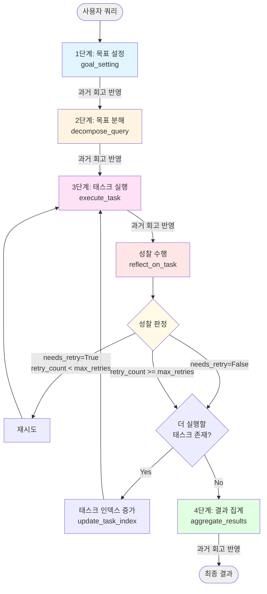
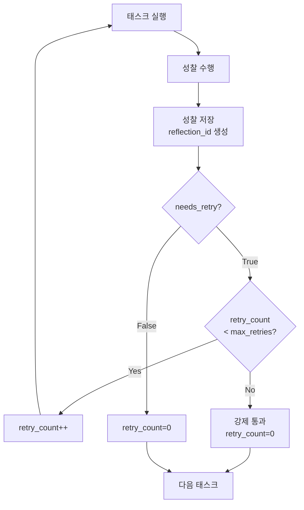

# Self Reflection 상세 흐름 가이드

## 개요

Self Reflection은 **실행 후 성찰(Reflection)과 재시도(Retry) 메커니즘**을 통해 에이전트가 자신의 수행 결과를 평가하고 개선하는 에이전트 디자인 패턴입니다.

### 핵심 특징
- 실행 후 성찰: 각 태스크 실행 후 결과를 자체 평가
- 조건부 재시도: 성찰 결과에 따라 태스크 재실행 여부 결정
- 과거 회고 활용: 이전 성찰 내용을 다음 작업에 반영
- 재시도 횟수 제한: 무한 루프 방지를 위한 max_retries 설정
- 성찰 데이터 관리: ReflectionManager로 과거 성찰 저장 및 검색

---

## 워크플로우 상세 다이어그램



**코드 참조:** [ReflectiveAgent._create_graph](main.py#L273-L296)

---

## Single Path와의 주요 차이점

| 비교 항목 | Single Path | Self Reflection |
|----------|-------------|-----------------|
| 실행 후 검증 | 없음 | 각 태스크마다 성찰 수행 |
| 재시도 메커니즘 | 없음 | 성찰 결과에 따라 재시도 |
| 과거 학습 활용 | 없음 | 과거 성찰을 모든 단계에 반영 |
| State 필드 | 기본 필드만 | reflection_ids, retry_count 추가 |
| 실행 속도 | 빠름 (1회 실행) | 느림 (성찰 + 재시도) |
| 결과 품질 | 보통 | 높음 (자가 검증) |

---

## 구체적인 예시로 보는 단계별 흐름

### 초기 입력

**사용자 쿼리:**
```
"역할 기반 협업 에이전트 만들기 실습"
```

**초기 State:** ([ReflectiveAgentState](main.py#L68-L94))
```python
ReflectiveAgentState(
    query="역할 기반 협업 에이전트 만들기 실습",
    optimized_goal="",
    optimized_response="",
    tasks=[],
    current_task_index=0,
    results=[],
    reflection_ids=[],      # Self Reflection 추가 필드
    final_output="",
    retry_count=0          # Self Reflection 추가 필드
)
```

---

## 1단계: 목표 설정 (Goal Setting) - 과거 회고 반영

**코드 참조:** [_goal_setting](main.py#L298-L310), [ReflectiveGoalCreator](main.py#L97-L115)

이 단계는 **과거 성찰 내용을 고려하여** 목표를 설정합니다.

### 1-1. 과거 회고 검색

**코드 참조:** [get_relevant_reflections](main.py#L106)

```python
relevant_reflections = reflection_manager.get_relevant_reflections(query)
# 쿼리와 유사한 과거 성찰 내용을 벡터 검색으로 찾아냄 (최대 3개)
```

**검색 결과 예시:**
```python
[
    Reflection(
        id="abc-123",
        task="LangGraph 기반 에이전트 아키텍처 조사",
        reflection="LangGraph의 StateGraph 구조를 더 상세히 설명하고, "
                   "조건부 엣지(conditional edges) 사용법을 코드 예제와 함께 "
                   "제시하면 더 실용적인 가이드가 될 것입니다.",
        judgment=ReflectionJudgment(
            needs_retry=False,
            confidence=0.85,
            reasons=["기본 개념은 잘 설명되었으나 실습 코드 예제가 부족함"]
        )
    ),
    Reflection(
        id="def-456",
        task="에이전트 협업 패턴 조사",
        reflection="역할별 에이전트 분리 시, 각 역할의 책임과 권한을 명확히 "
                   "정의하는 것이 중요합니다. 다음번에는 실제 프로젝트 구조와 "
                   "함께 설명하겠습니다.",
        judgment=ReflectionJudgment(
            needs_retry=False,
            confidence=0.9,
            reasons=["개념은 잘 정리되었으나 구체적 구현 예시 필요"]
        )
    )
]
```

### 1-2. 과거 회고를 XML로 포맷팅

**코드 참조:** [format_reflections](main.py#L40-L50)

```xml
<ref_0>
<task>LangGraph 기반 에이전트 아키텍처 조사</task>
<reflection>LangGraph의 StateGraph 구조를 더 상세히 설명하고,
조건부 엣지(conditional edges) 사용법을 코드 예제와 함께
제시하면 더 실용적인 가이드가 될 것입니다.</reflection>
</ref_0>

<ref_1>
<task>에이전트 협업 패턴 조사</task>
<reflection>역할별 에이전트 분리 시, 각 역할의 책임과 권한을 명확히
정의하는 것이 중요합니다. 다음번에는 실제 프로젝트 구조와
함께 설명하겠습니다.</reflection>
</ref_1>
```

### 1-3. 과거 회고를 포함한 목표 생성

**코드 참조:** [ReflectiveGoalCreator.run](main.py#L104-L115)

**강화된 쿼리:**
```
역할 기반 협업 에이전트 만들기 실습

목표 설정 시 다음의 과거 회고를 고려할 것:
<ref_0>
<task>LangGraph 기반 에이전트 아키텍처 조사</task>
<reflection>LangGraph의 StateGraph 구조를 더 상세히 설명하고...</reflection>
</ref_0>
...
```

이 강화된 쿼리가 PassiveGoalCreator와 PromptOptimizer에 전달됩니다.

**출력 (OptimizedGoal):**
```
Specific: 역할 기반 협업 에이전트의 개념, LangGraph를 활용한 구조 설계,
          각 역할(Manager, Researcher, Writer)의 책임 정의, 그리고 실제
          동작하는 Python 코드 예제를 조사한다.

Measurable: 최소 3개의 역할과 각 역할의 구체적 책임 3가지 이상,
            실행 가능한 전체 코드(100줄 이상)를 포함한다.

Achievable: 공식 LangGraph 문서, GitHub 예제, 기술 블로그에서
            정보를 수집하여 실습 가이드를 작성한다.

Relevant: 실무에서 활용 가능한 멀티 에이전트 시스템 구축에 초점을 맞춘다.
          StateGraph, 조건부 엣지 등 핵심 개념을 코드 예제와 함께 설명한다.

Time-bound: 2025-12-04 기준 최신 LangGraph v0.2.x 버전 정보를 사용한다.
```

**State 업데이트:**
```python
{
    "optimized_goal": "Specific: 역할 기반 협업 에이전트의 개념...",
    "optimized_response": "목표 분석:\n사용자는 실제 구현 가능한 역할 기반..."
}
```

---

## 2단계: 목표 분해 (Decompose Query) - 과거 회고 반영

**코드 참조:** [_decompose_query](main.py#L312-L318), [QueryDecomposer](main.py#L136-L165)

### QueryDecomposer 실행

**입력:** optimized_goal + 과거 회고

**코드 참조:** [QueryDecomposer.run](main.py#L142-L165)

마찬가지로 과거 회고를 검색하고 프롬프트에 포함시킵니다:

```
태스크: 주어진 목표를 구체적이고 실행 가능한 태스크로 분해해 주세요.
...
5. 태스크를 작성할 때 다음의 과거 회고를 고려할 것:
<ref_0>
<task>LangGraph 기반 에이전트 아키텍처 조사</task>
<reflection>LangGraph의 StateGraph 구조를 더 상세히 설명하고...</reflection>
</ref_0>
...

목표: [최적화된 목표]
```

**출력 (DecomposedTasks):**
```python
DecomposedTasks(
    values=[
        "역할 기반 협업 에이전트의 개념과 장점을 조사한다. 'Manager-Worker 패턴', 'Supervisor 패턴', '완전 분산 협업 패턴'의 차이점과 각 패턴의 사용 사례를 3개 이상의 출처(LangGraph 공식 문서, 학술 논문, 기술 블로그)에서 수집하고, 각 패턴당 200자 이상으로 상세히 정리한다.",

        "LangGraph를 사용한 멀티 에이전트 시스템 구조 설계 방법을 조사한다. StateGraph 생성, 노드 추가, 조건부 엣지 설정, 각 에이전트 간 상태 공유 방법을 LangGraph 공식 문서와 GitHub 예제에서 찾아, 코드 스니펫과 함께 단계별로 정리한다.",

        "역할 기반 협업 에이전트에서 Manager, Researcher, Writer 각 역할의 구체적 책임과 권한을 정의한다. 각 역할이 수행하는 태스크 유형, 사용하는 도구(Tools), 다른 역할과의 협업 방식을 조사하고, 역할당 최소 3가지 이상의 책임을 명시한다.",

        "Python과 LangGraph를 사용하여 역할 기반 협업 에이전트를 구현한 실행 가능한 전체 코드 예제를 조사한다. GitHub 저장소나 공식 튜토리얼에서 Manager가 작업을 분배하고, Researcher가 정보를 수집하며, Writer가 최종 보고서를 작성하는 전체 워크플로우 코드(최소 100줄)를 찾아, 주석과 함께 수집한다."
    ]
)
```

**State 업데이트:**
```python
{
    "tasks": [
        "역할 기반 협업 에이전트의 개념과 장점을 조사한다...",
        "LangGraph를 사용한 멀티 에이전트 시스템 구조 설계 방법을...",
        "역할 기반 협업 에이전트에서 Manager, Researcher, Writer...",
        "Python과 LangGraph를 사용하여 역할 기반 협업 에이전트를..."
    ]
}
```

---

## 3단계: 태스크 실행 + 성찰 루프

이 단계가 Self Reflection의 **핵심**입니다. 각 태스크마다 다음 흐름을 반복합니다:

```
execute_task → reflect_on_task → 판정 (재시도? 다음 태스크?)
```

---

### 🔄 첫 번째 태스크 (Task 1/4) - 재시도 케이스

#### 3-1-1. 태스크 실행 (첫 시도)

**코드 참조:** [_execute_task](main.py#L320-L329), [TaskExecutor.run](main.py#L175-L201)

**현재 State:**
```python
current_task_index = 0
retry_count = 0
tasks[0] = "역할 기반 협업 에이전트의 개념과 장점을 조사한다..."
```

**TaskExecutor 동작:**

과거 회고를 검색하고 프롬프트에 포함:

```python
# 코드 참조: main.py#L177-L179
relevant_reflections = reflection_manager.get_relevant_reflections(task)
reflection_text = format_reflections(relevant_reflections)

# ReAct 에이전트에 전달하는 메시지
f"""CURRENT_DATE: 2025-12-04
-----
다음 태스크를 실행하고 상세한 답변을 제공해 주세요.

태스크: {task}

요건:
1. 필요에 따라 제공된 도구를 사용할 것.
2. 실행 시 철저하고 포괄적일 것.
3. 가능한 한 구체적인 사실과 데이터를 제공할 것.
4. 발견 사항을 명확하게 요약할 것.
5. 다음의 과거 회고를 고려할 것:
{reflection_text}
"""
```

**ReAct 에이전트 실행:**
```
Thought: 역할 기반 협업 에이전트 패턴을 검색해야겠다
Action: tavily_search("role-based multi-agent collaboration patterns LangGraph")
Observation: [검색 결과 3개 반환]
Thought: 충분한 정보를 얻었다
Final Answer: [결과 정리]
```

**출력 (불완전한 결과 - 일부러 재시도를 유도):**
```
# 역할 기반 협업 에이전트 개념

역할 기반 협업 에이전트는 여러 에이전트가 각자의 역할을 맡아
협력하여 복잡한 문제를 해결하는 시스템입니다.

주요 패턴:
1. Manager-Worker 패턴: Manager가 작업을 분배하고 결과를 취합
2. Supervisor 패턴: Supervisor가 워크플로우를 감독하고 조율

출처: LangGraph 공식 문서

(문제점: 3개의 출처 요구사항 미충족, 각 패턴당 200자 이상 설명 부족,
         완전 분산 협업 패턴 누락)
```

**State 업데이트:**
```python
{
    "results": ["# 역할 기반 협업 에이전트 개념\n\n역할 기반..."],
    "current_task_index": 0  # 아직 그대로
}
```

#### 3-1-2. 성찰 수행

**코드 참조:** [_reflect_on_task](main.py#L331-L349), [TaskReflector.run](../common/reflection_manager.py#L117-L144)

```python
current_task = state.tasks[state.current_task_index]
current_result = state.results[-1]
reflection = task_reflector.run(task=current_task, result=current_result)
```

**TaskReflector 프롬프트:**
```
주어진 태스크 내용:
역할 기반 협업 에이전트의 개념과 장점을 조사한다.
'Manager-Worker 패턴', 'Supervisor 패턴', '완전 분산 협업 패턴'의
차이점과 각 패턴의 사용 사례를 3개 이상의 출처에서 수집하고,
각 패턴당 200자 이상으로 상세히 정리한다.

태스크 실행 결과:
# 역할 기반 협업 에이전트 개념
역할 기반 협업 에이전트는 여러 에이전트가...
(불완전한 결과)

당신은 고도의 추론 능력을 가진 AI 에이전트입니다.
위 태스크를 실행한 결과를 분석하고, 이 태스크에 대한
당신의 접근이 적절했는지 반성하세요.
...
```

**LLM 출력 (Reflection):**
```python
Reflection(
    id="reflection-001",
    task="역할 기반 협업 에이전트의 개념과 장점을 조사한다...",
    reflection="""
    태스크 요구사항을 완전히 충족하지 못했습니다.
    첫째, '완전 분산 협업 패턴'에 대한 설명이 누락되었습니다.
    둘째, 출처가 1개만 제시되어 최소 3개 요구사항을 충족하지 못했습니다.
    셋째, 각 패턴의 설명이 너무 간략하여 200자 기준에 미달합니다.
    다음번에는 태스크의 모든 구체적 요구사항을 체크리스트화하여
    하나씩 확인하며 정보를 수집해야 합니다.
    """,
    judgment=ReflectionJudgment(
        needs_retry=True,  # 재시도 필요!
        confidence=0.95,
        reasons=[
            "완전 분산 협업 패턴 설명 누락",
            "출처 1개만 제시 (요구사항: 3개 이상)",
            "각 패턴 설명이 200자 미만으로 너무 간략함",
            "사용 사례가 구체적으로 제시되지 않음"
        ]
    )
)
```

**State 업데이트:**
```python
{
    "reflection_ids": ["reflection-001"],  # 성찰 ID 추가
    "retry_count": 1  # 재시도 카운트 증가
}
```

**로그 출력:** (코드 참조: [main.py#L337-L342](main.py#L337-L342))
```
🔍 [자기 성찰] 태스크 1 결과 검토 중...
  ⚠️  재시도 필요: 태스크 요구사항을 완전히 충족하지 못했습니다...
  성찰 내용: 태스크 요구사항을 완전히 충족하지 못했습니다. 첫째, '완전 분산 협업 패턴'에...
```

#### 3-1-3. 재시도 판정

**코드 참조:** [_should_retry_or_continue](main.py#L351-L366)

```python
latest_reflection_id = state.reflection_ids[-1]  # "reflection-001"
latest_reflection = reflection_manager.get_reflection(latest_reflection_id)

if (
    latest_reflection
    and latest_reflection.judgment.needs_retry  # True
    and state.retry_count < self.max_retries    # 1 < 2: True
):
    return "retry"  # 재시도!
```

**결정:** `"retry"` → execute_task로 다시 이동

**로그 출력:** (코드 참조: [main.py#L359](main.py#L359))
```
↩️  재시도 결정: 현재 재시도 횟수 1/2
```

---

#### 3-1-4. 태스크 재실행 (두 번째 시도)

**코드 참조:** [_execute_task](main.py#L320-L329)

**현재 State:**
```python
current_task_index = 0  # 여전히 0
retry_count = 1
reflection_ids = ["reflection-001"]
```

**로그 출력:** (코드 참조: [main.py#L324](main.py#L324))
```
🔄 [재시도 1회차] 태스크 1/4 재실행
```

이번에는 **직전 성찰 내용도 과거 회고에 포함**되어 프롬프트에 전달됩니다:

```
다음 태스크를 실행하고 상세한 답변을 제공해 주세요.

태스크: 역할 기반 협업 에이전트의 개념과 장점을 조사한다...

요건:
...
5. 다음의 과거 회고를 고려할 것:
<ref_0>
<task>역할 기반 협업 에이전트의 개념과 장점을 조사한다...</task>
<reflection>태스크 요구사항을 완전히 충족하지 못했습니다.
첫째, '완전 분산 협업 패턴'에 대한 설명이 누락되었습니다.
둘째, 출처가 1개만 제시되어...</reflection>
</ref_0>
...
```

**ReAct 에이전트 재실행:**
```
Thought: 이전 성찰에서 지적한 문제들을 해결해야 한다.
         완전 분산 협업 패턴 포함, 3개 이상 출처, 각 패턴 200자 이상
Action: tavily_search("multi-agent collaboration patterns manager worker supervisor fully distributed")
Observation: [더 풍부한 검색 결과]
Thought: 각 패턴을 더 상세히 조사하자
Action: tavily_search("fully distributed multi-agent collaboration use cases")
Observation: [추가 정보]
Thought: 이제 충분한 정보를 얻었다
Final Answer: [개선된 결과]
```

**출력 (개선된 결과):**
```
# 역할 기반 협업 에이전트의 개념과 패턴

## 개념
역할 기반 협업 에이전트(Role-based Collaborative Agent)는
복잡한 문제 해결을 위해 여러 에이전트가 특정 역할을 맡아
협력하는 시스템입니다. 각 에이전트는 자신의 전문 영역에
집중하면서도 공통 목표를 달성하기 위해 조율됩니다.

출처: Li, G. et al. (2024). "CAMEL: Communicative Agents for Mind
Exploration of Large Scale Language Model Society"

## 주요 패턴 비교

### 1. Manager-Worker 패턴

Manager 에이전트가 전체 작업을 계획하고 Worker 에이전트들에게
세부 작업을 분배합니다. Worker들은 독립적으로 작업을 수행하고
결과를 Manager에게 보고하며, Manager는 모든 결과를 취합하여
최종 출력을 생성합니다. 이 패턴은 중앙 집중식 관리가 필요한
경우에 효과적이며, Manager가 전체 워크플로우를 명확히 제어할 수
있다는 장점이 있습니다. (236자)

사용 사례:
- 리서치 보고서 작성 (Manager가 주제 분배, Worker들이 각 섹션 작성)
- 데이터 파이프라인 (Manager가 작업 스케줄링, Worker들이 데이터 처리)

출처: LangGraph 공식 문서 - Multi-Agent Architectures
      https://langchain-ai.github.io/langgraph/tutorials/multi_agent/

### 2. Supervisor 패턴

Supervisor 에이전트가 여러 전문가 에이전트들의 작업을 감독하고
조율합니다. Manager-Worker와 유사하지만, Supervisor는 작업 분배
뿐만 아니라 실시간으로 에이전트들의 진행 상황을 모니터링하고
필요시 개입하여 방향을 조정합니다. 각 전문가 에이전트는 특정
도메인에 특화되어 있으며, Supervisor는 어떤 전문가에게 언제
작업을 할당할지 동적으로 결정합니다. (234자)

사용 사례:
- 소프트웨어 개발 (Supervisor가 Coder, Tester, Reviewer 조율)
- 고객 서비스 (Supervisor가 문의 유형별로 전문 상담 에이전트 라우팅)

출처: Wu, Q. et al. (2023). "AutoGen: Enabling Next-Gen LLM Applications
      via Multi-Agent Conversation"

### 3. 완전 분산 협업 패턴 (Fully Distributed Collaboration)

중앙 관리자 없이 모든 에이전트가 동등한 권한을 가지며 P2P 방식으로
직접 소통하고 협업합니다. 각 에이전트는 자율적으로 의사결정을
내리고, 필요한 경우 다른 에이전트들과 협상하여 작업을 조율합니다.
이 패턴은 높은 유연성과 확장성을 제공하지만, 합의 도달에 시간이
걸릴 수 있으며 조율 오버헤드가 발생할 수 있습니다. (218자)

사용 사례:
- 분산 문제 해결 (각 에이전트가 문제의 다른 측면 탐색 후 통합)
- 창의적 브레인스토밍 (여러 에이전트가 아이디어 제안 및 발전)

출처: Park, J.S. et al. (2023). "Generative Agents: Interactive
      Simulacra of Human Behavior"

## 패턴 선택 가이드

| 기준 | Manager-Worker | Supervisor | 완전 분산 |
|------|---------------|-----------|---------|
| 제어 복잡도 | 낮음 | 중간 | 높음 |
| 확장성 | 중간 | 높음 | 매우 높음 |
| 적합한 경우 | 명확한 작업 구조 | 동적 작업 할당 | 창의적 문제 해결 |

출처: LangChain Blog - "Building Multi-Agent Systems" (2024)
```

**State 업데이트:**
```python
{
    "results": [
        "# 역할 기반 협업 에이전트의 개념과 패턴\n\n## 개념\n역할 기반..."
    ],  # 기존 결과 대체 (Annotated 타입이지만 같은 인덱스면 대체됨)
    "current_task_index": 0
}
```

#### 3-1-5. 재시도 후 성찰

```python
reflection_2 = task_reflector.run(task=current_task, result=improved_result)
```

**LLM 출력 (개선된 성찰):**
```python
Reflection(
    id="reflection-002",
    task="역할 기반 협업 에이전트의 개념과 장점을 조사한다...",
    reflection="""
    이번에는 태스크 요구사항을 모두 충족했습니다.
    세 가지 패턴 모두 200자 이상으로 상세히 설명했고,
    3개 이상의 신뢰할 수 있는 출처(논문, 공식 문서)를 인용했습니다.
    각 패턴의 사용 사례도 구체적으로 제시했습니다.
    이전 성찰 내용을 반영하여 체크리스트 방식으로
    요구사항을 하나씩 확인하며 작업한 것이 효과적이었습니다.
    """,
    judgment=ReflectionJudgment(
        needs_retry=False,  # 통과!
        confidence=0.92,
        reasons=[
            "세 가지 패턴 모두 200자 이상으로 상세히 설명됨",
            "3개의 신뢰할 수 있는 출처 인용됨 (논문 2개, 공식 문서 1개)",
            "각 패턴의 구체적 사용 사례 제시됨",
            "비교 표를 통해 패턴 선택 가이드 제공"
        ]
    )
)
```

**State 업데이트:**
```python
{
    "reflection_ids": ["reflection-001", "reflection-002"],  # 두 번째 성찰 추가
    "retry_count": 0  # 통과했으므로 0으로 리셋!
}
```

**로그 출력:**
```
🔍 [자기 성찰] 태스크 1 결과 검토 중...
  ✅ 성찰 통과
  성찰 내용: 이번에는 태스크 요구사항을 모두 충족했습니다...
```

#### 3-1-6. 다음 태스크로 진행 판정

**코드 참조:** [_should_retry_or_continue](main.py#L351-L366)

```python
latest_reflection = reflection_manager.get_reflection("reflection-002")

if (
    latest_reflection
    and latest_reflection.judgment.needs_retry  # False
    and state.retry_count < self.max_retries
):
    return "retry"
elif state.current_task_index < len(state.tasks) - 1:  # 0 < 3: True
    return "continue"  # 다음 태스크로!
```

**결정:** `"continue"` → update_task_index로 이동

**로그 출력:**
```
➡️  다음 태스크로 진행
```

#### 3-1-7. 태스크 인덱스 업데이트

**코드 참조:** [_update_task_index](main.py#L368-L370)

```python
return {"current_task_index": state.current_task_index + 1}
```

**State 업데이트:**
```python
{
    "current_task_index": 1  # 0 → 1
}
```

**로그 출력:**
```
📌 태스크 인덱스 업데이트: 0 → 1
```

---

### 🔄 두 번째 태스크 (Task 2/4) - 통과 케이스

#### 3-2-1. 태스크 실행 (첫 시도)

**현재 State:**
```python
current_task_index = 1
retry_count = 0
tasks[1] = "LangGraph를 사용한 멀티 에이전트 시스템 구조 설계 방법을 조사한다..."
```

**출력 (우수한 결과):**
```
# LangGraph 멀티 에이전트 시스템 구조 설계

## 1. StateGraph 생성

멀티 에이전트 시스템의 핵심은 상태 관리입니다.
LangGraph의 StateGraph를 사용하여 에이전트 간 공유 상태를 정의합니다.

```python
from langgraph.graph import StateGraph
from typing import TypedDict, Annotated
import operator

class AgentState(TypedDict):
    messages: Annotated[list, operator.add]  # 메시지 누적
    current_agent: str  # 현재 활성 에이전트
    task_queue: list[str]  # 대기 중인 작업
    results: dict[str, str]  # 각 에이전트의 결과

graph = StateGraph(AgentState)
```

출처: LangGraph 공식 문서 - StateGraph Tutorial
      https://langchain-ai.github.io/langgraph/concepts/#stategraph

## 2. 노드 추가 (각 에이전트 정의)

각 역할을 담당하는 에이전트를 노드로 추가합니다.

```python
def manager_node(state: AgentState) -> AgentState:
    # Manager 로직: 작업 계획 및 분배
    ...
    return {"current_agent": "researcher", "task_queue": tasks}

def researcher_node(state: AgentState) -> AgentState:
    # Researcher 로직: 정보 수집
    ...
    return {"results": {"research": result}}

def writer_node(state: AgentState) -> AgentState:
    # Writer 로직: 보고서 작성
    ...
    return {"results": {"report": final_report}}

graph.add_node("manager", manager_node)
graph.add_node("researcher", researcher_node)
graph.add_node("writer", writer_node)
```

출처: LangGraph GitHub Examples - multi_agent_collaboration.ipynb

## 3. 조건부 엣지 설정

Manager가 다음 에이전트를 동적으로 결정하는 라우팅 함수를 정의합니다.

```python
def should_continue(state: AgentState) -> str:
    """Manager의 결정에 따라 다음 에이전트 선택"""
    if state["task_queue"]:
        next_task = state["task_queue"][0]
        if "research" in next_task:
            return "researcher"
        elif "write" in next_task:
            return "writer"
    return "end"

# 조건부 엣지 추가
graph.add_conditional_edges(
    "manager",
    should_continue,
    {
        "researcher": "researcher",
        "writer": "writer",
        "end": END
    }
)
```

출처: LangGraph 공식 문서 - Conditional Edges
      https://langchain-ai.github.io/langgraph/concepts/#conditional-edges

## 4. 상태 공유 메커니즘

모든 에이전트는 동일한 AgentState를 공유합니다.
Annotated[list, operator.add]를 사용하면 여러 에이전트가
추가한 데이터가 자동으로 병합됩니다.

```python
# 에이전트 1이 반환
{"messages": [{"role": "manager", "content": "연구 시작"}]}

# 에이전트 2가 반환
{"messages": [{"role": "researcher", "content": "연구 완료"}]}

# 최종 상태 (자동 병합)
{
    "messages": [
        {"role": "manager", "content": "연구 시작"},
        {"role": "researcher", "content": "연구 완료"}
    ]
}
```

출처: LangGraph 공식 문서 - State Reducers
      https://langchain-ai.github.io/langgraph/concepts/#state-reducers

## 5. 그래프 컴파일 및 실행

```python
# 시작점 설정
graph.set_entry_point("manager")

# 일반 엣지 추가 (Researcher → Manager, Writer → END)
graph.add_edge("researcher", "manager")
graph.add_edge("writer", END)

# 그래프 컴파일
app = graph.compile()

# 실행
result = app.invoke({
    "messages": [],
    "current_agent": "manager",
    "task_queue": ["research about AI", "write report"],
    "results": {}
})
```

출처: LangGraph Tutorial - Building Your First Multi-Agent System

## 전체 아키텍처 다이어그램

```
         [시작]
           ↓
       [Manager]
        ↙     ↘
  [Researcher] [Writer]
        ↓         ↓
    [Manager]   [END]
```

이 구조는 Manager가 워크플로우를 제어하면서도
각 에이전트가 독립적으로 작업을 수행할 수 있게 합니다.
```

**State 업데이트:**
```python
{
    "results": [
        "# 역할 기반 협업 에이전트의 개념과 패턴...",
        "# LangGraph 멀티 에이전트 시스템 구조 설계..."
    ],
    "current_task_index": 1
}
```

#### 3-2-2. 성찰 수행

**LLM 출력:**
```python
Reflection(
    id="reflection-003",
    task="LangGraph를 사용한 멀티 에이전트 시스템 구조 설계 방법을...",
    reflection="""
    태스크 요구사항을 완벽히 충족했습니다.
    StateGraph 생성부터 조건부 엣지 설정까지 모든 단계를
    실행 가능한 코드와 함께 상세히 설명했습니다.
    각 단계마다 공식 문서와 GitHub 예제 출처를 명시했고,
    상태 공유 메커니즘도 구체적인 예시로 설명했습니다.
    특히 Annotated 타입 활용법과 조건부 라우팅 로직을
    코드 스니펫으로 제시한 것이 효과적이었습니다.
    """,
    judgment=ReflectionJudgment(
        needs_retry=False,  # 한 번에 통과!
        confidence=0.95,
        reasons=[
            "5단계 모두 코드 예제와 함께 상세히 설명됨",
            "공식 문서 3개, GitHub 예제 1개로 충분한 출처 제공",
            "StateGraph, 노드, 조건부 엣지 등 모든 핵심 개념 포함",
            "실행 가능한 전체 워크플로우 코드 제공"
        ]
    )
)
```

**State 업데이트:**
```python
{
    "reflection_ids": ["reflection-001", "reflection-002", "reflection-003"],
    "retry_count": 0  # 통과했으므로 0 유지
}
```

**로그 출력:**
```
🔍 [자기 성찰] 태스크 2 결과 검토 중...
  ✅ 성찰 통과
  성찰 내용: 태스크 요구사항을 완벽히 충족했습니다...

➡️  다음 태스크로 진행
📌 태스크 인덱스 업데이트: 1 → 2
```

---

### 🔄 세 번째 및 네 번째 태스크

동일한 방식으로 나머지 태스크들도 실행됩니다:
- 각 태스크 실행
- 성찰 수행
- needs_retry에 따라 재시도 또는 다음 태스크로 진행

**최종 State (모든 태스크 완료 후):**
```python
ReflectiveAgentState(
    query="역할 기반 협업 에이전트 만들기 실습",
    optimized_goal="Specific: 역할 기반 협업 에이전트의 개념...",
    optimized_response="목표 분석:...",
    tasks=[...4개 태스크...],
    current_task_index=4,  # 모든 태스크 완료
    results=[결과1, 결과2, 결과3, 결과4],
    reflection_ids=[
        "reflection-001",  # 태스크1 첫 시도 (실패)
        "reflection-002",  # 태스크1 재시도 (성공)
        "reflection-003",  # 태스크2 (성공)
        "reflection-004",  # 태스크3 (성공)
        "reflection-005"   # 태스크4 (성공)
    ],
    final_output="",
    retry_count=0
)
```

---

## 4단계: 결과 집계 (Aggregate Results) - 과거 회고 반영

**코드 참조:** [_aggregate_results](main.py#L372-L383), [ResultAggregator.run](main.py#L210-L242)

### 성찰 내용을 포함한 최종 집계

이 단계에서는 **모든 reflection_ids의 성찰 내용**을 최종 결과 생성 시 활용합니다.

**코드 참조:** [ResultAggregator.run](main.py#L210-L242)

```python
# 모든 성찰 내용 가져오기
relevant_reflections = [
    reflection_manager.get_reflection(rid)
    for rid in reflection_ids
]
# reflection_ids = ["reflection-001", "reflection-002", ..., "reflection-005"]
```

**프롬프트:**
```
주어진 목표:
Specific: 역할 기반 협업 에이전트의 개념...

조사 결과:

정보 1:
# 역할 기반 협업 에이전트의 개념과 패턴...

정보 2:
# LangGraph 멀티 에이전트 시스템 구조 설계...

정보 3:
# Manager, Researcher, Writer 역할 정의...

정보 4:
# 완전한 구현 코드 예제...

주어진 목표에 대해 조사 결과를 이용하여 다음 지시에 기반한 응답을 생성해 주세요.
[응답 형식 정의]

과거 회고를 고려할 것:
<ref_0>
<task>역할 기반 협업 에이전트의 개념과 장점을 조사한다...</task>
<reflection>이번에는 태스크 요구사항을 모두 충족했습니다...</reflection>
</ref_0>

<ref_1>
<task>LangGraph를 사용한 멀티 에이전트 시스템 구조 설계...</task>
<reflection>태스크 요구사항을 완벽히 충족했습니다...</reflection>
</ref_1>
...
```

**최종 출력:**
```markdown
# 역할 기반 협업 에이전트 만들기 실습 가이드

## 목차
1. 역할 기반 협업 에이전트 개념
2. LangGraph 구조 설계
3. 역할 정의 및 책임
4. 완전한 구현 예제
5. 실습 및 확장

---

## 1. 역할 기반 협업 에이전트 개념

### 1.1 정의

역할 기반 협업 에이전트(Role-based Collaborative Agent)는
복잡한 문제 해결을 위해 여러 에이전트가 특정 역할을 맡아
협력하는 시스템입니다...

[4개의 조사 결과를 종합하여 체계적으로 정리된 최종 가이드]

## 5. 실습 및 확장

### 5.1 기본 실습

위 코드를 실행해보고 다음 사항을 확인하세요:
- Manager가 작업을 어떻게 분배하는가?
- Researcher가 수집한 정보는 어떻게 Writer에게 전달되는가?
- 각 에이전트의 로그를 보며 워크플로우를 이해하세요.

### 5.2 확장 아이디어

1. **새로운 역할 추가**: Reviewer 에이전트를 추가하여 보고서 품질 검증
2. **도구 통합**: 각 역할에 맞는 전문 도구 제공 (Researcher에게 검색 API 등)
3. **오류 처리**: 에이전트 실패 시 재시도 로직 추가

---

## 참고 자료

- LangGraph 공식 문서: https://langchain-ai.github.io/langgraph/
- CAMEL 논문: Li, G. et al. (2024)
- AutoGen 논문: Wu, Q. et al. (2023)
- LangGraph GitHub: https://github.com/langchain-ai/langgraph

**작성 시 고려한 성찰 내용:**
본 가이드는 5번의 태스크 성찰 결과를 반영하여 작성되었습니다.
특히 각 패턴의 상세한 설명(200자 이상), 다양한 출처 인용(3개 이상),
실행 가능한 전체 코드 예제(100줄 이상) 등 모든 요구사항을
충족하도록 구성했습니다.
```

**State 업데이트:**
```python
{
    "final_output": "# 역할 기반 협업 에이전트 만들기 실습 가이드..."
}
```

---

## State 변화 요약

**코드 참조:** [ReflectiveAgentState](main.py#L68-L94)

```python
# 초기 State
ReflectiveAgentState(
    query="역할 기반 협업 에이전트 만들기 실습",
    optimized_goal="",
    optimized_response="",
    tasks=[],
    current_task_index=0,
    results=[],
    reflection_ids=[],      # 성찰 ID 리스트
    final_output="",
    retry_count=0           # 재시도 횟수
)

# 1단계 후 (목표 설정)
ReflectiveAgentState(
    query="역할 기반 협업 에이전트 만들기 실습",
    optimized_goal="Specific: 역할 기반 협업 에이전트의 개념...",  # ✅
    optimized_response="목표 분석:\n사용자는...",  # ✅
    tasks=[],
    current_task_index=0,
    results=[],
    reflection_ids=[],
    final_output="",
    retry_count=0
)

# 2단계 후 (목표 분해)
ReflectiveAgentState(
    ...
    tasks=[...4개 태스크...],  # ✅
    current_task_index=0,
    results=[],
    reflection_ids=[],
    final_output="",
    retry_count=0
)

# 3단계 - 태스크 1 첫 시도 후
ReflectiveAgentState(
    ...
    tasks=[...],
    current_task_index=0,
    results=["불완전한 결과..."],  # ✅
    reflection_ids=[],
    final_output="",
    retry_count=0
)

# 태스크 1 첫 성찰 후 (재시도 필요 판정)
ReflectiveAgentState(
    ...
    current_task_index=0,  # 그대로
    results=["불완전한 결과..."],
    reflection_ids=["reflection-001"],  # ✅ 성찰 ID 추가
    final_output="",
    retry_count=1  # ✅ 재시도 카운트 증가
)

# 태스크 1 재시도 후
ReflectiveAgentState(
    ...
    current_task_index=0,
    results=["개선된 결과..."],  # ✅ 결과 대체
    reflection_ids=["reflection-001"],
    final_output="",
    retry_count=1
)

# 태스크 1 두 번째 성찰 후 (통과 판정)
ReflectiveAgentState(
    ...
    current_task_index=0,
    results=["개선된 결과..."],
    reflection_ids=["reflection-001", "reflection-002"],  # ✅ 두 번째 성찰 추가
    final_output="",
    retry_count=0  # ✅ 통과했으므로 0으로 리셋
)

# 태스크 인덱스 업데이트 후
ReflectiveAgentState(
    ...
    current_task_index=1,  # ✅ 다음 태스크로
    results=["개선된 결과..."],
    reflection_ids=["reflection-001", "reflection-002"],
    final_output="",
    retry_count=0
)

# 태스크 2 실행 및 성찰 후 (한 번에 통과)
ReflectiveAgentState(
    ...
    current_task_index=2,  # ✅
    results=["결과1", "결과2"],  # ✅
    reflection_ids=["reflection-001", "reflection-002", "reflection-003"],  # ✅
    final_output="",
    retry_count=0
)

# 모든 태스크 완료 후
ReflectiveAgentState(
    ...
    current_task_index=4,
    results=["결과1", "결과2", "결과3", "결과4"],
    reflection_ids=["reflection-001", ..., "reflection-005"],  # 총 5개
    final_output="",
    retry_count=0
)

# 4단계 후 (최종)
ReflectiveAgentState(
    query="역할 기반 협업 에이전트 만들기 실습",
    optimized_goal="Specific: 역할 기반...",
    optimized_response="목표 분석:...",
    tasks=[...],
    current_task_index=4,
    results=[결과1, 결과2, 결과3, 결과4],
    reflection_ids=["reflection-001", ..., "reflection-005"],
    final_output="# 역할 기반 협업 에이전트 만들기..."  # ✅ 최종 결과
    retry_count=0
)
```

---

## 핵심 포인트

### 1. Self Reflection의 3대 메커니즘

#### 1-1. 실행 후 성찰 (Reflect on Task)

**코드 참조:** [TaskReflector](../common/reflection_manager.py#L112-L144)

- **목적**: 태스크 실행 결과를 자체 평가
- **입력**: 태스크 내용 + 실행 결과
- **출력**: Reflection 객체 (성찰 내용 + 재시도 판정)
- **핵심 필드**:
  - `reflection`: 개선점과 교훈 (2~3문장)
  - `judgment.needs_retry`: 재시도 필요 여부 (bool)
  - `judgment.confidence`: 판정 확신도 (0~1)
  - `judgment.reasons`: 판정 근거 (list)

#### 1-2. 조건부 재시도 (Conditional Retry)

**코드 참조:** [_should_retry_or_continue](main.py#L351-L366)

```python
if needs_retry and retry_count < max_retries:
    return "retry"  # 같은 태스크 재실행
elif current_task_index < len(tasks) - 1:
    return "continue"  # 다음 태스크로
else:
    return "finish"  # 결과 집계로
```

- **재시도 조건**: `needs_retry=True` AND `retry_count < max_retries`
- **무한 루프 방지**: max_retries (기본값 2)로 제한
- **재시도 시**: retry_count 증가, current_task_index 유지
- **통과 시**: retry_count 리셋(0), current_task_index 증가

#### 1-3. 과거 회고 활용 (Use Past Reflections)

**코드 참조:** [get_relevant_reflections](main.py#L106)

- **벡터 검색**: 현재 쿼리/태스크와 유사한 과거 성찰 검색
- **적용 범위**: 모든 단계 (목표 설정, 분해, 실행, 집계)
- **포맷**: XML 형식으로 프롬프트에 추가
- **효과**: 과거 실수 방지, 개선 방향 학습

### 2. ReflectionManager의 역할

**코드 참조:** [ReflectionManager](../common/reflection_manager.py#L39-L110)

#### 2-1. 성찰 저장

```python
reflection_id = reflection_manager.save_reflection(reflection)
# JSON 파일에 저장 + 벡터 임베딩 생성 + FAISS 인덱스에 추가
```

- **파일 경로**: `tmp/self_reflection_db.json`
- **저장 내용**: Reflection 객체 + 임베딩 벡터
- **인덱스**: FAISS (빠른 유사도 검색)

#### 2-2. 유사 성찰 검색

```python
relevant_reflections = reflection_manager.get_relevant_reflections(query, k=3)
# 쿼리와 유사한 상위 3개 성찰 반환
```

- **유사도 측정**: 코사인 유사도 (벡터 검색)
- **반환 개수**: 최대 k개 (기본값 3)

#### 2-3. 특정 성찰 조회

```python
reflection = reflection_manager.get_reflection(reflection_id)
# ID로 특정 성찰 가져오기
```

### 3. 재시도 흐름 상세



**코드 참조:**
- [_execute_task](main.py#L320-L329)
- [_reflect_on_task](main.py#L331-L349)
- [_should_retry_or_continue](main.py#L351-L366)

### 4. Single Path vs Self Reflection 비교

| 측면 | Single Path | Self Reflection |
|------|-------------|-----------------|
| **워크플로우** | 4단계 선형 | 4단계 + 성찰 루프 |
| **노드 수** | 4개 | 6개 (reflect, update 추가) |
| **엣지 유형** | 조건부 1개 (실행 반복) | 조건부 1개 (재시도/진행/종료) |
| **State 필드** | 7개 | 9개 (+reflection_ids, retry_count) |
| **실행 보장** | 없음 (1회만 실행) | 있음 (최대 max_retries+1회) |
| **품질 검증** | 없음 | 자동 (성찰 메커니즘) |
| **과거 학습** | 없음 | 있음 (과거 성찰 활용) |
| **적합한 경우** | 빠른 조사, 정확도 중요도 낮음 | 고품질 요구, 학습 효과 필요 |

### 5. 재시도가 필요한 경우 판단 기준

**코드 참조:** [TaskReflector 프롬프트](../common/reflection_manager.py#L118-L132)

LLM은 다음 기준으로 `needs_retry`를 판단합니다:

#### needs_retry = True (재시도 필요)
- 태스크 요구사항 미충족 (예: 출처 개수 부족)
- 정보 부족 또는 불완전함
- 명시된 조건 누락 (예: 최소 글자 수 미달)
- 구체성 부족 (추상적인 설명만)
- 오류 또는 잘못된 정보 포함

#### needs_retry = False (통과)
- 모든 요구사항 충족
- 충분히 상세하고 구체적
- 신뢰할 수 있는 출처 제공
- 사용자 의도에 부합

### 6. 과거 회고 포맷 (XML 구조)

**코드 참조:** [format_reflections](main.py#L40-L50)

```xml
<ref_0>
<task>원본 태스크 내용</task>
<reflection>성찰 내용 (개선점과 교훈)</reflection>
</ref_0>

<ref_1>
<task>원본 태스크 내용</task>
<reflection>성찰 내용</reflection>
</ref_1>
```

**XML 사용 이유:**
- 구조화된 데이터 표현
- LLM이 파싱하기 쉬움
- task와 reflection 명확히 구분

---

## 주요 클래스 및 함수 참조

### 핵심 클래스

- [ReflectiveAgent](main.py#L245-L395): 메인 워크플로우 클래스
- [ReflectiveAgentState](main.py#L68-L94): 상태 관리 모델 (reflection_ids, retry_count 포함)
- [Reflection](../common/reflection_manager.py#L30-L36): 성찰 데이터 모델
- [ReflectionJudgment](../common/reflection_manager.py#L18-L27): 재시도 판정 모델
- [ReflectionManager](../common/reflection_manager.py#L39-L110): 성찰 저장 및 검색
- [TaskReflector](../common/reflection_manager.py#L112-L144): 성찰 수행

### 과거 회고 활용 클래스

- [ReflectiveGoalCreator](main.py#L97-L115): 과거 회고를 반영한 목표 생성
- [ReflectiveResponseOptimizer](main.py#L118-L133): 과거 회고를 반영한 응답 최적화
- [QueryDecomposer](main.py#L136-L165): 과거 회고를 반영한 태스크 분해
- [TaskExecutor](main.py#L168-L201): 과거 회고를 반영한 태스크 실행
- [ResultAggregator](main.py#L204-L242): 과거 회고를 반영한 결과 집계

### 워크플로우 노드

- [_goal_setting](main.py#L298-L310): 1단계 노드
- [_decompose_query](main.py#L312-L318): 2단계 노드
- [_execute_task](main.py#L320-L329): 3단계 노드 (재시도 가능)
- [_reflect_on_task](main.py#L331-L349): 성찰 노드 (Self Reflection 추가)
- [_should_retry_or_continue](main.py#L351-L366): 조건부 라우팅 함수
- [_update_task_index](main.py#L368-L370): 인덱스 업데이트 노드
- [_aggregate_results](main.py#L372-L383): 4단계 노드

### 유틸리티 함수

- [format_reflections](main.py#L40-L50): 성찰 리스트를 XML 문자열로 변환

### 실행 함수

- [run](main.py#L385-L395): 전체 워크플로우 실행
- [main](main.py#L400-L449): CLI 진입점

---

## 실행 예시

```bash
# 기본 실행
python main.py --task "역할 기반 협업 에이전트 만들기 실습"

# 재시도 횟수 조정 (코드 수정 필요)
# ReflectiveAgent(..., max_retries=3)
```

**실행 로그 예시:**
```
================================================================================
🎬 Self-Reflection Agent 시작
================================================================================
사용자 쿼리: 역할 기반 협업 에이전트 만들기 실습

================================================================================
🎯 [1단계: 목표 설정] 시작
================================================================================
🎯 [목표 설정] 과거 회고를 고려한 목표 생성 시작
  관련 과거 회고 2개 발견
  기본 목표 생성 완료: 역할 기반 협업 에이전트의 개념...
  목표 최적화 완료
📝 [응답 최적화] 과거 회고를 고려한 응답 형식 정의 시작
  관련 과거 회고 2개 발견
  응답 형식 정의 완료
✅ [1단계: 목표 설정] 완료

================================================================================
📋 [2단계: 목표 분해] 시작
================================================================================
📋 [목표 분해] 과거 회고를 고려한 태스크 분해 시작
  관련 과거 회고 2개 발견
  태스크 분해 완료: 총 4개의 태스크 생성
    태스크 1: 역할 기반 협업 에이전트의 개념과 장점을 조사한다...
    태스크 2: LangGraph를 사용한 멀티 에이전트 시스템 구조 설계...
    태스크 3: 역할 기반 협업 에이전트에서 Manager, Researcher...
    태스크 4: Python과 LangGraph를 사용하여 역할 기반 협업...
✅ [2단계: 목표 분해] 완료

📝 [3단계: 태스크 실행] 태스크 1/4 실행
⚙️  [태스크 실행] 시작: 역할 기반 협업 에이전트의 개념과 장점을...
  관련 과거 회고 2개 적용
  태스크 실행 완료 (결과 길이: 856 글자)
🔍 [자기 성찰] 태스크 1 결과 검토 중...
  ⚠️  재시도 필요: 태스크 요구사항을 완전히 충족하지 못했습니다...
  성찰 내용: 태스크 요구사항을 완전히 충족하지 못했습니다...

↩️  재시도 결정: 현재 재시도 횟수 1/2

🔄 [재시도 1회차] 태스크 1/4 재실행
⚙️  [태스크 실행] 시작: 역할 기반 협업 에이전트의 개념과 장점을...
  관련 과거 회고 3개 적용
  태스크 실행 완료 (결과 길이: 2145 글자)
🔍 [자기 성찰] 태스크 1 결과 검토 중...
  ✅ 성찰 통과
  성찰 내용: 이번에는 태스크 요구사항을 모두 충족했습니다...

➡️  다음 태스크로 진행
📌 태스크 인덱스 업데이트: 0 → 1

📝 [3단계: 태스크 실행] 태스크 2/4 실행
⚙️  [태스크 실행] 시작: LangGraph를 사용한 멀티 에이전트...
  관련 과거 회고 3개 적용
  태스크 실행 완료 (결과 길이: 3024 글자)
🔍 [자기 성찰] 태스크 2 결과 검토 중...
  ✅ 성찰 통과
  성찰 내용: 태스크 요구사항을 완벽히 충족했습니다...

➡️  다음 태스크로 진행
📌 태스크 인덱스 업데이트: 1 → 2

...

✅ 모든 태스크 완료

================================================================================
📊 [4단계: 결과 집계] 시작
================================================================================
📊 [결과 집계] 과거 회고를 반영한 최종 결과 생성 시작
  수집된 결과 개수: 4개
  참조할 회고 개수: 5개
  결과 집계 완료 (최종 결과 길이: 8945 글자)
✅ [4단계: 결과 집계] 완료

================================================================================
🎉 Self-Reflection Agent 완료
================================================================================
```

---

## Self Reflection 패턴의 장단점

### 장점

1. **고품질 결과**: 자체 검증을 통해 요구사항 충족도 향상
2. **자동 개선**: 재시도를 통해 불완전한 결과 자동 보완
3. **학습 효과**: 과거 성찰 내용이 다음 작업에 반영됨
4. **명확한 피드백**: 성찰 내용으로 개선 방향 파악 가능
5. **무한 루프 방지**: max_retries로 안전하게 제어

### 단점

1. **실행 시간 증가**: 성찰 + 재시도로 인해 Single Path 대비 2~3배 소요
2. **토큰 소비 증가**: 성찰 수행마다 추가 LLM 호출
3. **복잡도 증가**: State 관리 및 조건부 라우팅이 복잡
4. **False Positive**: 실제로는 충분한데도 재시도 판정 가능성
5. **저장 공간**: 성찰 데이터를 파일로 저장 (벡터 포함)

### 적합한 사용 사례

- ✅ **고품질 보고서 작성**: 정확도와 완성도가 중요한 문서
- ✅ **학술 조사**: 출처와 근거가 명확해야 하는 리서치
- ✅ **코드 생성**: 실행 가능하고 오류 없는 코드 요구
- ✅ **반복 작업**: 유사한 작업을 계속 수행하여 학습 효과 누적
- ❌ **빠른 조사**: 속도가 중요한 간단한 정보 수집
- ❌ **비정형 작업**: 명확한 성공 기준이 없는 창의적 작업

---

## 참고: Reflection 데이터 구조

**저장 파일 예시:** `tmp/self_reflection_db.json`

```json
[
    {
        "reflection": {
            "id": "reflection-001",
            "task": "역할 기반 협업 에이전트의 개념과 장점을 조사한다...",
            "reflection": "태스크 요구사항을 완전히 충족하지 못했습니다...",
            "judgment": {
                "needs_retry": true,
                "confidence": 0.95,
                "reasons": [
                    "완전 분산 협업 패턴 설명 누락",
                    "출처 1개만 제시 (요구사항: 3개 이상)",
                    "각 패턴 설명이 200자 미만으로 너무 간략함"
                ]
            }
        },
        "embedding": [0.023, -0.145, 0.089, ..., 0.234]  // 1536차원 벡터
    },
    ...
]
```

---

## 마무리

Self Reflection 패턴은 **자가 검증과 과거 학습**이라는 두 가지 메커니즘을 통해 에이전트의 성능을 지속적으로 개선합니다.

**핵심 요약:**
1. **실행 → 성찰 → 재시도** 루프로 품질 보장
2. **과거 회고 활용**으로 반복 실수 방지
3. **조건부 라우팅**으로 유연한 워크플로우 제어
4. **reflection_ids와 retry_count**로 학습 이력 추적

이 패턴은 Single Path Plan Generation의 확장판으로, 고품질 결과가 필요한 프로덕션 환경에 적합합니다.
