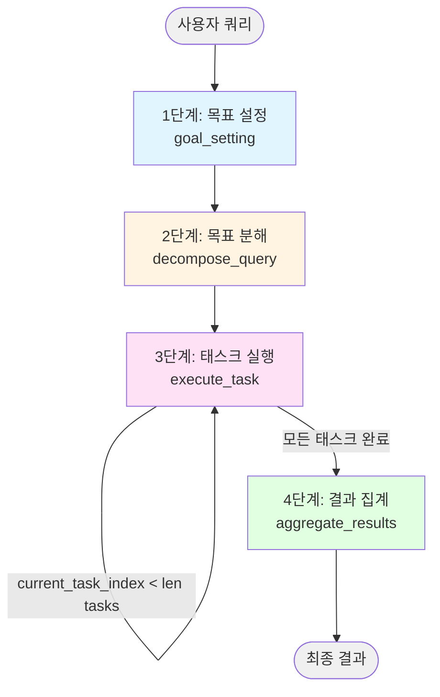
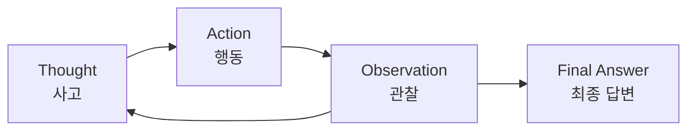

# Single Path Plan Generation 상세 흐름 가이드

## 개요

Single Path Plan Generation은 복잡한 목표를 **하나의 선형적인 실행 경로**로 분해하여 순차적으로 처리하는 에이전트 디자인 패턴입니다.

### 핵심 특징
- 단일 경로: 병렬 실행 없이 순차적으로 태스크 수행
- 3~5개의 태스크: 적절한 크기로 목표 분해
- 상태 기반 워크플로우: LangGraph를 활용한 상태 관리

---

## 워크플로우 4단계



**코드 참조:** [SinglePathPlanGeneration._create_graph](main.py#L232-L264)

---

## 구체적인 예시로 보는 단계별 흐름

### 초기 입력

**사용자 쿼리:**
```
"AI agent 만들기 실습"
```

**초기 State:** ([SinglePathPlanGenerationState](main.py#L58-L77))
```python
SinglePathPlanGenerationState(
    query="AI agent 만들기 실습",
    optimized_goal="",
    optimized_response="",
    tasks=[],
    current_task_index=0,
    results=[],
    final_output=""
)
```

---

## 1단계: 목표 설정 (Goal Setting)

**코드 참조:** [_goal_setting](main.py#L266-L292)

이 단계는 3개의 서브 단계로 구성됩니다.

### 1-1. 기본 목표 생성 (PassiveGoalCreator)

**코드 참조:** [PassiveGoalCreator.run](../passive_goal_creator/main.py#L35-L58)

**입력:** 원본 쿼리
```
"AI agent 만들기 실습"
```

**LLM 프롬프트:**
```
사용자 입력을 분석하여 명확하고 실행 가능한 목표를 생성해 주세요.
요건:
1. 목표는 구체적이고 명확해야 하며, 실행 가능한 수준으로 상세화되어야 합니다.
2. 당신이 실행할 수 있는 행동은 다음과 같은 행동뿐입니다.
   - 인터넷을 이용하여 목표 달성을 위한 조사를 수행합니다.
   - 사용자를 위한 보고서를 생성합니다.
3. 절대 2.에 명시된 행동 외의 다른 행동을 취해서는 안 됩니다.
사용자 입력: AI agent 만들기 실습
```

**출력:** [Goal](../passive_goal_creator/main.py#L10-L20) 객체
```python
Goal(
    description="AI agent의 개념, 구성 요소, 개발 방법, 실습 예제를 조사하여 단계별 실습 가이드를 작성한다."
)
```

**변화:**
- 모호한 표현 "만들기 실습" → 구체적인 행동 "조사하여 가이드 작성"
- 범위 명시: 개념, 구성 요소, 개발 방법, 실습 예제
- 실행 가능한 형태로 재구성

---

### 1-2. 목표 최적화 (PromptOptimizer - SMART 원칙)

**코드 참조:** [PromptOptimizer.run](../prompt_optimizer/main.py#L39-L76)

**입력:** 기본 목표
```
"AI agent의 개념, 구성 요소, 개발 방법, 실습 예제를 조사하여 단계별 실습 가이드를 작성한다."
```

**LLM 프롬프트:**
```
당신은 목표 설정 전문가입니다. 아래의 목표를 SMART 원칙에 기반하여 최적화해 주세요.

원래 목표:
AI agent의 개념, 구성 요소, 개발 방법, 실습 예제를 조사하여 단계별 실습 가이드를 작성한다.

지시 사항:
1. 원래 목표를 분석하고, 부족한 요소나 개선점을 파악해 주세요.
2. 당신이 실행할 수 있는 행동은 다음과 같습니다.
   - 인터넷을 이용하여 목표 달성을 위한 조사를 수행한다.
   - 사용자를 위한 보고서를 생성한다.
3. SMART 원칙의 각 요소를 고려하면서 목표를 구체적이고 상세하게 기술해 주세요.
...
```

**출력:** [OptimizedGoal](../prompt_optimizer/main.py#L14-L27) 객체
```python
OptimizedGoal(
    description="""
    Specific: AI agent의 정의, LangChain/LangGraph와 같은 주요 프레임워크,
              ReAct 패턴 등 핵심 아키텍처, 그리고 간단한 챗봇 구축 예제를 조사한다.
    Measurable: 최소 3개의 신뢰할 수 있는 출처(공식 문서, 기술 블로그, 학술 논문)에서
                정보를 수집하고, 각 주제별로 200자 이상의 설명을 작성한다.
    Achievable: 인터넷 검색을 통해 공개된 자료를 수집하고, 이를 기반으로 초보자도
                이해할 수 있는 수준의 가이드를 작성한다.
    Relevant: Python 기반의 실용적인 AI agent 개발에 초점을 맞추며,
              2023년 이후의 최신 정보를 우선적으로 활용한다.
    Time-bound: 현재 시점(2024-12-04) 기준 최신 정보를 사용한다.
    """,
    metrics="출처 개수(최소 3개), 각 주제별 설명 길이(최소 200자), 실습 예제 포함 여부"
)
```

**변화:**
- SMART 원칙 적용 (Specific, Measurable, Achievable, Relevant, Time-bound)
- 구체적인 프레임워크 명시: LangChain, LangGraph, ReAct 패턴
- 측정 가능한 기준: 출처 3개, 각 주제 200자 이상
- 시간 범위: 2024-12-04 기준 최신 정보

---

### 1-3. 응답 형식 최적화 (ResponseOptimizer)

**코드 참조:** [ResponseOptimizer.run](../response_optimizer/main.py#L22-L76)

**입력:** 최적화된 목표
```
"AI agent의 정의, LangChain/LangGraph와 같은 주요 프레임워크..."
```

**출력:** 응답 형식 정의 (문자열)
```
목표 분석:
사용자는 AI agent 개발에 대한 체계적인 실습 가이드를 원하며,
개념부터 실제 구현까지 단계별로 이해하고자 합니다.

응답 사양:
- 톤: 초보자 친화적이고 교육적인 톤
- 구조: 개념 → 도구 → 아키텍처 → 실습 순서
- 내용 초점: 이론과 실습의 균형

AI 에이전트에 대한 지침:
1. 각 섹션은 명확한 제목으로 구분할 것
2. 전문 용어는 처음 등장 시 설명을 추가할 것
3. 코드 예제는 주석과 함께 제공할 것
4. 각 출처의 URL을 명시할 것

응답 예시:
# AI Agent 만들기 실습 가이드

## 1. AI Agent란?
AI agent는 환경을 인식하고(Perception), 의사결정을 내리며(Reasoning),
행동을 취하는(Action) 자율적인 소프트웨어 시스템입니다.

## 2. 주요 프레임워크
### 2.1 LangChain
- 목적: LLM 기반 애플리케이션 개발 프레임워크
- 주요 기능: 체인, 에이전트, 메모리 관리
...

평가 기준:
- 3개 이상의 신뢰할 수 있는 출처 인용 여부
- 각 주제별 200자 이상 설명 여부
- 실습 가능한 코드 예제 포함 여부
- 초보자 이해도 (전문 용어 설명 포함 여부)
```

**State 업데이트:** ([main.py:289-292](main.py#L289-L292))
```python
{
    "optimized_goal": "Specific: AI agent의 정의, LangChain/LangGraph...",
    "optimized_response": "목표 분석:\n사용자는 AI agent 개발에 대한..."
}
```

---

## 2단계: 목표 분해 (Decompose Query)

**코드 참조:** [_decompose_query](main.py#L294-L299), [QueryDecomposer](main.py#L82-L115)

### QueryDecomposer 실행

**입력:** optimized_goal
```
"AI agent의 정의, LangChain/LangGraph와 같은 주요 프레임워크..."
```

**LLM 프롬프트:** ([main.py:95-107](main.py#L95-L107))
```
CURRENT_DATE: 2024-12-04
-----
태스크: 주어진 목표를 구체적이고 실행 가능한 태스크로 분해해 주세요.
요건:
1. 다음 행동만으로 목표를 달성할 것...
   - 인터넷을 이용하여 목표 달성을 위한 조사를 수행한다.
2. 각 태스크는 구체적이고 상세하게 기재하며, 단독으로 실행 및 검증 가능한 정보를 포함할 것...
3. 태스크는 실행 가능한 순서로 리스트화할 것.
4. 태스크는 한국어로 출력할 것.
5. **중요: 반드시 정확히 3개 이상 5개 이하의 태스크로 분해할 것...**
목표: [최적화된 목표]
```

**출력:** [DecomposedTasks](main.py#L45-L53) 객체
```python
DecomposedTasks(
    values=[
        "AI agent의 정의와 개념을 조사한다. 'AI agent란 무엇인가', 'AI agent의 특징', '전통적인 프로그램과의 차이점'을 중심으로 최소 3개의 신뢰할 수 있는 출처(위키피디아, OpenAI 공식 블로그, 학술 논문 등)에서 정보를 수집하고, 각 내용을 200자 이상으로 정리한다.",

        "LangChain과 LangGraph 프레임워크에 대해 조사한다. 공식 문서(langchain.com, langgraph.io)를 참고하여 각 프레임워크의 목적, 주요 기능(체인, 에이전트, 그래프 워크플로우), 설치 방법, 그리고 간단한 사용 예제를 수집한다. 각 프레임워크당 최소 200자 이상 설명한다.",

        "ReAct(Reasoning + Acting) 패턴과 같은 AI agent의 핵심 아키텍처를 조사한다. ReAct 패턴의 동작 원리(Thought-Action-Observation 사이클), 장단점, 그리고 LangChain에서의 구현 방법을 기술 블로그나 공식 문서에서 찾아 200자 이상으로 정리한다.",

        "Python을 사용한 간단한 AI agent 실습 예제를 조사한다. LangChain을 활용한 기본 챗봇 또는 검색 에이전트 구축 예제를 GitHub 저장소나 튜토리얼 사이트에서 찾아, 코드 예제와 단계별 설명을 수집한다. 초보자도 따라할 수 있도록 상세한 주석이 포함된 예제를 우선한다."
    ]
)
```

**State 업데이트:** ([main.py:299](main.py#L299))
```python
{
    "tasks": [
        "AI agent의 정의와 개념을 조사한다...",
        "LangChain과 LangGraph 프레임워크에 대해 조사한다...",
        "ReAct(Reasoning + Acting) 패턴과 같은 AI agent의 핵심 아키텍처를 조사한다...",
        "Python을 사용한 간단한 AI agent 실습 예제를 조사한다..."
    ]
}
```

**특징:**
- 4개의 태스크로 분해 (3~5개 범위 내)
- 각 태스크는 독립적으로 실행 가능
- 순차적 실행 순서 (개념 → 프레임워크 → 아키텍처 → 실습 예제)

---

## 3단계: 태스크 실행 (Execute Task) - 순차 반복

**코드 참조:** [_execute_task](main.py#L301-L318), [TaskExecutor](main.py#L120-L160)

이 단계는 각 태스크를 순차적으로 실행하며, **조건부 엣지**를 통해 반복됩니다.

### 반복 조건 ([main.py:254-258](main.py#L254-L258))
```python
# 조건: current_task_index < len(tasks)
# True → execute_task 노드로 다시 이동 (반복)
# False → aggregate_results 노드로 이동 (종료)
graph.add_conditional_edges(
    "execute_task",
    lambda state: state.current_task_index < len(state.tasks),
    {True: "execute_task", False: "aggregate_results"},
)
```

---

### 🔄 첫 번째 반복 (Task 1/4)

**현재 State:**
```python
current_task_index = 0
tasks[0] = "AI agent의 정의와 개념을 조사한다..."
```

**TaskExecutor 실행:** ([main.py:129-160](main.py#L129-L160))
1. ReAct 에이전트 생성 ([main.py:135](main.py#L135))
2. Tavily 검색 도구 사용 ([main.py:126](main.py#L126))
3. 태스크 실행 및 결과 반환

**에이전트 동작 과정 (ReAct 패턴):**
```
Thought: AI agent의 정의를 조사하기 위해 검색이 필요함
Action: tavily_search("AI agent 정의 개념 특징")
Observation: [검색 결과 3개 반환]
  - Result 1: "AI agent는 환경을 인식하고 목표 달성을 위해 자율적으로 행동하는 시스템"
  - Result 2: "전통적 프로그램과 달리 AI agent는 불확실한 환경에서 의사결정 가능"
  - Result 3: "주요 특징: 자율성(Autonomy), 반응성(Reactivity), 능동성(Pro-activeness)"
Thought: 충분한 정보를 수집했음
Final Answer: 종합 정리...
```

**출력:** 태스크 결과 (문자열)
```
# AI Agent의 정의와 개념

## 정의
AI agent(인공지능 에이전트)는 환경(Environment)을 센서를 통해 인식하고(Perception),
수집한 정보를 바탕으로 의사결정을 내리며(Reasoning), 액추에이터를 통해 행동을 취하는(Action)
자율적인 소프트웨어 시스템입니다.

출처: Russell & Norvig, "Artificial Intelligence: A Modern Approach"

## 주요 특징
1. **자율성(Autonomy)**: 인간의 개입 없이 독립적으로 작동
2. **반응성(Reactivity)**: 환경 변화를 감지하고 적절히 대응
3. **능동성(Pro-activeness)**: 목표 달성을 위해 주도적으로 행동
4. **사회성(Social Ability)**: 다른 에이전트나 사람과 상호작용

출처: Wooldridge, M. "An Introduction to MultiAgent Systems"

## 전통적인 프로그램과의 차이점
- 전통적 프로그램: 명확한 입력 → 정해진 처리 → 예측 가능한 출력
- AI Agent: 불확실한 환경 → 상황 판단 → 최적 행동 선택
- AI Agent는 환경과의 지속적인 상호작용을 통해 학습하고 개선됨

출처: OpenAI Developer Blog, "Understanding AI Agents" (2024)
```

**State 업데이트:** ([main.py:315-318](main.py#L315-L318))
```python
{
    "results": ["# AI Agent의 정의와 개념\n\n## 정의\nAI agent..."],
    "current_task_index": 1
}
```

**조건 체크:** `1 < 4` → True → `execute_task`로 재이동

---

### 🔄 두 번째 반복 (Task 2/4)

**현재 State:**
```python
current_task_index = 1
tasks[1] = "LangChain과 LangGraph 프레임워크에 대해 조사한다..."
```

**에이전트 동작:**
```
Thought: LangChain과 LangGraph 공식 문서를 검색
Action: tavily_search("LangChain LangGraph 프레임워크 공식 문서")
Observation: [검색 결과]
  - LangChain: LLM 애플리케이션 개발 프레임워크
  - LangGraph: 상태 기반 워크플로우 구축 라이브러리
  - 설치: pip install langchain langgraph
  ...
```

**출력:**
```
# LangChain과 LangGraph 프레임워크

## LangChain

### 목적
LangChain은 대규모 언어 모델(LLM)을 활용한 애플리케이션을 쉽게 개발할 수 있도록
설계된 오픈소스 프레임워크입니다. 복잡한 LLM 기반 워크플로우를 모듈식 컴포넌트로
구성할 수 있게 해줍니다.

### 주요 기능
1. **체인(Chains)**: 여러 컴포넌트를 연결하여 복잡한 워크플로우 구성
2. **에이전트(Agents)**: LLM이 도구를 사용하여 동적으로 행동 결정
3. **메모리(Memory)**: 대화 기록을 저장하고 컨텍스트 유지
4. **프롬프트 템플릿**: 재사용 가능한 프롬프트 관리

### 설치 방법
```python
pip install langchain langchain-openai
```

### 간단한 사용 예제
```python
from langchain_openai import ChatOpenAI
from langchain_core.prompts import ChatPromptTemplate

llm = ChatOpenAI(model="gpt-4")
prompt = ChatPromptTemplate.from_template("Tell me about {topic}")
chain = prompt | llm
result = chain.invoke({"topic": "AI agents"})
```

출처: https://python.langchain.com/docs/get_started/introduction

## LangGraph

### 목적
LangGraph는 LLM을 사용하여 상태가 있는(stateful) 멀티 액터 애플리케이션을
구축하기 위한 라이브러리입니다. 순환(cycle)을 지원하는 그래프 구조로
복잡한 에이전트 워크플로우를 표현할 수 있습니다.

### 주요 기능
1. **StateGraph**: 상태 기반 워크플로우 그래프 구성
2. **노드와 엣지**: 실행 단계와 연결 관계 정의
3. **조건부 라우팅**: 상태에 따라 동적으로 경로 결정
4. **체크포인트**: 실행 상태 저장 및 복원

### 설치 방법
```python
pip install langgraph
```

### 간단한 사용 예제
```python
from langgraph.graph import StateGraph, END

graph = StateGraph(State)
graph.add_node("step1", step1_function)
graph.add_node("step2", step2_function)
graph.add_edge("step1", "step2")
graph.add_edge("step2", END)
app = graph.compile()
```

출처: https://langchain-ai.github.io/langgraph/
```

**State 업데이트:**
```python
{
    "results": [
        "# AI Agent의 정의와 개념...",
        "# LangChain과 LangGraph 프레임워크..."
    ],
    "current_task_index": 2
}
```

**조건 체크:** `2 < 4` → True → `execute_task`로 재이동

---

### 🔄 세 번째 반복 (Task 3/4)

**현재 State:**
```python
current_task_index = 2
tasks[2] = "ReAct(Reasoning + Acting) 패턴과 같은 AI agent의 핵심 아키텍처를 조사한다..."
```

**출력:**
```
# ReAct 패턴: AI Agent의 핵심 아키텍처

## ReAct란?

ReAct(Reasoning + Acting)는 언어 모델이 추론(Reasoning)과 행동(Acting)을
번갈아 수행하도록 하는 프롬프트 패턴입니다. 2022년 Yao et al.이 제안한
이 방식은 LLM이 사고 과정을 명시적으로 드러내면서 도구를 사용할 수 있게 합니다.

출처: Yao, S. et al. (2022). "ReAct: Synergizing Reasoning and Acting in Language Models"

## 동작 원리: Thought-Action-Observation 사이클

### 1. Thought (사고)
LLM이 현재 상황을 분석하고 다음에 무엇을 해야 할지 생각합니다.
```
Thought: 사용자가 날씨를 물어봤으니 날씨 API를 호출해야겠다.
```

### 2. Action (행동)
LLM이 결정한 행동을 실행합니다. 보통 특정 도구나 API를 호출합니다.
```
Action: search_weather(location="서울")
```

### 3. Observation (관찰)
행동의 결과를 관찰하고 다음 단계를 결정합니다.
```
Observation: 서울의 현재 기온은 15도이고 맑습니다.
```

이 사이클은 최종 답변에 도달할 때까지 반복됩니다.

## 장점
- **투명성**: 사고 과정이 명시적으로 드러나 디버깅 용이
- **유연성**: 복잡한 다단계 작업 수행 가능
- **도구 활용**: 외부 API나 데이터베이스를 자연스럽게 통합

## 단점
- **토큰 소비**: 사고 과정을 텍스트로 표현하므로 토큰 사용량 증가
- **실행 시간**: 여러 사이클을 거치므로 응답 시간 증가

## LangChain에서의 구현

LangChain은 `create_react_agent` 함수를 통해 ReAct 패턴을 쉽게 구현할 수 있습니다.

```python
from langchain_openai import ChatOpenAI
from langgraph.prebuilt import create_react_agent
from langchain_community.tools.tavily_search import TavilySearchResults

llm = ChatOpenAI(model="gpt-4")
tools = [TavilySearchResults(max_results=3)]

agent = create_react_agent(llm, tools)
result = agent.invoke({
    "messages": [("human", "AI agent에 대해 조사해줘")]
})
```

출처: https://python.langchain.com/docs/modules/agents/agent_types/react
```

**State 업데이트:**
```python
{
    "results": [..., "# ReAct 패턴: AI Agent의 핵심 아키텍처..."],
    "current_task_index": 3
}
```

**조건 체크:** `3 < 4` → True → `execute_task`로 재이동

---

### 🔄 네 번째 반복 (Task 4/4)

**현재 State:**
```python
current_task_index = 3
tasks[3] = "Python을 사용한 간단한 AI agent 실습 예제를 조사한다..."
```

**출력:**
```
# Python AI Agent 실습 예제

## 기본 챗봇 에이전트 구축

이 예제는 LangChain을 사용하여 검색 기능을 갖춘 간단한 AI agent를 만드는 방법을 보여줍니다.

### 1단계: 필요한 라이브러리 설치

```bash
pip install langchain langchain-openai langgraph tavily-python
```

### 2단계: 환경 변수 설정

```python
import os

# OpenAI API 키 설정
os.environ["OPENAI_API_KEY"] = "your-api-key"
# Tavily API 키 설정 (검색 도구용)
os.environ["TAVILY_API_KEY"] = "your-tavily-key"
```

### 3단계: AI Agent 생성

```python
from langchain_openai import ChatOpenAI
from langgraph.prebuilt import create_react_agent
from langchain_community.tools.tavily_search import TavilySearchResults

# LLM 초기화
# temperature=0: 일관된 응답 생성
llm = ChatOpenAI(model="gpt-4", temperature=0)

# 검색 도구 설정
# max_results=3: 최대 3개의 검색 결과 반환
tools = [TavilySearchResults(max_results=3)]

# ReAct 패턴 에이전트 생성
# create_react_agent: Thought-Action-Observation 사이클 구현
agent = create_react_agent(llm, tools)
```

### 4단계: 에이전트 실행

```python
# 사용자 질문 전달
response = agent.invoke({
    "messages": [
        ("human", "2024년 AI 기술 트렌드를 조사해줘")
    ]
})

# 최종 응답 출력
# messages[-1]: 대화 기록의 마지막 메시지 (에이전트의 최종 답변)
print(response["messages"][-1].content)
```

### 실행 과정 예시

```
Thought: 사용자가 2024년 AI 트렌드를 물어봤으니 최신 정보를 검색해야 함
Action: tavily_search("2024 AI technology trends")
Observation: [검색 결과] 생성형 AI, 멀티모달 AI, AI 에이전트...
Thought: 충분한 정보를 수집했으니 정리해서 답변하자
Final Answer: 2024년 주요 AI 기술 트렌드는 다음과 같습니다...
```

### 5단계: 대화 기록 유지 (선택사항)

```python
from langgraph.checkpoint.memory import MemorySaver

# 메모리 저장소 생성
memory = MemorySaver()

# 메모리를 사용하는 에이전트 생성
agent_with_memory = create_react_agent(
    llm,
    tools,
    checkpointer=memory
)

# 세션 ID로 대화 기록 관리
config = {"configurable": {"thread_id": "conversation-1"}}

# 첫 번째 질문
response1 = agent_with_memory.invoke(
    {"messages": [("human", "AI agent란?")]},
    config
)

# 두 번째 질문 (이전 대화 기억)
response2 = agent_with_memory.invoke(
    {"messages": [("human", "그걸 어떻게 만들어?")]},
    config
)
```

## 전체 코드

```python
import os
from langchain_openai import ChatOpenAI
from langgraph.prebuilt import create_react_agent
from langchain_community.tools.tavily_search import TavilySearchResults

# API 키 설정
os.environ["OPENAI_API_KEY"] = "your-key"
os.environ["TAVILY_API_KEY"] = "your-key"

# 컴포넌트 초기화
llm = ChatOpenAI(model="gpt-4", temperature=0)
tools = [TavilySearchResults(max_results=3)]
agent = create_react_agent(llm, tools)

# 실행
response = agent.invoke({
    "messages": [("human", "LangChain이란 무엇인가요?")]
})
print(response["messages"][-1].content)
```

출처:
- https://python.langchain.com/docs/tutorials/agents
- https://github.com/langchain-ai/langchain/tree/master/docs/docs/tutorials
```

**State 업데이트:**
```python
{
    "results": [
        "# AI Agent의 정의와 개념...",
        "# LangChain과 LangGraph 프레임워크...",
        "# ReAct 패턴: AI Agent의 핵심 아키텍처...",
        "# Python AI Agent 실습 예제..."
    ],
    "current_task_index": 4
}
```

**조건 체크:** `4 < 4` → **False** → `aggregate_results`로 이동

---

## 4단계: 결과 집계 (Aggregate Results)

**코드 참조:** [_aggregate_results](main.py#L320-L331), [ResultAggregator](main.py#L165-L206)

### ResultAggregator 실행

**입력:**
```python
query = "Specific: AI agent의 정의, LangChain/LangGraph..."
response_definition = "목표 분석:\n사용자는 AI agent 개발에 대한..."
results = [
    "# AI Agent의 정의와 개념...",
    "# LangChain과 LangGraph 프레임워크...",
    "# ReAct 패턴: AI Agent의 핵심 아키텍처...",
    "# Python AI Agent 실습 예제..."
]
```

**LLM 프롬프트:** ([main.py:178-183](main.py#L178-L183))
```
주어진 목표:
Specific: AI agent의 정의, LangChain/LangGraph...

조사 결과:

Info 1:
# AI Agent의 정의와 개념...

Info 2:
# LangChain과 LangGraph 프레임워크...

Info 3:
# ReAct 패턴: AI Agent의 핵심 아키텍처...

Info 4:
# Python AI Agent 실습 예제...

주어진 목표에 대해 조사 결과를 활용하여 다음 지시에 기반한 응답을 생성해 주세요.
[응답 형식 정의]
```

**최종 출력:**
```markdown
# AI Agent 만들기 실습 가이드

## 1. AI Agent란?

### 정의
AI agent(인공지능 에이전트)는 환경(Environment)을 센서를 통해 인식하고(Perception),
수집한 정보를 바탕으로 의사결정을 내리며(Reasoning), 액추에이터를 통해 행동을 취하는(Action)
자율적인 소프트웨어 시스템입니다.

### 주요 특징
1. **자율성(Autonomy)**: 인간의 개입 없이 독립적으로 작동
2. **반응성(Reactivity)**: 환경 변화를 감지하고 적절히 대응
3. **능동성(Pro-activeness)**: 목표 달성을 위해 주도적으로 행동
4. **사회성(Social Ability)**: 다른 에이전트나 사람과 상호작용

### 전통적인 프로그램과의 차이점
- **전통적 프로그램**: 명확한 입력 → 정해진 처리 → 예측 가능한 출력
- **AI Agent**: 불확실한 환경 → 상황 판단 → 최적 행동 선택
- AI Agent는 환경과의 지속적인 상호작용을 통해 학습하고 개선됩니다.

*출처: Russell & Norvig, "Artificial Intelligence: A Modern Approach", Wooldridge "An Introduction to MultiAgent Systems", OpenAI Developer Blog*

---

## 2. 주요 프레임워크

### 2.1 LangChain

#### 목적
LangChain은 대규모 언어 모델(LLM)을 활용한 애플리케이션을 쉽게 개발할 수 있도록
설계된 오픈소스 프레임워크입니다.

#### 주요 기능
- **체인(Chains)**: 여러 컴포넌트를 연결하여 복잡한 워크플로우 구성
- **에이전트(Agents)**: LLM이 도구를 사용하여 동적으로 행동 결정
- **메모리(Memory)**: 대화 기록을 저장하고 컨텍스트 유지
- **프롬프트 템플릿**: 재사용 가능한 프롬프트 관리

#### 설치 방법
```bash
pip install langchain langchain-openai
```

#### 간단한 사용 예제
```python
from langchain_openai import ChatOpenAI
from langchain_core.prompts import ChatPromptTemplate

llm = ChatOpenAI(model="gpt-4")
prompt = ChatPromptTemplate.from_template("Tell me about {topic}")
chain = prompt | llm
result = chain.invoke({"topic": "AI agents"})
```

### 2.2 LangGraph

#### 목적
LangGraph는 LLM을 사용하여 상태가 있는(stateful) 멀티 액터 애플리케이션을
구축하기 위한 라이브러리입니다.

#### 주요 기능
- **StateGraph**: 상태 기반 워크플로우 그래프 구성
- **노드와 엣지**: 실행 단계와 연결 관계 정의
- **조건부 라우팅**: 상태에 따라 동적으로 경로 결정
- **체크포인트**: 실행 상태 저장 및 복원

#### 설치 방법
```bash
pip install langgraph
```

#### 간단한 사용 예제
```python
from langgraph.graph import StateGraph, END

graph = StateGraph(State)
graph.add_node("step1", step1_function)
graph.add_node("step2", step2_function)
graph.add_edge("step1", "step2")
graph.add_edge("step2", END)
app = graph.compile()
```

*출처: https://python.langchain.com/docs, https://langchain-ai.github.io/langgraph/*

---

## 3. 핵심 아키텍처: ReAct 패턴

### ReAct란?

ReAct(Reasoning + Acting)는 언어 모델이 추론(Reasoning)과 행동(Acting)을
번갈아 수행하도록 하는 프롬프트 패턴입니다.

### 동작 원리: Thought-Action-Observation 사이클



1. **Thought (사고)**: LLM이 현재 상황을 분석하고 다음 행동 계획
2. **Action (행동)**: 결정한 행동 실행 (도구 호출, API 사용 등)
3. **Observation (관찰)**: 행동 결과를 관찰하고 다음 단계 결정

### 장단점

**장점:**
- 투명성: 사고 과정이 명시적으로 드러나 디버깅 용이
- 유연성: 복잡한 다단계 작업 수행 가능
- 도구 활용: 외부 API나 데이터베이스를 자연스럽게 통합

**단점:**
- 토큰 소비: 사고 과정을 텍스트로 표현하므로 토큰 사용량 증가
- 실행 시간: 여러 사이클을 거치므로 응답 시간 증가

*출처: Yao, S. et al. (2022). "ReAct: Synergizing Reasoning and Acting in Language Models"*

---

## 4. 실습: 검색 기능을 가진 AI Agent 만들기

### 4.1 환경 설정

#### 라이브러리 설치
```bash
pip install langchain langchain-openai langgraph tavily-python
```

#### API 키 설정
```python
import os

os.environ["OPENAI_API_KEY"] = "your-openai-api-key"
os.environ["TAVILY_API_KEY"] = "your-tavily-api-key"
```

### 4.2 기본 에이전트 구축

```python
from langchain_openai import ChatOpenAI
from langgraph.prebuilt import create_react_agent
from langchain_community.tools.tavily_search import TavilySearchResults

# 1. LLM 초기화
llm = ChatOpenAI(model="gpt-4", temperature=0)

# 2. 검색 도구 설정
tools = [TavilySearchResults(max_results=3)]

# 3. ReAct 에이전트 생성
agent = create_react_agent(llm, tools)

# 4. 에이전트 실행
response = agent.invoke({
    "messages": [("human", "2024년 AI 기술 트렌드를 조사해줘")]
})

# 5. 결과 출력
print(response["messages"][-1].content)
```

### 4.3 실행 과정

에이전트는 다음과 같은 ReAct 사이클을 거칩니다:

```
Thought: 사용자가 2024년 AI 트렌드를 물어봤으니 최신 정보를 검색해야 함
Action: tavily_search("2024 AI technology trends")
Observation: [검색 결과] 생성형 AI, 멀티모달 AI, AI 에이전트...
Thought: 충분한 정보를 수집했으니 정리해서 답변하자
Final Answer: 2024년 주요 AI 기술 트렌드는...
```

### 4.4 대화 기록 유지 (심화)

```python
from langgraph.checkpoint.memory import MemorySaver

# 메모리 저장소 생성
memory = MemorySaver()

# 메모리를 사용하는 에이전트 생성
agent_with_memory = create_react_agent(llm, tools, checkpointer=memory)

# 세션 ID로 대화 기록 관리
config = {"configurable": {"thread_id": "conversation-1"}}

# 첫 번째 질문
response1 = agent_with_memory.invoke(
    {"messages": [("human", "AI agent란?")]},
    config
)

# 두 번째 질문 (이전 대화 기억)
response2 = agent_with_memory.invoke(
    {"messages": [("human", "그걸 어떻게 만들어?")]},  # "그걸"이 "AI agent"를 가리킴
    config
)
```

*출처: https://python.langchain.com/docs/tutorials/agents*

---

## 5. 다음 단계

이 가이드를 완료했다면 다음 주제를 학습해보세요:

1. **고급 에이전트 패턴**
   - Multi-agent 시스템
   - Plan-and-Execute 패턴
   - Reflexion (자기 반성) 패턴

2. **도구 개발**
   - 커스텀 도구 만들기
   - API 통합
   - 데이터베이스 연결

3. **프로덕션 배포**
   - LangSmith로 모니터링
   - 에러 핸들링
   - 성능 최적화

## 참고 자료

- LangChain 공식 문서: https://python.langchain.com
- LangGraph 공식 문서: https://langchain-ai.github.io/langgraph
- ReAct 논문: Yao et al. (2022)
- AI Agent 이론: Russell & Norvig, "Artificial Intelligence: A Modern Approach"
```

**State 업데이트:** ([main.py:331](main.py#L331))
```python
{
    "final_output": "# AI Agent 만들기 실습 가이드..."
}
```

---

## State 변화 요약

**코드 참조:** [SinglePathPlanGenerationState](main.py#L58-L77)

```python
# 초기 State
SinglePathPlanGenerationState(
    query="AI agent 만들기 실습",
    optimized_goal="",
    optimized_response="",
    tasks=[],
    current_task_index=0,
    results=[],
    final_output=""
)

# 1단계 후 (목표 설정)
SinglePathPlanGenerationState(
    query="AI agent 만들기 실습",
    optimized_goal="Specific: AI agent의 정의, LangChain/LangGraph...",  # ✅ 설정
    optimized_response="목표 분석:\n사용자는 AI agent 개발에 대한...",  # ✅ 설정
    tasks=[],
    current_task_index=0,
    results=[],
    final_output=""
)

# 2단계 후 (목표 분해)
SinglePathPlanGenerationState(
    query="AI agent 만들기 실습",
    optimized_goal="Specific: AI agent의 정의...",
    optimized_response="목표 분석:...",
    tasks=[  # ✅ 4개 태스크로 분해
        "AI agent의 정의와 개념을 조사한다...",
        "LangChain과 LangGraph 프레임워크에 대해 조사한다...",
        "ReAct 패턴과 같은 AI agent의 핵심 아키텍처를 조사한다...",
        "Python을 사용한 간단한 AI agent 실습 예제를 조사한다..."
    ],
    current_task_index=0,
    results=[],
    final_output=""
)

# 3단계 첫 번째 실행 후
SinglePathPlanGenerationState(
    ...
    tasks=[...],
    current_task_index=1,  # ✅ 인덱스 증가
    results=["# AI Agent의 정의와 개념..."],  # ✅ 첫 결과 추가
    final_output=""
)

# 3단계 두 번째 실행 후
SinglePathPlanGenerationState(
    ...
    current_task_index=2,  # ✅ 인덱스 증가
    results=[
        "# AI Agent의 정의와 개념...",
        "# LangChain과 LangGraph 프레임워크..."  # ✅ 두 번째 결과 추가
    ],
    final_output=""
)

# 3단계 세 번째 실행 후
SinglePathPlanGenerationState(
    ...
    current_task_index=3,
    results=[..., "# ReAct 패턴..."],  # ✅ 세 번째 결과 추가
    final_output=""
)

# 3단계 네 번째 실행 후
SinglePathPlanGenerationState(
    ...
    current_task_index=4,  # ✅ 4 < 4 = False → 다음 단계로
    results=[..., "# Python AI Agent 실습 예제..."],  # ✅ 네 번째 결과 추가
    final_output=""
)

# 4단계 후 (최종)
SinglePathPlanGenerationState(
    query="AI agent 만들기 실습",
    optimized_goal="Specific: AI agent의 정의...",
    optimized_response="목표 분석:...",
    tasks=[...],
    current_task_index=4,
    results=[결과1, 결과2, 결과3, 결과4],
    final_output="# AI Agent 만들기 실습 가이드..."  # ✅ 최종 결과
)
```

---

## 핵심 포인트

### 1. 순차적 실행의 장점
- **컨텍스트 누적**: 이전 태스크 결과가 다음 태스크에 참고 자료가 됨
- **일관성 유지**: 하나의 선형적 흐름으로 논리적 일관성 확보
- **디버깅 용이**: 각 단계별 결과를 명확히 추적 가능

### 2. Single Path vs Multi Path
| 비교 항목 | Single Path | Multi Path |
|----------|-------------|------------|
| 실행 방식 | 순차적 | 병렬적 |
| 태스크 수 | 3~5개 | 5~10개 |
| 적합한 경우 | 선형적 조사, 단계별 누적 | 독립적 조사, 빠른 처리 |
| 결과 품질 | 높음 (맥락 유지) | 다양함 (다각도 분석) |

### 3. LangGraph의 역할

**코드 참조:** [StateGraph 생성](main.py#L232-L264)

- **상태 관리**: 각 노드 간 데이터 전달을 자동화 ([StateGraph](main.py#L234))
- **조건부 라우팅**: `add_conditional_edges`로 동적 흐름 제어 ([조건부 엣지](main.py#L254-L258))
- **반복 처리**: 동일 노드를 여러 번 실행 (태스크 반복)

### 4. Annotated 타입의 의미

**코드 참조:** [results 필드](main.py#L73-L75)

```python
results: Annotated[list[str], operator.add]
```
- `operator.add`: 새로운 결과가 기존 리스트에 **추가**됨
- 각 태스크 실행마다 `results`에 결과가 누적되는 이유
- LangGraph가 자동으로 리스트 병합 처리

### 5. ReAct 에이전트의 활용

**코드 참조:** [TaskExecutor](main.py#L120-L160)

- [create_react_agent](main.py#L135): LangGraph의 미리 빌드된 ReAct 에이전트
- [TavilySearchResults](main.py#L126): 웹 검색 도구 통합
- Thought-Action-Observation 사이클 자동 실행

---

## 주요 클래스 및 함수 참조

### 핵심 클래스
- [SinglePathPlanGeneration](main.py#L212-L347): 메인 워크플로우 클래스
- [SinglePathPlanGenerationState](main.py#L58-L77): 상태 관리 모델
- [DecomposedTasks](main.py#L45-L53): 분해된 태스크 컨테이너
- [QueryDecomposer](main.py#L82-L115): 목표 분해 클래스
- [TaskExecutor](main.py#L120-L160): 태스크 실행 클래스
- [ResultAggregator](main.py#L165-L206): 결과 집계 클래스

### 외부 모듈
- [PassiveGoalCreator](../passive_goal_creator/main.py#L25-L58): 기본 목표 생성
- [PromptOptimizer](../prompt_optimizer/main.py#L32-L76): SMART 원칙 최적화
- [ResponseOptimizer](../response_optimizer/main.py#L15-L76): 응답 형식 정의

### 워크플로우 노드
- [_goal_setting](main.py#L266-L292): 1단계 노드
- [_decompose_query](main.py#L294-L299): 2단계 노드
- [_execute_task](main.py#L301-L318): 3단계 노드 (반복)
- [_aggregate_results](main.py#L320-L331): 4단계 노드

### 실행 함수
- [run](main.py#L333-L347): 전체 워크플로우 실행
- [main](main.py#L353-L399): CLI 진입점
