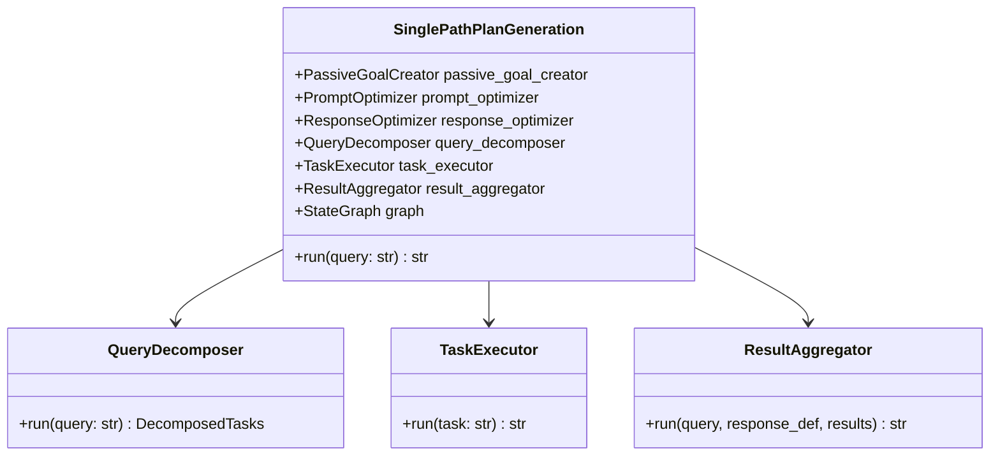

# Single Path Plan Generation 실행 흐름 가이드

> 이 문서는 Single Path Plan Generation 패턴의 전체 실행 흐름을 구체적인 예시와 함께 설명합니다.

## 📋 목차

1. [개요](#개요)
2. [핵심 개념](#핵심-개념)
3. [전체 아키텍처](#전체-아키텍처)
4. [단계별 실행 흐름](#단계별-실행-흐름)
5. [상태 변화 추적](#상태-변화-추적)
6. [실제 실행 예시](#실제-실행-예시)

---

## 개요

### Single Path Plan Generation이란?

**Single Path Plan Generation**은 복잡한 목표를 **하나의 선형 경로**를 따라 순차적으로 실행하는 에이전트 디자인 패턴입니다.

### 핵심 특징

- ✅ **선형 실행**: 한 번에 하나의 경로만 따라감
- ✅ **순차 처리**: 태스크를 순서대로 하나씩 실행
- ✅ **목표 지향**: SMART 원칙으로 목표를 명확히 정의
- ✅ **결과 통합**: 모든 조사 결과를 하나의 응답으로 종합

### 전체 프로세스 요약

```
사용자 입력
    ↓
[1단계] 목표 설정 (Goal Setting)
    ├─ 기본 목표 생성 (PassiveGoalCreator)
    ├─ 목표 최적화 (PromptOptimizer - SMART)
    └─ 응답 형식 정의 (ResponseOptimizer)
    ↓
[2단계] 목표 분해 (Decompose Query)
    └─ 3~5개의 실행 가능한 태스크로 분해
    ↓
[3단계] 태스크 실행 (Execute Task) - 반복
    ├─ 태스크 1 실행 → 결과 저장
    ├─ 태스크 2 실행 → 결과 저장
    └─ 태스크 N 실행 → 결과 저장
    ↓
[4단계] 결과 집계 (Aggregate Results)
    └─ 모든 결과를 종합하여 최종 응답 생성
    ↓
최종 결과
```

---

## 핵심 개념

### 1. State (상태)

프로그램의 모든 정보를 담는 컨테이너입니다.

```python
class SinglePathPlanGenerationState:
    query: str                    # 사용자 입력
    optimized_goal: str          # 최적화된 목표
    optimized_response: str      # 응답 형식 정의
    tasks: list[str]            # 분해된 태스크 리스트
    current_task_index: int     # 현재 실행 중인 태스크 인덱스
    results: list[str]          # 각 태스크의 실행 결과
    final_output: str           # 최종 응답
```

### 2. Graph (그래프)

LangGraph를 사용하여 워크플로우를 정의합니다.

```
[goal_setting] → [decompose_query] → [execute_task]
                                            ↓ ↑ (반복)
                                      [aggregate_results] → END
```

### 3. Node (노드)

그래프의 각 단계를 나타냅니다.

- **goal_setting**: 목표 설정 및 최적화
- **decompose_query**: 목표를 태스크로 분해
- **execute_task**: 개별 태스크 실행 (반복)
- **aggregate_results**: 결과 집계

### 4. Edge (엣지)

노드 간의 연결을 정의합니다.

- **일반 엣지**: 항상 다음 노드로 이동
- **조건부 엣지**: 조건에 따라 다른 노드로 분기

---

## 전체 아키텍처

### 클래스 구조



### 데이터 흐름

```
┌─────────────────┐
│  사용자 입력      │  "카레라이스 만드는 방법"
└────────┬────────┘
         ↓
┌─────────────────┐
│  Goal Setting   │  목표 명확화 + SMART 원칙 적용
└────────┬────────┘
         ↓
┌─────────────────┐
│ Decompose Query │  태스크 3~5개로 분해
└────────┬────────┘
         ↓
┌─────────────────┐
│  Execute Task 1 │  ReAct 에이전트로 실행
└────────┬────────┘
         ↓
┌─────────────────┐
│  Execute Task 2 │  Tavily 검색 + LLM 분석
└────────┬────────┘
         ↓
┌─────────────────┐
│  Execute Task N │  반복...
└────────┬────────┘
         ↓
┌─────────────────┐
│ Aggregate       │  모든 결과를 하나로 통합
└────────┬────────┘
         ↓
┌─────────────────┐
│  최종 응답       │  완성된 레시피 가이드
└─────────────────┘
```

---

## 단계별 실행 흐름

### 예시 시나리오

사용자 입력: **"카레라이스 만드는 방법"**

---

## 🎯 [1단계] 목표 설정 (Goal Setting)

### 목적
모호한 사용자 입력을 구체적이고 측정 가능한 목표로 변환

### 세부 단계

#### 1-1. 기본 목표 생성 (PassiveGoalCreator)

**입력**:
```
"카레라이스 만드는 방법"
```

**처리**:
- 사용자 입력을 분석
- 실행 가능한 행동으로 변환
- 제약사항 적용 (인터넷 조사, 보고서 생성만 가능)

**출력 (Goal)**:
```
"인터넷을 이용하여 카레라이스를 만드는 구체적인 방법을 조사하고,
사용자를 위한 단계별 레시피 보고서를 생성한다."
```

#### 1-2. 목표 최적화 (PromptOptimizer - SMART 원칙)

**입력**:
```
"인터넷을 이용하여 카레라이스를 만드는 구체적인 방법을 조사하고,
사용자를 위한 단계별 레시피 보고서를 생성한다."
```

**SMART 원칙 적용**:

| 원칙 | 적용 내용 |
|------|----------|
| **S**pecific (구체적) | 4인분 기준, 일본식 카레라이스로 구체화 |
| **M**easurable (측정 가능) | 재료 5가지 이상, 조리법 5~7단계로 수치화 |
| **A**chievable (달성 가능) | 인터넷 조사로 충분히 가능 |
| **R**elevant (관련성) | 카레 만들기라는 목표에 직접 관련 |
| **T**ime-bound (기한) | (선택적) |

**출력 (OptimizedGoal)**:
```python
OptimizedGoal {
  description: """
    4인분 기준 일본식 카레라이스 레시피를 인터넷에서 조사하여,
    재료 목록(최소 5가지), 단계별 조리법(5~7단계), 조리 시간을
    포함한 상세한 가이드를 작성한다.
  """,

  metrics: """
    1. 재료 목록이 5가지 이상 포함되었는가?
    2. 각 조리 단계가 구체적으로 기술되었는가?
    3. 조리 시간이 명시되었는가?
    4. 초보자도 따라할 수 있을 정도로 상세한가?
  """
}
```

#### 1-3. 응답 형식 정의 (ResponseOptimizer)

**입력**:
```
OptimizedGoal.text (위의 최적화된 목표)
```

**처리**:
- 목표 분석: 핵심 요소와 의도 파악
- 응답 사양: 톤, 구조, 내용 초점 결정
- AI 지침: 구체적인 작성 방법 정의
- 예시 제공: 샘플 응답 구조
- 평가 기준: 품질 측정 기준

**출력 (응답 정의)**:
```markdown
### 목표 분석
사용자는 실제로 요리할 수 있는 구체적이고 따라하기 쉬운
카레 레시피를 원합니다.

### 응답 사양
- 톤: 친근하고 이해하기 쉬운 설명체
- 구조: 재료 → 준비 → 조리 → 팁 순서
- 초점: 초보자도 실패 없이 만들 수 있도록

### AI 에이전트 지침
1. 재료는 정확한 분량과 함께 나열할 것
2. 각 단계는 "~하세요" 형태로 작성할 것
3. 중요한 포인트는 **굵게** 표시할 것
4. 조리 시간은 각 단계별로 명시할 것

### 응답 예시
**[재료 - 4인분]**
- 카레 루: 4~5조각 (100g)
- 소고기: 300g (한입 크기로 자름)
...

**[조리법]**
1. 감자와 당근을 한입 크기로 자릅니다. (5분)
...

### 평가 기준
1. 재료가 정확한 분량과 함께 제시되었는가?
2. 각 단계가 순서대로 명확하게 설명되었는가?
3. 초보자가 따라하기에 충분히 상세한가?
```

### 상태 변화

**처리 전**:
```python
State {
  query: "카레라이스 만드는 방법",
  optimized_goal: "",
  optimized_response: "",
  tasks: [],
  current_task_index: 0,
  results: [],
  final_output: ""
}
```

**처리 후**:
```python
State {
  query: "카레라이스 만드는 방법",

  optimized_goal: "4인분 기준 일본식 카레라이스 레시피를...",

  optimized_response: """
    ### 목표 분석
    사용자는 실제로 요리할 수 있는...
    ### 응답 사양
    ...
  """,

  tasks: [],
  current_task_index: 0,
  results: [],
  final_output: ""
}
```

---

## 📋 [2단계] 목표 분해 (Decompose Query)

### 목적
최적화된 목표를 3~5개의 **구체적이고 실행 가능한** 태스크로 분해

### 처리 과정

**입력**:
```
"4인분 기준 일본식 카레라이스 레시피를 인터넷에서 조사하여,
재료 목록(최소 5가지), 단계별 조리법(5~7단계), 조리 시간을
포함한 상세한 가이드를 작성한다."
```

**QueryDecomposer의 프롬프트**:
```
CURRENT_DATE: 2025-12-04
-----
태스크: 주어진 목표를 구체적이고 실행 가능한 태스크로 분해해 주세요.

요건:
1. 다음 행동만으로 목표를 달성할 것
   - 인터넷을 이용하여 목표 달성을 위한 조사를 수행한다.
2. 각 태스크는 구체적이고 상세하게 기재
3. 태스크는 실행 가능한 순서로 리스트화
4. 태스크는 한국어로 출력
5. 반드시 3개 이상 5개 이하의 태스크로 분해

목표: 4인분 기준 일본식 카레라이스 레시피를...
```

**출력 (DecomposedTasks)**:
```python
DecomposedTasks {
  values: [
    """
    태스크 1: 4인분 기준 일본식 카레라이스의 기본 재료 목록
    (최소 5가지)을 인터넷에서 조사하고, 각 재료의 정확한 분량과
    구입처를 포함하여 상세히 기록한다.
    """,

    """
    태스크 2: 일본식 카레라이스의 단계별 조리법을 5~7단계로
    구분하여 인터넷에서 조사하고, 각 단계마다 구체적인 조리 방법과
    주의사항을 상세히 기록한다.
    """,

    """
    태스크 3: 카레라이스 조리 시 각 단계별 소요 시간(준비 시간,
    조리 시간, 전체 소요 시간)을 인터넷에서 조사하여
    실질적으로 측정 가능한 시간 정보를 수집한다.
    """,

    """
    태스크 4: 초보자를 위한 카레라이스 조리 팁(재료 손질 방법,
    불 조절 요령, 간 맞추기 등)과 흔히 발생하는 실수 및
    해결 방법을 인터넷에서 조사한다.
    """,

    """
    태스크 5: 카레라이스와 잘 어울리는 밑반찬이나 사이드 메뉴,
    보관 방법 및 재가열 팁을 인터넷에서 조사하여
    완성도 높은 레시피 정보를 수집한다.
    """
  ]
}
```

### 분해 원칙

#### ✅ 좋은 태스크 예시
```
"4인분 기준 일본식 카레라이스의 기본 재료 목록(최소 5가지)을
인터넷에서 조사하고, 각 재료의 정확한 분량과 구입처를
포함하여 상세히 기록한다."
```

**좋은 이유**:
- ✓ 구체적 (4인분, 최소 5가지)
- ✓ 실행 가능 (인터넷 조사)
- ✓ 독립적 (다른 태스크 없이도 실행 가능)
- ✓ 검증 가능 (재료 개수로 확인)

#### ❌ 나쁜 태스크 예시
```
"카레 만들기에 대해 알아본다."
```

**나쁜 이유**:
- ✗ 추상적 (무엇을 알아볼지 불명확)
- ✗ 측정 불가 (언제 완료인지 알 수 없음)
- ✗ 너무 광범위 (범위가 무한정)

### 상태 변화

**처리 전**:
```python
State {
  ...
  tasks: [],
  current_task_index: 0,
  ...
}
```

**처리 후**:
```python
State {
  ...
  tasks: [
    "태스크 1: 4인분 기준 일본식 카레라이스의...",
    "태스크 2: 일본식 카레라이스의 단계별...",
    "태스크 3: 카레라이스 조리 시 각 단계별...",
    "태스크 4: 초보자를 위한 카레라이스...",
    "태스크 5: 카레라이스와 잘 어울리는..."
  ],
  current_task_index: 0,
  ...
}
```

---

## 🚀 [3단계] 태스크 실행 (Execute Task)

### 목적
각 태스크를 **순차적으로** 실행하고 결과를 수집

### 실행 방식

이 단계는 **조건부 엣지**로 인해 **반복 실행**됩니다:

```python
# 조건: 아직 실행할 태스크가 남아있는가?
if current_task_index < len(tasks):
    return "execute_task"  # 다시 execute_task 노드로
else:
    return "aggregate_results"  # 다음 단계로
```

### ReAct 에이전트

각 태스크는 **ReAct (Reasoning + Acting) 패턴**으로 실행됩니다:

```
1. Thought (생각): "재료 목록을 찾기 위해 검색해야겠다"
2. Action (행동): Tavily 검색 실행
3. Observation (관찰): 검색 결과 확인
4. Thought (생각): "더 구체적인 분량 정보가 필요하다"
5. Action (행동): 추가 검색 실행
6. Observation (관찰): 상세 정보 확인
7. Answer (답변): 최종 결과 정리
```

### 태스크 1 실행

**입력**:
```
"4인분 기준 일본식 카레라이스의 기본 재료 목록(최소 5가지)을
인터넷에서 조사하고, 각 재료의 정확한 분량과 구입처를
포함하여 상세히 기록한다."
```

**ReAct 에이전트 실행 과정**:

```
[Thought]
4인분 카레라이스 재료를 찾기 위해 검색해야겠습니다.

[Action]
Tavily Search: "일본식 카레라이스 4인분 재료 분량"

[Observation]
검색 결과 3개:
1. 일본식 카레 레시피 - 재료와 만드는 법
2. 카레라이스 4인분 황금 레시피
3. 집에서 만드는 일본식 카레

[Thought]
충분한 정보를 얻었습니다. 이제 재료 목록을 정리하겠습니다.

[Answer]
4인분 기준 일본식 카레라이스의 재료 목록:

1. **카레 루**: 4~5조각 (약 100g)
   - 구입처: 대형마트 양념 코너, 한일관 등
   - 종류: 오뚜기 카레 (중간 맵기 추천)

2. **소고기 또는 돼지고기**: 300g
   - 부위: 불고기용 또는 등심
   - 구입처: 정육점, 대형마트 정육 코너
   - 한입 크기로 자른 것

3. **감자**: 중간 크기 2개 (약 300g)
   - 구입처: 마트, 동네 슈퍼
   - 품종: 수미 감자 추천

4. **당근**: 중간 크기 1개 (약 150g)
   - 구입처: 마트, 동네 슈퍼

5. **양파**: 중간 크기 1개 (약 200g)
   - 구입처: 마트, 동네 슈퍼

6. **물**: 800ml
   - 카레 루 박스에 표시된 양 참고

7. **식용유**: 2큰술
   - 구입처: 마트
   - 종류: 올리브유 또는 카놀라유

8. **밥**: 4공기
   - 미리 지어두거나 카레와 함께 조리
```

**상태 변화**:
```python
# 실행 전
State {
  current_task_index: 0,
  results: []
}

# 실행 후
State {
  current_task_index: 1,  # 다음 태스크로 이동
  results: [
    "4인분 기준 일본식 카레라이스의 재료 목록: 1. 카레 루: 4~5조각..."
  ]
}
```

### 태스크 2 실행

**입력**:
```
"일본식 카레라이스의 단계별 조리법을 5~7단계로 구분하여..."
```

**출력**:
```
일본식 카레라이스 단계별 조리법 (총 7단계):

**1단계: 재료 준비 (5분)**
- 감자, 당근을 2cm 크기로 깍둑썰기
- 양파는 채썰기
- 고기는 한입 크기로 자르기

**2단계: 재료 볶기 (5분)**
- 냄비에 식용유를 두르고 중불로 가열
- 고기를 먼저 넣고 겉면이 익을 때까지 볶기
- 양파를 넣고 투명해질 때까지 볶기

**3단계: 야채 추가 (3분)**
- 감자와 당근을 넣고 함께 볶기
- 모든 재료가 기름에 코팅되도록 섞기

**4단계: 물 넣고 끓이기 (15분)**
- 물 800ml를 넣고 강불로 끓이기
- 끓어오르면 중불로 줄이기
- 뚜껑을 덮고 야채가 부드러워질 때까지 끓이기
- 중간에 거품 제거하기

**5단계: 카레 루 녹이기 (5분)**
- 불을 끄고 카레 루를 넣기
- 루가 완전히 녹을 때까지 저어주기
- 덩어리가 없도록 주의

**6단계: 농도 조절 (5~10분)**
- 다시 약불로 켜기
- 저어주면서 원하는 농도가 될 때까지 끓이기
- 너무 걸쭉하면 물 추가, 묽으면 더 끓이기

**7단계: 완성 및 담기**
- 불을 끄고 1~2분 정도 그대로 두기
- 밥과 함께 그릇에 담아 완성

**중요 주의사항**:
- 카레 루는 불을 끈 상태에서 녹여야 타지 않음
- 너무 센 불로 끓이면 야채가 부서짐
- 중간중간 저어줘야 바닥이 타지 않음
```

### 태스크 3~5 실행

동일한 방식으로 나머지 태스크들도 순차적으로 실행됩니다.

**최종 상태**:
```python
State {
  current_task_index: 5,  # 모든 태스크 완료
  results: [
    "4인분 기준 일본식 카레라이스의 재료 목록...",
    "일본식 카레라이스 단계별 조리법 (총 7단계)...",
    "카레라이스 조리 시간 정보...",
    "초보자를 위한 카레라이스 조리 팁...",
    "카레라이스와 잘 어울리는 사이드 메뉴..."
  ]
}
```

### 실행 흐름 시각화

```
┌─────────────────────┐
│ execute_task 진입    │
└──────────┬──────────┘
           ↓
    current_task_index = 0
           ↓
┌─────────────────────┐
│ 태스크 1 실행        │ → Result 1 저장
└──────────┬──────────┘
           ↓
    current_task_index = 1
           ↓
    조건: 1 < 5? YES
           ↓
┌─────────────────────┐
│ execute_task 재진입  │
└──────────┬──────────┘
           ↓
┌─────────────────────┐
│ 태스크 2 실행        │ → Result 2 저장
└──────────┬──────────┘
           ↓
    current_task_index = 2
           ↓
    조건: 2 < 5? YES
           ↓
          ...
           ↓
    current_task_index = 5
           ↓
    조건: 5 < 5? NO
           ↓
┌─────────────────────┐
│ aggregate_results   │
└─────────────────────┘
```

---

## 📊 [4단계] 결과 집계 (Aggregate Results)

### 목적
모든 태스크의 실행 결과를 **하나의 일관된 최종 응답**으로 통합

### 처리 과정

**입력**:
1. **optimized_goal**: 최적화된 목표
2. **optimized_response**: 응답 형식 정의
3